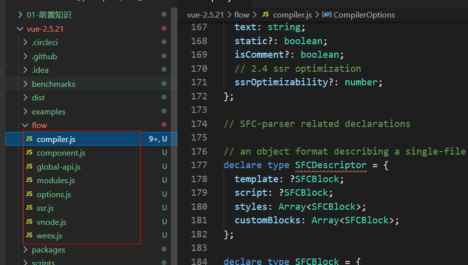

(注1：网上找了一些资料，还是要尝试着去学学框架源码啊。"问渠那得清如许，为有源头活水来"，我们不止要会用框架，还要了解它内部的原理，看看尤雨溪是到底怎么开发出来的，对于今后的工作学习是十分有好处的啊。)

(注2：现阶段主要是搜集一些文字资料，看看别人是如何学习Vue源码的。)

(注3：等自己学到了一定的程度了，或者说看文字资料遇到了瓶颈了，就去网上找一些视频来看。我之前找过，感觉有点不好找，这个到时候再说了啊。)

(注4：但是我现在要明确一下学哪个版本的Vue源码啊，现在Vue3.0也出来了。)

(注5：现在是2021年3月1日，我现在真的要开始着手熟悉一下Vue的源码了，主要是通过看**黄弈的视频**以及GitHub上的这个[mini-vue](https://github.com/woai3c/mini-vue/tree/v0.1)这个项目进行学习，希望可以对Vue有更深层次的理解和熟练使用吧。)

(注6：现在是2021年3月10日，我开始看黄弈的视频了吧，这篇博文主要也是看视频做的笔记了。)

[Vue源码阅读总结大会](https://zhuanlan.zhihu.com/p/53184632)

# 看过的Vue源码有关资料

[【Vue原理】响应式原理 - 白话版](https://mp.weixin.qq.com/s?__biz=MzUxNjQ1NjMwNw==&mid=2247483922&idx=1&sn=228ca8365d8566d59630d5bad4bf7d58&chksm=f9a6680eced1e118b628499600abd12d622083a0434673514cd5da4cc69a9325c555c051c147&scene=21#wechat_redirect)

[【Vue原理】Props - 白话版](https://zhuanlan.zhihu.com/p/53218851)

# 阅读源码前的准备

* **JavaScript 扎实基础**

* **看完《 JavaScript 设计模式》**

* **掌握 Vue 所有API**

我把 Vue 的所有 API 都详细研究使用过了一遍，而且尽量在项目中都有使用，让自己有深一点的体会

而且我对着官方文档，一个个做了详细的笔记，而且联想过了使用场景。

* **学会调试**

我很大胆地说，如果你不会调试，你看 Vue 源码，或者你会想死，你会出现这个场景："MMP，这个方法是怎么跳到 那个方法的，那个方法和 这个方法又是怎么联系起来的？"

也许你可以慢慢**使用函数名字**去寻找，但是无疑你会多消耗几倍时间，而且你会更烦。使用调试真的方便，以前我也真的不喜欢调试，觉得好像很难，更喜欢使用 `console.log`去打印信息。

是啊，我自己写项目的时候，我还是会使用` console.log `去调试，那是因为我自己代码，我知道怎么跑。你看别人的代码，还是超级抽象的框架，使用 `console.log` 的方式相信我，你会掉很多头发。

这里，我使用的是 **VSCode** 去调试，真的简单又方便，我当时也真的很难去让自己又要学一个东西,但是我咬咬牙，我还是学了，感谢自己。我可以保证，你从不懂到掌握，只要不到十分钟，简直就是现实版的十分钟精通到入门

# Vue 源码的简短总结

* **封装了很多常用的函数**

常用的**类型判断、 类型转换 、数据格式转换（数组转对象）**等等。主要目的是为了**复用**且**易维护**。

举个例子：

~~~javascript
function isObject(obj) {    return obj !== null && typeof obj === 'object'}
function isUndef(v) {    return v === undefined || v === null}
function isDef(v) {    return v !== undefined && v !== null}
function toString(val) {    
    return val == null ?    '' :    
    typeof val === 'object' ?    
    JSON.stringify(val, null, 2) :    String(val)
}
function toObject(arr) {    
    var res = {};    
    for (var i = 0; i < arr.length; i++) {        
        if (arr[i]) {
            extend(res, arr[i]);
        }
    }    return res
}
....
~~~

> 此段源码地址为：到时候找一下。

你说说不定过了几年，判断是否是一个对象，不再是什么`typeof obj == "object"`了。

如果没有封装，那岂不是所有代码涉及到的都要改一遍，且不说如果有很多个都变了，那你就头大了。

* **节点操作兼容函数**

**addClass ,removeClass，createElement，appendChild，removeChild**等。

举个例子：

~~~javascript
function addClass(el, cls) {    
    if (!cls || !(cls = cls.trim())) return
    if (el.classList) {        
        if (cls.indexOf(' ') > -1) {
            cls.split(/\s+/).forEach(function(c) { return el.classList.add(c); });
        } else {
            el.classList.add(cls);
        }

    } else {        
       var cur = " " + (el.getAttribute('class') || '') + " ";        
       if (cur.indexOf(' ' + cls + ' ') < 0) {
            el.setAttribute('class', (cur + cls).trim());
       }
    }
}
....
~~~

> 此段源码地址为：到时候找一下。

这些函数都很有用，所以我都记下来了，**毕竟是框架封装的，肯定是最完善的**。

* **真的用了很多设计模式**

就我看到的设计模式就有：观察者模式、状态模式、节流模式、 参与者模式、备忘录模式、单例模式 装饰者模式、组合继承模式、链模式等。我怀疑 Vue 把所有的设计模式都用完了。真的，如果你不懂设计模式，你真不会领悟到他这么写的精髓。(所以记得要把前面提到的书籍《 JavaScript 设计模式》看一遍啊)

我就选 Vue 常用的一个设计模式来讲：**参与者模式**。

Vue 封装的很多函数都是用了 参与者模式，也可以叫做**柯里化**。

先来简单解释下什么是参与者模式：首先保存第一次调用，传入参数。其次返回定制函数，函数内使用参数。

# mini-vue项目学习笔记

[mini-vue项目地址](https://github.com/woai3c/mini-vue/tree/v0.1)

我现在还不太会学习别人仓库里的东西，我先fork了一份，然后自己也建了一个空仓库，名字叫[VueSourceCodeLearning](https://github.com/lm101845/VueSourceCodeLearning)，就打算跟着视频和这个项目从头开始写一遍Vue1.0的大体源码吧。

# 黄弈视频笔记

## 准备工作

那么从这一章开始我们即捋分析Vue的源码，我们将会介绍一些**前置知识**如flow、源码目录、构建方式、编译人口等。

除此之外，我希望你已经用过Vue做过2个以上的实际项目，对Vue的思想有了一定的了解，对绝大部分的API都已经有使用。同时，我也要求你有一定的原生JavaScript的功底，并对代码调试有一定的了解。

如果你具备了以上条件，并且对Vue的实现原理很感兴趣，那么就可以开始这课程的学习了，我将会为你打开Vue的底层世界大内，对它的实现细节一探究竟。

### 认识 Flow

[Vue 2.0 为什么选用 Flow 进行静态代码检查而不是直接使用 TypeScript？](https://www.zhihu.com/question/46397274)

[Flow](https://flow.org/en/docs/getting-started/) 是 facebook 出品的
JavaScript 静态类型检查工具。Vue.js 的源码利用了 Flow 做了静态类型检查，所以了解 Flow 有助于我们阅读源码。

#### 为什么用 Flow

> 可以使用`npm install -g flow-bin`来安装它。

JavaScript 是**动态类型语言**，它的灵活性有目共睹，但是过于灵活的副作用是很容易就写出非常隐蔽的隐患代码，在编译期甚至看上去都不会报错，但在**运行阶段**就可能出现各种奇怪的 bug。

类型检查是当前动态类型语言的发展趋势，所谓类型检查，就是在**编译期**尽早发现（由类型错误引起的）bug，又不影响代码运行（不需要运行时动态检查类型），使编写 JavaScript 具有和编写 Java 等强类型语言相近的体验。

项目越复杂就越需要通过工具的手段来保证项目的维护性和增强代码的可读性。 Vue.js 在做 2.0 重构的时候，在 ES2015 的基础上，除了 ESLint 保证代码风格之外，也引入了 Flow 做静态类型检查。之所以选择 Flow，主要是因为 Babel 和 ESLint 都有对应的 Flow 插件以支持语法，可以完全沿用现有的构建配置，非常小成本的改动就可以拥有**静态类型检查**的能力。

#### Flow 的工作方式

> 前面的注释`/*@flow*/`是有用的，没有它就不会进行静态类型检查了。

通常类型检查分成 2 种方式：

* **类型推断**：通过变量的使用上下文来推断出变量类型，然后根据这些推断来检查类型。
* **类型注释**：事先注释好我们期待的类型，Flow 会基于这些注释来判断。

##### 类型推断

它不需要任何代码修改即可进行类型检查，最小化开发者的工作量。它不会强制你改变开发习惯，因为它会自动推断出变量的类型。这就是所谓的类型推断，Flow 最重要的特性之一。

通过一个简单例子说明一下：

~~~javascript
/*@flow*/``

function split(str) {
  return str.split(' ')
}

split(11)
~~~

Flow 检查上述代码后会报错，因为函数 `split` 期待的参数是字符串，而我们输入了数字。

##### 类型注释

如上所述，类型推断是 Flow 最有用的特性之一，不需要编写类型注释就能获取有用的反馈。但在某些特定的场景下，添加类型注释可以提供更好更明确的检查依据。

考虑如下代码：

~~~javascript
/*@flow*/

function add(x, y){
  return x + y
}

add('Hello', 11)
~~~

Flow 检查上述代码时检查不出任何错误，因为从语法层面考虑， `+` 即可以用在字符串上，也可以用在数字上，我们并没有明确指出 `add()` 的参数必须为数字。

在这种情况下，我们可以借助类型注释来指明期望的类型。类型注释是以冒号 `:` 开头，可以在函数参数，返回值，变量声明中使用。

如果我们在上段代码中添加类型注释，就会变成如下：

~~~javascript
/*@flow*/

function add(x: number, y: number): number {
  return x + y
}

add('Hello', 11)
~~~

现在 Flow 就能检查出错误，因为函数参数的期待类型为数字，而我们提供了字符串。

上面的例子是针对函数的类型注释。接下来我们来看看 Flow 能支持的一些常见的类型注释。

**数组**

~~~javascript
/*@flow*/

var arr: Array<number> = [1, 2, 3]

arr.push('Hello')
~~~

数组类型注释的格式是 `Array<T>`，`T` 表示数组中每项的数据类型。在上述代码中，arr 是每项均为数字的数组。如果我们给这个数组添加了一个字符串，Flow 能检查出错误。

**类和对象**

~~~javascript
/*@flow*/

class Bar {
  x: string;           // x 是字符串
  y: string | number;  // y 可以是字符串或者数字
  z: boolean;

  constructor(x: string, y: string | number) {
    this.x = x
    this.y = y
    this.z = false
  }
}

var bar: Bar = new Bar('hello', 4)

var obj: { a: string, b: number, c: Array<string>, d: Bar } = {
  a: 'hello',
  b: 11,
  c: ['hello', 'world'],
  d: new Bar('hello', 3)
}
~~~

类的类型注释格式如上，可以对类自身的属性做类型检查，也可以对构造函数的参数做类型检查。这里需要注意的是，属性 `y` 的类型中间用 `|` 做间隔，表示 `y` 的类型即可以是字符串也可以是数字。

对象的注释类型类似于类，需要指定对象属性的类型。

**Null**

若想任意类型 `T` 可以为 `null` 或者 `undefined`，只需类似如下写成 `?T` 的格式即可。

~~~javascript
/*@flow*/

var foo: ?string = null
~~~

此时，`foo` 可以为字符串，也可以为 `null`。

目前我们只列举了 Flow 的一些常见的类型注释。如果想了解所有类型注释，请移步 Flow 的[官方文档](https://flow.org/en/docs/types/)。

#### FLow在Vue.js源码中的应用

有时候我们想引用第三方库，或者自定义一些类型，但 Flow 并不认识，因此检查的时候会报错。为了解决这类问题，Flow 提出了一个 `libdef` 的概念，可以用来识别这些第三方库或者是自定义类型，而 Vue.js 也利用了这一特性。

在 Vue.js 的主目录下有 `.flowconfig` 文件， 它是 Flow 的配置文件，感兴趣的同学可以看[官方文档](https://flow.org/en/docs/config/)。这其中的 `[libs]` 部分用来描述包含指定库定义的目录，默认是名为 `flow-typed` 的目录。

这里 `[libs]` 配置的是 `flow`，表示指定的库定义都在 `flow` 文件夹内。我们打开这个目录，会发现文件如下：

~~~json
flow
├── compiler.js        # 编译相关
├── component.js       # 组件数据结构
├── global-api.js      # Global API 结构
├── modules.js         # 第三方库定义
├── options.js         # 选项相关
├── ssr.js             # 服务端渲染相关
├── vnode.js           # 虚拟 node 相关
~~~

#### 总结

通过对 Flow 的认识，有助于我们阅读 Vue 的源码，并且这种静态类型检查的方式非常有利于大型项目源码的开发和维护。类似
Flow 的工具还有如 **TypeScript**，感兴趣的同学也可以自行去了解一下。

> 现在TypeScript成了主流了，尤雨溪也用TypeScript来重构了Vue3.x了。

### Vue.js源码目录设计

Vue.js 的源码都在 src 目录下，其目录结构如下。

~~~javascript
src
├── compiler        # 编译相关 
├── core            # 核心代码 
├── platforms       # 不同平台的支持
├── server          # 服务端渲染
├── sfc             # .vue 文件解析
├── shared          # 共享代码
~~~

#### compiler

compiler 目录包含 Vue.js 所有编译相关的代码。它包括把模板解析成ast语法树，ast语法树优化，代码生成等功能。

编译的工作可以在构建时做（借助 webpack、vue-loader 等辅助插件）；也可以在运行时做，使用包含构建功能的 Vue.js。显然，编译是一项耗性能的工作，所以更推荐前者——离线编译。

#### core

core 目录包含了 Vue.js 的核心代码，包括内置组件、全局 API 封装，Vue 实例化、观察者、虚拟 DOM、工具函数等等。

这里的代码可谓是 Vue.js 的灵魂，也是我们之后需要重点分析的地方。

#### platform

Vue.js 是一个跨平台的 MVVM 框架，它可以跑在 web 上，也可以配合 weex 跑在 natvie 客户端上。platform 是 Vue.js 的入口，2 个目录代表 2 个主要入口，分别打包成运行在 web 上和 weex 上的 Vue.js。

我们会重点分析 web 入口打包后的 Vue.js，对于 weex 入口打包的 Vue.js，感兴趣的同学可以自行研究。

#### server

Vue.js 2.0 支持了服务端渲染，所有服务端渲染相关的逻辑都在这个目录下。注意：这部分代码是跑在服务端的 Node.js，不要和跑在浏览器端的 Vue.js 混为一谈。

服务端渲染主要的工作是把组件渲染为服务器端的 HTML 字符串，将它们直接发送到浏览器，最后将静态标记"混合"为客户端上完全交互的应用程序。

#### sfc

通常我们开发 Vue.js 都会借助 webpack 构建， 然后通过 .vue 单文件的编写组件。

这个目录下的代码逻辑会把 .vue文件内容解析成一个 JavaScript 的对象。

#### shared

Vue.js 会定义一些工具方法，这里定义的工具方法都是会被浏览器端的 Vue.js 和服务端的 Vue.js 所共享的。

#### 总结

从 Vue.js 的目录设计可以看到，作者把功能模块拆分的非常清楚，相关的逻辑放在一个独立的目录下维护，并且把复用的代码也抽成一个独立目录。

这样的目录设计让代码的阅读性和可维护性都变强，是非常值得学习和推敲的。

### Vue.js源码构建

Vue.js 源码是基于 [Rollup](https://github.com/rollup/rollup) 构建的，它的构建相关配置都在 scripts 目录下。

> Rolup和Webpack都是构建工具，只不过Webpack更加强大一些，它会把图片，js这些资源统统编译成JavaScript。但Rollup更适合JavaScript库的编译，它只处理js部分，其他资源它是不管的，所以Rollup更加轻量。

#### 构建脚本

通常一个基于 NPM 托管的项目都会有一个package.json 文件，它是对项目的描述文件，它的内容实际上是一个标准的 JSON 对象。

我们通常会配置 `script` 字段作为 NPM 的执行脚本，Vue.js 源码构建的脚本如下：

~~~javascript
{
  "script": {
    "build": "node scripts/build.js",
    "build:ssr": "npm run build -- web-runtime-cjs,web-server-renderer",
    "build:weex": "npm run build --weex"
  }
}
~~~

这里总共有 3 条命令，作用都是构建 Vue.js，后面 2 条是在第一条命令的基础上，添加一些环境参数。

当在命令行运行 `npm run build` 的时候，实际上就会执行 `node scripts/build.js`，接下来我们来看看它实际是怎么构建的。

#### 构建过程

我们对于构建过程分析是基于源码的，先打开构建的入口 JS 文件，在 `scripts/build.js` 中：

~~~javascript
let builds = require('./config').getAllBuilds()

// filter builds via command line arg
if (process.argv[2]) {
  const filters = process.argv[2].split(',')
  builds = builds.filter(b => {
    return filters.some(f => b.output.file.indexOf(f) > -1 || b._name.indexOf(f) > -1)
  })
} else {
  // filter out weex builds by default
  builds = builds.filter(b => {
    return b.output.file.indexOf('weex') === -1
  })
}

build(builds)
~~~

这段代码逻辑非常简单，先从配置文件读取配置，再通过命令行参数对构建配置做**过滤**，这样就可以构建出不同用途的 Vue.js 了。接下来我们看一下配置文件，在 `scripts/config.js` 中：

~~~javascript
const builds = {
  // Runtime only (CommonJS). Used by bundlers e.g. Webpack & Browserify
  'web-runtime-cjs': {
    entry: resolve('web/entry-runtime.js'),
    dest: resolve('dist/vue.runtime.common.js'),
    format: 'cjs',
    banner
  },
  // Runtime+compiler CommonJS build (CommonJS)
  'web-full-cjs': {
    entry: resolve('web/entry-runtime-with-compiler.js'),
    dest: resolve('dist/vue.common.js'),
    format: 'cjs',
    alias: { he: './entity-decoder' },
    banner
  },
  // Runtime only (ES Modules). Used by bundlers that support ES Modules,
  // e.g. Rollup & Webpack 2
  'web-runtime-esm': {
    entry: resolve('web/entry-runtime.js'),
    dest: resolve('dist/vue.runtime.esm.js'),
    format: 'es',
    banner
  },
  // Runtime+compiler CommonJS build (ES Modules)
  'web-full-esm': {
    entry: resolve('web/entry-runtime-with-compiler.js'),
    dest: resolve('dist/vue.esm.js'),
    format: 'es',
    alias: { he: './entity-decoder' },
    banner
  },
  // runtime-only build (Browser)
  'web-runtime-dev': {
    entry: resolve('web/entry-runtime.js'),
    dest: resolve('dist/vue.runtime.js'),
    format: 'umd',
    env: 'development',
    banner
  },
  // runtime-only production build (Browser)
  'web-runtime-prod': {
    entry: resolve('web/entry-runtime.js'),
    dest: resolve('dist/vue.runtime.min.js'),
    format: 'umd',
    env: 'production',
    banner
  },
  // Runtime+compiler development build (Browser)
  'web-full-dev': {
    entry: resolve('web/entry-runtime-with-compiler.js'),
    dest: resolve('dist/vue.js'),
    format: 'umd',
    env: 'development',
    alias: { he: './entity-decoder' },
    banner
  },
  // Runtime+compiler production build  (Browser)
  'web-full-prod': {
    entry: resolve('web/entry-runtime-with-compiler.js'),
    dest: resolve('dist/vue.min.js'),
    format: 'umd',
    env: 'production',
    alias: { he: './entity-decoder' },
    banner
  },
  // ...
}
~~~

这里列举了一些 Vue.js 构建的配置，关于还有一些服务端渲染 webpack 插件以及 weex 的打包配置就不列举了。

对于单个配置，它是遵循 Rollup 的构建规则的。其中 `entry` 属性表示构建的入口 JS 文件地址，`dest` 属性表示构建后的 JS 文件地址。`format` 属性表示构建的格式，`cjs` 表示构建出来的文件遵循 [CommonJS](http://wiki.commonjs.org/wiki/Modules/1.1) 规范，`es` 表示构建出来的文件遵循 [ES Module](http://exploringjs.com/es6/ch_modules.html) 规范。 `umd` 表示构建出来的文件遵循 [UMD](https://github.com/umdjs/umd) 规范。

以 `web-runtime-cjs` 配置为例，它的 `entry` 是
 `resolve('web/entry-runtime.js')`，先来看一下 `resolve` 函数的定义。

源码目录：`scripts/config.js`

~~~javascript
const aliases = require('./alias')
const resolve = p => {
  const base = p.split('/')[0]
  if (aliases[base]) {
    return path.resolve(aliases[base], p.slice(base.length + 1))
  } else {
    return path.resolve(__dirname, '../', p)
  }
}
~~~

这里的 `resolve` 函数实现非常简单，它先把 `resolve` 函数传入的参数 `p` 通过 `/` 做了分割成数组，然后取数组第一个元素设置为 `base`。在我们这个例子中，参数 `p` 是 `web/entry-runtime.js`，那么 `base` 则为 `web`。`base` 并不是实际的路径，它的真实路径借助了别名的配置，我们来看一下别名配置的代码，在 `scripts/alias` 中：

~~~javascript
const path = require('path')

module.exports = {
  vue: path.resolve(__dirname, '../src/platforms/web/entry-runtime-with-compiler'),
  compiler: path.resolve(__dirname, '../src/compiler'),
  core: path.resolve(__dirname, '../src/core'),
  shared: path.resolve(__dirname, '../src/shared'),
  web: path.resolve(__dirname, '../src/platforms/web'),
  weex: path.resolve(__dirname, '../src/platforms/weex'),
  server: path.resolve(__dirname, '../src/server'),
  entries: path.resolve(__dirname, '../src/entries'),
  sfc: path.resolve(__dirname, '../src/sfc')
}
~~~

很显然，这里 `web` 对应的真实的路径是 `path.resolve(__dirname, '../src/platforms/web')`，这个路径就找到了 Vue.js 源码的 web 目录。然后 `resolve` 函数通过 `path.resolve(aliases[base], p.slice(base.length + 1))` 找到了最终路径，它就是 Vue.js 源码 web 目录下的 `entry-runtime.js`。因此，`web-runtime-cjs` 配置对应的入口文件就找到了。

它经过 Rollup 的构建打包后，最终会在 dist 目录下生成 `vue.runtime.common.js`。

#### Runtime Only VS Runtime+Compiler

通常我们利用 vue-cli 去初始化我们的 Vue.js 项目的时候会询问我们用 Runtime Only 版本的还是
Runtime+Compiler 版本。下面我们来对比这两个版本。

##### Runtime Only

我们在使用 Runtime Only 版本的`Vue.js`的时候，通常需要借助如 webpack 的`vue-loader`工具把 `.vue`文件编译成 JavaScript，因为是在编译阶段做的，所以它只包含运行时的`Vue.js`代码，因此代码体积也会更轻量。

##### Runtime+Compiler

我们如果没有对代码做**预编译**，但又使用了 Vue 的 template 属性并传入一个字符串，则需要**在客户端编译模板**，如下所示：

~~~javascript
// 需要编译器的版本
new Vue({
  template: '
{{ hi }}
'
})

// 这种情况不需要
new Vue({
  render (h) {
    return h('div', this.hi)
  }
})
~~~

因为在 Vue.js 2.0 中，最终渲染都是通过 `render` 函数，如果写 `template` 属性，则需要编译成 `render` 函数，那么这个编译过程会发生运行时，所以需要**带有编译器的版本**。

很显然，这个编译过程对性能会有一定损耗，所以通常我们更推荐使用 Runtime-Only的 Vue.js。

#### 总结

通过这一节的分析，我们可以了解到 Vue.js 的构建打包过程，也知道了不同作用和功能的 Vue.js 它们对应的入口以及最终编译生成的 JS 文件。尽管在实际开发过程中我们会用 Runtime Only 版本开发比较多，但为了分析 Vue 的编译过程，我们这门课重点分析的源码是Runtime+Compiler 的 Vue.js。

### 从入口开始

我们之前提到过 Vue.js 构建过程，在 web 应用下，我们来分析 Runtime + Compiler 构建出来的 Vue.js，它的入口是 `src/platforms/web/entry-runtime-with-compiler.js`：

~~~javascript
/* @flow */

import config from 'core/config'
import { warn, cached } from 'core/util/index'
import { mark, measure } from 'core/util/perf'

import Vue from './runtime/index'
import { query } from './util/index'
import { compileToFunctions } from './compiler/index'
import { shouldDecodeNewlines, shouldDecodeNewlinesForHref } from './util/compat'

const idToTemplate = cached(id => {
  const el = query(id)
  return el && el.innerHTML
})

const mount = Vue.prototype.$mount
Vue.prototype.$mount = function (
  el?: string | Element,
  hydrating?: boolean
): Component {
  el = el && query(el)

  /* istanbul ignore if */
  if (el === document.body || el === document.documentElement) {
    process.env.NODE_ENV !== 'production' && warn(
      `Do not mount Vue to <html> or <body> - mount to normal elements instead.`
    )
    return this
  }

  const options = this.$options
  // resolve template/el and convert to render function
  if (!options.render) {
    let template = options.template
    if (template) {
      if (typeof template === 'string') {
        if (template.charAt(0) === '#') {
          template = idToTemplate(template)
          /* istanbul ignore if */
          if (process.env.NODE_ENV !== 'production' && !template) {
            warn(
              `Template element not found or is empty: ${options.template}`,
              this
            )
          }
        }
      } else if (template.nodeType) {
        template = template.innerHTML
      } else {
        if (process.env.NODE_ENV !== 'production') {
          warn('invalid template option:' + template, this)
        }
        return this
      }
    } else if (el) {
      template = getOuterHTML(el)
    }
    if (template) {
      /* istanbul ignore if */
      if (process.env.NODE_ENV !== 'production' && config.performance && mark) {
        mark('compile')
      }

      const { render, staticRenderFns } = compileToFunctions(template, {
        shouldDecodeNewlines,
        shouldDecodeNewlinesForHref,
        delimiters: options.delimiters,
        comments: options.comments
      }, this)
      options.render = render
      options.staticRenderFns = staticRenderFns

      /* istanbul ignore if */
      if (process.env.NODE_ENV !== 'production' && config.performance && mark) {
        mark('compile end')
        measure(`vue ${this._name} compile`, 'compile', 'compile end')
      }
    }
  }
  return mount.call(this, el, hydrating)
}

/**
 * Get outerHTML of elements, taking care
 * of SVG elements in IE as well.
 */
function getOuterHTML (el: Element): string {
  if (el.outerHTML) {
    return el.outerHTML
  } else {
    const container = document.createElement('div')
    container.appendChild(el.cloneNode(true))
    return container.innerHTML
  }
}

Vue.compile = compileToFunctions

export default Vue
~~~

