(注1：现在是2020年3月24日，已经有2个多月没看Vue了，现在开始要继续学习了，没办法，进度不能再落下了，现在3月份都要结束了。一边看视频一边看文档，视频里的老师说学习Vue最好的方法就是看文档，有关Vue的书籍很多都是将官方文档内容抄了一遍，而且里面的API随着时间的推移有些都不用了，当初老师第一次学Vue的时候，就是将官方文档给抄了一遍，我决定效仿，不过不是盲目抄，一边抄一边思考，正如同我做别的读书笔记一样)

(注2：现在是2020年10月3日，现在要开始过一遍官方文档了。可以跳着看，看视频学到某个地方感觉概念上有点难懂的话再看看官方文档进行补充。)

(注3：现在是2020年10月6日，我先跳着看了组件的部分，里面的例子我也没有照搬照抄，而是按照自己的习惯和理解进行了一定的修改。)

(注4：现在是2020年12月10日，我的Vue知识点早些时候已经全部学完了，现在开始学习实战了，现在这个时候我觉得很有必要再来完整看一遍官方文档了，不管看得懂看不懂了，很多人都说Vue官方文档很通俗详细，但是我前面尝试过看过几次，发现里面的概念都是高度浓缩，经常出现一个概念解释一个概念，所以我根本就看不太懂啊，现在再重新来试试吧。)

(注5：等自己把Vue2.x官方文档看完后，再接着看Vue3.x官方文档，现在还是英文的，我真的需要尝试看看英文文档了啊。如果到时候Vue3.x还是英文的话，那就看英文文档吧。)

(注6：这篇博文就是把官方文档抄了一遍，通过抄官方文档来学习官方文档，顺便搜集一些其他资料作为补充。)

(注7：找了一个讲官方文档的视频：[2020-web前端-Vue-基础-高级](https://www.bilibili.com/video/BV18Z4y1V7fa?p=1)，我就跟着这个视频来学一遍官方文档吧。这个视频看着看着就感觉到讲的还挺不错的了。)

(注8：讲官方文档视频的老师和我的观点一致：这个Vue官方文档写的都不是人话，除非你会Vue你才能读懂，你要是一个初学者的话你都看不懂这个文档讲的是什么东西！！！对初学者来说文档能不能写的通俗一点啊，能不能写点人话啊！)

(注9：抄官方文档的时候里面穿插的视频也看了，视频很短，一个视频也才几分钟。)

(注10：现在是2020年12月21日，让我欣慰的是我慢慢的可以看的懂官方文档了，开心。)

(注11：Vue这个框架是尤雨溪最早2013年弄的，现在2020年都快过去了，人家尤雨溪花了7年的时间Vue才成长为这个样子，所以你只是花了几个月的时间来学习它，而且一个项目都没有做完的情况下，想把它彻底搞懂真的是不太现实，不投入投入大量的时间、精力，想要纯熟的掌握它，把它作为一个趁手的生产工具无异于痴人说梦。明白了这个道理，希望学习的时候不要再感到浮躁了。慢慢来吧，一步一个脚印的学习吧。遇到问题就去自己解决，不懂的知识点就去查漏补缺，在这个过程中你慢慢也就成长了。)

# 学习建议（尤雨溪）

## 起步

1. 扎实的 JavaScript / HTML / CSS 基本功。这是前置条件。
2. 通读官方教程 (guide) 的基础篇。不要用任何构建工具，就只用最简单的 `< script>`，把教程里的例子模仿一遍，理解用法。**不推荐上来就直接用 vue-cli 构建项目，尤其是如果没有 Node/Webpack 基础。**
3. 照着官网上的示例，自己想一些类似的例子，模仿着实现来练手，加深理解。
4. 阅读官方教程进阶篇的前半部分，到『自定义指令 (Custom Directive) 』为止。着重理解 Vue 的响应式机制和组件生命周期。『渲染函数（Render Function)』如果理解吃力可以先跳过。
5. 阅读教程里关于路由和状态管理的章节，然后根据需要学习 vue-router 和 vuex。同样的，先不要管构建工具，以跟着文档里的例子理解用法为主。
6. 走完基础文档后，如果你对于基于 Node 的前端工程化不熟悉，就需要补课了。下面这些严格来说并不是 Vue 本身的内容，也不涵盖所有的前端工程化知识，但对于大型的 Vue 工程是前置条件，也是合格的『前端工程师』应当具备的知识。

## 前端生态/工程化

1. 了解 JavaScript 背后的规范，ECMAScript 的历史和目前的规范制定方式。学习 ES2015/16 的新特性，理解 ES2015 modules，适当关注还未成为标准的提案。
2. 学习命令行的使用。建议用 Mac(没钱买)。
3. 学习 Node.js 基础。**建议使用 npm 这样的工具来管理机器上的 Node 版本，并且将 npm 的 registry 注册表配置为淘宝的镜像源。**至少要了解 npm 的常用命令，npm scripts 如何使用，语义化版本号规则，CommonJS 模块规范（了解它和 ES2015 Modules 的异同），Node 包的解析规则，以及 Node 的常用 API。应当做到可以自己写一些基本的命令行程序。注意最新版本的 Node (6+) 已经支持绝大部分 ES2015 的特性，可以借此巩固 ES2015。
4. 了解如何使用 / 配置 Babel 来将 ES2015 编译到 ES5 用于浏览器环境。
5. 学习 Webpack。Webpack 是一个极其强大同时也复杂的工具，作为起步，理解它的『一切皆模块』的思想，并基本了解其常用配置选项和 loader 的概念/使用方法即可，比如如何搭配 Webpack 使用 Babel。学习 Webpack 的一个挑战在于其本身文档的混乱，建议多搜索搜索，应该还是有质量不错的第三方教程的。英文好的建议阅读 Webpack 2.0 的文档，比起 1.0 有极大的改善，但需要注意和 1.0 的不兼容之处]。

## Vue 进阶

1. 有了 Node 和 Webpack 的基础，可以通过 vue-cli 来搭建基于 Webpack ，并且支持单文件组件的项目了。建议用 webpack-simple 这个模板开始，并阅读官方教程进阶篇剩余的内容以及 [vue-loader 的文档](https://link.zhihu.com/?target=http%3A//vue-loader.vuejs.org/)，了解一些进阶配置。有兴趣的可以自己亲手从零开始搭一个项目加深理解。
2. 根据 [例子](https://link.zhihu.com/?target=https%3A//github.com/vuejs/vue-hackernews-2.0) 尝试在 Webpack 模板基础上整合`vue-router`和 vuex
3. 深入理解 Virtual DOM 和『渲染函数 (Render Functions)』这一章节（可选择性使用 JSX)，理解模板和渲染函数之间的对应关系，了解其使用方法和适用场景。
4. （可选）根据需求，了解服务端渲染的使用（需要配合 Node 服务器开发的知识）。其实更重要的是理解它所解决的问题并搞清楚你是否需要它。
5. 阅读开源的 Vue 应用、组件、插件源码，**自己尝试编写开源的 Vue 组件、插件**。
6. 参考 [贡献指南](https://link.zhihu.com/?target=https%3A//github.com/vuejs/vue/blob/dev/.github/CONTRIBUTING.md%23development-setup) 阅读 Vue 的源码，理解内部实现细节。（需要了解 Flow）
7. 参与 Vue GitHub issue 的定位 -> 贡献 PR -> 加入核心团队

# 安装

> 后面的部分就看不懂了。

## 兼容性

Vue **不支持** IE8 及以下版本，因为 Vue 使用了 IE8 无法模拟的 ECMAScript 5 特性。但它支持所有[兼容 ECMAScript 5 的浏览器](https://caniuse.com/#feat=es5)。

> 所以你这个项目要保证兼容性的话就不能用这个框架了。

## 语义化版本控制

Vue 在其所有项目中公布的功能和行为都遵循[语义化版本控制](https://semver.org/lang/zh-CN/)。对于未公布的或内部暴露的行为，其变更会描述在[发布说明](https://github.com/vuejs/vue/releases)中。

## 更新日志

最新稳定版本：2.6.12

每个版本的更新日志见 [GitHub](https://github.com/vuejs/vue/releases)。

## Vue Devtools

在使用 Vue 时，我们推荐在你的浏览器上安装 [Vue Devtools](https://github.com/vuejs/vue-devtools#vue-devtools)。它允许你在一个更友好的界面中审查和调试 Vue 应用。

## 直接用` <script> `引入

直接下载并用` <script> `标签引入，Vue 会被注册为一个**全局变量**。

> 在开发环境下不要使用压缩版本，不然你就失去了所有常见错误相关的警告!

[开发版本：包含完整的警告和调试模式](https://cn.vuejs.org/js/vue.js)

[生产版本：删除了警告，33.30KB min+gzip](https://cn.vuejs.org/js/vue.min.js)

## CDN

对于制作原型或学习，你可以这样使用最新版本：

~~~javascript
<script src="https://cdn.jsdelivr.net/npm/vue/dist/vue.js"></script>
~~~

对于生产环境，我们推荐链接到一个**明确的版本号和构建文件**，以避免新版本造成的不可预期的破坏：

~~~javascript
<script src="https://cdn.jsdelivr.net/npm/vue@2.6.12"></script>
~~~

如果你使用原生 ES Modules，这里也有一个兼容 ES Module 的构建文件：

~~~javascript
<script type="module">
  import Vue from 'https://cdn.jsdelivr.net/npm/vue@2.6.12/dist/vue.esm.browser.js'
</script>
~~~

你可以在 [cdn.jsdelivr.net/npm/vue](https://cdn.jsdelivr.net/npm/vue/) 浏览 NPM 包的源代码。

Vue 也可以在 [unpkg](https://unpkg.com/vue@2.6.12/dist/vue.js) 和 [cdnjs](https://cdnjs.cloudflare.com/ajax/libs/vue/2.6.12/vue.js) 上获取 (cdnjs 的版本更新可能略滞后)。

请确认了解[不同构建版本](https://cn.vuejs.org/v2/guide/installation.html#%E5%AF%B9%E4%B8%8D%E5%90%8C%E6%9E%84%E5%BB%BA%E7%89%88%E6%9C%AC%E7%9A%84%E8%A7%A3%E9%87%8A)并在你发布的站点中使用**生产环境版本**，把 `vue.js` 换成 `vue.min.js`。这是一个更小的构建，可以带来比开发环境下更快的速度体验。

## NPM

在用 Vue 构建大型应用时推荐使用 NPM 安装[[1\]](https://cn.vuejs.org/v2/guide/installation.html#footnote-1)。NPM 能很好地和诸如 [webpack](https://webpack.js.org/) 或 [Browserify](http://browserify.org/) 模块打包器配合使用。同时 Vue 也提供配套工具来开发[单文件组件](https://cn.vuejs.org/v2/guide/single-file-components.html)。

~~~SHELL
# 最新稳定版
$ npm install vue
~~~

## 命令行工具 (CLI)

Vue 提供了一个[官方的 CLI](https://github.com/vuejs/vue-cli)，为单页面应用 (SPA) 快速搭建繁杂的脚手架。它为现代前端工作流提供了 batteries-included 的构建设置。只需要几分钟的时间就可以运行起来并带有热重载、保存时 lint 校验，以及生产环境可用的构建版本。更多详情可查阅 [Vue CLI 的文档](https://cli.vuejs.org/)。

> CLI 工具假定用户对 Node.js 和相关构建工具有一定程度的了解。如果你是新手，我们强烈建议先在不用构建工具的情况下通读[指南](https://cn.vuejs.org/v2/guide/)，在熟悉 Vue 本身之后再使用 CLI。

## 对不同构建版本的解释

在 NPM 包的`dist/`目录你将会找到很多不同的 Vue.js 构建版本。这里列出了它们之间的差别：

|                               | UMD                | CommonJS              | ES Module (基于构建工具使用) | ES Module (直接用于浏览器) |
| ----------------------------- | ------------------ | --------------------- | ---------------------------- | -------------------------- |
| **完整版**                    | vue.js             | vue.common.js         | vue.esm.js                   | vue.esm.browser.js         |
| **只包含运行时版**            | vue.runtime.js     | vue.runtime.common.js | vue.runtime.esm.js           | -                          |
| **完整版 (生产环境)**         | vue.min.js         | -                     | -                            | vue.esm.browser.min.js     |
| **只包含运行时版 (生产环境)** | vue.runtime.min.js | -                     | -                            | -                          |

### 术语

* **完整版**：同时包含编译器和运行时的版本。
* **编译器**：用来将模板字符串编译成为 JavaScript 渲染函数的代码。
* **运行时**：用来创建 Vue 实例、渲染并处理虚拟 DOM 等的代码。基本上就是除去编译器的其它一切。
* **UMD**：UMD 版本可以通过 `<script>` 标签直接用在浏览器中。jsDelivr CDN 的 <https://cdn.jsdelivr.net/npm/vue> 默认文件就是运行时 + 编译器的 UMD 版本 (`vue.js`)。
* **CommonJS**：CommonJS 版本用来配合老的打包工具比如 [Browserify](http://browserify.org/) 或 [webpack 1](https://webpack.github.io/)。这些打包工具的默认文件 (`pkg.main`) 是只包含运行时的 CommonJS 版本 (`vue.runtime.common.js`)。
* **ES Module**：从 2.6 开始 Vue 会提供两个 ES Modules (ESM) 构建文件：
  * 为打包工具提供的 ESM：为诸如 [webpack 2](https://webpack.js.org/) 或 [Rollup](https://rollupjs.org/) 提供的现代打包工具。ESM 格式被设计为可以被静态分析，所以打包工具可以利用这一点来进行“tree-shaking”并将用不到的代码排除出最终的包。为这些打包工具提供的默认文件 (`pkg.module`) 是只有运行时的 ES Module 构建 (`vue.runtime.esm.js`)。
  * 为浏览器提供的 ESM (2.6+)：用于在现代浏览器中通过 `<script type="module">` 直接导入。

## 运行时 + 编译器 vs. 只包含运行时

如果你需要在客户端编译模板 (比如传入一个字符串给 `template` 选项，或挂载到一个元素上并以其 DOM 内部的 HTML 作为模板)，就将需要加上编译器，即完整版：

~~~javascript
// 需要编译器
new Vue({
  template: '<div>{{ hi }}</div>'
})

// 不需要编译器
new Vue({
  render (h) {
    return h('div', this.hi)
  }
})
~~~

当使用 `vue-loader` 或 `vueify` 的时候，`*.vue` 文件内部的模板会在构建时预编译成 JavaScript。你在最终打好的包里实际上是不需要编译器的，所以只用运行时版本即可。

因为运行时版本相比完整版体积要小大约 30%，所以应该尽可能使用这个版本。如果你仍然希望使用完整版，则需要在打包工具里配置一个别名：

**webpack**

~~~javascript
module.exports = {
  // ...
  resolve: {
    alias: {
      'vue$': 'vue/dist/vue.esm.js' // 用 webpack 1 时需用 'vue/dist/vue.common.js'
    }
  }
}
~~~

**Rollup**

~~~javascript
const alias = require('rollup-plugin-alias')

rollup({
  // ...
  plugins: [
    alias({
      'vue': require.resolve('vue/dist/vue.esm.js')
    })
  ]
})
~~~

**Browserify**

添加到你项目的 `package.json`：

~~~javascript
{
  // ...
  "browser": {
    "vue": "vue/dist/vue.common.js"
  }
}
~~~

**Parcel**

~~~javascript
{
  // ...
  "alias": {
    "vue" : "./node_modules/vue/dist/vue.common.js"
  }
}
~~~

## 开发环境 vs. 生产环境模式

对于 UMD 版本来说，开发环境/生产环境模式是硬编码好的：开发环境下用未压缩的代码，生产环境下使用压缩后的代码。

`CommonJS`和 `ES Module `版本是用于打包工具的，因此我们不提供压缩后的版本。你需要自行将最终的包进行压缩。

CommonJS 和 ES Module 版本同时保留原始的 `process.env.NODE_ENV` 检测，以决定它们应该运行在什么模式下。你应该使用适当的打包工具配置来替换这些环境变量以便控制 Vue 所运行的模式。把 `process.env.NODE_ENV` 替换为字符串字面量同时可以让 UglifyJS 之类的压缩工具完全丢掉仅供开发环境的代码块，以减少最终的文件尺寸。

### webpack

在 webpack 4+ 中，你可以使用 `mode` 选项：

```javascript
module.exports = {
  mode: 'production'
}
```

但是在 webpack 3 及其更低版本中，你需要使用 [DefinePlugin](https://webpack.js.org/plugins/define-plugin/)：

```javascript
var webpack = require('webpack')

module.exports = {
  // ...
  plugins: [
    // ...
    new webpack.DefinePlugin({
      'process.env': {
        NODE_ENV: JSON.stringify('production')
      }
    })
  ]
}
```

### Rollup

> 没用过

[Rollup：下一代ES模块打包工具](https://zhuanlan.zhihu.com/p/75717476)

使用 [rollup-plugin-replace](https://github.com/rollup/rollup-plugin-replace)：

```javascript
const replace = require('rollup-plugin-replace')

rollup({
  // ...
  plugins: [
    replace({
      'process.env.NODE_ENV': JSON.stringify('production')
    })
  ]
}).then(...)
```

### Browserify

> 没用过

[Webpack、Browserify和Gulp三者之间到底是怎样的关系？](https://www.zhihu.com/question/37020798/answer/126848301)

为你的包应用一次全局的 [envify](https://github.com/hughsk/envify) 转换。

```javascript
NODE_ENV=production browserify -g envify -e main.js | uglifyjs -c -m > build.js
```

也可以移步[生产环境部署](https://cn.vuejs.org/v2/guide/deployment.html)。

## CSP 环境

有些环境，如 Google Chrome Apps，会强制应用内容安全策略 (CSP)，不能使用 `new Function()` 对表达式求值。这时可以用 CSP 兼容版本。完整版本依赖于该功能来编译模板，所以无法在这些环境下使用。

另一方面，运行时版本则是完全兼容 CSP 的。当通过 [webpack + vue-loader](https://github.com/vuejs-templates/webpack-simple) 或者 [Browserify + vueify](https://github.com/vuejs-templates/browserify-simple) 构建时，模板将被预编译为 `render` 函数，可以在 CSP 环境中完美运行。

## 开发版本

**重要**：GitHub 仓库的 `/dist` 文件夹只有在新版本发布时才会提交。如果想要使用 GitHub 上 Vue 最新的源码，你需要自己构建！

```shell
git clone https://github.com/vuejs/vue.git node_modules/vue
cd node_modules/vue
npm install
npm run build
```

## Bower

Bower 只提供 UMD 版本。

```shell
# 最新稳定版本
$ bower install vue
```

## AMD 模块加载器

所有 UMD 版本都可以直接用作 AMD 模块。

# 介绍

## Vue.js 是什么

Vue (读音 /vjuː/，类似于 **view**) 是一套用于**构建用户界面**的**渐进式框架**。与其它大型框架不同的是，Vue 被设计为可以**自底向上逐层应用**。Vue 的**核心库只关注视图层**，不仅易于上手，还**便于与第三方库或既有项目整合**。另一方面，当与[现代化的工具链](https://cn.vuejs.org/v2/guide/single-file-components.html)以及各种[支持类库](https://github.com/vuejs/awesome-vue#libraries--plugins)结合使用时，Vue 也完全能够为复杂的单页应用提供驱动。

如果你想在深入学习 Vue 之前对它有更多了解，我们[制作了一个视频](https://cn.vuejs.org/v2/guide/index.html#)，带您了解其核心概念和一个示例工程。

如果你已经是有经验的前端开发者，想知道 Vue 与其它库/框架有哪些区别，请查看[对比其它框架](https://cn.vuejs.org/v2/guide/comparison.html)。

## 起步

> 官方指南假设你已了解关于 HTML、CSS 和 JavaScript 的中级知识。如果你刚开始学习前端开发，将框架作为你的第一步可能不是最好的主意——掌握好基础知识再来吧！之前有其它框架的使用经验会有帮助，但这不是必需的。

尝试 Vue.js 最简单的方法是使用 [Hello World 例子](https://codesandbox.io/s/github/vuejs/vuejs.org/tree/master/src/v2/examples/vue-20-hello-world)。你可以在浏览器新标签页中打开它，跟着例子学习一些基础用法。或者你也可以[创建一个 `.html` 文件](https://github.com/vuejs/vuejs.org/blob/master/src/v2/examples/vue-20-hello-world/index.html)，然后通过如下方式引入 Vue：

## 声明式渲染

Vue.js 的核心是一个允许采用简洁的模板语法来声明式地将数据渲染进 DOM 的系统：

```javascript
<div id="app">
  {{ message }}
</div>
```

```javascript
var app = new Vue({
  el: '#app',
  data: {
    message: 'Hello Vue!'
  }
})
```

```javascript
Hello Vue!
```

我们已经成功创建了第一个 Vue 应用！看起来这跟**渲染一个字符串模板**非常类似，但是 Vue 在背后做了大量工作。现在**数据和 DOM 已经被建立了关联**，所有东西都是**响应式的**。我们要怎么确认呢？打开你的浏览器的 JavaScript 控制台 (就在这个页面打开)，并修改 `app.message` 的值，你将看到上例相应地更新。

注意我们不再和 HTML 直接交互了。一个 **Vue 应用**会将其**挂载到一个 DOM 元素上** (对于这个例子是 `#app`) 然后**对其进行完全控制**。那个 **HTML 是我们的入口**，但**其余都会发生在新创建的 Vue 实例内部**。

除了文本插值，我们还可以像这样来绑定元素 attribute(属性)：

```javascript
<div id="app-2">
  <span v-bind:title="message">
    鼠标悬停几秒钟查看此处动态绑定的提示信息！
  </span>
</div>
```

```javascript
var app2 = new Vue({
  el: '#app-2',
  data: {
    message: '页面加载于 ' + new Date().toLocaleString()
  }
})
```

[toLocaleString 了解一下](https://juejin.cn/post/6844903588045520903#comment)

这里我们遇到了一点新东西。你看到的 `v-bind` attribute 被称为**指令**。指令带有前缀 `v-`，以表示它们是 Vue 提供的特殊 attribute。可能你已经猜到了，它们会在渲染的 DOM 上应用特殊的响应式行为。在这里，该指令的意思是：“将这个元素节点的 `title` attribute 和 Vue 实例的 `message` property 保持一致”。

如果你再次打开浏览器的 JavaScript 控制台，输入 `app2.message = '新消息'`，就会再一次看到这个绑定了 `title` attribute 的 HTML 已经进行了更新。

## 条件与循环

控制切换一个元素是否显示也相当简单：

```javascript
<div id="app-3">
  <p v-if="seen">现在你看到我了</p>
</div>
```

~~~javascript
var app3 = new Vue({
  el: '#app-3',
  data: {
    seen: true
  }
})
~~~

继续在控制台输入 `app3.seen = false`，你会发现之前显示的消息消失了。

这个例子演示了我们不仅可以把数据绑定到 DOM 文本或 attribute，还可以绑定到 DOM **结构**。此外，Vue 也提供一个强大的过渡效果系统，可以在 Vue 插入/更新/移除元素时自动应用[过渡效果](https://cn.vuejs.org/v2/guide/transitions.html)。

还有其它很多指令，每个都有特殊的功能。例如，`v-for` 指令可以绑定数组的数据来渲染一个项目列表：

```javascript
<div id="app-4">
  <ol>
    <li v-for="todo in todos">
      {{ todo.text }}
    </li>
  </ol>
</div>
```

~~~javascript
var app4 = new Vue({
  el: '#app-4',
  data: {
    todos: [
      { text: '学习 JavaScript' },
      { text: '学习 Vue' },
      { text: '整个牛项目' }
    ]
  }
})
~~~


在控制台里，输入 `app4.todos.push({ text: '新项目' })`，你会发现列表最后添加了一个新项目。

## 处理用户输入

为了让用户和你的应用进行交互，我们可以用 `v-on` 指令添加一个事件监听器，通过它调用在 Vue 实例中定义的方法：

```javascript
<div id="app-5">
  <p>{{ message }}</p>
  <button v-on:click="reverseMessage">反转消息</button>
</div>
```

~~~javascript
var app5 = new Vue({
  el: '#app-5',
  data: {
    message: 'Hello Vue.js!'
  },
  methods: {
    reverseMessage: function () {
      this.message = this.message.split('').reverse().join('')
    }
  }
})
~~~

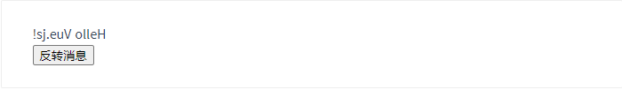

注意在 `reverseMessage` 方法中，我们更新了应用的状态，但没有触碰 DOM——所有的 DOM 操作都由 Vue 来处理，你编写的代码只需要关注逻辑层面即可。

Vue 还提供了 `v-model` 指令，它能轻松实现表单输入和应用状态之间的双向绑定。

~~~javascript
<div id="app-6">
  <p>{{ message }}</p>
  <input v-model="message">
</div>
~~~

~~~javascript
var app6 = new Vue({
  el: '#app-6',
  data: {
    message: 'Hello Vue!'
  }
})
~~~

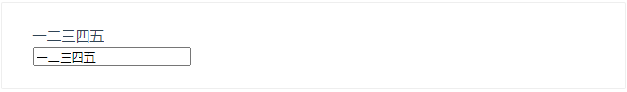

## 组件化应用构建

组件系统是 Vue 的另一个重要概念，因为它是一种抽象，允许我们使用小型、独立和通常可复用的组件构建大型应用。仔细想想，几乎任意类型的应用界面都可以抽象为一个组件树：

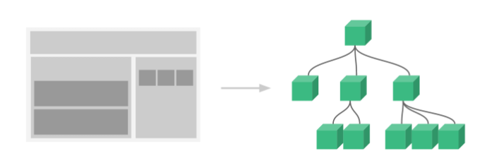

在 Vue 里，一个组件本质上是一个拥有预定义选项的一个 Vue 实例。在 Vue 中注册组件很简单：

~~~javascript
// 定义名为 todo-item 的新组件
Vue.component('todo-item', {
  template: '<li>这是个待办项</li>'
})

var app = new Vue(...)
~~~

现在你可以用它构建另一个组件模板：

~~~javascript
<ol>
  <!-- 创建一个 todo-item 组件的实例 -->
  <todo-item></todo-item>
</ol>
~~~

但是这样会为每个待办项渲染同样的文本，这看起来并不炫酷。我们应该能**从父作用域将数据传到子组件才对**。让我们来修改一下组件的定义，使之能够接受一个 [prop](https://cn.vuejs.org/v2/guide/components.html#通过-Prop-向子组件传递数据)：

```javascript
Vue.component('todo-item', {
  // todo-item 组件现在接受一个
  // "prop"，类似于一个自定义 attribute。
  // 这个 prop 名为 todo。
  props: ['todo'],
  template: '<li>{{ todo.text }}</li>'
})
```

现在，我们可以使用 `v-bind` 指令将待办项**传到循环输出的每个组件中**：

~~~javascript
<div id="app-7">
  <ol>
    <!--
      现在我们为每个 todo-item 提供 todo 对象
      todo 对象是变量，即其内容可以是动态的。
      我们也需要为每个组件提供一个“key”，稍后再
      作详细解释。
    -->
    <todo-item
      v-for="item in groceryList"
      v-bind:todo="item"
      v-bind:key="item.id"
    ></todo-item>
  </ol>
</div>
~~~

~~~javascript
Vue.component('todo-item', {
  props: ['todo'],
  template: '<li>{{ todo.text }}</li>'
})

var app7 = new Vue({
  el: '#app-7',
  data: {
    groceryList: [
      { id: 0, text: '蔬菜' },
      { id: 1, text: '奶酪' },
      { id: 2, text: '随便其它什么人吃的东西' }
    ]
  }
})
~~~

> 这个例子我都看不太懂。

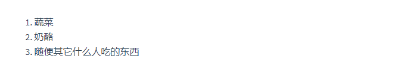

尽管这只是一个刻意设计的例子，但是我们已经设法将应用分割成了两个更小的单元。子单元通过 prop 接口与父单元进行了良好的解耦。我们现在可以进一步改进 `` 组件，提供更为复杂的模板和逻辑，而不会影响到父单元。

在一个大型应用中，有必要将整个应用程序划分为组件，以使开发更易管理。在[后续教程](https://cn.vuejs.org/v2/guide/components.html)中我们将详述组件，不过这里有一个 (假想的) 例子，以展示使用了组件的应用模板是什么样的：

~~~javascript
<div id="app">
  <app-nav></app-nav>
  <app-view>
    <app-sidebar></app-sidebar>
    <app-content></app-content>
  </app-view>
</div>
~~~

### 与自定义元素的关系

你可能已经注意到 Vue 组件非常类似于**自定义元素**——它是 [Web 组件规范](https://www.w3.org/wiki/WebComponents/)的一部分，这是因为 Vue 的组件语法部分参考了该规范。例如 Vue 组件实现了 [Slot API](https://github.com/w3c/webcomponents/blob/gh-pages/proposals/Slots-Proposal.md) 与 `is` attribute。但是，还是有几个关键差别：

1. Web Components 规范已经完成并通过，但未被所有浏览器原生实现。目前 Safari 10.1+、Chrome 54+ 和 Firefox 63+ 原生支持 Web Components。相比之下，Vue 组件不需要任何 polyfill，并且在所有支持的浏览器 (IE9 及更高版本) 之下表现一致。必要时，Vue 组件也可以包装于原生自定义元素之内。
2. Vue 组件提供了纯自定义元素所不具备的一些重要功能，最突出的是跨组件数据流、自定义事件通信以及构建工具集成。

虽然 Vue 内部没有使用自定义元素，不过在应用使用自定义元素、或以自定义元素形式发布时，[依然有很好的互操作性](https://custom-elements-everywhere.com/#vue)。Vue CLI 也支持将 Vue 组件构建成为原生的自定义元素。

## 准备好了吗？

我们刚才简单介绍了 Vue 核心最基本的功能——本教程的其余部分将更加详细地涵盖这些功能以及其它高级功能，所以请务必读完整个教程！

# Vue实例

## 创建一个 Vue 实例

每个 Vue 应用都是通过用 `Vue` 函数创建一个新的 **Vue 实例**开始的：

```javascript
var vm = new Vue({
  // 选项
})
```

虽然没有完全遵循 [MVVM 模型](https://zh.wikipedia.org/wiki/MVVM)，但是 Vue 的设计也受到了它的启发。因此在文档中经常会使用 `vm` (ViewModel 的缩写) 这个变量名表示 Vue 实例。

当创建一个 Vue 实例时，你可以传入一个**选项对象**。这篇教程主要描述的就是如何使用这些选项来创建你想要的行为。作为参考，你也可以在 [API 文档](https://cn.vuejs.org/v2/api/#%E9%80%89%E9%A1%B9-%E6%95%B0%E6%8D%AE)中浏览完整的选项列表。

一个 Vue 应用由一个通过 `new Vue` 创建的**根 Vue 实例**，以及可选的嵌套的、可复用的组件树组成。举个例子，一个 todo 应用的组件树可以是这样的：

```javascript
根实例
└─ TodoList
   ├─ TodoItem
   │  ├─ TodoButtonDelete
   │  └─ TodoButtonEdit
   └─ TodoListFooter
      ├─ TodosButtonClear
      └─ TodoListStatistics
```

我们会在稍后的[组件系统](https://cn.vuejs.org/v2/guide/components.html)章节具体展开。不过现在，你只需要明白所有的 Vue 组件都是 Vue 实例，并且接受相同的选项对象 (一些根实例特有的选项除外)。

## 数据与方法

当一个 Vue 实例被创建时，它将 `data` 对象中的所有的 property 加入到 Vue 的**响应式系统**中。当这些 property 的值发生改变时，视图将会产生“响应”，即匹配更新为新的值。

~~~javascript
// 我们的数据对象
var data = { a: 1 }

// 该对象被加入到一个 Vue 实例中
var vm = new Vue({
  data: data
})

// 获得这个实例上的 property
// 返回源数据中对应的字段
vm.a == data.a // => true

// 设置 property 也会影响到原始数据
vm.a = 2
data.a // => 2

// ……反之亦然
data.a = 3
vm.a // => 3
~~~

当这些数据改变时，视图会进行重渲染。值得注意的是只有当实例被创建时就已经存在于 `data` 中的 property 才是**响应式**的。也就是说如果你添加一个新的 property，比如：

```javascript
vm.b = 'hi'
```

那么对 `b` 的改动将不会触发任何视图的更新。如果你知道你会在晚些时候需要一个 property，但是一开始它为空或不存在，那么你仅需要设置一些初始值。比如：

```javascript
data: {
  newTodoText: '',
  visitCount: 0,
  hideCompletedTodos: false,
  todos: [],
  error: null
}
```

这里唯一的例外是使用 `Object.freeze()`，这会阻止修改现有的 property，也意味着响应系统无法再*追踪*变化。

```javascript
var obj = {
  foo: 'bar'
}

Object.freeze(obj)

new Vue({
  el: '#app',
  data: obj
})
```

~~~javascript
<div id="app">
  <p>{{ foo }}</p>
  <!-- 这里的 `foo` 不会更新！ -->
  <button v-on:click="foo = 'baz'">Change it</button>
</div>
~~~

除了数据 property，Vue 实例还暴露了一些有用的实例 property 与方法。它们都有前缀 `$`，以便与用户定义的 property 区分开来。例如：

```javascript
var data = { a: 1 }
var vm = new Vue({
  el: '#example',
  data: data
})

vm.$data === data // => true
vm.$el === document.getElementById('example') // => true

// $watch 是一个实例方法
vm.$watch('a', function (newValue, oldValue) {
  // 这个回调将在 `vm.a` 改变后调用
})
```

以后你可以在 [API 参考](https://cn.vuejs.org/v2/api/#%E5%AE%9E%E4%BE%8B-property)中查阅到完整的实例 property 和方法的列表。

## 实例生命周期钩子

每个 Vue 实例在被创建时都要经过一系列的初始化过程——例如，需要设置数据监听、编译模板、将实例挂载到 DOM 并在数据变化时更新 DOM 等。同时在这个过程中也会运行一些叫做**生命周期钩子**的函数，这给了用户在不同阶段添加自己的代码的机会。

比如 [`created`](https://cn.vuejs.org/v2/api/#created) 钩子可以用来在一个实例被创建之后执行代码：

```javascript
new Vue({
  data: {
    a: 1
  },
  created: function () {
    // `this` 指向 vm 实例
    console.log('a is: ' + this.a)
  }
})
// => "a is: 1"
```

也有一些其它的钩子，在实例生命周期的不同阶段被调用，如 [`mounted`](https://cn.vuejs.org/v2/api/#mounted)、[`updated`](https://cn.vuejs.org/v2/api/#updated) 和 [`destroyed`](https://cn.vuejs.org/v2/api/#destroyed)。生命周期钩子的 `this` 上下文指向调用它的 Vue 实例。

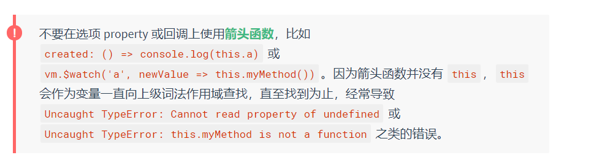

## 生命周期图示

下图展示了实例的生命周期。你不需要立马弄明白所有的东西，不过随着你的不断学习和使用，它的参考价值会越来越高。

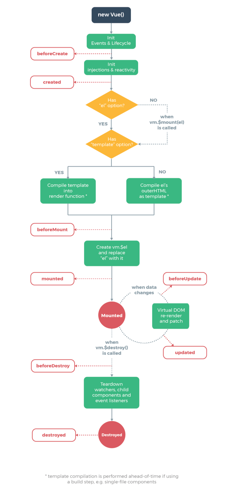

# 模版语法

> 我对于渲染函数所知甚少，而且这个官方文档也不说人话。

Vue.js 使用了基于 HTML 的模板语法，允许开发者声明式地将 DOM 绑定至底层 Vue 实例的数据。所有 Vue.js 的模板都是合法的 HTML，所以能被遵循规范的浏览器和 HTML 解析器解析。

在底层的实现上，Vue 将模板编译成虚拟 DOM 渲染函数。结合响应系统，Vue 能够智能地计算出最少需要重新渲染多少组件，并把 DOM 操作次数减到最少。

如果你熟悉虚拟 DOM 并且偏爱 JavaScript 的原始力量，你也可以不用模板，[直接写渲染 (render) 函数](https://cn.vuejs.org/v2/guide/render-function.html)，使用可选的 JSX 语法。

## 插值

### 文本

数据绑定最常见的形式就是使用“Mustache”语法 (双大括号) 的文本插值：

```css
<span>Message: {{ msg }}</span>
```

Mustache 标签将会被替代为对应数据对象上 `msg` property 的值。无论何时，绑定的数据对象上 `msg` property 发生了改变，插值处的内容都会更新。

通过使用 [v-once 指令](https://cn.vuejs.org/v2/api/#v-once)，你也能执行一次性地插值，当数据改变时，插值处的内容不会更新。但请留心这会影响到该节点上的其它数据绑定：

```css
<span v-once>这个将不会改变: {{ msg }}</span>
```

### 原始HTML

双大括号会将数据解释为普通文本，而非 HTML 代码。为了输出真正的 HTML，你需要使用 [`v-html` 指令](https://cn.vuejs.org/v2/api/#v-html)：

```javascript
<p>Using mustaches: {{ rawHtml }}</p>
<p>Using v-html directive: <span v-html="rawHtml"></span></p>
```

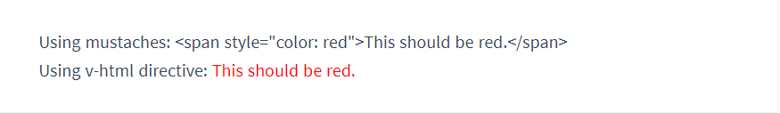

这个 `span` 的内容将会被替换成为 property 值 `rawHtml`，直接作为 HTML——会忽略解析 property 值中的数据绑定。注意，你不能使用 `v-html` 来复合局部模板，因为 Vue 不是基于字符串的模板引擎。反之，对于用户界面 (UI)，**组件更适合**作为可重用和可组合的基本单位。

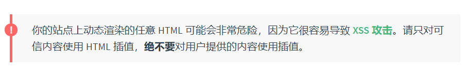

### Attribute

Mustache 语法不能作用在 HTML attribute 上，遇到这种情况应该使用 [`v-bind` 指令](https://cn.vuejs.org/v2/api/#v-bind)：

```javascript
<div v-bind:id="dynamicId"></div>
```

对于布尔 attribute (它们只要存在就意味着值为 `true`)，`v-bind` 工作起来略有不同，在这个例子中：

```javascript
<button v-bind:disabled="isButtonDisabled">Button</button>
```

如果 `isButtonDisabled` 的值是 `null`、`undefined` 或 `false`，则 `disabled` attribute 甚至不会被包含在渲染出来的 `<button>` 元素中。

### 使用 JavaScript 表达式

迄今为止，在我们的模板中，我们一直都只绑定简单的 property 键值。但实际上，对于所有的数据绑定，Vue.js 都提供了完全的 JavaScript 表达式支持。

```javascript
{{ number + 1 }}

{{ ok ? 'YES' : 'NO' }}

{{ message.split('').reverse().join('') }}

<div v-bind:id="'list-' + id"></div>
```

这些表达式会在所属 Vue 实例的数据作用域下作为 JavaScript 被解析。有个限制就是，每个绑定都只能包含**单个表达式**，所以下面的例子都**不会**生效。

~~~javascript
<!-- 这是语句，不是表达式 -->
{{ var a = 1 }}

<!-- 流控制也不会生效，请使用三元表达式 -->
{{ if (ok) { return message } }}

<p>{{100 > 20?'正确':'错误'}}</p>
<!--像这样就可以，它是单行表达式-->
  
<p>{{1+1}}</p>
<!-- 它也是单行语句，有结果：2 -->
  
<p>{{msg.split('').reverse().join('')}}</p>
<!-- 这个也是单行语句 -->
~~~

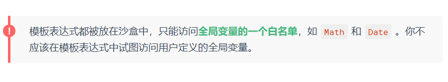

## 指令

指令 (Directives) 是带有 `v-` 前缀的特殊 attribute。指令 attribute 的值预期是**单个 JavaScript 表达式** (`v-for` 是例外情况，稍后我们再讨论)。指令的职责是，当表达式的值改变时，将其产生的连带影响，响应式地作用于 DOM。回顾我们在介绍中看到的例子：

```javascript
<p v-if="seen">现在你看到我了</p>
```

这里，`v-if` 指令将根据表达式 `seen` 的值的真假来插入/移除 `<p>` 元素。

### 参数

一些指令能够接收一个“参数”，在指令名称之后以冒号表示。例如，`v-bind` 指令可以用于响应式地更新 HTML attribute：

```javascript
<a v-bind:href="url">...</a>
```

在这里 `href` 是参数，告知 `v-bind` 指令将该元素的 `href` attribute 与表达式 `url` 的值绑定。

另一个例子是 `v-on` 指令，它用于监听 DOM 事件：

```javascript
<a v-on:click="doSomething">...</a>
```

在这里参数是监听的事件名。我们也会更详细地讨论事件处理。

### 动态参数

> 2.6.0 新增

从 2.6.0 开始，可以用方括号括起来的 JavaScript 表达式作为一个指令的参数：

```javascript
<!--
注意，参数表达式的写法存在一些约束，如之后的“对动态参数表达式的约束”章节所述。
-->
<a v-bind:[attributeName]="url"> ... </a>
```

这里的 `attributeName` 会被作为一个 JavaScript 表达式进行动态求值，求得的值将会作为最终的参数来使用。例如，如果你的 Vue 实例有一个 `data` property `attributeName`，其值为 `"href"`，那么这个绑定将等价于 `v-bind:href`。

同样地，你可以使用动态参数为一个动态的事件名绑定处理函数：

```javascript
<a v-on:[eventName]="doSomething"> ... </a>
```

在这个示例中，当 `eventName` 的值为 `"focus"` 时，`v-on:[eventName]` 将等价于 `v-on:focus`。

#### 对动态参数的值的约束

动态参数预期会求出一个字符串，异常情况下值为 `null`。这个特殊的 `null` 值可以被显性地用于移除绑定。任何其它非字符串类型的值都将会触发一个警告。

#### 对动态参数表达式的约束

动态参数表达式有一些语法约束，因为某些字符，如空格和引号，放在 HTML attribute 名里是无效的。例如：

```javascript
<!-- 这会触发一个编译警告 -->
<a v-bind:['foo' + bar]="value"> ... </a>
```

变通的办法是使用没有空格或引号的表达式，或用计算属性替代这种复杂表达式。

在 DOM 中使用模板时 (直接在一个 HTML 文件里撰写模板)，还需要避免使用大写字符来命名键名，因为浏览器会把 attribute 名全部强制转为小写：

```javascript
<!--
在 DOM 中使用模板时这段代码会被转换为 `v-bind:[someattr]`。
除非在实例中有一个名为“someattr”的 property，否则代码不会工作。
-->
<a v-bind:[someAttr]="value"> ... </a>
```

### 修饰符

修饰符 (modifier) 是以半角句号 `.` 指明的特殊后缀，用于指出一个指令应该以特殊方式绑定。例如，`.prevent` 修饰符告诉 `v-on` 指令对于触发的事件调用 `event.preventDefault()`：

```
<form v-on:submit.prevent="onSubmit">...</form>
```

在接下来对 [`v-on`](https://cn.vuejs.org/v2/guide/events.html#%E4%BA%8B%E4%BB%B6%E4%BF%AE%E9%A5%B0%E7%AC%A6) 和 [`v-for`](https://cn.vuejs.org/v2/guide/forms.html#%E4%BF%AE%E9%A5%B0%E7%AC%A6) 等功能的探索中，你会看到修饰符的其它例子。

### 缩写

`v-` 前缀作为一种视觉提示，用来识别模板中 Vue 特定的 attribute。当你在使用 Vue.js 为现有标签添加动态行为 (dynamic behavior) 时，`v-` 前缀很有帮助，然而，对于一些频繁用到的指令来说，就会感到使用繁琐。同时，在构建由 Vue 管理所有模板的[单页面应用程序 (SPA - single page application)](https://en.wikipedia.org/wiki/Single-page_application) 时，`v-` 前缀也变得没那么重要了。因此，Vue 为 `v-bind` 和 `v-on` 这两个最常用的指令，提供了特定简写：

#### v-bind缩写

~~~javascript
<!-- 完整语法 -->
<a v-bind:href="url">...</a>

<!-- 缩写 -->
<a :href="url">...</a>

<!-- 动态参数的缩写 (2.6.0+) -->
<a :[key]="url"> ... </a>
~~~

#### v-on 缩写

~~~javascript
<!-- 完整语法 -->
<a v-on:click="doSomething">...</a>

<!-- 缩写 -->
<a @click="doSomething">...</a>

<!-- 动态参数的缩写 (2.6.0+) -->
<a @[event]="doSomething"> ... </a>
~~~

它们看起来可能与普通的 HTML 略有不同，但 `:` 与 `@` 对于 attribute 名来说都是合法字符，在所有支持 Vue 的浏览器都能被正确地解析。而且，它们不会出现在最终渲染的标记中。缩写语法是完全可选的，但随着你更深入地了解它们的作用，你会庆幸拥有它们。

# 计算属性和侦听器

# Class 与 Style 绑定

# 条件渲染

## v-if

`v-if` 指令用于条件性地渲染一块内容。这块内容只会在指令的表达式返回 truthy 值的时候被渲染。

```javascript
<h1 v-if="awesome">Vue is awesome!</h1>
```

也可以用 `v-else` 添加一个“else 块”：

```javascript
<h1 v-if="awesome">Vue is awesome!</h1>
<h1 v-else>Oh no 😢</h1>
```

### 在 `<template> `元素上使用 v-if 条件渲染分组

因为 `v-if` 是一个指令，所以必须将它添加到一个元素上。但是如果想切换多个元素呢？此时可以把一个 `<template>` 元素当做**不可见的包裹元素**，并在上面使用 `v-if`。最终的渲染结果将不包含 `<template>` 元素。

> 如果不用`template`元素，用别的元素包裹，比如div，也行，但是这样就会多渲染一个div了，对性能就不好了。

```javascript
<template v-if="ok">
  <h1>Title</h1>
  <p>Paragraph 1</p>
  <p>Paragraph 2</p>
</template>
```

### v-else

你可以使用 `v-else` 指令来表示 `v-if` 的“else 块”：

```javascript
<div v-if="Math.random() > 0.5">
  Now you see me
</div>
<div v-else>
  Now you don't
</div>
```

`v-else` 元素必须紧跟在带 `v-if` 或者 `v-else-if` 的元素的后面，否则它将不会被识别。

### v-else-if

> 2.1.0 新增

`v-else-if`，顾名思义，充当 `v-if` 的“else-if 块”，可以连续使用：

```javascript
<div v-if="type === 'A'">
  A
</div>
<div v-else-if="type === 'B'">
  B
</div>
<div v-else-if="type === 'C'">
  C
</div>
<div v-else>
  Not A/B/C
</div>
```

类似于 `v-else`，`v-else-if` 也必须紧跟在带 `v-if` 或者 `v-else-if` 的元素之后。

### 用 key 管理可复用的元素

Vue 会尽可能高效地渲染元素，通常会复用已有元素而不是从头开始渲染。这么做除了使 Vue 变得非常快之外，还有其它一些好处。例如，如果你允许用户在不同的登录方式之间切换：

```javascript
<template v-if="loginType === 'username'">
  <label>Username</label>
  <input placeholder="Enter your username">
</template>

<template v-else>
  <label>Email</label>
  <input placeholder="Enter your email address">
</template>
```

那么在上面的代码中切换 `loginType` 将不会清除用户已经输入的内容。因为两个模板使用了相同的元素，`<input>` 不会被替换掉——仅仅是替换了它的 `placeholder`。

自己动手试一试，在输入框中输入一些文本，然后按下切换按钮：

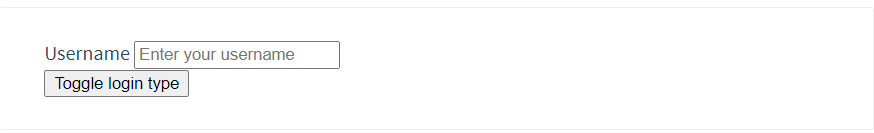

这样也不总是符合实际需求，所以 Vue 为你提供了一种方式来表达“这两个元素是完全独立的，不要复用它们”。只需添加一个具有唯一值的 `key` attribute 即可：

```javascript
<template v-if="loginType === 'username'">
  <label>Username</label>
  <input placeholder="Enter your username" key="username-input">
</template>

<template v-else>
  <label>Email</label>
  <input placeholder="Enter your email address" key="email-input">
</template>
```

现在，每次切换时，输入框都将被重新渲染。请看：


注意，`<label>` 元素仍然会被高效地复用，因为它们没有添加 `key` attribute。

## v-show

> 注意：`v-show`是没有else的概念的，它只能控制自己的显示和隐藏。

另一个用于根据条件展示元素的选项是 `v-show` 指令。用法大致一样：

```javascript
<h1 v-show="ok">Hello!</h1>
```

不同的是带有 `v-show` 的元素始终会被渲染并保留在 DOM 中。`v-show` 只是简单地切换元素的 CSS property `display`。

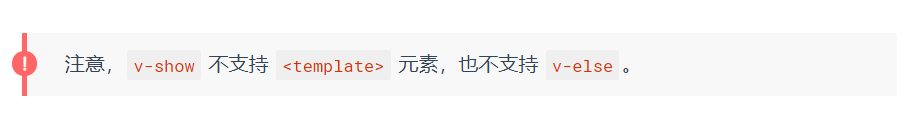

## v-if(死亡)vs v-show(隐身)

`v-if` 是“真正”的条件渲染，因为它会确保在切换过程中条件块内的事件监听器和子组件适当地被**销毁和重建**。

`v-if` 也是**惰性的**：如果在初始渲染时条件为假，则什么也不做——直到条件第一次变为真时，才会开始渲染条件块。

> `v-if`在初始条件为false的情况下，页面是看不到结构的，而`v-show`页面上可以看到结构的，只是不显示而已。

相比之下，`v-show` 就简单得多——**不管初始条件是什么，元素总是会被渲染**，并且只是简单地基于 CSS 进行切换。

一般来说，`v-if` 有更高的切换开销，而 `v-show` 有更高的初始渲染开销。因此，如果需要非常频繁地切换，则使用 `v-show` 较好；如果在运行时条件很少改变，则使用 `v-if` 较好。

## v-if 与 v-for 一起使用

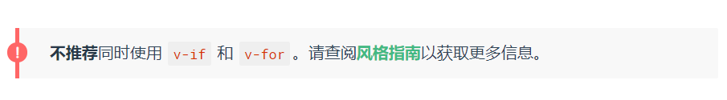

当 `v-if` 与 `v-for` 一起使用时，`v-for` 具有比 `v-if` 更高的优先级。请查阅[列表渲染指南](https://cn.vuejs.org/v2/guide/list.html#v-for-with-v-if)以获取详细信息。

# 列表渲染

## 用 v-for 把一个数组对应为一组元素

我们可以用 `v-for` 指令基于一个数组来渲染一个列表。`v-for` 指令需要使用 `item in items` 形式的特殊语法，其中 `items` 是源数据数组，而 `item` 则是被迭代的数组元素的**别名**。

~~~~javascript
<ul id="example-1">
  <li v-for="item in items" :key="item.message">
    {{ item.message }}
  </li>
</ul>
~~~~

~~~javascript
var example1 = new Vue({
  el: '#example-1',
  data: {
    items: [
      { message: 'Foo' },
      { message: 'Bar' }
    ]
  }
})
~~~

结果：

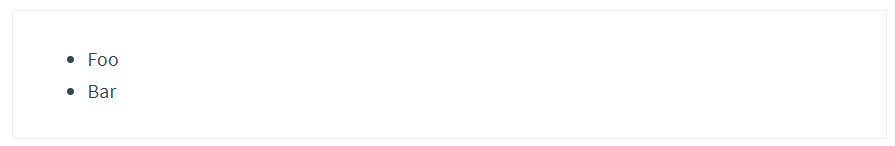

在 `v-for` 块中，我们可以访问所有父作用域的 property。`v-for` 还支持一个可选的第二个参数，即当前项的索引。

~~~javascript
<ul id="example-2">
  <li v-for="(item, index) in items">
    {{ parentMessage }} - {{ index }} - {{ item.message }}
  </li>
</ul>
~~~

~~~javascript
var example2 = new Vue({
  el: '#example-2',
  data: {
    parentMessage: 'Parent',
    items: [
      { message: 'Foo' },
      { message: 'Bar' }
    ]
  }
})
~~~

结果：

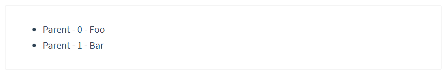

你也可以用 `of` 替代 `in` 作为分隔符，因为它更接近 JavaScript 迭代器的语法：

> `for in`遍历的是数组的索引（即键名），而`for of`遍历的是数组元素值。

~~~javascript
<div v-for="item of items"></div>
~~~

## 在 v-for 里使用对象

你也可以用 `v-for` 来遍历一个对象的 property。

~~~javascript
<ul id="v-for-object" class="demo">
  <li v-for="value in object">
    {{ value }}
  </li>
</ul>
~~~

~~~javascript
new Vue({
  el: '#v-for-object',
  data: {
    object: {
      title: 'How to do lists in Vue',
      author: 'Jane Doe',
      publishedAt: '2016-04-10'
    }
  }
})
~~~

结果：

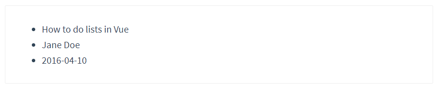

你也可以提供**第二个的参数为 property 名称 (也就是键名)**：

~~~javascript
<div v-for="(value, name) in object">
  {{ name }}: {{ value }}
</div>
~~~

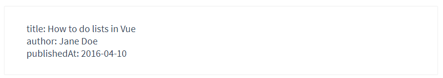

还可以用第三个参数作为索引：

~~~javascript
<div v-for="(value, name, index) in object">
  {{ index }}. {{ name }}: {{ value }}
</div>
~~~

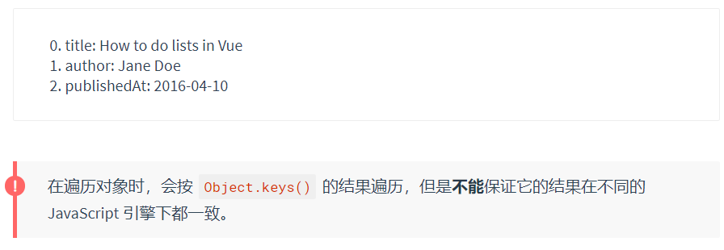

## 维护状态

当 Vue 正在更新使用 `v-for` 渲染的元素列表时，它默认使用“就地更新”的策略。如果数据项的顺序被改变，Vue 将不会移动 DOM 元素来匹配数据项的顺序，而是就地更新每个元素，并且确保它们在每个索引位置正确渲染。这个类似 Vue 1.x 的 `track-by="$index"`。

这个默认的模式是高效的，但是**只适用于不依赖子组件状态或临时 DOM 状态 (例如：表单输入值) 的列表渲染输出**。

为了给 Vue 一个提示，以便它能跟踪每个节点的身份，从而重用和重新排序现有元素，你需要为每项提供一个唯一 `key` attribute：

~~~javascript
<div v-for="item in items" v-bind:key="item.id">
  <!-- 内容 -->
</div>
~~~

建议尽可能在使用 `v-for` 时提供 `key` attribute，除非遍历输出的 DOM 内容非常简单，或者是刻意依赖默认行为以获取性能上的提升。

因为它是 Vue 识别节点的一个通用机制，`key` 并不仅与 `v-for` 特别关联。后面我们将在指南中看到，它还具有其它用途。

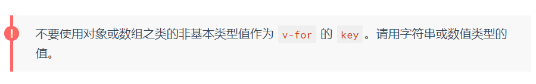

更多 `key` attribute 的细节用法请移步至 [`key` 的 API 文档](https://cn.vuejs.org/v2/api/#key)。

## 数组更新检测

### 变更方法

Vue 将被侦听的数组的变更方法进行了包裹，所以它们也将会触发视图更新。这些被包裹过的方法包括：

* `push()`
* `pop()`
* `shift()`
* `unshift()`
* `splice()`
* `sort()`
* `reverse()`

你可以打开控制台，然后对前面例子的 `items` 数组尝试调用变更方法。比如 `example1.items.push({ message: 'Baz' })`。

### 替换数组

变更方法，顾名思义，会变更调用了这些方法的原始数组。相比之下，也有非变更方法，例如 `filter()`、`concat()` 和 `slice()`。它们不会变更原始数组，而**总是返回一个新数组**。当使用非变更方法时，可以用新数组替换旧数组：

```javascript
example1.items = example1.items.filter(function (item) {
  return item.message.match(/Foo/)
})
```

你可能认为这将导致 Vue 丢弃现有 DOM 并重新渲染整个列表。幸运的是，事实并非如此。Vue 为了使得 DOM 元素得到最大范围的重用而实现了一些智能的启发式方法，所以用一个含有相同元素的数组去替换原来的数组是非常高效的操作。

### 注意事项

由于 JavaScript 的限制，Vue **不能检测**数组和对象的变化。[深入响应式原理](https://cn.vuejs.org/v2/guide/reactivity.html#%E6%A3%80%E6%B5%8B%E5%8F%98%E5%8C%96%E7%9A%84%E6%B3%A8%E6%84%8F%E4%BA%8B%E9%A1%B9)中有相关的讨论。

## 显示过滤/排序后的结果

有时，我们想要显示一个数组经过过滤或排序后的版本，而不实际变更或重置原始数据。在这种情况下，可以创建一个计算属性，来返回过滤或排序后的数组。

例如：

```javascript
<li v-for="n in evenNumbers">{{ n }}</li>
```

~~~javascript
data: {
  numbers: [ 1, 2, 3, 4, 5 ]
},
computed: {
  evenNumbers: function () {
    return this.numbers.filter(function (number) {
      return number % 2 === 0
    })
  }
}
~~~

在计算属性不适用的情况下 (例如，在嵌套 `v-for` 循环中) 你可以使用一个方法：

~~~javascript
<ul v-for="set in sets">
  <li v-for="n in even(set)">{{ n }}</li>
</ul>
~~~

~~~javascript
data: {
  sets: [[ 1, 2, 3, 4, 5 ], [6, 7, 8, 9, 10]]
},
methods: {
  even: function (numbers) {
    return numbers.filter(function (number) {
      return number % 2 === 0
    })
  }
}
~~~

## 在 `v-for` 里使用值范围

`v-for` 也可以接受整数。在这种情况下，它会把模板重复对应次数。

~~~javascript
<div>
  <span v-for="n in 10">{{ n }} </span>
</div>
~~~

结果：

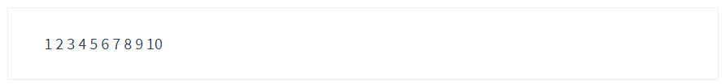

## 在 `<template> `上使用 v-for

类似于 `v-if`，你也可以利用带有 `v-for` 的 `<template>` 来循环渲染一段包含多个元素的内容。比如：

~~~javascript
<ul>
  <template v-for="item in items">
    <li>{{ item.msg }}</li>
    <li class="divider" role="presentation"></li>
  </template>
</ul>
~~~

## v-for 与 v-if 一同使用


当它们处于同一节点，`v-for` 的优先级比 `v-if` 更高，这意味着 `v-if` 将分别重复运行于每个 `v-for` 循环中。当你只想为*部分*项渲染节点时，这种优先级的机制会十分有用，如下：

~~~javascript
<li v-for="todo in todos" v-if="!todo.isComplete">
  {{ todo }}
</li>
~~~

上面的代码将只渲染未完成的 todo。

而如果你的目的是有条件地跳过循环的执行，那么可以将 `v-if` 置于外层元素 (或 `<template>`) 上。如：

```javascript
<ul v-if="todos.length">
  <li v-for="todo in todos">
    {{ todo }}
  </li>
</ul>
<p v-else>No todos left!</p>
```

## 在组件上使用 v-for

> 这部分内容假定你已经了解[组件](https://cn.vuejs.org/v2/guide/components.html)相关知识。你也完全可以先跳过它，以后再回来查看。

在自定义组件上，你可以像在任何普通元素上一样使用 `v-for`。

```javascript
<my-component v-for="item in items" :key="item.id"></my-component>
```

> 2.2.0+ 的版本里，当在组件上使用 `v-for` 时，`key` 现在是必须的。

然而，任何数据都不会被自动传递到组件里，因为组件有自己独立的作用域。为了把迭代数据传递到组件里，我们要使用 prop：

```javascript
<my-component
  v-for="(item, index) in items"
  v-bind:item="item"
  v-bind:index="index"
  v-bind:key="item.id"
></my-component>
```

不自动将 `item` 注入到组件里的原因是，这会使得组件与 `v-for` 的运作紧密耦合。明确组件数据的来源能够使组件在其他场合重复使用。

下面是一个简单的 todo 列表的完整例子：

~~~javascript
<div id="todo-list-example">
  <form v-on:submit.prevent="addNewTodo">
    <label for="new-todo">Add a todo</label>
    <input
      v-model="newTodoText"
      id="new-todo"
      placeholder="E.g. Feed the cat"
    >
    <button>Add</button>
  </form>
  <ul>
    <li
      is="todo-item"
      v-for="(todo, index) in todos"
      v-bind:key="todo.id"
      v-bind:title="todo.title"
      v-on:remove="todos.splice(index, 1)"
    ></li>
  </ul>
</div>
~~~

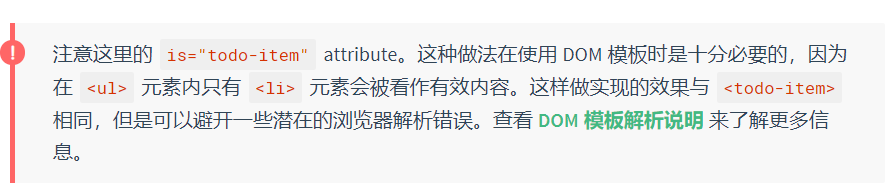

~~~javascript
Vue.component('todo-item', {
  template: '\
    <li>\
      {{ title }}\
      <button v-on:click="$emit(\'remove\')">Remove</button>\
    </li>\
  ',
  props: ['title']
})

new Vue({
  el: '#todo-list-example',
  data: {
    newTodoText: '',
    todos: [
      {
        id: 1,
        title: 'Do the dishes',
      },
      {
        id: 2,
        title: 'Take out the trash',
      },
      {
        id: 3,
        title: 'Mow the lawn'
      }
    ],
    nextTodoId: 4
  },
  methods: {
    addNewTodo: function () {
      this.todos.push({
        id: this.nextTodoId++,
        title: this.newTodoText
      })
      this.newTodoText = ''
    }
  }
})
~~~

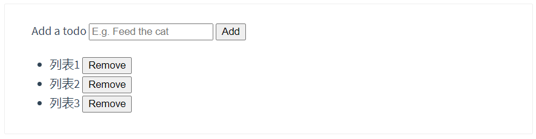

# 事件处理

## 监听事件

可以用 `v-on` 指令监听 DOM 事件，并在触发时运行一些 JavaScript 代码。

示例：

```javascript
<div id="example-1">
  <button v-on:click="counter += 1">Add 1</button>
  <p>The button above has been clicked {{ counter }} times.</p>
</div>
```

~~~javascript
var example1 = new Vue({
  el: '#example-1',
  data: {
    counter: 0
  }
})
~~~

## 事件处理方法

然而许多事件处理逻辑会更为复杂，所以直接把 JavaScript 代码写在 `v-on` 指令中是不可行的。因此 `v-on` 还可以接收一个需要调用的方法名称。

示例：

```javascript
<div id="example-2">
  <!-- `greet` 是在下面定义的方法名 -->
  <button v-on:click="greet">Greet</button>
</div>
```

~~~javascript
var example2 = new Vue({
  el: '#example-2',
  data: {
    name: 'Vue.js'
  },
  // 在 `methods` 对象中定义方法
  methods: {
    greet: function (event) {
      // `this` 在方法里指向当前 Vue 实例
      alert('Hello ' + this.name + '!')
      // `event` 是原生 DOM 事件
      if (event) {
        alert(event.target.tagName)
      }
    }
  }
})

// 也可以用 JavaScript 直接调用方法
example2.greet() // => 'Hello Vue.js!'
~~~

结果：

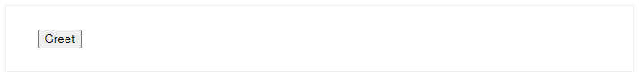

> 点击按钮首先会出现`Hello Vue.js`，然后会出现`BUTTON`。

## 内联处理器中的方法

除了直接绑定到一个方法，也可以在内联 JavaScript 语句中调用方法：

```javascript
<div id="example-3">
  <button v-on:click="say('hi')">Say hi</button>
  <button v-on:click="say('what')">Say what</button>
</div>
```

~~~javascript
new Vue({
  el: '#example-3',
  methods: {
    say: function (message) {
      alert(message)
    }
  }
})
~~~

结果：

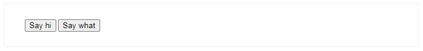

有时也需要在内联语句处理器中访问原始的 DOM 事件。可以用**特殊变量 `$event`** 把它传入方法：

~~~javascript
<button v-on:click="warn('Form cannot be submitted yet.', $event)">
  Submit
</button>
~~~

~~~javascript
// ...
methods: {
  warn: function (message, event) {
    // 现在我们可以访问原生事件对象
    if (event) {
      event.preventDefault()
    }
    alert(message)
  }
}
~~~

> `$event`并不熟，十分不熟。

## 事件修饰符

在事件处理程序中调用 `event.preventDefault()` 或 `event.stopPropagation()` 是非常常见的需求。尽管我们可以在方法中轻松实现这点，但更好的方式是：方法只有纯粹的数据逻辑，而不是去处理 DOM 事件细节。

为了解决这个问题，Vue.js 为 `v-on` 提供了**事件修饰符**。之前提过，修饰符是由点开头的指令后缀来表示的。

- `.stop`
- `.prevent`
- `.capture`
- `.self`
- `.once`
- `.passive`

~~~javascript
<!-- 阻止单击事件继续传播 -->
<a v-on:click.stop="doThis"></a>

<!-- 提交事件不再重载页面 -->
<form v-on:submit.prevent="onSubmit"></form>

<!-- 修饰符可以串联 -->
<a v-on:click.stop.prevent="doThat"></a>

<!-- 只有修饰符 -->
<form v-on:submit.prevent></form>

<!-- 添加事件监听器时使用事件捕获模式 -->
<!-- 即内部元素触发的事件先在此处理，然后才交由内部元素进行处理 -->
<div v-on:click.capture="doThis">...</div>

<!-- 只当在 event.target 是当前元素自身时触发处理函数 -->
<!-- 即事件不是从内部元素触发的 -->
<div v-on:click.self="doThat">...</div>
~~~

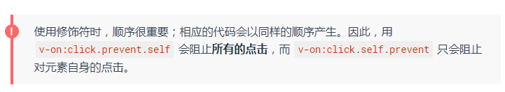

> 2.1.4 新增

~~~javascript
<!-- 点击事件将只会触发一次 -->
<a v-on:click.once="doThis"></a>
~~~

不像其它只能对原生的 DOM 事件起作用的修饰符，`.once` 修饰符还能被用到自定义的[组件事件](https://cn.vuejs.org/v2/guide/components-custom-events.html)上。如果你还没有阅读关于组件的文档，现在大可不必担心。

> 2.3.0 新增

Vue 还对应 [`addEventListener` 中的 `passive` 选项](https://developer.mozilla.org/en-US/docs/Web/API/EventTarget/addEventListener#Parameters)提供了 `.passive` 修饰符。

```javascript
<!-- 滚动事件的默认行为 (即滚动行为) 将会立即触发 -->
<!-- 而不会等待 `onScroll` 完成  -->
<!-- 这其中包含 `event.preventDefault()` 的情况 -->
<div v-on:scroll.passive="onScroll">...</div>
```

这个 `.passive` 修饰符尤其能够提升移动端的性能。

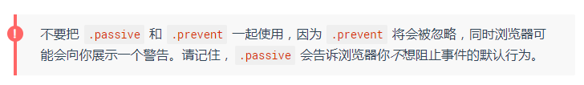

## 按键修饰符

在监听键盘事件时，我们经常需要检查详细的按键。Vue 允许为 `v-on` 在监听键盘事件时添加按键修饰符：

```javascript
<!-- 只有在 `key` 是 `Enter` 时调用 `vm.submit()` -->
<input v-on:keyup.enter="submit">
```

你可以直接将 [`KeyboardEvent.key`](https://developer.mozilla.org/en-US/docs/Web/API/KeyboardEvent/key/Key_Values) 暴露的任意有效按键名转换为 kebab-case 来作为修饰符。

```javascript
<input v-on:keyup.page-down="onPageDown">
```

在上述示例中，处理函数只会在 `$event.key` 等于 `PageDown` 时被调用。

### 按键码

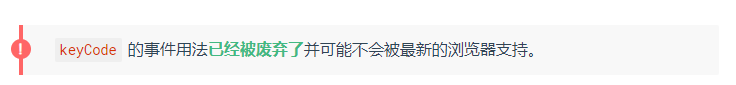

使用 `keyCode` attribute 也是允许的：

```
<input v-on:keyup.13="submit">
```

为了在必要的情况下支持旧浏览器，Vue 提供了绝大多数常用的按键码的别名：

- `.enter`
- `.tab`
- `.delete` (捕获“删除”和“退格”键)
- `.esc`
- `.space`
- `.up`
- `.down`
- `.left`
- `.right`

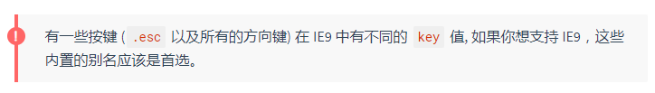

你还可以通过全局 `config.keyCodes` 对象[自定义按键修饰符别名](https://cn.vuejs.org/v2/api/#keyCodes)：

```javascript
// 可以使用 `v-on:keyup.f1`
Vue.config.keyCodes.f1 = 112
```

## 系统修饰键

> 2.1.0 新增

可以用如下修饰符来实现仅在按下相应按键时才触发鼠标或键盘事件的监听器。

- `.ctrl`
- `.alt`
- `.shift`
- `.meta`

> 注意：在 Mac 系统键盘上，meta 对应 command 键 (⌘)。在 Windows 系统键盘 meta 对应 Windows 徽标键 (⊞)。在 Sun 操作系统键盘上，meta 对应实心宝石键 (◆)。在其他特定键盘上，尤其在 MIT 和 Lisp 机器的键盘、以及其后继产品，比如 Knight 键盘、space-cadet 键盘，meta 被标记为“META”。在 Symbolics 键盘上，meta 被标记为“META”或者“Meta”。

例如：

```javascript
<!-- Alt + C -->
<input v-on:keyup.alt.67="clear">

<!-- Ctrl + Click -->
<div v-on:click.ctrl="doSomething">Do something</div>
```

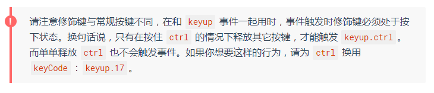

### .exact 修饰符

> 2.5.0 新增

`.exact` 修饰符允许你控制由精确的系统修饰符组合触发的事件。

~~~javascript
<!-- 即使 Alt 或 Shift 被一同按下时也会触发 -->
<button v-on:click.ctrl="onClick">A</button>

<!-- 有且只有 Ctrl 被按下的时候才触发 -->
<button v-on:click.ctrl.exact="onCtrlClick">A</button>

<!-- 没有任何系统修饰符被按下的时候才触发 -->
<button v-on:click.exact="onClick">A</button>
~~~

### 鼠标按钮修饰符

> 2.2.0 新增

- `.left`
- `.right`
- `.middle`

这些修饰符会限制处理函数仅响应特定的鼠标按钮。

## 为什么在 HTML 中监听事件？

你可能注意到这种事件监听的方式违背了关注点分离 (separation of concern) 这个长期以来的优良传统。但不必担心，因为所有的 Vue.js 事件处理方法和表达式都严格绑定在当前视图的 ViewModel 上，它不会导致任何维护上的困难。实际上，使用 `v-on` 有几个好处：

1. 扫一眼 HTML 模板便能轻松定位在 JavaScript 代码里对应的方法。
2. 因为你无须在 JavaScript 里手动绑定事件，你的 ViewModel 代码可以是非常纯粹的逻辑，和 DOM 完全解耦，更易于测试。
3. 当一个 ViewModel 被销毁时，所有的事件处理器都会自动被删除。你无须担心如何清理它们。

# 表单输入绑定

## 基础用法

你可以用 `v-model` 指令在表单 ``、`` 及 `` 元素上创建双向数据绑定。它会根据控件类型自动选取正确的方法来更新元素。尽管有些神奇，但 `v-model` 本质上不过是语法糖。它负责监听用户的输入事件以更新数据，并对一些极端场景进行一些特殊处理。

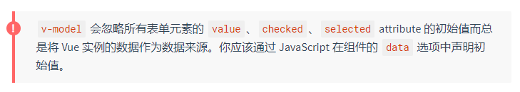

`v-model` 在内部为不同的输入元素使用不同的 property 并抛出不同的事件：

- text 和 textarea 元素使用 `value` property 和 `input` 事件；
- checkbox 和 radio 使用 `checked` property 和 `change` 事件；
- select 字段将 `value` 作为 prop 并将 `change` 作为事件。

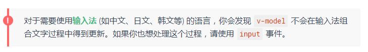

### 文本

~~~javascript
<input v-model="message" placeholder="edit me">
<p>Message is: {{ message }}</p>
~~~

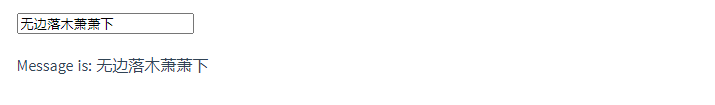

### 多行文本

~~~javascript
<span>Multiline message is:</span>
<p style="white-space: pre-line;">{{ message }}</p>
<br>
<textarea v-model="message" placeholder="add multiple lines"></textarea>
~~~

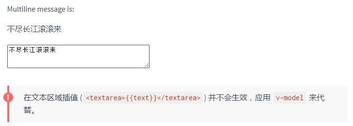

### 复选框

单个复选框，绑定到布尔值：

```javascript
<input type="checkbox" id="checkbox" v-model="checked">
<label for="checkbox">{{ checked }}</label>
```

多个复选框，绑定到同一个数组：

```javascript
<input type="checkbox" id="jack" value="Jack" v-model="checkedNames">
<label for="jack">Jack</label>
<input type="checkbox" id="john" value="John" v-model="checkedNames">
<label for="john">John</label>
<input type="checkbox" id="mike" value="Mike" v-model="checkedNames">
<label for="mike">Mike</label>
<br>
<span>Checked names: {{ checkedNames }}</span>
```

~~~javascript
new Vue({
  el: '...',
  data: {
    checkedNames: []
  }
})
~~~


### 单选按钮

~~~javascript
<div id="example-4">
  <input type="radio" id="one" value="One" v-model="picked">
  <label for="one">One</label>
  <br>
  <input type="radio" id="two" value="Two" v-model="picked">
  <label for="two">Two</label>
  <br>
  <span>Picked: {{ picked }}</span>
</div>
~~~

~~~javascript
new Vue({
  el: '#example-4',
  data: {
    picked: ''
  }
})
~~~

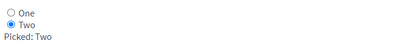

### 选择框

单选时：

```javascript
<div id="example-5">
  <select v-model="selected">
    <option disabled value="">请选择</option>
    <option>A</option>
    <option>B</option>
    <option>C</option>
  </select>
  <span>Selected: {{ selected }}</span>
</div>
```

~~~javascript
new Vue({
  el: '...',
  data: {
    selected: ''
  }
})
~~~

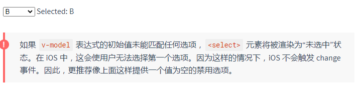

多选时 (绑定到一个数组)：

```javascript
<div id="example-6">
  <select v-model="selected" multiple style="width: 50px;">
    <option>A</option>
    <option>B</option>
    <option>C</option>
  </select>
  <br>
  <span>Selected: {{ selected }}</span>
</div>
```

~~~javascript
new Vue({
  el: '#example-6',
  data: {
    selected: []
  }
})
~~~

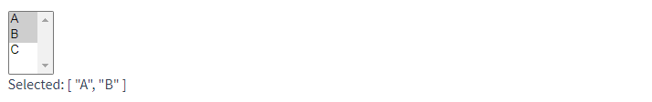

用 `v-for` 渲染的动态选项：

```javascript
<select v-model="selected">
  <option v-for="option in options" v-bind:value="option.value">
    {{ option.text }}
  </option>
</select>
<span>Selected: {{ selected }}</span>
```

~~~javascript
new Vue({
  el: '...',
  data: {
    selected: 'A',
    options: [
      { text: 'One', value: 'A' },
      { text: 'Two', value: 'B' },
      { text: 'Three', value: 'C' }
    ]
  }
})
~~~

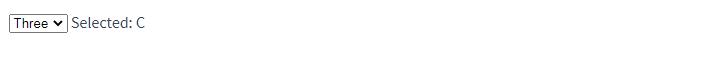

## 值绑定

对于单选按钮，复选框及选择框的选项，`v-model` 绑定的值通常是静态字符串 (对于复选框也可以是布尔值)：

```javascript
<!-- 当选中时，`picked` 为字符串 "a" -->
<input type="radio" v-model="picked" value="a">

<!-- `toggle` 为 true 或 false -->
<input type="checkbox" v-model="toggle">

<!-- 当选中第一个选项时，`selected` 为字符串 "abc" -->
<select v-model="selected">
  <option value="abc">ABC</option>
</select>
```

但是有时我们可能想把值绑定到 Vue 实例的一个动态 property 上，这时可以用 `v-bind` 实现，并且这个 property 的值可以不是字符串。

### 复选框

~~~javascript
<input
  type="checkbox"
  v-model="toggle"
  true-value="yes"
  false-value="no"
>
~~~

~~~javascript
// 当选中时
vm.toggle === 'yes'
// 当没有选中时
vm.toggle === 'no'
~~~

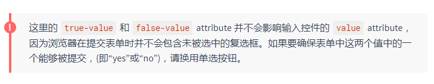

### 单选按钮

~~~javascript
<input type="radio" v-model="pick" v-bind:value="a">
~~~

~~~javascript
// 当选中时
vm.pick === vm.a
~~~

### 选择框的选项

~~~javascript
<select v-model="selected">
    <!-- 内联对象字面量 -->
  <option v-bind:value="{ number: 123 }">123</option>
</select>
~~~

~~~javascript
// 当选中时
typeof vm.selected // => 'object'
vm.selected.number // => 123
~~~

## 修饰符

### .lazy

在默认情况下，`v-model` 在每次 `input` 事件触发后将输入框的值与数据进行同步 (除了[上述](https://cn.vuejs.org/v2/guide/forms.html#vmodel-ime-tip)输入法组合文字时)。你可以添加 `lazy` 修饰符，从而转为在 `change` 事件_之后_进行同步：

```javascript
<!-- 在“change”时而非“input”时更新 -->
<input v-model.lazy="msg">
```

### .number

如果想自动将用户的输入值转为数值类型，可以给 `v-model` 添加 `number` 修饰符：

```javascript
<input v-model.number="age" type="number">
```

这通常很有用，因为即使在 `type="number"` 时，HTML 输入元素的值也总会返回字符串。如果这个值无法被 `parseFloat()` 解析，则会返回原始的值。

### .trim

如果要自动过滤用户输入的首尾空白字符，可以给 `v-model` 添加 `trim` 修饰符：

```javascript
<input v-model.trim="msg">
```

## 在组件上使用 v-model

> 如果你还不熟悉 Vue 的组件，可以暂且跳过这里。

HTML 原生的输入元素类型并不总能满足需求。幸好，Vue 的组件系统允许你创建具有完全自定义行为且可复用的输入组件。这些输入组件甚至可以和 `v-model` 一起使用！

要了解更多，请参阅组件指南中的[自定义输入组件](https://cn.vuejs.org/v2/guide/components-custom-events.html#自定义组件的-v-model)。

# 组件基础

> 学到父子组件通信这里卡了壳，看一下官方文档。

## 基本示例

这里有一个 Vue 组件的示例：

~~~javascript
// 定义一个名为 button-counter 的新组件
Vue.component('button-counter', {
  data: function () {
    return {
      count: 0
    }
  },
  template: '<button v-on:click="count++">You clicked me {{ count }} times.</button>'
})
~~~

**组件是可复用的 Vue 实例，且带有一个名字**：在这个例子中是 `<button-counter>`。我们可以在一个通过 `new Vue` 创建的 Vue 根实例中，把这个组件作为**自定义元素**来使用：

~~~javascript
<div id="components-demo">
  <button-counter></button-counter>
</div>
~~~

~~~javascript
new Vue({ el: '#components-demo' })
~~~

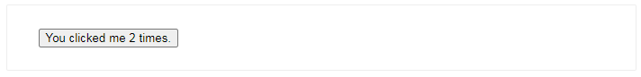

因为组件是可复用的 Vue 实例，所以它们与 `new Vue` 接收相同的选项，例如 `data`、`computed`、`watch`、`methods` 以及生命周期钩子等。仅有的例外是像 `el` 这样根实例特有的选项。

## 组件的复用

你可以将组件进行**任意次数**的复用：

> 这个就是组件的方便之处了。

~~~html
<div id="app">
  <cpn></cpn>
	<cpn></cpn>
  <cpn></cpn>
</div>
~~~

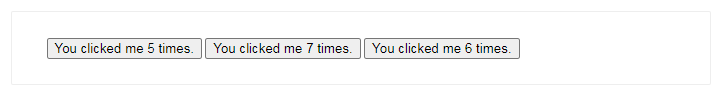

注意当点击按钮时，每个组件都会**各自独立维护它的 `count`**。因为你每用一次组件，就会有一个它的新**实例**被创建。

### data必须是一个函数

当我们定义这个 `<cpn>` 组件时，你可能会发现它的 `data` 并不是像这样直接提供一个对象：

~~~javascript
data: {
  counter: 0
}
~~~

取而代之的是，**一个组件的 data 选项必须是一个函数**，因此每个实例可以维护一份被返回对象的**独立的拷贝**：

> 这个看王红元老师视频的时候老师讲的很清楚。

~~~javascript
data: function () {
  return {
    count: 0
  }
}
~~~

如果 Vue 没有这条规则，点击一个按钮就可能会像如下代码一样影响到其它所有实例：

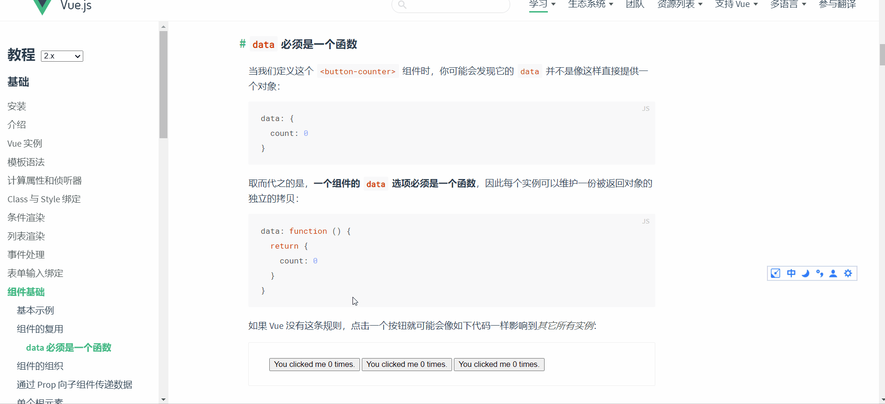

## 组件的组织

通常一个应用会以一棵**嵌套的组件树的形式**来组织：

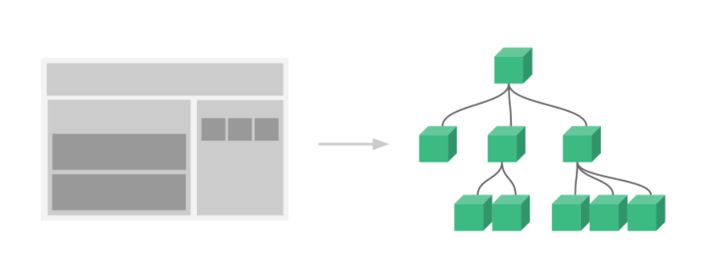

例如，你可能会有页头、侧边栏、内容区等组件，每个组件又包含了其它的像导航链接、博文之类的组件。

为了能在模板中使用，这些组件必须**先注册**以便 Vue 能够识别。这里有两种组件的注册类型：**全局注册**和**局部注册**。至此，我们的组件都只是通过 `Vue.component` 全局注册的：

~~~javascript
Vue.component('my-component-name', {
  // ... options ...
})
~~~

**全局注册的组件可以用在其被注册之后的任何 (通过 `new Vue`) 新创建的 Vue 根实例，也包括其组件树中的所有子组件的模板中。**

> 这他娘的不说人话。

到目前为止，关于组件注册你需要了解的就这些了，如果你阅读完本页内容并掌握了它的内容，我们会推荐你再回来把[组件注册](https://cn.vuejs.org/v2/guide/components-registration.html)读完。

## 通过 Prop 向子组件传递数据

[前端杂谈: Attribute VS Property](https://juejin.im/post/6844903712721387534)

早些时候，我们提到了创建一个博文组件的事情。问题是**如果你不能向这个组件传递某一篇博文的标题或内容之类的我们想展示的数据的话，它是没有办法使用的(啥意思)**。这也正是 prop 的由来。

**Prop 是你可以在组件上注册的一些自定义 attribute**。**当一个值传递给一个 prop attribute 的时候，它就变成了那个组件实例的一个 property(并没有很深刻的理解这句话)**。为了给博文组件传递一个标题，我们可以用一个 `props` 选项将其包含在该组件可接受的 prop 列表中：	

~~~javascript
Vue.component('blog-post', {
  props: ['title'],
  template: '<h3>{{ title }}</h3>'
})
~~~

**一个组件默认可以拥有任意数量的 prop**，**任何值都可以传递给任何 prop**。在上述模板中，你会发现我们能够在组件实例中访问这个值，就像访问 `data` 中的值一样。

一个 prop 被注册之后，你就可以像这样**把数据作为一个自定义 attribute 传递进来**：

~~~javascript
<blog-post title="My journey with Vue"></blog-post>
<blog-post title="Blogging with Vue"></blog-post>
<blog-post title="Why Vue is so fun"></blog-post>
~~~

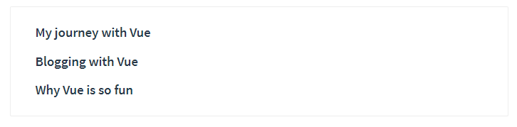

然而在一个典型的应用中，你可能在 `data` 里有一个博文的数组：

~~~javascript
new Vue({
  el: '#blog-post-demo',
  data: {
    posts: [
      { id: 1, title: 'My journey with Vue' },
      { id: 2, title: 'Blogging with Vue' },
      { id: 3, title: 'Why Vue is so fun' }
    ]
  }
})
~~~

并想要**为每篇博文渲染一个组件**：

~~~javascript
<blog-post
  v-for="post in posts"
  v-bind:key="post.id"
  v-bind:title="post.title"
></blog-post>
~~~

如上所示，你会发现我们可以使用 `v-bind` 来动态传递 prop。这在你一开始不清楚要渲染的具体内容，比如[从一个 API 获取博文列表](https://codesandbox.io/s/github/vuejs/vuejs.org/tree/master/src/v2/examples/vue-20-component-blog-post-example)的时候，是非常有用的。

到目前为止，关于 prop 你需要了解的大概就这些了，如果你阅读完本页内容并掌握了它的内容，我们会推荐你再回来把 [prop](https://cn.vuejs.org/v2/guide/components-props.html) 读完。

## 单个根元素

当构建一个 `<blog-post>` 组件时，你的模板最终会包含的东西远不止一个标题：

~~~javascript
<h3>{{ title }}</h3>
~~~

最最起码，你会包含这篇博文的正文：

~~~javascript
<h3>{{ title }}</h3>
<div v-html="content"></div>
~~~

然而如果你在模板中尝试这样写，Vue 会显示一个错误，并解释道 **every component must have a single root element (每个组件必须只有一个根元素)**。你可以将模板的内容包裹在一个父元素内，来修复这个问题，例如：

~~~javascript
<div class="blog-post">
  <h3>{{ title }}</h3>
  <div v-html="content"></div>
</div>
~~~

看起来当组件变得越来越复杂的时候，我们的博文不只需要标题和内容，还需要发布日期、评论等等。**为每个相关的信息定义一个 prop 会变得很麻烦**：

~~~javascript
<cpn
  v-for="item in posts"
  v-bind:key="item.id"
  v-bind:title="item.title"
  v-bind:content="item.content"
  v-bind:publishedAt="item.publishedAt"
  v-bind:comments="item.comments"
></cpn>
~~~

所以是时候**重构**一下这个 `<cpn>` 组件了，让它变成接受一个单独的 `item` prop：

~~~javascript
<blog-post
  v-for="post in posts"
  v-bind:key="post.id"
  v-bind:post="post"
></blog-post>
~~~

~~~javascript
Vue.component('blog-post', {
  props: ['post'],
  template: `
    <div class="blog-post">
      <h3>{{ post.title }}</h3>
      <div v-html="post.content"></div>
    </div>
  `
})
~~~

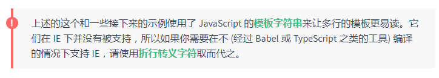

现在，不论何时为 `post` 对象添加一个新的 property，它都会自动地在 `<cpn>` 内可用。

## 监听子组件事件

在我们开发 `<blog-post>` 组件时，**它的一些功能可能要求我们和父级组件进行沟通**。例如我们可能会引入一个辅助功能来放大博文的字号，同时让页面的其它部分保持默认的字号。

在其父组件中，我们可以通过添加一个 `postFontSize` 数据 property 来支持这个功能：

~~~javascript
new Vue({
  el: '#blog-posts-events-demo',
  data: {
    posts: [/* ... */],
    postFontSize: 1
  }
})
~~~

它可以在模板中用来控制所有博文的字号：

~~~javascript
<div id="blog-posts-events-demo">
  <div :style="{ fontSize: postFontSize + 'em' }">
    <blog-post
      v-for="post in posts"
      v-bind:key="post.id"
      v-bind:post="post"
    ></blog-post>
  </div>
</div>
~~~

现在我们在每篇博文正文之前添加一个按钮来放大字号：

~~~javascript
Vue.component('blog-post', {
  props: ['post'],
  template: `
    <div class="blog-post">
      <h3>{{ post.title }}</h3>
      <button>
        Enlarge text
      </button>
      <div v-html="post.content"></div>
    </div>
  `
})
~~~

问题是这个按钮不会做任何事：

```javascript
<button>
  Enlarge text
</button>
```

当点击这个按钮时，我们需要告诉父级组件放大所有博文的文本。幸好 Vue 实例提供了一个自定义事件的系统来解决这个问题。父级组件可以像处理 native DOM 事件一样通过 `v-on` 监听子组件实例的任意事件：

~~~javascript
<blog-post
  ...
  v-on:enlarge-text="postFontSize += 0.1"
></blog-post>
~~~

同时子组件可以通过调用内建的 [$emit 方法](https://cn.vuejs.org/v2/api/#vm-emit)并传入事件名称来触发一个事件：

> `$emit()`方法不熟悉。

```javascript
<button v-on:click="$emit('enlarge-text')">
  Enlarge text
</button>
```

有了这个 `v-on:enlarge-text="postFontSize += 0.1"` 监听器，父级组件就会接收该事件并更新 `postFontSize` 的值。

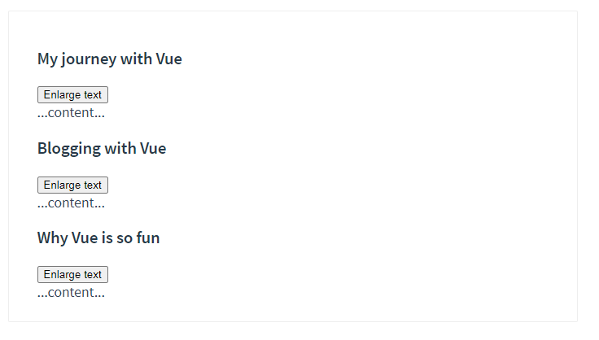

### 使用事件抛出一个值

有的时候用一个事件来抛出一个特定的值是非常有用的。例如我们可能想让 `` 组件决定它的文本要放大多少。这时可以使用 `$emit` 的第二个参数来提供这个值：

```javascript
<button v-on:click="$emit('enlarge-text', 0.1)">
  Enlarge text
</button>
```

然后当在父级组件监听这个事件的时候，我们可以通过 `$event` 访问到被抛出的这个值：

~~~javascript
<blog-post
  ...
  v-on:enlarge-text="postFontSize += $event"
></blog-post>
~~~

或者，如果这个事件处理函数是一个方法：

~~~javascript
<blog-post
  ...
  v-on:enlarge-text="onEnlargeText"
></blog-post>
~~~

那么这个值将会作为第一个参数传入这个方法：

```javascript
methods: {
  onEnlargeText: function (enlargeAmount) {
    this.postFontSize += enlargeAmount
  }
}
```

### 在组件上使用 v-model

自定义事件也可以用于创建支持 `v-model` 的自定义输入组件。记住：

```javascript
<input v-model="searchText">
```

等价于：

```javascript
<input
  v-bind:value="searchText"
  v-on:input="searchText = $event.target.value"
>
```

当用在组件上时，`v-model` 则会这样：

~~~javascript
<custom-input
  v-bind:value="searchText"
  v-on:input="searchText = $event"
></custom-input>
~~~

为了让它正常工作，这个组件内的 `<input>` 必须：

- 将其 `value` attribute 绑定到一个名叫 `value` 的 prop 上
- 在其 `input` 事件被触发时，将新的值通过自定义的 `input` 事件抛出

写成代码之后是这样的：

~~~javascript
Vue.component('custom-input', {
  props: ['value'],
  template: `
    <input
      v-bind:value="value"
      v-on:input="$emit('input', $event.target.value)"
    >
  `
})
~~~

现在 `v-model` 就应该可以在这个组件上完美地工作起来了：

```
<custom-input v-model="searchText"></custom-input>
```

到目前为止，关于组件自定义事件你需要了解的大概就这些了，如果你阅读完本页内容并掌握了它的内容，我们会推荐你再回来把[自定义事件](https://cn.vuejs.org/v2/guide/components-custom-events.html)读完。

## 通过插槽分发内容

和 HTML 元素一样，我们经常需要向一个组件传递内容，像这样：

```javascript
<alert-box>
  Something bad happened.
</alert-box>
```

可能会渲染出这样的东西：

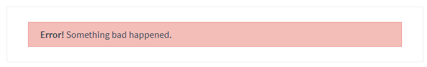

幸好，Vue 自定义的 `` 元素让这变得非常简单：

```javascript
Vue.component('alert-box', {
  template: `
    <div class="demo-alert-box">
      <strong>Error!</strong>
      <slot></slot>
    </div>
  `
})
```

如你所见，我们只要在需要的地方加入插槽就行了——就这么简单！

到目前为止，关于插槽你需要了解的大概就这些了，如果你阅读完本页内容并掌握了它的内容，我们会推荐你再回来把[插槽](https://cn.vuejs.org/v2/guide/components-slots.html)读完。

## 动态组件

有的时候，在不同组件之间进行动态切换是非常有用的，比如在一个多标签的界面里：

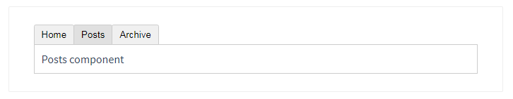

上述内容可以通过 Vue 的 `` 元素加一个特殊的 `is` attribute 来实现：

```
<!-- 组件会在 `currentTabComponent` 改变时改变 -->
<component v-bind:is="currentTabComponent"></component>
```

在上述示例中，`currentTabComponent` 可以包括

- 已注册组件的名字，或
- 一个组件的选项对象

你可以在[这里](https://codesandbox.io/s/github/vuejs/vuejs.org/tree/master/src/v2/examples/vue-20-dynamic-components)查阅并体验完整的代码，或在[这个版本](https://codesandbox.io/s/github/vuejs/vuejs.org/tree/master/src/v2/examples/vue-20-dynamic-components-with-binding)了解绑定组件选项对象，而不是已注册组件名的示例。

请留意，这个 attribute 可以用于常规 HTML 元素，但这些元素将被视为组件，这意味着所有的 attribute **都会作为 DOM attribute 被绑定**。对于像 `value` 这样的 property，若想让其如预期般工作，你需要使用 [`.prop` 修饰器](https://cn.vuejs.org/v2/api/#v-bind)。

到目前为止，关于动态组件你需要了解的大概就这些了，如果你阅读完本页内容并掌握了它的内容，我们会推荐你再回来把[动态和异步组件](https://cn.vuejs.org/v2/guide/components-dynamic-async.html)读完。

## 解析 DOM 模板时的注意事项

有些 HTML 元素，诸如  `<ul>`、`<ol>`、`<table>` 和 `<select>`对于哪些元素可以出现在其内部是有严格限制的。而有些元素，诸如 `<li>`、`<tr>` 和 `<option>`，只能出现在其它某些特定的元素内部。

这会导致我们使用这些有约束条件的元素时遇到一些问题。例如：

```javascript
<table>
  <blog-post-row></blog-post-row>
</table>
```

这个自定义组件 `<blog-post-row>` 会被作为无效的内容提升到外部，并导致最终渲染结果出错。幸好这个特殊的 `is` attribute 给了我们一个变通的办法：

```javascript
<table>
  <tr is="blog-post-row"></tr>
</table>
```

需要注意的是**如果我们从以下来源使用模板的话，这条限制是不存在的**：

- 字符串 (例如：`template: '...'`)
- [单文件组件 (`.vue`)](https://cn.vuejs.org/v2/guide/single-file-components.html)
- [`<script type="text/x-template">`](https://cn.vuejs.org/v2/guide/components-edge-cases.html#X-Templates)

到这里，你需要了解的解析 DOM 模板时的注意事项——实际上也是 Vue 的全部*必要内容*，大概就是这些了。恭喜你！接下来还有很多东西要去学习，不过首先，我们推荐你先休息一下，试用一下 Vue，自己随意做些好玩的东西。

如果你感觉已经掌握了这些知识，我们推荐你再回来把完整的组件指南，包括侧边栏中组件深入章节的所有页面读完。

> 抄到这里为止，我自己的Vue组件知识掌握程度是远远不够的，还需要花大时间去消化、去理解的。

# 组件注册

> 该页面假设你已经阅读过了[组件基础](https://cn.vuejs.org/v2/guide/components.html)。如果你还对组件不太了解，推荐你先阅读它。

## 组件名

在注册一个组件的时候，我们始终需要给它一个名字。比如在全局注册的时候我们已经看到了：

```javascript
Vue.component('my-component-name', { /* ... */ })
```

该组件名就是 `Vue.component` 的第一个参数。

你给予组件的名字可能依赖于你打算拿它来做什么。当直接在 DOM 中使用一个组件 (而不是在字符串模板或[单文件组件](https://cn.vuejs.org/v2/guide/single-file-components.html)) 的时候，我们强烈推荐遵循 [W3C 规范](https://html.spec.whatwg.org/multipage/custom-elements.html#valid-custom-element-name)中的自定义组件名 (字母全小写且必须包含一个连字符)。这会帮助你避免和当前以及未来的 HTML 元素相冲突。

你可以在[风格指南](https://cn.vuejs.org/v2/style-guide/#%E5%9F%BA%E7%A1%80%E7%BB%84%E4%BB%B6%E5%90%8D-%E5%BC%BA%E7%83%88%E6%8E%A8%E8%8D%90)中查阅到关于组件名的其它建议。

### 组件名大小写

定义组件名的方式有两种：

#### 使用 kebab-case

```javascript
Vue.component('my-component-name', { /* ... */ })
```

当使用 kebab-case (短横线分隔命名) 定义一个组件时，你也必须在引用这个自定义元素时使用 kebab-case，例如 `<my-component-name>`。

#### 使用 PascalCase

```javascript
Vue.component('MyComponentName', { /* ... */ })
```

当使用 PascalCase (首字母大写命名) 定义一个组件时，你在引用这个自定义元素时两种命名法都可以使用。也就是说 `<my-component-name>` 和 `<MyComponentName>` 都是可接受的。注意，尽管如此，**直接在 DOM (即非字符串的模板) 中使用时只有`kebab-case`是有效的**。

## 全局注册

到目前为止，我们只用过 `Vue.component` 来创建组件：

```javascript
Vue.component('my-component-name', {
  // ... 选项 ...
})
```

这些组件是**全局注册的**。也就是说它们在注册之后可以用在任何新创建的 Vue 根实例 (`new Vue`) 的模板中。比如：

```javascript
Vue.component('component-a', { /* ... */ })
Vue.component('component-b', { /* ... */ })
Vue.component('component-c', { /* ... */ })

new Vue({ el: '#app' })
```

~~~javascript
<div id="app">
  <component-a></component-a>
  <component-b></component-b>
  <component-c></component-c>
</div>
~~~

在所有子组件中也是如此，也就是说这三个组件在各自内部也都可以相互使用。

## 局部注册

全局注册往往是不够理想的。比如，如果你使用一个像 webpack 这样的构建系统，全局注册所有的组件意味着即便你已经不再使用一个组件了，它仍然会被包含在你最终的构建结果中。这造成了用户下载的 JavaScript 的无谓的增加。

在这些情况下，你可以通过一个普通的 JavaScript 对象来定义组件：

```javascript
var ComponentA = { /* ... */ }
var ComponentB = { /* ... */ }
var ComponentC = { /* ... */ }
```

然后在 `components` 选项中定义你想要使用的组件：

```javascript
new Vue({
  el: '#app',
  components: {
    'component-a': ComponentA,
    'component-b': ComponentB
  }
})
```

对于 `components` 对象中的每个 property 来说，其 property 名就是自定义元素的名字，其 property 值就是这个组件的选项对象。

注意**局部注册的组件在其子组件中不可用**。例如，如果你希望 `ComponentA` 在 `ComponentB` 中可用，则你需要这样写：

```javascript
var ComponentA = { /* ... */ }

var ComponentB = {
  components: {
    'component-a': ComponentA
  },
  // ...
}
```

或者如果你通过 Babel 和 webpack 使用 ES2015 模块，那么代码看起来更像：

~~~javascript
import ComponentA from './ComponentA.vue'

export default {
  components: {
    ComponentA
  },
  // ...
}
~~~

注意在 ES2015+ 中，在对象中放一个类似 `ComponentA` 的变量名其实是 `ComponentA: ComponentA` 的缩写，即这个变量名同时是：

* 用在模板中的自定义元素的名称
* 包含了这个组件选项的变量名

> 开心，都能看得懂。

## 模块系统

如果你没有通过 `import`/`require` 使用一个模块系统，也许可以暂且跳过这个章节。如果你使用了，那么我们会为你提供一些特殊的使用说明和注意事项。

### 在模块系统中局部注册

如果你还在阅读，说明你使用了诸如 Babel 和 webpack 的模块系统。在这些情况下，我们推荐创建一个 `components` 目录，并将每个组件放置在其各自的文件中。

然后你需要在局部注册之前导入每个你想使用的组件。例如，在一个假设的 `ComponentB.js` 或 `ComponentB.vue` 文件中：

```javascript
import ComponentA from './ComponentA'
import ComponentC from './ComponentC'

export default {
  components: {
    ComponentA,
    ComponentC
  },
  // ...
}
```

现在 `ComponentA` 和 `ComponentC` 都可以在 `ComponentB` 的模板中使用了。

### 基础组件的自动化全局注册

可能你的许多组件只是包裹了一个输入框或按钮之类的元素，是相对通用的。我们有时候会把它们称为[基础组件](https://cn.vuejs.org/v2/style-guide/#%E5%9F%BA%E7%A1%80%E7%BB%84%E4%BB%B6%E5%90%8D-%E5%BC%BA%E7%83%88%E6%8E%A8%E8%8D%90)，它们会在各个组件中被频繁的用到。

所以会导致很多组件里都会有一个包含基础组件的长列表：

```javascript
import BaseButton from './BaseButton.vue'
import BaseIcon from './BaseIcon.vue'
import BaseInput from './BaseInput.vue'

export default {
  components: {
    BaseButton,
    BaseIcon,
    BaseInput
  }
}
```

而只是用于模板中的一小部分：

```javascript
<BaseInput
  v-model="searchText"
  @keydown.enter="search"
/>
<BaseButton @click="search">
  <BaseIcon name="search"/>
</BaseButton>
```

如果你恰好使用了 webpack (或在内部使用了 webpack 的 [Vue CLI 3+](https://github.com/vuejs/vue-cli))，那么就可以使用 `require.context` 只全局注册这些非常通用的基础组件。这里有一份可以让你在应用入口文件 (比如 `src/main.js`) 中全局导入基础组件的示例代码：

```javascript
import Vue from 'vue'
import upperFirst from 'lodash/upperFirst'
import camelCase from 'lodash/camelCase'

const requireComponent = require.context(
  // 其组件目录的相对路径
  './components',
  // 是否查询其子目录
  false,
  // 匹配基础组件文件名的正则表达式
  /Base[A-Z]\w+\.(vue|js)$/
)

requireComponent.keys().forEach(fileName => {
  // 获取组件配置
  const componentConfig = requireComponent(fileName)

  // 获取组件的 PascalCase 命名
  const componentName = upperFirst(
    camelCase(
      // 获取和目录深度无关的文件名
      fileName
        .split('/')
        .pop()
        .replace(/\.\w+$/, '')
    )
  )

  // 全局注册组件
  Vue.component(
    componentName,
    // 如果这个组件选项是通过 `export default` 导出的，
    // 那么就会优先使用 `.default`，
    // 否则回退到使用模块的根。
    componentConfig.default || componentConfig
  )
})
```

记住**全局注册的行为必须在根 Vue 实例 (通过 new Vue) 创建之前发生**。[这里](https://github.com/chrisvfritz/vue-enterprise-boilerplate/blob/master/src/components/_globals.js)有一个真实项目情景下的示例。

# prop

> 该页面假设你已经阅读过了[组件基础](https://cn.vuejs.org/v2/guide/components.html)。如果你还对组件不太了解，推荐你先阅读它。

## Prop 的大小写

>  camelCase vs kebab-case

HTML 中的 attribute 名是大小写不敏感的，所以浏览器会把所有大写字符解释为小写字符。这意味着当你使用 DOM 中的模板时，camelCase (驼峰命名法) 的 prop 名需要使用其等价的 kebab-case (短横线分隔命名) 命名：

```javascript
Vue.component('blog-post', {
  // 在 JavaScript 中是 camelCase 的
  props: ['postTitle'],
  template: '<h3>{{ postTitle }}</h3>'
})
```

~~~javascript
<!-- 在 HTML 中是 kebab-case 的 -->
<blog-post post-title="hello!"></blog-post>
~~~

重申一次，如果你使用字符串模板，那么这个限制就不存在了。

## Prop 类型

到这里，我们只看到了以字符串数组形式列出的 prop：

```javascript
props: ['title', 'likes', 'isPublished', 'commentIds', 'author']
```

但是，通常你希望每个 prop 都有指定的值类型。这时，你可以以对象形式列出 prop，这些 property 的名称和值分别是 prop 各自的名称和类型：

```javascript
props: {
  title: String,
  likes: Number,
  isPublished: Boolean,
  commentIds: Array,
  author: Object,
  callback: Function,
  contactsPromise: Promise // or any other constructor
}
```

这不仅为你的组件提供了文档，还会在它们遇到错误的类型时从浏览器的 JavaScript 控制台提示用户。你会在这个页面接下来的部分看到[类型检查和其它 prop 验证](https://cn.vuejs.org/v2/guide/components-props.html#Prop-%E9%AA%8C%E8%AF%81)。

## 传递静态或动态 Prop

像这样，你已经知道了可以像这样给 prop 传入一个静态的值：

```javascript
<blog-post title="My journey with Vue"></blog-post>
```

你也知道 prop 可以通过 `v-bind` 动态赋值，例如：

```javascript
<!-- 动态赋予一个变量的值 -->
<blog-post v-bind:title="post.title"></blog-post>

<!-- 动态赋予一个复杂表达式的值 -->
<blog-post
  v-bind:title="post.title + ' by ' + post.author.name"
></blog-post>
```

在上述两个示例中，我们传入的值都是字符串类型的，但实际上*任何*类型的值都可以传给一个 prop。

### 传入一个数字

~~~javascript
<!-- 即便 `42` 是静态的，我们仍然需要 `v-bind` 来告诉 Vue -->
<!-- 这是一个 JavaScript 表达式而不是一个字符串。-->
<blog-post v-bind:likes="42"></blog-post>

<!-- 用一个变量进行动态赋值。-->
<blog-post v-bind:likes="post.likes"></blog-post>
~~~

### 传入一个布尔值

~~~javascript
<!-- 包含该 prop 没有值的情况在内，都意味着 `true`。-->
<blog-post is-published></blog-post>

<!-- 即便 `false` 是静态的，我们仍然需要 `v-bind` 来告诉 Vue -->
<!-- 这是一个 JavaScript 表达式而不是一个字符串。-->
<blog-post v-bind:is-published="false"></blog-post>

<!-- 用一个变量进行动态赋值。-->
<blog-post v-bind:is-published="post.isPublished"></blog-post>
~~~

### 传入一个数组

```javascript
<!-- 即便数组是静态的，我们仍然需要 `v-bind` 来告诉 Vue -->
<!-- 这是一个 JavaScript 表达式而不是一个字符串。-->
<blog-post v-bind:comment-ids="[234, 266, 273]"></blog-post>

<!-- 用一个变量进行动态赋值。-->
<blog-post v-bind:comment-ids="post.commentIds"></blog-post>
```

### 传入一个对象

```javascript
<!-- 即便对象是静态的，我们仍然需要 `v-bind` 来告诉 Vue -->
<!-- 这是一个 JavaScript 表达式而不是一个字符串。-->
<blog-post
  v-bind:author="{
    name: 'Veronica',
    company: 'Veridian Dynamics'
  }"
></blog-post>

<!-- 用一个变量进行动态赋值。-->
<blog-post v-bind:author="post.author"></blog-post>
```

### 传入一个对象的所有 property

如果你想要将一个对象的所有 property 都作为 prop 传入，你可以使用不带参数的 `v-bind` (取代 `v-bind:prop-name`)。例如，对于一个给定的对象 `post`：

```javascript
post: {
  id: 1,
  title: 'My Journey with Vue'
}
```

下面的模板：

```javascript
<blog-post v-bind="post"></blog-post>
```

等价于：

```javascript
<blog-post
  v-bind:id="post.id"
  v-bind:title="post.title"
></blog-post>
```

## 单向数据流

所有的 prop 都使得其父子 prop 之间形成了一个**单向下行绑定**：父级 prop 的更新会向下流动到子组件中，但是反过来则不行。这样会防止从子组件意外变更父级组件的状态，从而导致你的应用的数据流向难以理解。

额外的，每次父级组件发生变更时，子组件中所有的 prop 都将会刷新为最新的值。这意味着你**不**应该在一个子组件内部改变 prop。如果你这样做了，Vue 会在浏览器的控制台中发出警告。

这里有两种常见的试图变更一个 prop 的情形：

1. **这个 prop 用来传递一个初始值；这个子组件接下来希望将其作为一个本地的 prop 数据来使用。**在这种情况下，最好定义一个本地的 data property 并将这个 prop 用作其初始值：

   ~~~javascript
   props: ['initialCounter'],
   data: function () {
     return {
       counter: this.initialCounter
     }
   }
   ~~~

2. **这个 prop 以一种原始的值传入且需要进行转换。**在这种情况下，最好使用这个 prop 的值来定义一个计算属性：

   ~~~javascript
   props: ['size'],
   computed: {
     normalizedSize: function () {
       return this.size.trim().toLowerCase()
     }
   }
   ~~~

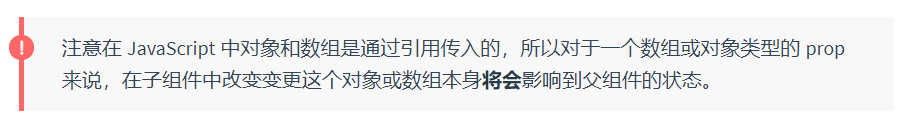

## Prop 验证

我们可以为组件的 prop 指定验证要求，例如你知道的这些类型。如果有一个需求没有被满足，则 Vue 会在浏览器控制台中警告你。这在开发一个会被别人用到的组件时尤其有帮助。

为了定制 prop 的验证方式，你可以为 `props` 中的值提供一个带有验证需求的对象，而不是一个字符串数组。例如：

~~~javascript
Vue.component('my-component', {
  props: {
    // 基础的类型检查 (`null` 和 `undefined` 会通过任何类型验证)
    propA: Number,
    // 多个可能的类型
    propB: [String, Number],
    // 必填的字符串
    propC: {
      type: String,
      required: true
    },
    // 带有默认值的数字
    propD: {
      type: Number,
      default: 100
    },
    // 带有默认值的对象
    propE: {
      type: Object,
      // 对象或数组默认值必须从一个工厂函数获取
      default: function () {
        return { message: 'hello' }
      }
    },
    // 自定义验证函数
    propF: {
      validator: function (value) {
        // 这个值必须匹配下列字符串中的一个
        return ['success', 'warning', 'danger'].indexOf(value) !== -1
      }
    }
  }
})
~~~

当 prop 验证失败的时候，(开发环境构建版本的) Vue 将会产生一个控制台的警告。

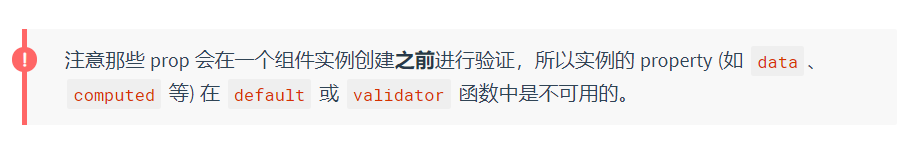

### 类型检查

`type` 可以是下列原生构造函数中的一个：

* `String`
* `Number`
* `Boolean`
* `Array`
* `Object`
* `Date`
* `Function`
* `Symbol`

额外的，`type` 还可以是一个自定义的构造函数，并且通过 `instanceof` 来进行检查确认。例如，给定下列现成的构造函数：

```javascript
function Person (firstName, lastName) {
  this.firstName = firstName
  this.lastName = lastName
}
```

你可以使用：

```javascript
Vue.component('blog-post', {
  props: {
    author: Person
  }
})
```

来验证 `author` prop 的值是否是通过 `new Person` 创建的。

## 非 Prop 的 Attribute

一个非 prop 的 attribute 是指传向一个组件，但是该组件并没有相应 prop 定义的 attribute。

因为显式定义的 prop 适用于向一个子组件传入信息，然而组件库的作者并不总能预见组件会被用于怎样的场景。这也是为什么组件可以接受任意的 attribute，而这些 attribute 会被添加到这个组件的根元素上。

例如，想象一下你通过一个 Bootstrap 插件使用了一个第三方的 `<bootstrap-date-input>` 组件，这个插件需要在其 `<input>` 上用到一个 `data-date-picker` attribute。我们可以将这个 attribute 添加到你的组件实例上：

```javascript
<bootstrap-date-input data-date-picker="activated"></bootstrap-date-input>
```

然后这个 `data-date-picker="activated"` attribute 就会自动添加到 `<bootstrap-date-input>` 的根元素上。

> 开始又看不懂了。

### 替换/合并已有的 Attribute

想象一下 `<bootstrap-date-input>` 的模板是这样的：

```javascript
<input type="date" class="form-control">
```

为了给我们的日期选择器插件定制一个主题，我们可能需要像这样添加一个特别的类名：

```javascript
<bootstrap-date-input
  data-date-picker="activated"
  class="date-picker-theme-dark"
></bootstrap-date-input>
```

在这种情况下，我们定义了两个不同的 `class` 的值：

* `form-control`，这是在组件的模板内设置好的
* `date-picker-theme-dark`，这是从组件的父级传入的

对于绝大多数 attribute 来说，从外部提供给组件的值会替换掉组件内部设置好的值。所以如果传入 `type="text"` 就会替换掉 `type="date"` 并把它破坏！庆幸的是，`class` 和 `style` attribute 会稍微智能一些，即两边的值会被合并起来，从而得到最终的值：`form-control date-picker-theme-dark`。

### 禁用 Attribute 继承

如果你**不**希望组件的根元素继承 attribute，你可以在组件的选项中设置 `inheritAttrs: false`。例如：

```javascript
Vue.component('my-component', {
  inheritAttrs: false,
  // ...
})
```

这尤其适合配合实例的 `$attrs` property 使用，该 property 包含了传递给一个组件的 attribute 名和 attribute 值，例如：

```javascript
{
  required: true,
  placeholder: 'Enter your username'
}
```

有了 `inheritAttrs: false` 和 `$attrs`，你就可以手动决定这些 attribute 会被赋予哪个元素。在撰写[基础组件](https://cn.vuejs.org/v2/style-guide/#%E5%9F%BA%E7%A1%80%E7%BB%84%E4%BB%B6%E5%90%8D-%E5%BC%BA%E7%83%88%E6%8E%A8%E8%8D%90)的时候是常会用到的：

```javascript
Vue.component('base-input', {
  inheritAttrs: false,
  props: ['label', 'value'],
  template: `
    <label>
      {{ label }}
      <input
        v-bind="$attrs"
        v-bind:value="value"
        v-on:input="$emit('input', $event.target.value)"
      >
    </label>
  `
})
```

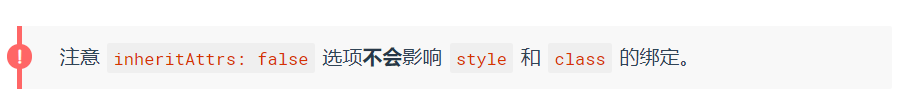

这个模式允许你在使用基础组件的时候更像是使用原始的 HTML 元素，而不会担心哪个元素是真正的根元素：

```javascript
<base-input
  v-model="username"
  required
  placeholder="Enter your username"
></base-input>
```

# 自定义事件

> 该页面假设你已经阅读过了[组件基础](https://cn.vuejs.org/v2/guide/components.html)。如果你还对组件不太了解，推荐你先阅读它。

## 事件名

不同于组件和 prop，事件名不存在任何自动化的大小写转换。而是触发的事件名需要完全匹配监听这个事件所用的名称。举个例子，如果触发一个 camelCase 名字的事件：

```javascript
this.$emit('myEvent')
```

则监听这个名字的 kebab-case 版本是不会有任何效果的：

```javascript
<!-- 没有效果 -->
<my-component v-on:my-event="doSomething"></my-component>
```

不同于组件和 prop，事件名不会被用作一个 JavaScript 变量名或 property 名，所以就没有理由使用 camelCase 或 PascalCase 了。并且 `v-on` 事件监听器在 DOM 模板中会被自动转换为全小写 (因为 HTML 是大小写不敏感的)，所以 `v-on:myEvent` 将会变成 `v-on:myevent`——导致 `myEvent` 不可能被监听到。

因此，我们推荐你**始终使用 kebab-case 的事件名**。

## 自定义组件的 v-model

> 2.2.0+ 新增

一个组件上的 `v-model` 默认会利用名为 `value` 的 prop 和名为 `input` 的事件，但是像单选框、复选框等类型的输入控件可能会将 `value` attribute 用于[不同的目的](https://developer.mozilla.org/en-US/docs/Web/HTML/Element/input/checkbox#Value)。`model` 选项可以用来避免这样的冲突：

```javascript
Vue.component('base-checkbox', {
  model: {
    prop: 'checked',
    event: 'change'
  },
  props: {
    checked: Boolean
  },
  template: `
    <input
      type="checkbox"
      v-bind:checked="checked"
      v-on:change="$emit('change', $event.target.checked)"
    >
  `
})
```

现在在这个组件上使用 `v-model` 的时候：

```javascript
<base-checkbox v-model="lovingVue"></base-checkbox>
```

这里的 `lovingVue` 的值将会传入这个名为 `checked` 的 prop。同时当 `<base-checkbox>` 触发一个 `change` 事件并附带一个新的值的时候，这个 `lovingVue` 的 property 将会被更新。

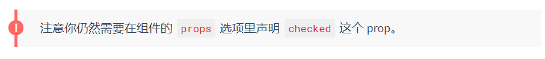

## 将原生事件绑定到组件

你可能有很多次想要在一个组件的根元素上直接监听一个原生事件。这时，你可以使用 `v-on` 的 `.native` 修饰符：

```javascript
<base-input v-on:focus.native="onFocus"></base-input>
```

在有的时候这是很有用的，不过在你尝试监听一个类似 `<input>` 的非常特定的元素时，这并不是个好主意。比如上述 `<base-input>` 组件可能做了如下重构，所以根元素实际上是一个 `<label>` 元素：

```javascript
<label>
  {{ label }}
  <input
    v-bind="$attrs"
    v-bind:value="value"
    v-on:input="$emit('input', $event.target.value)"
  >
</label>
```

这时，父级的 `.native` 监听器将静默失败。它不会产生任何报错，但是 `onFocus` 处理函数不会如你预期地被调用。

为了解决这个问题，Vue 提供了一个 `$listeners` property，它是一个对象，里面包含了作用在这个组件上的所有监听器。例如：

```javascript
{
  focus: function (event) { /* ... */ }
  input: function (value) { /* ... */ },
}
```

有了这个 `$listeners` property，你就可以配合 `v-on="$listeners"` 将所有的事件监听器指向这个组件的某个特定的子元素。对于类似 `<input>` 的你希望它也可以配合 `v-model` 工作的组件来说，为这些监听器创建一个类似下述 `inputListeners` 的计算属性通常是非常有用的：

```javascript
Vue.component('base-input', {
  inheritAttrs: false,
  props: ['label', 'value'],
  computed: {
    inputListeners: function () {
      var vm = this
      // `Object.assign` 将所有的对象合并为一个新对象
      return Object.assign({},
        // 我们从父级添加所有的监听器
        this.$listeners,
        // 然后我们添加自定义监听器，
        // 或覆写一些监听器的行为
        {
          // 这里确保组件配合 `v-model` 的工作
          input: function (event) {
            vm.$emit('input', event.target.value)
          }
        }
      )
    }
  },
  template: `
    <label>
      {{ label }}
      <input
        v-bind="$attrs"
        v-bind:value="value"
        v-on="inputListeners"
      >
    </label>
  `
})
```

现在 `<base-input>` 组件是一个**完全透明的包裹器**了，也就是说它可以完全像一个普通的 `<input>` 元素一样使用了：所有跟它相同的 attribute 和监听器都可以工作，不必再使用 `.native` 监听器。

## .sync 修饰符

> 2.3.0+ 新增

在有些情况下，我们可能需要对一个 prop 进行“双向绑定”。不幸的是，真正的双向绑定会带来维护上的问题，因为子组件可以变更父组件，且在父组件和子组件都没有明显的变更来源。

这也是为什么我们推荐以 `update:myPropName` 的模式触发事件取而代之。举个例子，在一个包含 `title` prop 的假设的组件中，我们可以用以下方法表达对其赋新值的意图：

```javascript
this.$emit('update:title', newTitle)
```

然后父组件可以监听那个事件并根据需要更新一个本地的数据 property。例如：

```javascript
<text-document
  v-bind:title="doc.title"
  v-on:update:title="doc.title = $event"
></text-document>
```

为了方便起见，我们为这种模式提供一个缩写，即 `.sync` 修饰符：

```javascript
<text-document v-bind:title.sync="doc.title"></text-document>
```


当我们用一个对象同时设置多个 prop 的时候，也可以将这个 `.sync` 修饰符和 `v-bind` 配合使用：

```
<text-document v-bind.sync="doc"></text-document>
```

这样会把 `doc` 对象中的每一个 property (如 `title`) 都作为一个独立的 prop 传进去，然后各自添加用于更新的 `v-on` 监听器。


# 插槽

> 该页面假设你已经阅读过了[组件基础](https://cn.vuejs.org/v2/guide/components.html)。如果你还对组件不太了解，推荐你先阅读它。

> 在 2.6.0 中，我们为具名插槽和作用域插槽引入了一个新的统一的语法 (即 `v-slot` 指令)。它取代了 `slot` 和 `slot-scope` 这两个目前已被废弃但未被移除且仍在[文档中](https://cn.vuejs.org/v2/guide/components-slots.html#废弃了的语法)的 attribute。新语法的由来可查阅这份 [RFC](https://github.com/vuejs/rfcs/blob/master/active-rfcs/0001-new-slot-syntax.md)。

# 动态组件 & 异步组件

> 该页面假设你已经阅读过了[组件基础](https://cn.vuejs.org/v2/guide/components.html)。如果你还对组件不太了解，推荐你先阅读它。

## 在动态组件上使用 keep-alive

我们之前曾经在一个多标签的界面中使用 `is` attribute 来切换不同的组件：

```javascript
<component v-bind:is="currentTabComponent"></component>
```

当在这些组件之间切换的时候，你有时会想保持这些组件的状态，以避免反复重渲染导致的性能问题。例如我们来展开说一说这个多标签界面：


你会注意到，如果你选择了一篇文章，切换到 *Archive* 标签，然后再切换回 *Posts*，是不会继续展示你之前选择的文章的。这是因为你每次切换新标签的时候，Vue 都创建了一个新的 `currentTabComponent` 实例。

重新创建动态组件的行为通常是非常有用的，但是在这个案例中，我们更希望那些标签的组件实例能够被在它们第一次被创建的时候缓存下来。为了解决这个问题，我们可以用一个 `<keep-alive>` 元素将其动态组件包裹起来。

~~~javascript
<!-- 失活的组件将会被缓存！-->
<keep-alive>
  <component v-bind:is="currentTabComponent"></component>
</keep-alive>
~~~

现在这个 *Posts* 标签保持了它的状态 (被选中的文章) 甚至当它未被渲染时也是如此。你可以在[这个示例](https://codesandbox.io/s/github/vuejs/vuejs.org/tree/master/src/v2/examples/vue-20-keep-alive-with-dynamic-components)查阅到完整的代码。


你可以在 [API 参考文档](https://cn.vuejs.org/v2/api/#keep-alive)查阅更多关于 `<keep-alive>` 的细节。

## 异步组件

在大型应用中，我们可能需要将应用分割成小一些的代码块，并且只在需要的时候才从服务器加载一个模块。为了简化，Vue 允许你以一个工厂函数的方式定义你的组件，这个工厂函数会异步解析你的组件定义。Vue 只有在这个组件需要被渲染的时候才会触发该工厂函数，且会把结果缓存起来供未来重渲染。例如：

~~~javascript
Vue.component('async-example', function (resolve, reject) {
  setTimeout(function () {
    // 向 `resolve` 回调传递组件定义
    resolve({
      template: '<div>I am async!</div>'
    })
  }, 1000)
})
~~~

如你所见，这个工厂函数会收到一个 `resolve` 回调，这个回调函数会在你从服务器得到组件定义的时候被调用。你也可以调用 `reject(reason)` 来表示加载失败。这里的 `setTimeout` 是为了演示用的，如何获取组件取决于你自己。一个推荐的做法是将异步组件和 [webpack 的 code-splitting 功能](https://webpack.js.org/guides/code-splitting/)一起配合使用：

~~~javascript
Vue.component(
  'async-webpack-example',
  // 这个动态导入会返回一个 `Promise` 对象。
  () => import('./my-async-component')
)
~~~

当使用[局部注册](https://cn.vuejs.org/v2/guide/components-registration.html#%E5%B1%80%E9%83%A8%E6%B3%A8%E5%86%8C)的时候，你也可以直接提供一个返回 `Promise` 的函数：

~~~javascript
new Vue({
  // ...
  components: {
    'my-component': () => import('./my-async-component')
  }
})
~~~


### 处理加载状态

> 2.3.0+ 新增

这里的异步组件工厂函数也可以返回一个如下格式的对象：

~~~javascript
const AsyncComponent = () => ({
  // 需要加载的组件 (应该是一个 `Promise` 对象)
  component: import('./MyComponent.vue'),
  // 异步组件加载时使用的组件
  loading: LoadingComponent,
  // 加载失败时使用的组件
  error: ErrorComponent,
  // 展示加载时组件的延时时间。默认值是 200 (毫秒)
  delay: 200,
  // 如果提供了超时时间且组件加载也超时了，
  // 则使用加载失败时使用的组件。默认值是：`Infinity`
  timeout: 3000
})
~~~

> 注意如果你希望在 [Vue Router](https://github.com/vuejs/vue-router) 的路由组件中使用上述语法的话，你必须使用 Vue Router 2.4.0+ 版本。

# 处理边界情况

# 可复用性 & 组合

## 混入

### 基础

混入 (mixin) 提供了一种非常灵活的方式，来分发 Vue 组件中的可复用功能。一个混入对象可以包含任意组件选项。当组件使用混入对象时，所有混入对象的选项将被“混合”进入该组件本身的选项。

例子：

~~~javascript
// 定义一个混入对象
var myMixin = {
  created: function () {
    this.hello()
  },
  methods: {
    hello: function () {
      console.log('hello from mixin!')
    }
  }
}

// 定义一个使用混入对象的组件
var Component = Vue.extend({
  mixins: [myMixin]
})

var component = new Component() // => "hello from mixin!"
~~~

### 选项合并

当组件和混入对象含有同名选项时，这些选项将以恰当的方式进行“合并”。

比如，数据对象在内部会进行递归合并，并在发生冲突时以组件数据优先。

~~~javascript
var mixin = {
  data: function () {
    return {
      message: 'hello',
      foo: 'abc'
    }
  }
}

new Vue({
  mixins: [mixin],
  data: function () {
    return {
      message: 'goodbye',
      bar: 'def'
    }
  },
  created: function () {
    console.log(this.$data)
    // => { message: "goodbye", foo: "abc", bar: "def" }
  }
})
~~~

同名钩子函数将合并为一个数组，因此都将被调用。另外，混入对象的钩子将在组件自身钩子**之前**调用。

~~~javascript
var mixin = {
  created: function () {
    console.log('混入对象的钩子被调用')
  }
}

new Vue({
  mixins: [mixin],
  created: function () {
    console.log('组件钩子被调用')
  }
})

// => "混入对象的钩子被调用"
// => "组件钩子被调用"
~~~

值为对象的选项，例如 `methods`、`components` 和 `directives`，将被合并为同一个对象。两个对象键名冲突时，取组件对象的键值对。

~~~javascript
var mixin = {
  methods: {
    foo: function () {
      console.log('foo')
    },
    conflicting: function () {
      console.log('from mixin')
    }
  }
}

var vm = new Vue({
  mixins: [mixin],
  methods: {
    bar: function () {
      console.log('bar')
    },
    conflicting: function () {
      console.log('from self')
    }
  }
})

vm.foo() // => "foo"
vm.bar() // => "bar"
vm.conflicting() // => "from self"
~~~

注意：`Vue.extend()` 也使用同样的策略进行合并。