(注1：看到父子组件的时候感觉有点懵，于是准备暂停一下，单独写篇博文，把组件有关知识复习一下，再进行视频的学习。)

(注2：这其实和我看的视频里写的博文内容基本一致，只不过自己再单独拎出来再写了一遍，以增加印象。)

本文文章链接如下：

[Vue.js——60分钟组件快速入门（上篇）](https://www.cnblogs.com/keepfool/p/5625583.html)

[深入理解Vue组件3大核心概念](https://zhuanlan.zhihu.com/p/142083605)

[Vue.extend构造器](https://blog.csdn.net/Dear_Mr/article/details/72627214?utm_medium=distribute.pc_aggpage_search_result.none-task-blog-2~all~first_rank_v2~rank_v25-1-72627214.nonecase&utm_term=vue%20%E6%9E%84%E9%80%A0%E5%99%A8%E6%98%AF%E4%BB%80%E4%B9%88&spm=1000.2123.3001.4430)

[Vue.js——60分钟组件快速入门（下篇）](https://www.cnblogs.com/keepfool/p/5637834.html)

(注3：这篇博文就是抄的别的很多地方的博文，所以结构有点乱，等有时间了自己再整理一下。)

# 组件简介

组件系统是Vue.js其中一个重要的概念，它提供了一种抽象，让我们可以使用**独立可复用**的小组件来构建大型应用，任意类型的应用界面都可以抽象为一个组件树：

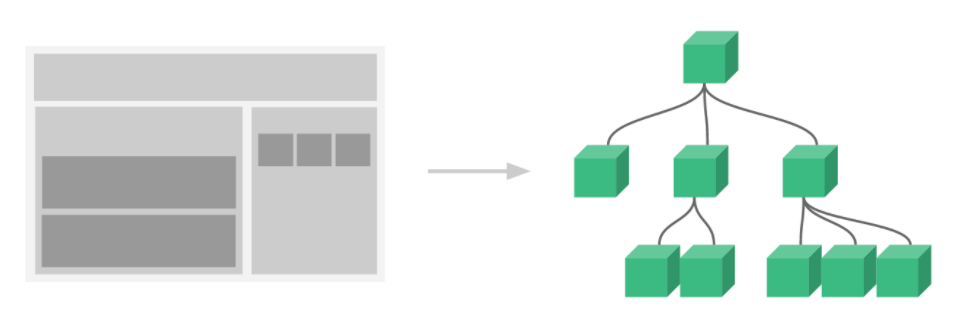

那么什么是组件呢？

**组件可以扩展HTML元素，封装可重用的HTML代码，我们可以将组件看作自定义的HTML元素。**

# 组件的创建和注册

## 基本步骤

Vue.js的组件的使用有3个步骤：**创建组件构造器、注册组件和使用组件。**

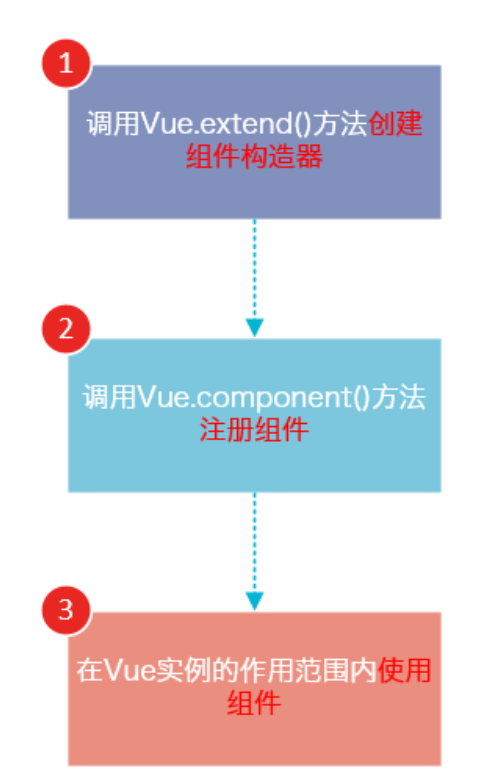

下面的代码演示了这3个步骤：

~~~html
<!DOCTYPE html>
<html>

<body>
    <div id="app">
        <!-- 3. #app是Vue实例挂载的元素，应该在挂载元素范围内使用组件-->
        <cpn></cpn>
    </div>
</body>
<script src="js/vue.js"></script>
<script>
    // 1.创建一个组件构造器
    const cpnC = Vue.extend({
        template: `
            <div>
                这是我的第一个组件!
            </div>`
    })

    // 2.注册组件，并指定组件的标签，组件的HTML标签为<cpn>
    Vue.component('cpn', cpnC)

    // 步骤1,2都是在生成Vue实例的script标签里面
    const app = new Vue({
        el: '#app',
        data: {
            message: '你好啊'
        }
    })

</script>
</html>
~~~

运行结果如下：

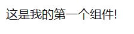

可以看到，使用组件和使用普通的HTML元素没什么区别。

## 理解组件的创建和注册

我们用以下几个步骤来理解组件的创建和注册：

> 1. `Vue.extend()`是Vue构造器的扩展，调用`Vue.extend()`创建的是一个组件构造器。
> 2. `Vue.extend()`构造器有一个**选项对象**，选项对象的template属性用于定义组件要渲染的HTML。
> 3. 使用`Vue.component()`注册组件时，需要提供**2个参数**，第1个参数时组件的标签，第2个参数是组件构造器。
> 4. **组件应该挂载到某个Vue实例下，否则它不会生效**。

请注意第4点，以下代码在3个地方使用了`<cpn>`标签，但只有`#app1`和`#app2`下的`<cpn>`标签才起到作用。

~~~html
<!DOCTYPE html>
<html>

<body>
    <div id="app1">
        <cpn></cpn>
        <!-- 组件可以正常渲染 -->
    </div>

    <div id="app2">
        <cpn></cpn>
        <!-- 组件可以正常渲染 -->
    </div>

    <cpn></cpn>
    <!-- 该组件因为不在Vue实例中，所以不会被渲染 -->
</body>
<script src="js/vue.js"></script>
<script>
    const cpnC = Vue.extend({
        template: `
            <div>
                这是我的第一个组件!
            </div>`
    })

    Vue.component('cpn', cpnC)

    const app1 = new Vue({
        el: '#app1'
    })

    const app2 = new Vue({
        el: '#app2'
    })
    // 实际开发中我们基本上只生成一个Vue实例的
</script>
</html>
~~~

## 全局注册和局部注册

**调用Vue.component()注册组件时，组件的注册是全局的，这意味着该组件可以在任意Vue示例下使用。**
如果不需要全局注册，或者是让组件使用在其它组件内，可以用**选项对象的components属性实现局部注册**。

上面的示例可以改为局部注册的方式：

~~~html
<!DOCTYPE html>
<html>

<body>
    <div id="app1">
        <!-- 3.cpn只能在#app下使用-->
        <cpn></cpn>
    </div>

    <div id="app2">
        <cpn></cpn>
        <!-- cpn是app1下的局部组件，在app2下无法使用，会显示cpn标签，而不会渲染 -->
    </div>
</body>
<script src="js/vue.js"></script>
<script>
    // 1.创建一个组件构造器
    const cpnC = Vue.extend({
        template: `
            <div>
                这是我的第一个组件!
            </div>`
    })


    // Vue.component('cpn', cpnC)
    // 2.这样注册就是全局组件了

    const app1 = new Vue({
        el: '#app1',
        components: {
            cpn: cpnC
            // 2.这样注册就是局部组件了，只能在id为app的Vue实例中使用
        }
    })

    const app2 = new Vue({
        el: '#app2'
    })
</script>
</html>
~~~

由于`cpn`组件是注册在`#app1`元素对应的Vue实例下的，所以它不能在其它Vue实例(如`#app2`)下使用。

如果你这样做了，浏览器会提示一个错误：

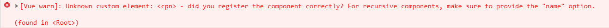

## 父组件和子组件

我们可以在组件中定义并使用其他组件，这就构成了父子组件的关系。

~~~html
<!DOCTYPE html>
<html>

<body>
    <div id="app">
        <parentcpn></parentcpn>
    </div>
</body>
<script src="js/vue.js"></script>
<script>

    //1.创建第一个组件构造器cpnC1(子组件)
    // 我发现子组件必须要写到父组件代码上面，否则会报错
    const cpnC1 = Vue.extend({
        template: `
          <div>
                这是子组件!
            </div>`
    })

    // 2.创建第二个组件构造器cpnC2(父组件)
    const cpnC2 = Vue.extend({
        // 在父组件模版中使用子组件标签
        template: `
            <div>
                这是父组件!
                <childcpn></childcpn>
            </div>`
        ,
        components: {
            // 4.局部注册子组件
            // 该组件只能在父组件内使用了
            childcpn: cpnC1
        }
    })


    // 3.全局注册父组件
    Vue.component('parentcpn', cpnC2)

    const app = new Vue({
        el: '#app',
        data: {
            message: '你好啊'
        }
    })

</script>
</html>
~~~

我们分几个步骤来理解这段代码：

1.`const cpnC1 = Vue.extend(...)`定义了一个子组件构造器

2.`const cpnC2 = Vue.extend(...)`定义了一个父组件构造器

3.`components:{childcpn:cpnC1}`,将子组件注册到父组件，并将子组件的标签名设置为`childcpn`

4.`template:<div>这是父组件!
 <childcpn></childcpn></div>`,在父组件模版内以标签的形式使用子组件

5.`Vue.component('parentcpn', cpnC2)`,全局注册父组件

6.在页面中使用`<parentcpn>`标签渲染父组件的内容，同时子组件的内容也被渲染出来


子组件是在父组件中注册的，它只能在父组件中使用，确切的说：**子组件只能在父组件的模版(template)中使用。**

**再来一个感受下：**

~~~html
<!DOCTYPE html>
<html lang="en">

<head>
    <meta charset="UTF-8">
    <title>Document</title>
</head>

<body>
    <div id="app">
        <cpn2></cpn2>
        <cpn1></cpn1>
        <!-- 单独写cpn1无法渲染，还会报错 -->
        <!-- 在Vue实例这个作用域里面，要想使用某一个组件，要么它是一个全局组件，
             要么在Vue实例中组件的components里已经注册过了(只注册过cpnC2,没有注册过cpnC1)
             所以直接在上面写cpn1会报错，写cpn2的话会渲染出里面的cpn1,
             儿子自己不能展示，只能通过爸爸像别人介绍来展示自己的儿子
             要想儿子自己独立展示，只能在Vue实例中再单独自己注册一次cpn1:cpnC1-->
    </div>
    <script src="js/vue.js"></script>
    <script>
        // 因为是父子组件，所以我至少要创建2个组件才行
        // 1.创建第一个组件构造器cpnC1(子组件)
        const cpnC1 = Vue.extend({
            template: `
                <div>
                    <h2>我是标题1</h2>   
                    <p>我是内容，哈哈哈</p> 
                </div>
            `
        })

        // 2.创建第二个组件构造器cpnC2(父组件)
        const cpnC2 = Vue.extend({
            template: `
                <div>
                    <h2>我是标题2</h2>   
                    <p>我是内容，呵呵呵</p> 
                    <cpn1></cpn1>
                </div>
            `,
            // 我们只给它添加了一个属性：template,其实它还可以添加别的属性
            components: {
                // 这个components不是放到Vue实例里的，而是放到组件构造器对象里的
                cpn1: cpnC1
                // 如果cpn1只在这里注册，不再Vue实例里再注册一次，则永无出头之日，
                // 只能通过爸爸向其他人展示，自己不能主动展示
            }
        })
        // root组件
        const app = new Vue({
            //  Vue实例其实你也可以把它看成是一个组件，它是最顶层的组件(root)
            //  Vue实例是爷爷，cpnC2是爸爸，cpnC1是儿子
            el: '#app',
            data: {
                message: '你好啊'
            },
            components: {
                cpn2: cpnC2,
                // 组件构造器cpnC1不是在Vue实例里注册的，而是在组件构造器cpnC2里注册的\
                // 要想自己主动单独展示，而不是被动的通过爸爸展示，需要在这里再注册一次
                cpn1: cpnC1
                // 不写这个会报错
            }
        })
        // 总结：组件构造器cpnC1放在组件构造器cpnC2里面注册的，而组件构造器cpnC2是放在Vue实例里注册的
        // 这样就可以保证2个组件构造器都注册过了
    </script>
</body>
</html>
~~~


请注意下面两种子组件的使用方式是错误的：

### 以子标签的形式在父组件中使用(无效)

~~~CSS
<div id="app">
   <parentcpn>
      <childcpn></childcpn>
    </parentcpn>
</div>
~~~

为什么这种方式无效呢？因为当子组件注册到父组件时，Vue.js会编译好父组件的模板，模板的内容已经决定了父组件将要渲染的HTML。
`<parentcpn>...</parentcpn>`相当于运行时，它的一些子标签只会被当作普通的HTML来执行，`<childcpn></childcpn>`不是标准的HTML标签，会被浏览器直接**忽视掉**。

> 这个只是无效，但是没有报错。

### 在父组件标签外使用子组件

~~~css
<div id="app">
     <parentcpn></parentcpn>
     <childcpn></childcpn>
</div>
~~~

运行这段代码，浏览器会提示以下错误：

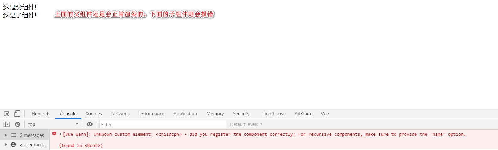

## 组件注册语法糖

以上组件注册的方式有些繁琐，Vue.js为了简化这个过程，提供了注册语法糖。

**使用Vue.component()直接创建和注册组件(全局组件)：**

~~~html
<!DOCTYPE html>
<html lang="en">

<head>
    <meta charset="UTF-8">
    <title>Document</title>
</head>

<body>
    <div id="app">
        <cpn1></cpn1>
    </div>
    <script src="js/vue.js"></script>
    <script>
        Vue.component('cpn1', {
            template: `
            <div>
                这是一个全局组件
            </div>`
        })
        const app = new Vue({
            el: '#app'
        })
    </script>
</body>
</html>
~~~

`Vue.component()`的第1个参数是标签名称，第2个参数是一个选项对象，使用选项对象的template属性定义组件模板。
使用这种方式，Vue在背后会自动地调用`Vue.extend()`。

**在选项对象的components属性中实现局部注册(局部组件)：**

~~~html
<!DOCTYPE html>
<html lang="en">

<head>
    <meta charset="UTF-8">
    <title>Document</title>
</head>

<body>
    <div id="app1">
        <cpn1></cpn1>
        <cpn2></cpn2>
        <cpn3></cpn3>
        <!-- 局部组件cpn2,cpn3只能在id为app的Vue实例中使用-->
        <!-- 正好这个div的id为app,所以可以直接使用 -->
    </div>

    <div id="app2">
        <cpn1></cpn1>
        <cpn2></cpn2>
        <cpn3></cpn3>
        <!-- 这里cpn1可以用,它是全局组件，全局组件也只能在Vue实例下使用。
             cpn2,cpn3都用不了，它们两个只能在id为app1的Vue实例下使用-->
    </div>

    <div>
        <cpn1></cpn1>
        <cpn2></cpn2>
        <cpn3></cpn3>
        <!-- 这里cpn1,cpn2,cpn3都用不了，全局组件也只能在Vue实例下使用-->
    </div>
  
    <script src="js/vue.js"></script>
    <script>
        Vue.component('cpn1', {
            template: `
            <div>
                这是一个全局组件
            </div>`
        })
        const app1 = new Vue({
            el: '#app1',
            components: {
                cpn2: {
                    template: `
                     <div>
                        这是局部第一个组件
                    </div>`
                },
                cpn3: {
                    template: `
                     <div>
                        这是局部第二个组件
                    </div>`
                }
            }
        })

        const app2 = new Vue({
            el: '#app2'
            // 全局组件也只能在Vue实例下使用！！
        })
    </script>
</body>
</html>
~~~

## 组件模版的分离写法

尽管语法糖简化了组件注册，但**在template选项中拼接HTML元素比较麻烦**，这也导致了HTML和JavaScript的高耦合性。
庆幸的是，Vue.js提供了两种方式将定义在JavaScript中的HTML模板分离出来。

### 使用`<script>`标签(不常用)

> `<script>`标签比较麻烦的地方是还要写type类型。

~~~html
<!DOCTYPE html>
<html lang="en">

<head>
    <meta charset="UTF-8">
    <title>Document</title>
</head>

<body>
    <div id="app">
        <cpn></cpn>
    </div>

    <script type="text/x-template" id="cpn">
    <!-- 我发现这个script标签是写在src上面的 -->
    <!-- script标签内还要记得写id -->
    <!-- template模版就写在这里了 -->
    <div>
        <p> 这是用script标签生成的template模版</p>
    </div>
    </script>
    <script src="js/vue.js"></script>
    <script>
        Vue.component('cpn', {
            template: '#cpn'
            // 不用在这里写template模版了，script标签里有id号，拿id和上面的模版进行联系就好了
        })
        const app = new Vue({
            el: '#app',
        })
    </script>
</body>
</html>
~~~

**template选项现在不再是HTML元素，而是一个id**，Vue.js根据这个id查找对应的元素，然后将这个元素内的HTML作为模板进行编译。

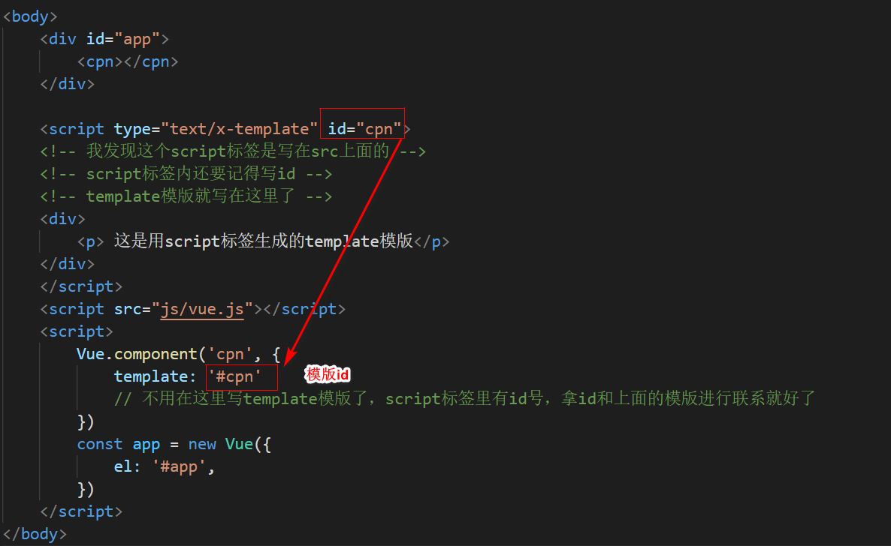

> **注意：**使用`<script>`标签时，type指定为`text/x-template`，意在告诉浏览器这不是一段JS脚本，浏览器在解析HTML文档时会**忽略**`<script>`标签内定义的内容。

### 使用`<template>`标签(常用)

如果使用`<template>`标签，则不需要指定type属性(但是id属性还是要有的)。

~~~html
<!DOCTYPE html>
<html lang="en">

<head>
    <meta charset="UTF-8">
    <title>Document</title>
</head>

<body>
    <div id="app">
        <cpn></cpn>
    </div>

    <template id="cpn">
        <!-- 这个同样也要加id号 -->
        <div>
            <p> 这是用template标签生成的template模版</p>
        </div>
    </template>

    <script src="js/vue.js"></script>
    <script>
        Vue.component('cpn', {
            template: '#cpn'
        })
        const app = new Vue({
            el: '#app',
        })
    </script>
</body>
</html>
~~~

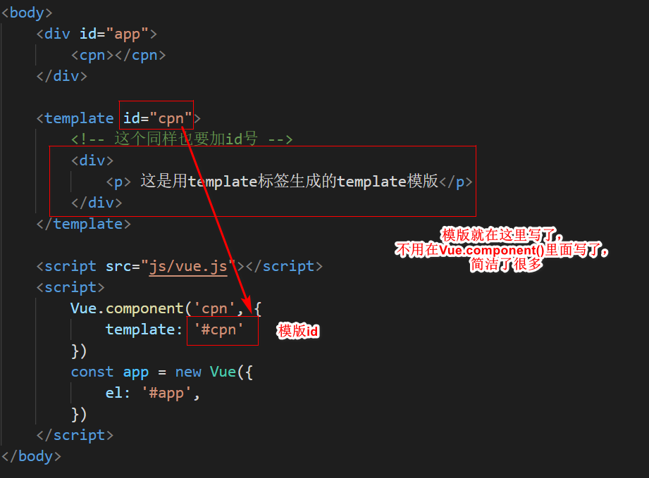

在理解了组件的创建和注册过程后，我建议使用`<script>`或`<template>`标签来定义组件的HTML模板。

这使得HTML代码和JavaScript代码是分离的，便于阅读和维护。

另外，在Vue.js中，可创建`.vue`后缀的文件，在`.vue`文件中定义组件，这个内容我会在后面的文章介绍。

# 组件的其他属性

> 我们前面学的组件里的内容都是写死的，能不能把组件里的数据抽离到一个变量里面，之后通过胡子语法直接显示这个变量？如果这样可以的话，我就可以改变这个变量，界面就会自动刷新了。
>
> 那么这个变量放到哪里呢？可以放到data属性里吗？——不可以。
>
> 组件内部是不能访问Vue实例里面的数据的。


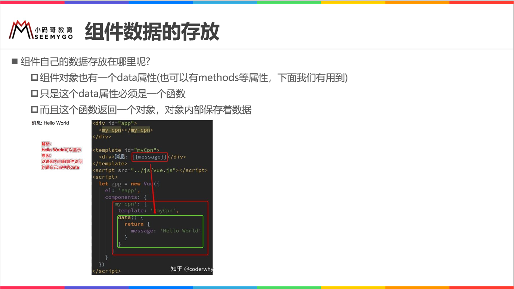

~~~html
<!DOCTYPE html>
<html lang="en">

<head>
    <meta charset="UTF-8">
    <title>Document</title>
</head>

<body>
    <div id="app">
        <cpn></cpn>
        <cpn></cpn>
        <cpn></cpn>
    </div>

    <template id="cpn">
        <div>
            <!-- <h2>{{message}}</h2> -->
            <!-- 这样写不行，组件内部是无法访问到Vue实例里的数据的 -->

            <h2>{{title}}</h2>
            <!-- 这个title是组件里面data函数定义的变量，可以用胡子语法进行访问 -->
            <p>我是内容，呵呵呵</p>
        </div>
    </template>
    <script src="js/vue.js"></script>

    <script>

        Vue.component('cpn', {
            template: '#cpn',
            // data: {
            //     title: 'abc'
            //     // 如果硬要写对象类型的话会报错
            // }
            // 这个data属性用于存放组件内部属于我自己的一些变量，这样就不会写死了
            // Vue实例里的data是一个对象类型，但是组件里的data不能是对象类型，只能是函数！！！
            data() {
                return {
                    title: 'abc'
                    // data本身是一个函数，返回的是一个对象，这个则没有问题
                }
            }
        })
        const app = new Vue({
            el: '#app',
            data: {
                message: '你好啊'
            }
        })
    </script>
</body>

</html>
~~~

## 组件的el和data属性

传入Vue构造器的多数选项也可以用在 `Vue.extend()` 或`Vue.component()`中，不过有两个特例： `data` 和`el`。

Vue.js规定：**在定义组件的选项时，data和el选项必须使用函数。**

**下面的代码在执行时，浏览器会提出一个错误**

~~~javascript
Vue.component('cpn', {
      template: '#cpn',
      data: {
          a: 1
         // 组件中的data是一个对象，不行！！
         // 组件中的data只能是一个函数，然后这个函数返回一个对象
       }
})
~~~

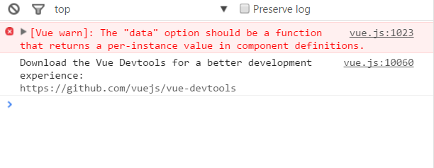

另外，如果data选项指向某个对象，这意味着**所有的组件实例共用一个data**。这样导致的结果就是，你修改了其中一个组件，另一个组件也会产生相应的变化，这样会导致整个页面都乱了套。(各个组件之间本来就应该保持独立性！！)

我们应当使用一个函数作为 data 选项，让这个函数返回一个新对象：

~~~javascript
Vue.component('cpn', {
      template: '#cpn',
      data(): {
  			 return {
  					 a:1
				 }
         // 组件中的data只能是一个函数，然后这个函数返回一个对象
      }
})
~~~

## 组件中的data为什么一定要是函数而不能是对象

~~~html
<!DOCTYPE html>
<html lang="en">

<head>
    <meta charset="UTF-8">
    <title>Document</title>
</head>

<body>
    <!-- 组件实例：就是实例对象的意思 -->
    <div id="app">
        <cpn></cpn>
        <cpn></cpn>
        <cpn></cpn>
        <!-- 根据下面注册的组件，创建出来了3个组件实例 -->
        <!-- 这3个组件实例有无共享同一个data对象啊？？？ 答案是否！！！-->
        <!-- 因为组件中的data是一个函数，创建组件实例时会调用data函数，我们会在每次调用的时候return一个新的对象-->
        <!-- 这样的话这3个组件彼此都是独立的，互不干扰！！ -->
    </div>

    <template id="cpn">
        <div>
            <h2>当前计数：{{counter}}</h2>
            <button @click="increment">+</button>
            <button @click="decrement">-</button>
            <!-- 这2个方法不能写到Vue实例里面！！ -->
            <!-- 组件里面还可以有自己的methods，写到组件里的methods里面 -->
        </div>
    </template>

    <script src="js/vue.js"></script>
    <script>
        // 1.注册组件(先来个全局的)
        Vue.component('cpn', {
            template: '#cpn',
            data() {
                return {
                    counter: 0
                }
            },
            methods: {
                // 组件也有自己的methods
                // 组件就是一个封闭的空间，我自己里面有自己的数据，有自己的方法
                increment() {
                    this.counter++
                },
                decrement() {
                    this.counter--
                }
            }
        })
        const app = new Vue({
            el: '#app',
            data: {
                message: '你好啊'
            }
        })
    </script>

    <script>
        // 例子1：obj1,obj2,obj3不是同一个对象
        function abc() {
            return {
                name: 'why',
                age: 18
            }
        }

        let obj1 = abc();
        let obj2 = abc();
        let obj3 = abc();
        // 调用了3次abc函数，函数有返回值，分别给个名字obj1,obj2,obj3
        // 问题：obj1,obj2,obj3是不是同一个对象？？？肯定不是！！！
        // 因为函数每次执行的时候都会在栈空间创建很多新的变量

        // 验证obj1，obj2，obj3不是同一个对象——比较内存地址
        obj1.name = 'Kobe';
        console.log(obj2.name);     //why
        console.log(obj3.name);     //why
        // 改变obj1的name,obj2和obj3中的name都没有变化，所以它们3个不是同一个东西


        //例子2:obj4,obj5,obj6是同一个对象
        const objj = {
            name: 'why',
            age: 18
        }

        function bcd() {
            return objj;
        }

        let obj4 = bcd();
        let obj5 = bcd();
        let obj6 = bcd();
        // 此时obj4,obj5,obj6是同一个对象！！！
        obj4.name = 'Kobe';
        console.log(obj5.name);     //Kobe
        console.log(obj6.name);     //kobe

        // 所以如果data不是函数而是对象的话，所有的组件实例都会引用同一个data对象
        // 这个时候你改其中一个组件，其他组件也都会改变，所有的组件之间都相互关联，没有独立性。
        // 组件之间一定要独立！！改了这个组件不能其他组件也会随着变化，这样就会乱套了！！！
    </script>
</body>
</html>
~~~

------

(上面是一篇完整的博文，上面的博文内容我已经理解了。)

# Vue组件选项props(好文章！！！)

[Vue组件选项props](https://www.cnblogs.com/xiaohuochai/p/7388866.html#anchor1)

## 前面的话

组件接受的选项大部分与Vue实例一样，而选项props是组件中非常重要的一个选项。在 Vue 中，父子组件的关系可以总结为 props down, events up。父组件通过 props 向下传递数据给子组件，子组件通过 events 给父组件发送消息。本文将详细介绍Vue组件选项props。

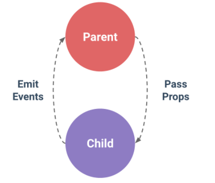

## 父子级组件

在介绍props之前，先介绍父子级组件的写法。

在一个良好定义的接口中尽可能将父子组件解耦是很重要的。这保证了每个组件可以在相对隔离的环境中书写和理解，也大幅提高了组件的可维护性和可重用性。

**【错误写法】**

现在来介绍两种父子级组件的错误写法

下面这种形式的写法是错误的，因为当子组件注册到父组件时，Vue.js会编译好父组件的模板，模板的内容已经决定了父组件将要渲染的HTML。
`<parent>...</parent>`运行时，它的一些子标签只会被当作普通的HTML来执行，`<child></child>`不是标准的HTML标签，会被浏览器直接忽视掉。

~~~javascript
<div id="example">
  <parent>
    <child></child>
    <child></child>
  </parent>
</div>
~~~

在父组件标签之外使用子组件也是错误的：

~~~javascript
<div id="example">
  <parent></parent>
  <child></child>
</div>
~~~

**【正确写法】**

~~~javascript
<div id="example">
  <parent></parent>
</div>
~~~

~~~javascript
<script>
var childNode = {
  template: `<div>childNode</div>`,
}
var parentNode = {
  template: `
  <div class="parent">
    <child></child>
    <child></child>
  </div>
  `,
  components: {
    'child': childNode
  } 
};
// 创建根实例
new Vue({
  el: '#example',
    components: {
     //在根实例中注册父组件
     //key(parent)是组件标签名，value(parentNode)是组件构造器
    'parent': parentNode
  }  
})
</script>
~~~

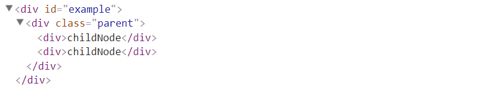

## 静态props

组件实例的作用域是孤立的。这意味着不能 (也不应该) 在子组件的模板内直接引用父组件的数据。要让子组件使用父组件的数据，需要通过子组件的 props 选项。

使用Prop传递数据包括静态和动态两种形式，下面先介绍静态props。

子组件要显式地用 props 选项声明它期待获得的数据。

~~~javascript
var childNode = {
  template: '<div>{{message}}</div>',
  props:['message']
  // props:['message']表示子组件想要父组件的'message'信息
}
~~~

静态Prop通过为子组件在父组件中的占位符添加特性的方式来达到传值的目的。

~~~javascript
<div id="example">
  <parent></parent>
</div>
~~~

~~~javascript
<script>
var childNode = {
  template: '<div>{{message}}</div>',
  props:['message']
}
var parentNode = {
  template: `
  <div class="parent">
    <child message="aaa"></child>
    <child message="bbb"></child>
  </div>`,
  components: {
    'child': childNode
  }
};
// 创建根实例
new Vue({
  el: '#example',
  components: {
    'parent': parentNode
  }
})
</script>
~~~


## 命名约定

对于props声明的属性来说，在父级HTML模板中，属性名需要使用中划线写法。

~~~javascript
var parentNode = {
  template: `
  <div class="parent">
    <child my-message="aaa"></child>
    <child my-message="bbb"></child>
  </div>`,
  components: {
    'child': childNode
  }
};
~~~

子级props属性声明时，使用小驼峰或者中划线写法都可以；而子级模板使用从父级传来的变量时，需要使用对应的小驼峰写法。

~~~javascript
var childNode = {
  template: '<div>{{myMessage}}</div>',
  props:['myMessage']
}
~~~

~~~javascript
var childNode = {
  template: '<div>{{myMessage}}</div>',
  props:['my-message']
}
~~~

## 动态props

在模板中，要动态地绑定父组件的数据到子模板的 props，与绑定到任何普通的HTML特性相类似，就是用 `v-bind`。每当父组件的数据变化时，该变化也会传导给子组件。

~~~javascript
var childNode = {
  template: '<div>{{myMessage}}</div>',
  //并且子组件的模版里也使用了父组件的这一属性：'myMessage'
  props:['myMessage']
  //子组件想要父组件的一个属性:'myMessage'
}
~~~

~~~javascript
var parentNode = {
  template: `
  <div class="parent">
    <child :my-message="data1"></child>
    <child :my-message="data2"></child>
	//v-bind用于动态绑定属性
	//v-bind:my-message="data1"表示一个属性，它的值是data1(这个值也是一个变量)
  </div>`,
  components: {
    'child': childNode
  },
  data(){
    return {
      'data1':'aaa',
      'data2':'bbb'
       //父组件里面有变量data1,它的值为'aaa'
    }
  }
};
~~~

> 我一直不理解`props`主要的原因就是上面这2段代码没有好好琢磨明白，一旦琢磨明白了，一切会有"拨云见日"的感觉的！！

## 传递数字

> 没怎么看得懂。

初学者常犯的一个错误是使用字面量语法传递数值。

~~~javascript
<!-- 传递了一个字符串 "1" -->
<comp some-prop="1"></comp>
~~~

~~~javascript
<div id="example">
  <my-parent></my-parent>
</div>
~~~

~~~javascript
<script>
var childNode = {
  template: '<div>{{myMessage}}的类型是{{type}}</div>',
  props:['myMessage'],
  computed:{
    type(){
      return typeof this.myMessage
    }
  }
}
var parentNode = {
  template: `
  <div class="parent">
    <my-child my-message="1"></my-child>
  </div>`,
  components: {
    'myChild': childNode
  }
};
// 创建根实例
new Vue({
  el: '#example',
  components: {
    'MyParent': parentNode
  }
})
</script>
~~~

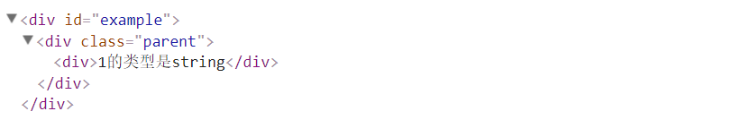

因为它是一个字面 prop，它的值是字符串 `"1"` 而不是 number。如果想传递一个实际的 number，需要使用 `v-bind`，从而让它的值被当作JS表达式计算。

~~~javascript
<!-- 传递实际的 number -->
<comp v-bind:some-prop="1"></comp>
~~~

~~~javascript
var parentNode = {
  template: `
  <div class="parent">
    <my-child :my-message="1"></my-child>
  </div>`,
  components: {
    'myChild': childNode
  }
};
~~~

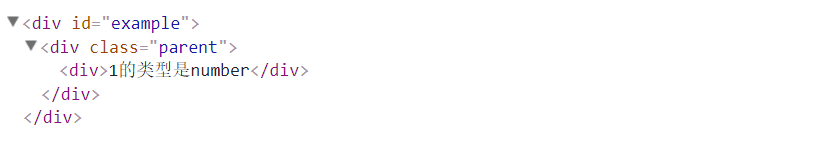

或者可以使用动态props，在data属性中设置对应的数字1。

~~~javascript
var parentNode = {
  template: `
  <div class="parent">
    <my-child :my-message="data"></my-child>
  </div>`,
  components: {
    'myChild': childNode
  },
  data(){
    return {
      'data': 1
    }
  }
};
~~~

## props验证

可以为组件的 props 指定验证规格。如果传入的数据不符合规格，Vue会发出警告。**当组件给其他人使用时，这很有用**。

要指定验证规格，需要用对象的形式，而不能用字符串数组。

~~~javascript
Vue.component('example', {
  props: {
    // 基础类型检测 (`null` 意思是任何类型都可以)
    propA: Number,
    // 多种类型
    propB: [String, Number],
    // 必传且是字符串
    propC: {
      type: String,
      required: true
    },
    // 数字，有默认值
    propD: {
      type: Number,
      default: 100
    },
    // 数组/对象的默认值应当由一个工厂函数返回
    propE: {
      type: Object,
      default: function () {
        return { message: 'hello' }
      }
    },
    // 自定义验证函数
    propF: {
      validator: function (value) {
        return value > 10
      }
    }
  }
})
~~~

`　type` 可以是下面原生构造器：

~~~javascript
String
Number
Boolean
Function
Object
Array
Symbol
~~~

`　type` 也可以是一个自定义构造器函数，使用 `instanceof` 检测。

当 prop 验证失败，Vue 会在抛出警告 (如果使用的是开发版本)。props会在组件实例创建**之前**进行校验，所以在 `default` 或 `validator` 函数里，诸如 `data`、`computed` 或 `methods` 等实例属性还无法使用。

下面是一个简单例子，如果传入子组件的message不是数字，则抛出警告：

~~~javascript
<div id="example">
  <parent></parent>
</div>
~~~

~~~javascript
<script>
var childNode = {
  template: '<div>{{message}}</div>',
  props:{
    'message':Number
  }
}
var parentNode = {
  template: `
  <div class="parent">
    <child :message="msg"></child>
  </div>`,
  components: {
    'child': childNode
  },
  data(){
    return{
      msg: '123'
    }
  }
};
// 创建根实例
new Vue({
  el: '#example',
  components: {
    'parent': parentNode
  }
})
</script>
~~~

传入数字123时，则无警告提示。传入字符串'123'时，结果如下所示：

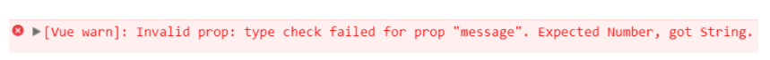

将上面代码中，子组件的内容修改如下，可自定义验证函数，当函数返回为false时，则输出警告提示：

~~~javascript
var childNode = {
  template: '<div>{{message}}</div>',
  props:{
    'message':{
      validator: function (value) {
        return value > 10
      }
    }
  }
}
~~~

在父组件中传入msg值为1，由于小于10，则输出警告提示：

~~~javascript
var parentNode = {
  template: `
  <div class="parent">
    <child :message="msg"></child>
  </div>`,
  components: {
    'child': childNode
  },
  data(){
    return{
      msg:1
    }
  }
};
~~~

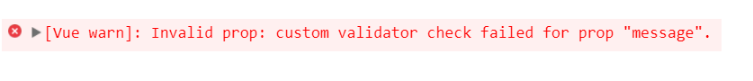

## 单向数据流

prop 是单向绑定的：当父组件的属性变化时，将传导给子组件，但是不会反过来。这是为了防止子组件无意修改了父组件的状态——这会让应用的数据流难以理解。

另外，每次父组件更新时，子组件的所有 prop 都会更新为最新值。这意味着不应该在子组件内部改变 prop。如果这么做了，Vue 会在控制台给出警告。

下面是一个典型例子：

~~~javascript
<div id="example">
  <parent></parent>
</div>
~~~

~~~javascript
<script>
var childNode = {
  template: `
  <div class="child">
    <div>
      <span>子组件数据</span>
      <input v-model="childMsg">
    </div>
    <p>{{childMsg}}</p>
  </div>
  `,
  props:['childMsg']
}
var parentNode = {
  template: `
  <div class="parent">
    <div>
      <span>父组件数据</span>
      <input v-model="msg">
    </div>
    <p>{{msg}}</p>
    <child :child-msg="msg"></child>
  </div>
  `,
  components: {
    'child': childNode
  },
  data(){
    return {
      'msg':'match'
    }
  }
};
// 创建根实例
new Vue({
  el: '#example',
  components: {
    'parent': parentNode
  }
})
</script>
~~~

父组件数据变化时，子组件数据会相应变化；而子组件数据变化时，父组件数据不变，并在控制台显示警告：

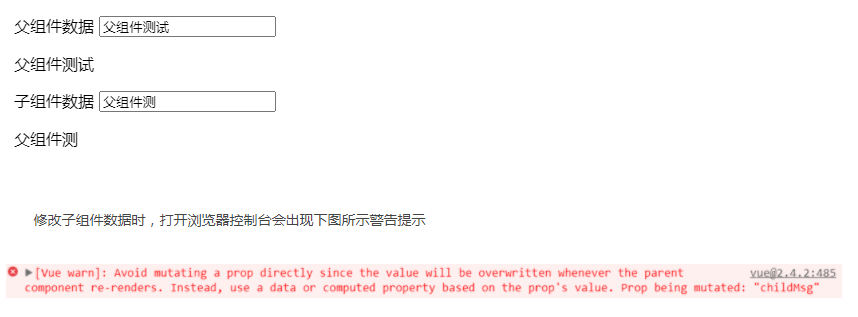

## 修改prop数据

修改prop中的数据，通常有以下两种原因：

* prop 作为初始值传入后，子组件想把它当作局部数据来用。
* prop 作为初始值传入，由子组件处理成其它数据输出。

> 注意：JS中对象和数组是引用类型，指向同一个内存空间，如果 prop 是一个对象或数组，在子组件内部改变它**会影响**父组件的状态。

对于这两种情况，正确的应对方式是：

* 定义一个局部变量，并用 prop 的值初始化它

  ~~~javascript
  props: ['initialCounter'],
  data: function () {
    return { counter: this.initialCounter }
  }
  ~~~

  但是，定义的局部变量counter只能接受initialCounter的初始值，当父组件要传递的值发生变化时，counter无法接收到最新值。

  ~~~javascript
  <div id="example">
    <parent></parent>
  </div>
  <script src="https://unpkg.com/vue"></script>
  <script>
  var childNode = {
    template: `
    <div class="child">
      <div>
        <span>子组件数据</span>
        <input v-model="temp">
      </div>
      <p>{{temp}}</p>
    </div>
    `,
    props:['childMsg'],
    data(){
      return{
        temp:this.childMsg
      }
    },
  };
  var parentNode = {
    template: `
    <div class="parent">
      <div>
        <span>父组件数据</span>
        <input v-model="msg">
      </div>
      <p>{{msg}}</p>
      <child :child-msg="msg"></child>
    </div>
    `,
    components: {
      'child': childNode
    },
    data(){
      return {
        'msg':'match'
      }
    }
  };
  // 创建根实例
  new Vue({
    el: '#example',
    components: {
      'parent': parentNode
    }
  })
  </script>
  ~~~

  下面示例中，除初始值外，父组件的值无法更新到子组件中：

  

* 定义一个计算属性，处理 prop 的值并返回：

  ~~~javascript
  props: ['size'],
  computed: {
    normalizedSize: function () {
      return this.size.trim().toLowerCase()
    }
  }
  ~~~

  但是，由于是计算属性，则只能显示值，而不能设置值：

  ~~~javascript
  <script src="https://unpkg.com/vue"></script>
  <script>
  var childNode = {
    template: `
    <div class="child">
      <div>
        <span>子组件数据</span>
        <input v-model="temp">
      </div>
      <p>{{temp}}</p>
    </div>
    `,
    props:['childMsg'],
    computed:{
        temp(){
          return this.childMsg
        }
    },
  };
  var parentNode = {
    template: `
    <div class="parent">
      <div>
        <span>父组件数据</span>
        <input v-model="msg">
      </div>
      <p>{{msg}}</p>
      <child :child-msg="msg"></child>
    </div>
    `,
    components: {
      'child': childNode
    },
    data(){
      return {
        'msg':'match'
      }
    }
  };
  // 创建根实例
  new Vue({
    el: '#example',
    components: {
      'parent': parentNode
    }
  })
  </script>
  ~~~

  下面示例中，由于子组件使用的是计算属性，所以，子组件的数据无法手动修改：

  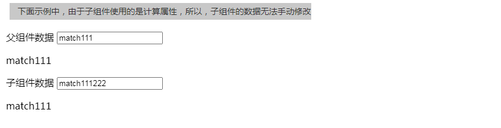

* 更加妥帖的方案是，使用变量储存prop的初始值，并使用watch来观察prop的值的变化。发生变化时，更新变量的值。

  ~~~javascript
  <div id="example">
    <parent></parent>
  </div>
  <script src="https://unpkg.com/vue"></script>
  <script>
  var childNode = {
    template: `
    <div class="child">
      <div>
        <span>子组件数据</span>
        <input v-model="temp">
      </div>
      <p>{{temp}}</p>
    </div>
    `,
    props:['childMsg'],
    data(){
      return{
        temp:this.childMsg
      }
    },
    watch:{
      childMsg(){
        this.temp = this.childMsg
      }
    }
  };
  var parentNode = {
    template: `
    <div class="parent">
      <div>
        <span>父组件数据</span>
        <input v-model="msg">
      </div>
      <p>{{msg}}</p>
      <child :child-msg="msg"></child>
    </div>
    `,
    components: {
      'child': childNode
    },
    data(){
      return {
        'msg':'match'
      }
    }
  };
  // 创建根实例
  new Vue({
    el: '#example',
    components: {
      'parent': parentNode
    }
  })
  </script>
  ~~~

  

------

(上面是一篇完整的博文，上面的博文内容我已经大体理解了，后面讲的还不是很清楚。)

# 组件通信

[Vue 组件通信方式全面详解](https://juejin.im/post/6844903784963899405)

[Vue组件间通信的6种方式](https://segmentfault.com/a/1190000022083517)

## 父传子(props属性)

[vue props-值得好好看](https://zhuanlan.zhihu.com/p/65029911)


**组件实例的作用域是孤立的**。这意味着不能并且不应该在子组件的模板内直接引用父组件的数据。可以使用 **props** 把数据传给子组件。

### props基础示例

下面的代码定义了一个**子组件**`my-component`，在Vue实例中定义了data选项。

> 只不过子组件是借窝下蛋：在父组件(Vue实例)的地盘中进行的组件注册。

~~~javascript
 const app = new Vue({
     //Vue实例其实你也可以把它看成是一个组件(绝对的父组件)，它是最顶层的组件(root)
     el: '#app',
     data: {
         name: 'Keepfool',
         age: 28
         // 这个是父组件里的数据
     },
     components: {
         // 这个是子组件的内容，借用父组件(Vue)这个地方进行注册
         'my-component': {
             // my-component是子组件标签名，是在父组件(Vue实例里注册的)
             //因为子组件名中间有横杠，所以外面加个单引号，如果没有横杠不加单引号也没事
             template: '#myComponent',
             // myComponent是子组件的id
             props: ['myName', 'myAge']
             // 不要把它当成字符串，把它当成变量!!

         }
     }
})
~~~

为了便于理解，你可以**将这个Vue实例看作`my-component`的父组件**。

如果我们想使父组件的数据，则必须先在子组件中定义props属性，也就是`props: ['myName', 'myAge']`这行代码。

定义子组件的HTML模板：

```javascript
 <template id="myComponent">
    <table width="400" height="100" border="1">
        <thead>
            <caption>子组件数据</caption>
        </thead>

        <tbody>
            <tr>
                <td>myname</td>
                <td>{{myName}}</td>
            </tr>
            <tr>
                <td>myage</td>
                <td>{{myAge}}</td>
            </tr>
        </tbody>
    </table>
</template>
```

将父组件数据通过已定义好的props属性传递给子组件：

~~~javascript
 <div id="app">
     <my-component :my-name="name" :my-age="age"></my-component>
     <!-- props中的myName和myAge要转变成my-name和my-age才行 -->
 </div>
~~~

> **注意：**在子组件中定义prop时，使用了驼峰命名法。由于HTML特性不区分大小写，驼峰的prop用于特性时，需要转为 kebab-case（短横线隔开）。例如，在prop中定义的myName，在用作特性时需要转换为my-name。

父组件是如何将数据传给子组件的呢？相信看了下面这图，也许你就能很好地理解了。

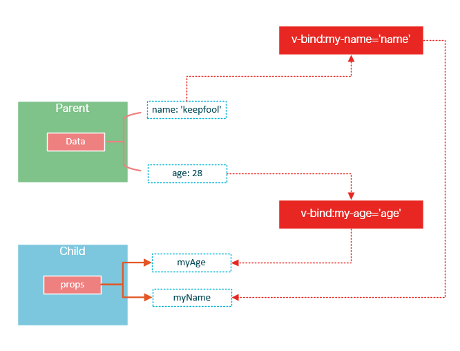

在父组件中使用子组件时，通过以下语法将数据传递给子组件：

~~~javascript
<child-component v-bind:子组件prop="父组件数据属性"></child-component>
~~~

**案例总览如下：**

~~~html
<!DOCTYPE html>
<html lang="en">

<head>
    <meta charset="UTF-8">
    <title>Document</title>
</head>

<body>
    <div id="app">
        <my-component :my-name="name" :my-age="age"></my-component>
        <!-- props中的myName和myAge要转变成my-name和my-age才行 -->
    </div>
    <template id="myComponent">
        <table width="400" height="100" border="1">
            <thead>
                <caption>子组件数据</caption>
            </thead>

            <tbody>
                <tr>
                    <td>myname</td>
                    <td>{{myName}}</td>
                </tr>
                <tr>
                    <td>myage</td>
                    <td>{{myAge}}</td>
                </tr>
            </tbody>
        </table>
    </template>
    <script src="js/vue.js"></script>
    <script>
        const app = new Vue({
            //Vue实例其实你也可以把它看成是一个组件(绝对的父组件)，它是最顶层的组件(root)
            el: '#app',
            data: {
                name: 'Keepfool',
                age: 28
                // 这个是父组件里的数据
            },
            components: {
                // 这个是子组件的内容，借用父组件(Vue)这个地方进行注册
                'my-component': {
                    // my-component是子组件标签名，是在父组件(Vue实例里注册的)
                    //因为子组件名中间有横杠，所以外面加个单引号，如果没有横杠不加单引号也没事
                    template: '#myComponent',
                    // myComponent是子组件的id
                    props: ['myName', 'myAge']
                    // 不要把它当成字符串，把它当成变量!!

                }
            }
        })
    </script>
</body>
</html>
~~~

**再来一个案例更深刻的感受一下：**

~~~html
<!DOCTYPE html>
<html lang="en">

<head>
    <meta charset="UTF-8">
    <title>Document</title>
</head>

<body>
    <div id="app">
        <cpn :cmessage='message' :cmovies="movies"></cpn>
    </div>

    <template id="cpn">
        <div>
            <!-- 这个div不能少！！我少写了div就报错了，找了好久错误在哪！！ -->
            <p>{{cmessage}}</p>
            <p>{{cmovies}}</p>
        </div>
    </template>
    <script src="js/vue.js"></script>
    <script>

        const app = new Vue({
            el: '#app',
            data: {
                message: '你好啊',
                // 这个message是在data里面的,data是在Vue实例里面的(组件中无法访问)
                movies: ['海王', '海贼王', '海尔兄弟']
                // movies也是在Vue实例里面的(组件中无法访问)
            },
            components: {
                cpn: {
                    template: '#cpn',
                    props: {
                        // props不仅可以传入数组，也可以传入对象
                        cmessage: {
                            // c表示child，子组件在父组件(Vue实例)里借窝生蛋(注册组件)
                            type: String,
                            default: 'aaa',
                            // default是指当别人没有给你传值的情况下，默认值是什么
                            // required: true
                            // 表明cmessage必须要传值
                        },
                        cmovies: {
                            type: Array,
                            // 类型是对象或数组时，默认值必须是一个函数
                            default() {
                                return []
                                // 这样写就不会报错了
                            }

                        }
                    }
                }
            }
        })
    </script>
</body>
</html>
~~~

### props基本类型

#### 单向绑定

既然父组件将数据传递给了子组件，那么如果子组件修改了数据，对父组件是否会有所影响呢？

我们将子组件模板和页面HTML稍作更改(案例总览如下)：

~~~html
<!DOCTYPE html>
<html lang="en">

<head>
    <meta charset="UTF-8">
    <title>Document</title>
</head>

<body>
    <div id="app">
        <table width="400" height="100" border="1">
            <thead>
                <caption>父组件数据</caption>
            </thead>

            <tbody>
                <tr>
                    <td>myname</td>
                    <td>{{name}}</td>
                    <td><input type="text" v-model="name"></td>
                </tr>
                <tr>
                    <td>myage</td>
                    <td>{{age}}</td>
                    <td><input type="text" v-model="age"></td>
                </tr>
            </tbody>
        </table>
        <my-component :my-name="name" :my-age="age"></my-component>
        <!-- props中的myName和myAge要转变成my-name和my-age才行 -->
    </div>

    <template id="myComponent">
        <table width="400" height="100" border="1">
            <thead>
                <caption>子组件数据</caption>
            </thead>

            <tbody>
                <tr>
                    <td>myname</td>
                    <td>{{myName}}</td>
                    <td><input type="text" v-model="myName"></td>
                </tr>
                <tr>
                    <td>myage</td>
                    <td>{{myAge}}</td>
                    <td><input type="text" v-model="myAge"></td>
                </tr>
            </tbody>
        </table>
    </template>
    <script src="js/vue.js"></script>
    <script>
        const app = new Vue({
            //Vue实例其实你也可以把它看成是一个组件(绝对的父组件)，它是最顶层的组件(root)
            el: '#app',
            data: {
                name: 'Keepfool',
                age: 28
                // 这个是父组件里的数据
            },
            components: {
                // 这个是子组件的内容，借用父组件(Vue)这个地方进行注册
                'my-component': {
                    // my-component是子组件标签名，是在父组件(Vue实例里注册的)
                    //因为子组件名中间有横杠，所以外面加个单引号，如果没有横杠不加单引号也没事
                    template: '#myComponent',
                    // myComponent是子组件的id
                    props: ['myName', 'myAge']
                    // 不要把它当成字符串，把它当成变量!!

                }
            }
        })
    </script>
</body>
</html>
~~~

运行这个页面，我们做两个小试验：

1.在页面上修改子组件的数据

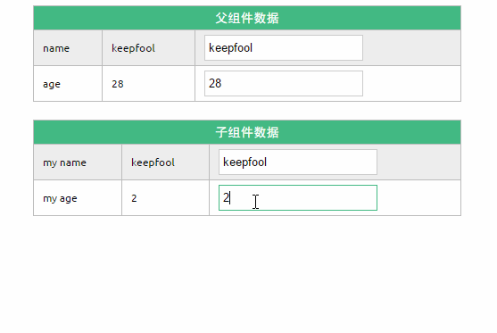

**修改了子组件的数据，没有影响父组件的数据。**

2.在页面上修改父组件的数据

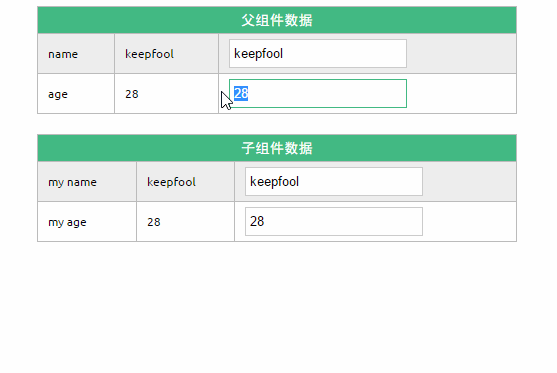

**修改了父组件的数据，同时影响了子组件。**

> prop默认是单向绑定：当父组件的属性变化时，将传导给子组件，但是反过来不会。这是为了防止子组件无意修改了父组件的状态

#### 双向绑定

可以使用`.sync`显式地指定双向绑定，这使得子组件的数据修改会回传给父组件。

~~~javascript
<my-component :my-name.sync="name" :my-age.sync="age"></my-component>
~~~

> 我试了一下，好像不行啊。

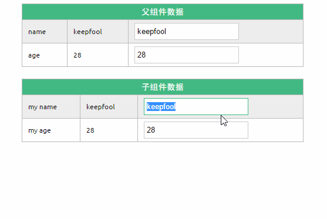

#### 单次绑定

可以使用`.once`显式地指定单次绑定，单次绑定在建立之后不会同步之后的变化，这意味着即使父组件修改了数据，也不会传导给子组件。

~~~javascript
<my-component v-bind:my-name.once="name" v-bind:my-age.once="age"></my-component>
~~~

> 好像也不行

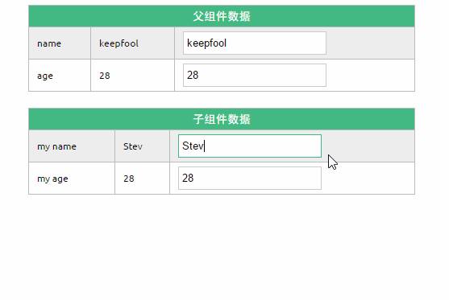

### 综合案例

为了尽快消化这些知识，我们来做一个小示例吧。

~~~html

<!DOCTYPE html>
<html>

	<head>
		<meta charset="UTF-8">
		<title></title>
		<link rel="stylesheet" href="styles/demo.css" />
	</head>

	<body>
		<div id="app">
			<div id="searchBar">
				Search <input type="text" v-model="searchQuery" />
			</div>
			<simple-grid :data="gridData" :columns="gridColumns" :filter-key="searchQuery">
			</simple-grid>
		</div>

		<template id="grid-template">
			<table>
				<thead>
					<tr>
						<th v-for="col in columns">
							{{ col | capitalize}}
						</th>
					</tr>
				</thead>
				<tbody>
					<tr v-for="entry in data | filterBy filterKey">
						<td v-for="col in columns">
							{{entry[col]}}
						</td>
					</tr>
				</tbody>
			</table>
		</template>

	</body>
	<script src="js/vue.js"></script>
	<script>
		Vue.component('simple-grid', {
			template: '#grid-template',
			props: {
				data: Array,
				columns: Array,
				filterKey: String
			}
		})

		var demo = new Vue({
			el: '#app',
			data: {
				searchQuery: '',
				gridColumns: ['name', 'age', 'sex'],
				gridData: [{
					name: 'Jack',
					age: 30,
					sex: 'Male'
				}, {
					name: 'Bill',
					age: 26,
					sex: 'Male'
				}, {
					name: 'Tracy',
					age: 22,
					sex: 'Female'
				}, {
					name: 'Chris',
					age: 36,
					sex: 'Male'
				}]
			}
		})
	</script>
</html>
~~~

> 但是这个出现了编译错误，显示不出来表格，我也不知道哪里有问题。

除了以上介绍的知识点，这个示例还用到了两个知识点：

**1. prop验证**

~~~javascript
props: {
	data: Array,
	columns: Array,
	filterKey: String
}
~~~

这段代码表示：父组件传递过来的data和columns必须是Array类型，filterKey必须是字符串类型。
更多prop验证的介绍，请参考：[官方文档prop验证](http://cn.vuejs.org/guide/components.html#Prop-%E9%AA%8C%E8%AF%81)

**2. filterBy过滤器**

可以根据指定的字符串过滤数据。

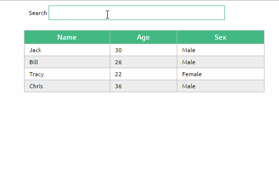

## 子传父($emit事件)

[vue组件之emit](https://www.jianshu.com/p/2e29f6e8800b)

[Vue.js 父子组件通信的十种方式](https://zhuanlan.zhihu.com/p/48090472)

### 案例1

~~~html
<!DOCTYPE html>
<html lang="en">

<head>
    <meta charset="UTF-8">
    <title>Document</title>
</head>

<body>
    <div id="app">
        <!-- 这个是父组件的模版 -->
        <cpn @item-click="cpnClick"></cpn>
        <!-- v-on事件监听 -->
        <!-- 子组件发射出去的事件也是一种事件，也可以监听 -->
        <!-- 不要写驼峰，用横杠代替 -->
        <!-- 在脚手架里才能写驼峰 -->
    </div>

    <template id="cpn">
        <div>
            <button v-for="item in categories" @click="btnClick(item)">{{item.name}}</button>
        </div>
    </template>

    <script src="js/vue.js"></script>
    <script>

        const cpnC = Vue.extend({
            // 创建的是子组件构造器
            template: '#cpn',
            data() {
                return {
                    categories: [
                        { id: "01", name: "热门推荐" },
                        { id: "02", name: "手机数码" },
                        { id: "03", name: "家用电器" },
                        { id: "04", name: "服装鞋帽" },
                    ]
                }
            },
            methods: {
                btnClick(item) {
                    console.log(item);
                    // 我们在自己的组件里面知道点击了谁
                    // 但是是我们的组件里面根据点击了谁发送请求的吗？——不是
                    // 要把这个点击事件告诉父组件，让父组件向服务器发送请求
                    this.$emit('item-click', item)
                }
            }
        })

        const app = new Vue({
            el: '#app',
            data: {
                message: '你好啊'
            },
            components: {
                cpn: cpnC
                // 这个注册的就是局部组件，只能在id为app的Vue实例中使用
            },
            methods: {
                cpnClick(item) {
                    console.log('cpnClick');
                }
            }
        })
    </script>
</body>
</html>
~~~

> 这个我看不懂啊。

### 案例2

~~~html
<!DOCTYPE html>
<html lang="en">

<head>
    <meta charset="UTF-8">
    <title>Document</title>
</head>

<body>
    <div id="app">
        <p>{{total}}</p>
        <cpn @increment="incrementTotal"></cpn>
    </div>

    <template id="cpn">
        <button @click="increment">{{counter}}</button>
    </template>

    <script src="js/vue.js"></script>

    <script>
        Vue.component('cpn', {
            template: '#cpn',
            data() {
                return {
                    counter: 0
                }
            },
            methods: {
                increment() {
                    this.counter += 1;
                    this.$emit('increment')
                }
            }
        })
        const app = new Vue({
            el: "#app",
            data: {
                total: 0
            },
            methods: {
                incrementTotal() {
                    this.total += 1;
                }
            }
        })
    </script>
</body>
</html>
~~~

> 卧槽，这个我也看不懂。

### 案例3

~~~html
<!DOCTYPE html>
<html lang="en">

<head>
    <meta charset="UTF-8">
    <title>Document</title>
</head>

<body>
    <div id="app">
        <cpn :number1="num1" :number2="num2" @num1change="num1change" @num2change="num2change"></cpn>
        <!-- 注：cpn使用单标签也是可以的 -->
    </div>
    <template id="cpn">
        <div>
            <h2>props:{{number1}}</h2>
            <h2>data:{{dnumber1}}</h2>
            <input type="text" v-model="dnumber1">
            <input type="text" v-bind:value="dnumber1" @input="dnumber1=$event.target.value">
            <input type="text" v-bind:value="dnumber1" @input="num1Input">
            <!-- 以前的v-model都是绑定data里面的数据，现在v-model绑定的是props里的数据了 -->
            <h2>props:{{number2}}</h2>
            <h2>data:{{dnumber2}}</h2>
            <input type="text" v-model="dnumber2">
            <input type="text" v-bind:value="dnumber2" @input="dnumber2=$event.target.value">
            <input type="text" v-bind:value="dnumber2" @input="num2Input">
            <!-- 下面这种写法更加的清爽 -->
        </div>
    </template>

    <script src="js/vue.js"></script>
    <script>
        const app = new Vue({
            el: '#app',
            data: {
                num1: 1,
                num2: 0
            },
            methods: {
                num1change(value) {
                    // console.log(typeof value);
                    // 这个是String类型，要转换为数字类型
                    // this.num1 = value * 1
                    // 上面这样也是可以的
                    this.num1 = parseFloat(value)
                    // parseFloat专门用于把字符串转变为数值
                },
                num2change(value) {
                    // console.log(typeof value);
                    // this.num2 = value * 1
                    this.num2 = parseFloat(value)

                }
            },
            components: {
                cpn: {
                    template: '#cpn',
                    props: {
                        // props强烈建议写成对象，不写数组
                        number1: Number,
                        number2: Number
                        // 不推荐这样写，会报错
                        // 如果你想直接展示，可以这样写，如果你想修改，一定要放到data函数里面
                        // 这2个属性一定要通过父组件对它进行修改
                        // 因为props最终的目的是让父组件给它传数据
                    },
                    data() {
                        return {
                            dnumber1: this.number1,
                            dnumber2: this.number2
                        }
                    },
                    methods: {
                        num1Input(event) {
                            // 1.将input中的value赋值到了dnumber中
                            this.dnumber1 = event.target.value;
                            // 2.为了让父组件可以修改值，发出一个事件
                            this.$emit('num1change', this.dnumber1)
                            // 3.同时修改dnumber2的值
                            this.dnumber2 = this.dnumber1 * 100
                            this.$emit('num2change', this.dnumber2)
                        },
                        num2Input(event) {
                            this.dnumber2 = event.target.value;
                            this.$emit('num2change', this.dnumber2)

                            // 同时修改dnumber2的值
                            this.dnumber1 = this.dnumber2 / 100;
                            this.$emit('num1change', this.dnumber1)
                        }
                    }
                }
            }
        })
    </script>
</body>
</html>
~~~

> 唉。

[Vue组件通信](https://www.bilibili.com/video/BV1uE411N79F/?spm_id_from=333.788.videocard.0)

> 现在是2020年12月13日，接下来的内容来自于上面的这个视频，再复习一下组件啊。

Vue的组件通信方式有七八种之多，我们这里主要讲一些常用的，比较偏门的就不讲了。

# Vue组件通信分类

[视频链接](https://www.bilibili.com/video/BV1uE411N79F/?spm_id_from=333.788.videocard.0)

> 前面都是看的摘抄的文档，这里就是看的视频了。我看完了，感觉讲的也就一般般吧。

查找的有关知识点：

[Vue 中的自定义事件](https://segmentfault.com/a/1190000022734627)

[Vue中$emit应用](https://segmentfault.com/a/1190000019363722)

[vue中的$代表什么意思？](https://www.zhihu.com/question/316680150)

[Vue.js里的vm是自定义的吗?](https://www.imooc.com/wenda/detail/457329)

[ref官方文档](https://cn.vuejs.org/v2/guide/components-edge-cases.html#%E8%AE%BF%E9%97%AE%E5%AD%90%E7%BB%84%E4%BB%B6%E5%AE%9E%E4%BE%8B%E6%88%96%E5%AD%90%E5%85%83%E7%B4%A0)

## 父传子组件通信

> 父亲给儿子生活费

* 通过`props选项`来做

  * `props选项`值的形式

    ~~~vue
    <!DOCTYPE html>
    <html lang="en">
    
    <head>
        <meta charset="UTF-8">
        <meta name="viewport" content="width=device-width, initial-scale=1.0">
        <title>Document</title>
    </head>
    
    <body>
    
        <div id="app">
            <Father></Father>
        </div>
    
        <!-- 父子组件通信，是父组件的数据给子组件 -->
        <!-- 数据在父组件定义，子组件接收 -->
        <template id="father">
            <!-- 唯一根元素：所以要有一个div-->
            <!-- 所有内容都要放到这个div里去写 -->
            <div>
                <h3>父组件</h3>
                <!-- 我们使用单向数据绑定的形式，将父组件的数据绑定到子组件身上 -->
    
                <!-- 第一步： -->
                <Son v-bind:aaa="money"></Son>
                <!-- 这个属性名attr是你自己来定义的，你可以不叫attr，叫别的名字都行 -->
    
                <!-- <Son v-bind:money="money"></Son> -->
                <!-- 为了语义化，我们会把这个属性名和要传的东西名字一样 -->
    
                <!-- 加了v-bind:后，"money"就不是一个简单的字符串了，摇身一变成为了一个变量了 									-->
                <!-- 将子组件以标签化的形式在父组件当中去使用 -->
            </div>
        </template>
    
        <template id="son">
            <div>
                <h3>这是子组件</h3>
                <p>父组件传递过来的数据为：{{aaa}}</p>
                <!-- 经过了第一步，第二步之后就可以直接使用了 -->
            </div>
        </template>
    
        <script src="vue.js"></script>
        <script>
            // 父子组件通信
            // 需要一个父组件(定义数据的)
            Vue.component('Father', {
                template: '#father',
                data() {
                    // 除了Vue实例定义data外，其他(比如组件)定义data必须要写成函数形式
                    return {
                        money: 2000
                    }
                }
            })
    
            // 还需要一个子组件(接收数据的)
            // 因为它俩是父子级关系，所以这个Son组件必须嵌套在这个Father组件里
            // 如何嵌套呢？将子组件以标签化形式在父组件的模版当中去使用
            Vue.component('Son', {
                template: '#son',
                // 第二步：子组件通过props选项来接收这个数据
                // 接收到的数据可以直接使用，类似直接在data选项中定义一样
                props: ['aaa']
                // 子组件通过props选项来接收aaa这个数据(属性，可以直接使用)
                // 但是传入数组不好，怪怪的
                // 不要把'aaa'当成字符串，要把它们当成变量看
                // 但是把变量的名字放到字符串里面看起来就有点别扭
                // props有好几种类型，可以写成数组或者对象
            })
            new Vue({
                el: '#app'
            })
        </script>
    </body>
    
    </html>
    ~~~

  * `props`数据验证

    * 组件是一个个独立的个体，父组件是独立的，子组件也是独立的。而现在我们要把父组件里的数据给子组件，难道别人给你的东西你都要照盘接收吗？我们需要验证一下别人给的是不是你想要的，是则接收，不是则不接收。
    * 所以我们需要进行一个数据验证，检验一下别人给我们的东西到底符不符合我们的要求。

    ~~~vue
    <!DOCTYPE html>
    <html lang="en">
    
    <head>
        <meta charset="UTF-8">
        <meta name="viewport" content="width=device-width, initial-scale=1.0">
        <title>Document</title>
    </head>
    
    <body>
    
        <div id="app">
            <Father></Father>
        </div>
    
        <template id="father">
            <div>
                <h3>父组件</h3>
                <Son v-bind:aaa="money"></Son>
            </div>
        </template>
    
        <template id="son">
            <div>
                <h3>这是子组件</h3>
                <p>父组件传递过来的数据为：{{aaa}}</p>
            </div>
        </template>
    
        <script src="vue.js"></script>
        <script>
            Vue.component('Father', {
                template: '#father',
                data() {
                    return {
                        money: 4000
                        // money: '2000'
                        // 使用了数据验证后，你把2000改成了'2000'后，会有一个警告
                        // 但是只是给了一个警告，不会有编译错误，改成'2000'后还是会有显示的
                    }
                }
            })
    
            Vue.component('Son', {
                template: '#son',
                // 书写形式1
                // props: {
                //     aaa: Number
                //     // 我们接收的这个money是Number类型的
                //     // 验证会给你警告，但是页面还是正常的渲染了
                // }
    
                // 书写形式2
                props: {
                    aaa: {
                        validator(value) {
                            // vue中提供了validator这个验证函数
                            // 我想要的是比3000多的值
                            return value > 3000
                        }
                    }
                }
    
            })
            new Vue({
                el: '#app'
            })
        </script>
    </body>
    
    </html>
    ~~~

## 子传父组件通信

> 父亲节儿子给父亲发红包

* 通过自定义事件`$emit`来触发

  ~~~vue
  <!DOCTYPE html>
  <html lang="en">
  
  <head>
      <meta charset="UTF-8">
      <meta name="viewport" content="width=device-width, initial-scale=1.0">
      <title>Document</title>
  </head>
  
  <body>
      <div id="app">
          <Father></Father>
          <!-- Father组件要放到根实例中去 -->
      </div>
  
      <template id="father">
          <div id="father">
              <h3>父组件</h3>
              <p>父亲的小金库有：{{xiaojinku}}</p>
              <!-- 展示一下父亲的小金库有多少钱 -->
              <hr>
              <!-- 使用自定义事件的形式将hide这个方法绑定到子组件身上 -->
              <!-- <Son @eventName='hide'></Son> -->
              <!-- 事件名字(eventName)自己随意定义即可 -->
              <Son @cangqian='hide'></Son>
          </div>
      </template>
  
      <template id="son">
          <div>
              <h4>子组件</h4>
              <button @click="give">发红包</button>
          </div>
      </template>
  
      <script src="vue.js"></script>
      <script>
          // 子传父组件通信
          // 模拟一个场景：父亲节，我们给父亲一个礼物——发个红包
          // 你      第一：红包在你这里  第二：给红包(这个动作也是你发出的)
          // 你父亲  第三：接收红包      第四：藏红包(藏这个动作是父亲发出的)
  
          Vue.component('Father', {
              template: '#father',
              data() {
                  // 父组件要接收红包，意味着它要有一个数据来接收红包
                  return {
                      xiaojinku: 500
                      // 父亲小金库中原先有500元
                  }
              },
              methods: {
                  // 定义一个方法用来表示"藏"这个动作
                  hide(value) {
                      // 藏红包这个动作
                      // value表示子组件发过来的数据(红包)
                      this.xiaojinku += value
                      // 500+8888
                  }
              },
          })
  
          Vue.component('Son', {
              template: '#son',
              data() {
                  // 首先，红包是儿子的，即数据是在子组件中定义的
                  return {
                      redEvnvelope: 8888
                  }
              },
              methods: {
                  // 动作"发"是子组件做出的，而动作在前端里面就是事件
                  give() {
                      // 给红包这个动作
                      // 在子组件给的动作中触发上面的自定义事件cangqian就可以了
                      this.$emit('cangqian', this.redEvnvelope)
                      // 第二次参数会传递到hide方法中的参数(value)中去
                  }
              },
          })
  
          new Vue({
              el: '#app'
          })
      </script>
  </body>
  
  </html>
  ~~~

## 非父子组件通信

> 例如：组件和组件之间进行通信，相当于儿子和女儿之间的通信。

* 通过**ref绑定**来做

  * 先找父级，然后再由父级传给另一个子级。
  * 这个就是**间接的**父传子，子传父啊！！

  ~~~vue
  <!DOCTYPE html>
  <html lang="en">
  
  <head>
      <meta charset="UTF-8">
      <meta name="viewport" content="width=device-width, initial-scale=1.0">
      <title>Document</title>
  </head>
  
  <body>
      <div id="app">
          <Father></Father>
          <!-- Vue实例中写Father组件 -->
      </div>
  
      <template id="father">
          <div>
              <!-- Father组件中写Son组件和Girl组件 -->
              <Girl :fn='fn'></Girl>
              <Son ref="son"></Son>
              <!-- 我们要在Father组件中得到Son组件的方法，用ref -->
          </div>
      </template>
  
      <template id="son">
          <div>
              <p v-if='flag'>哭</p>
          </div>
      </template>
  
      <template id="girl">
          <div>
              <button @click='hit'>打弟弟</button>
          </div>
      </template>
  
  
      <script src="vue.js"></script>
      <script>
          // 因为是非父子组件通信，所以写三个对象：父亲、儿子、女儿
          // 儿子和女儿不直接通信，通过父亲做传声筒来通信的
          // 模拟场景：女儿打儿子，儿子哭
          // 女儿动作：打  儿子动作：哭(注意：只有打了才哭，不打不会哭)
          Vue.component('Father', {
              template: '#father',
              // this.refs.
              methods: {
                  fn() {
                      console.log(this);
                      // 通过this.$refs.son找到Son组件，来找到它的方法
                      this.$refs.son.changeFlag()
                  }
              },
          })
  
          Vue.component('Son', {
              template: '#son',
              data() {
                  // 注意：组件是独立的个体，因此自己的数据自己改
                  return {
                      flag: false
                      // 设置一个开关，flag为true才哭
                  }
              },
              methods: {
                  changeFlag() {
                      this.flag = !this.flag
                      // 这个是开关的典型做法
                  }
              },
          })
  
          Vue.component('Girl', {
              template: '#girl',
              props: ['fn'],
              // 通过props把fn拿到手
              methods: {
                  // 女儿：打这个动作
                  hit() {
                      this.fn()
                      // 通过this把fn访问到
                  }
              },
          })
  
          new Vue({
              el: '#app'
          })
      </script>
  </body>
  
  </html>
  ~~~

  > 这个过于麻烦了，而且我也被绕晕了，这个视频并不好。

* 通过事件总线来做(event bus)

## Vue-router

* 路由传参

## 多组件通信

* Vuex状态共享


