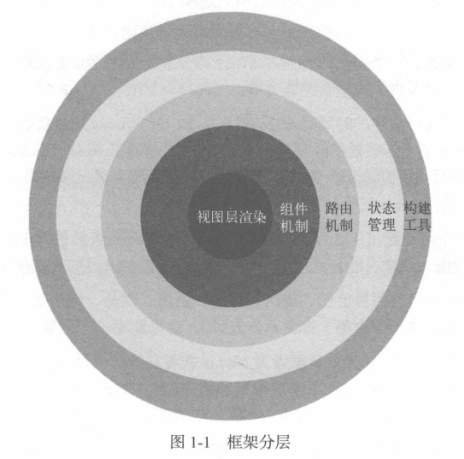

# 序一

近几年，JavaScript的流行库和框架带有**元编程**（metaprogramming）的特征。所谓元编程，简单来说，是指框架的作者使用一种编程语言固有的语言特性，创造出相对新的语言特性，使得最终使用者能够以新的语法和语义来构建他们的应用程序，从而在某些领域开发中获得更好的开发体验。

早期的jQuery库之所以获得开发者们的认可，很大程度上是因为它独创的链式语法和隐式迭代语义。尽管jQuery仅仅通过巧妙设计API就能支持上述特性，并不依赖于编程语言赋予的元编程能力，但是毫无疑问，它以一种精巧的设计理念和思路，为JavaScript库和框架的设计者打开了一扇创新的大门。

今天的Web产品对构建用户界面的要求越来越高，jQuery的方式不能满足构建复杂用户界面的需要，新的U1框架快速发展，其中一个最流行的框架就是Vue.js。与jQuery相比，Vue.js更强大，也具有更加明显的元编程特征。动态绑定属性和变化侦测、内置模板和依赖于模板语法的声明式渲染、可扩展的指令、支持嵌套的组件，这些原生JavaScript并不具备的特征和能力被一融入，框架的使用者在使用Vue.js开发web应用时，事实上获得了超越Javascript原生语言特性的能力。

尽管Vue.js框架赋予开发者众多特性和能力，但它仍然是使用原生JavaScript实现的应用框架。JavaScript自身提供了许多元编程特性，比如从ES5就开始支持的属性访问器（property accessor），ES6支持的代理（proxy），还有标准提案已经处于Stage 3阶段的装饰器（decorator）。基于这些语言特性，我们能够比较方便地扩展新的语言特性，将这些特性融入应用框架，从而使得应用开发者能够更加得心应手地使用框架开发出优雅、简洁的应用程序模块。

如何设计API和如何使用元编程思想将新特性融入到框架中，是现代JavaScript框架设计的两个核心，Vue.js更侧重于后者。理解元编程思想有助于深刻理解Vue.js的本质。而理解元编程思想本身最好的方法又是通过深入研究Vue.js的源码，因为元编程思想一旦涉及具体实现，不仅仅是使用Javascirpt提供的特性来扩展能力那么简单，这其中有许多细节需要考虑，比如要做到向下兼容，那么就要对一些特性的实现方式做出取舍，一些语言能力可以通过书写向下兼容代码来弥补，而另一些则需要通过编译机制来做到，还有一些则必须舍弃；同样，基于性能考虑，一些特性也可能需要做出一定的修改或妥协。这些问题不仅在框架设计和实现的过程中会遇到，而且在具体实现应用程序的过程中也会遇到。因此，通过学习Vue.js，我们不仅能够掌握设计应用程序框架的一般性技巧，还可以在实现应用程序时运用其中的具体设计思想和方法论。

本书的作者刘博文是我的同事，也是奇舞团的一员，后来由于业务变动，博文所在的团队从奇舞团独立了出去，但是同为360的前端团队，我们也始终保持着项目合作和技术交流。很早就听到博文要写这样一本书，当时我很高兴，我一直鼓励大家写书，因为这种创作既能使自己成长，又能使读者获益。我自己也写过技术类的书，深知技术创作的不易，要把Vue.js这样的流行框架讲透也着实需要下一番苦功。有时候，作为朋友，我会和博文开玩笑，说他的书再不出版，Vue.js3.0版本就要发布了，但这仅仅是玩笑，我不愿意博文因为要赶出版时间而草草了事，那样就无法真正做到“深入浅出”，毕竟这不是一本Vue.js的使用手册，而是真正能够透过Vue.js的设计思路去学习元编程思想，并将这种思想运用于程序开发中的书。只有这样，读者才能真正从这本书中获益。我想，在这一点上，博文没有让我失望，我也希望这本书没有让你们失望。

# 序二

“奇舞团”办公地点在“南瓜屋"7层，导航前端在“南瓜屋”8层。2017年某一天，我去8层的时候路过导航前端工位，梁超看到我，高兴地说："李老师，博文正在写书呢。”我脱口而出：“谁是博文，给哪个出版社写？”由此我便认识了博文，也知道了他是王军花（本书策划编辑）发掘的作者。当时听到这个消息我也很兴奋，知道是在给图灵写书，而我又在图灵待过几年，熟悉图灵的“套路”，就忍不住当场给博文分享了一些选题和写作思路。听着我滔滔不绝地讲“写书经"，博文频频点头，好像很受启发的样子。

2018年年初，360 W3C工作组成立，博文加入了Web性能工作组。于是几乎每周的例会上，我都会问问博文新书写作和出版的进度。时值年末，这本书终于要出版了。而这时候，我因为支持智能音箱项目临时搬到了11层，开发、联调非常繁忙。11月16日下午，博文突然在微信上问我能不能帮他写个序。我说：“你能不能先给我看看书稿？”然后博文把我加到了他GitHub的私有仓库。

两周来，我利用空暇时间大致浏览了一遍书稿。无奈时间紧迫，大部分章节来不及细读。一是因为公司项目开发进度必须保证，二是自己还有一个字体服务的项目在并行迭代。虽然大部分内容未曾细读，但仅就仔细读过的几章而言，着实让我受益匪浅。我想，等到手头的项目开发告一段落之后，一定要抽时间重新研读两遍。没错，这本书至少要读两遍以上。

浏览书稿的时候，我也在回忆第一次跟博文分享“写书经”的情景。当时我说，要想让技术书畅销，一是读者定位必须是新手，因为新手人数众多；二是要注重实用，书中的例子最好能立即照搬到项目上。然而，这本书的读者定位显然不是新手，而且书中的源码分析似乎也不能直接套用到项目上。其实这也是没办法的事，因为博文写这本书的初衷就是把自己研究Vue.js源码的心得分享出来。就Vue.js源码分析而言，这本书确确实实是非常棒的。反正我是爱不释手。这本书取名“深入浅出”是名副其实的。因为它确实有相当的深度，而且语言真的浅显易懂。最重要的是，与其他源代码分析类的技术书连篇累牍地堆砌、照搬项目源代码的做法截然不同，这本书里很少看到超过一页的代码片段。所有代码片段明显都被作者精心筛选、编排过，而且层层递进，加上了“新增”“修改”之类的注释。再辅以明白浅显的文字和配图，原本隐晦、抽象、艰深的代码逻辑，瞬间变得明白易懂，让人不时有“原来如此”之叹，继而“拍手称快”！

毋庸置疑，Vue.js是一个优秀的前端框架。一个优秀的前端框架如果没有一本优秀的解读著作，确实是一大缺憾。应该说，本书正是一本优秀的Vue.js源码解读专著。全书从一个新额的“人口点”-“变化侦测”切人，逐步过渡到“虚拟DOM"和“模板编译”，最后展开分析Vue.js的整体架构。如果想读懂这本书，读者不仅要有一些Vue.js的实际使用经验，而且还要有一些编译原理（比如AST）相关的知识储备，这样才能更轻松地理解模板解析、优化与代码生成的原理。本书最后几章对Vue.js的实例方法和全局API，以及生命周期、指令和过滤器的解读，虽然借鉴了Vue.js官方文档，但作者更注重实现原理的分析，弥补了文档的不足。

虽然本书不是写给新手看的，但鉴于Vejs在国内的用户基数巨大，我对它的销量还是很乐观的。这些年来，前端行业一直在飞速发展。行业的进步，导致对从业人员的要求也不断攀升。放眼未来，虽然仅仅会用某些框架还可以找到工作，但仅仅满足于会用一定无法走得更远。随着越来越多“聪明又勤奋”的人加入前端行列，能否洞悉前沿框架的设计和实现将会成为高级人才与普通人才的“分水岭。

“欲穷千里目，更上一层楼。”我衷心希望博文这本用心之作，能够帮助千千万万的Vue.js用户从“知其然”跃进到“知其所以然”的境界。最后想说一句，有心购买本书的读者大可不必纠结于Vue.js的版本问题。因为优秀源代码背后的思想是永恒的、普适的，跟版本没有任何关系。

早一天读到，早一天受益，仅此而已。

# 前言

时至今日，Vue.js就像曾经的jQuery，已经成为前端工程师必备的技能。不可否认，它可以极大地提高我们的开发效率，并且很容易学习。

这就造成了一个很普遍的现象，大部分前端工程师对框架以及第三方周边插件的关注程度越来越高，甚至把自己全部的关注点都放在了框架上。

在我看来，这多少有点亚健康，不是很利于前端工程师的技术成长。因为我发现大家关注框架时，更多的是关注其用法（包括框架自身、第三方插件和UI组件库等）、奇淫技巧和最佳实践等。

而我希望大家拿出一部分精力去关注框架所解决的问题以及它是如何解决这些问题的。这有助于我们提升自己的技术和解决问题的能力。

大家在使用Vue.js开发项目时，不免总会遇到一些奇奇怪怪的问题，而我们是否能很快解决这些问题以及理解这些问题为什么会发生，主要取决于对Vue.js原理的理解是否足够深入。

## 本书目的

**所有技术解决方案的终极目标都是在解决问题，都是先有问题，然后有解决方案**。解决方案可能并不完美，也可能有很多种。

Vue.jst也是如此，它解决了什么问题？如何解决的？解决问题的同时都做了哪些权衡和取舍？

本书将带领大家透过现象看到Vue.js的本质，通过本书，我们将学会：

* Vue.js的响应式原理，理解为什么修改数据视图会自动更新；
* DOM（Virtual DOM）的概念和原理；
* 模板编译原理，理解Vue.js的模板是如何生效的；
* Vue.js整体架构设计与项目结构；
* 深入理解Vue.js的生命周期，不同的生命周期钩子之间有什么区别，不同的生命周期之间Vue.js内部到底发生了什么；
* Vue.js提供的各种API的内部实现原理；
* 指令的实现原理；

* 过滤器的实现原理；
* 使用Vue.js开发项目的最佳实践。

## 组织结构

本书共分四篇，全方位讲解了Vue.js的内部原理。

* 第一篇：共3章，详细讲解了Vue.js内部核心技术“变化侦测”，并一步一步带领大家从0到1实现一个简单的“变化侦测"系统。
* 第二篇：共3章，详细介绍了虚拟DOM技术，其中包括虚拟DOM的原理及其patching算法。
* 第三篇：共4章，详细介绍了模板编译技术，其中包括模板解析器的实现原理、优化器的原理以及代码生成器的原理。
* 第四篇：这是本书占比最大的一部分，详细介绍了Vue.js的整体架构以及提供给我们使用的各种API的内部原理。同时还对Vue.js的生命周期、错误处理、指令系统与模板过滤器等功能的原理进行了介绍。在本书最后一章，我们为大家提供了一些使用Vue.js开发项目的最佳实践，这些内容中一大部分是Vue.js官网提供的，还有一小部分是我自己总结的。

**在撰写本书时，Vue.js的最新版本是2.5.2**，所以本书中的代码参考该版本进行撰写。如果你想对照源码来阅读本书，可以在GitHub上找出该版本的源码。此外，关于本书的任何意见和建议，都可以在这里讨论：https://github.com/berwin/Blgissues/34，关于本书的微信群，也请参见这个页面。

## 致谢

这本书的诞生我要感谢很多人。我曾幻想过如果有一天自己能出版一本技术书，那该有多好，但从来没有想到这一天来得这么快，**我更想象不到这一天会在我23岁时发生(牛皮，作者才23岁啊)**。在我看来，这件事不可能发生在我的身上，但它确确实实发生了。

这一切都要感谢王军花老师，是她给了我这个机会。最初她找到我，问我有没有兴趣写一本深入介绍Vue.js的书时，我的内心很挣扎。因为这可以实现我的一个梦想，但我又担心自己写不好，觉得自己不够资格出版一本书。最终经过激烈的思想斗争后，我决定接受这个挑战，做一些让自己佩服自己的事。

不止是感谢军花老师给我这个机会，我还非常感谢她前前后后跟进这本书，包括书的进度以及与我一起审校和修改这本书等很多事情，非常感谢！

其次我要感谢我的领导LC（梁超）和肆爷（何烁），当他们听说我要写一本书时，给了我很大的帮助和支持。本书没有拖稿，我按时写完了所有章节，这一切都是源于他们对我的大力支持。如果没有他们，我想我也没有办法按时交稿，非常感谢同时我也非常感谢李松峰老师，在开始写这本书时，李老师给我讲了很多写作方面的技巧，并且教我怎样写一本好书，怎么写出阅读体验良好的书。并且在这本书写完之后，李老师还答应给这本书写序，真的非常感谢！

我更要感谢我的父母，感谢你们对我多年的养育之恩，辛辛苦苦把我养大。如今，我虽有了一份稳定的工作，但回家的次数却越来越少。我很愧疚不能在你们身边工作，不能经常陪在你们身边。现在，我出版了一本书，不知道你们会不会为我感到骄傲。

我还要感谢堂姐王砚天，在写作期间给了我很多精神鼓励与支持，并且给我买了很多好吃的。除此之外，我要感谢第一批内测读者（刘冰晶、姚向阳、周延博、王建兵、陈凤），感谢你们的阅读以及给我提供的宝贵修改意见，非常感谢！

最后，我要感谢正在阅读这部分的你，感谢你阅读本书，感谢你对我的支持，谢谢！

# 第1章：Vue.js简介

在过去的10年时间里，网页变得更加动态化和强大了。通过JavaScript，我们已经可以把很多传统的服务端代码放到浏览器中。身为一名前端工程师，我们所面临的需求变得越来越复杂。

当应用程序开始变复杂后，我们需要频繁操作DOM，由于缺乏正规的组织形式，我们的代码变得非常难以维护。

这本质上是命令式操作DOM的问题，我们曾经用jQuery操作DOM写需求，但是当应用程序变复杂后，代码就像一坨意大利面一样，有点难以维护。我们无法继续使用命令式操作DOM，所以Vue.js提供了声明式操作DOM的能力来解决这个问题。

通过描述状态和DOM之间的映射关系，就可以将状态渲染成DOM呈现在用户界面中，也就是渲染到网页上。

## 什么是Vue.js

Vue.js，通常简称为Vue，是一款友好的、多用途且高性能的JavaScript框架，能够帮助我们创建可维护性和可测试性更强的代码。它是目前所有主流框架中学习曲线最平缓的框架，非常容易上手，其官方文档也写得非常清晰、易懂。

它是一款渐进式的JavaScript框架。关于什么是渐进式，其实一开始我琢磨了好久，后来才弄懂，就是说如果你已经有一个现成的服务端应用，也就是非单页应用，可以将Vue.js作为该应用的一部分嵌人其中，带来更加丰富的交互体验。

如果希望将更多业务逻辑放到前端来实现，那么Vue.js的核心库及其生态系统也可以满足你的各种需求。和其他前端框架一样，Vejs允许你将一个网页分割成可复用的组件，每个组件都有自己的HTML，CSS和JavaScript来渲染网页中一个对应的位置。

如果要构建一个大型应用，就需要先搭建项目，配置一些开发环境等。Vue.js提供了一个命令行工具，它让快速初始化一个真实的项目工程变得非常简单。

我们甚至可以使用Vue.js的单文件组件，它包含各自的HTML、JavaScript以及带作用域的CSS或scss，我本人在使用Vue.js开发项目时，通常都会使用单文件组件。单文件组件真的是一个非常棒的特性，它可以使项目架构变得非常清晰、可维护。

## Vue.js简史

2013年7月28日，有一位名叫尤雨溪，英文名叫Evan You的人在GitHub上第一次为Vue.js提交代码。这是Vue.js的第一个提交（commit），但这时还不叫Vue.js。从仓库的package.json文件可以看出，这时的名字叫作Element，后来被更名为Seed.js。

2013年12月7日，尤雨溪在GitHub上发布了新版本0.6.0，将项目正式改名为Vue.js，并且把默认的指令前缀变成v-。这一版本的发布，代表Vue.js正式问世。

2014年2月1日，尤雨溪将Vue.js 0.8发布在了国外的Hacker News网站，这代表它首次公开发布。听尤雨溪说，当时被顶到了Hacker News的首页，在一周的时间内拿到了615个GitHub的star，他特别兴奋。

从这之后，经过近两年的孵化，直到2015年10月26日这天，Vue.js终于迎来了1.0.0版本的发布。我不知道当时尤雨溪的心情是什么样的，但从他发布版本时所带的格言可以看出，他心里一定很复杂。

那句话是：`"The fate of destruction is also the joy of rebirth."`

翻译成中文是：`毁灭的命运，也是重生的喜悦。`

并且为1.0.0这个版本配备了一个代号，叫新世纪福音战士（Evangelion），这是一部动画片的名字。事实上，Vue.js每一次比较大的版本发布，都会配一个动画片的名称作为代号。

2016年10月1日，这一天是祖国的生日，但同时也是Vue.js 2.0发布的日子。Vue.js 2.0的代号叫攻壳机动队（Ghost in the Shell）。

同时，这一次尤雨溪发布这个版本时所带的格言是：`"Your effort to remain what you are is what limits you.`

翻译成中文是：`保持本色的努力，也在限制你的发展。`

在开发Vue.js的整个过程中，它的定位发生了变化，一开始的定位是：`"Just a view layer library"`

就是说，最早的Vue.js只做视图层，没有路由，没有状态管理，也没有官方的构建工具，只有一个库，放在网页里就直接用。
后来，他发现Vue.js无法用在一些大型应用上，这样在开发不同大小的应用时，需要不停地切换框架以及思维模式。尤雨溪希望有一个方案，有足够的灵活性，能够适应不同大小的应用需求。

所以，Vue.js就慢慢开始加入了一些官方的辅助工具，比如路由（Router）、状态管理方案（Vuex）和构建工具（vue-cli）等。

加入这些工具时，Vue.js始终维持着一个理念："这个框架应该是渐进式的。

这时Vue.js的定位是：`The Progressive Framework`

翻译成中文，就是渐进式框架。

所谓渐进式框架，就是把框架分层。

最核心的部分是视图层渲染，然后往外是组件机制，在这个基础上再加入路由机制，再加人状态管理，最外层是构建工具，如图1-1所示。

所谓分层，就是说你既可以只用最核心的视图层渲染功能来快速开发一些需求，也可以使用一整套全家桶来开发大型应用。Vue.js有足够的灵活性来适应不同的需求，所以你可以根据自己的需求选择不同的层级。

Vue.js 2.0与Vue.js 1.0之间内部变化非常大，整个渲染层都重写了，但API层面的变化却很小。可以看出，Vue.js是非常注重用户体验和学习曲线的，它尽量让开发者用起来很爽，同时在应用场景上，其他框架能做到的Vue.js都能做到，不存在其他框架可以实现而Vue.js不能实现这样的问题，所以在技术选型上，只需要考虑Vue.js的使用方式是不是符合口味，团队来了新同学能否快速融入等问题。由于无论是学习曲线还是API的设计上，Vue.js都非常优雅，所以它具有很强的竞争力。

Vue.jis 2.0引入了非常多的特性，其中一个明显的效果是Vue.js变得更轻、更快了。

Vue.js 2.0引入了虚拟DOM，其渲染过程变得更快了。虚拟DOM现在已经被网上说烂了，但是我想说的是，不要人云亦云。Vue.js引入虚拟DOM是有原因的。事实上，并不是引人虚拟DOM后，渲染速度变快了。**准确地说，应该是80%的场景下变得更快了，而剩下的20%反而变慢了。**

**任何技术的引入都是在解决一些问题，而通常解决一个问题的同时会引发另外一个问题，这种情况更多的是做权衡，做取舍。**所以，不要像网上大部分人那样，成天说因为引入了虚拟DOM而变快了。我们要透过现象看本质，本书的目的也在于此。

关于为什么引入虚拟DOM，以及为什么引入虚拟DOM后渲染速度变快了，第5章会详细介绍。

除了引入虚拟DOM外，Vue.js 2.0还提供了很多令人激动的特性，比如支持JSX和TypeScript，支持流式服务端渲染，提供了跨平台的能力等。

到目前，我写下这行文字的时间是2018年6月29日，Vue.js的最新版本是2.5.16，就在前几天，它在GtHub上的star数量已经超过了10万，同时超越了React在GitHub上的star数量。在GitHub上所有项目（所有语言）中排进了前五，目前是第4名，挤进前三指日可待。可能你在读这行文字的时候，Vue.js已经挤进前三了。

目前，Vue.js每个月有超过115万次NPM下载，Chrome开发者插件有17.4万周活跃用户（这是2017年5月的数据，现在可能会更多），这表示每天都有17.4万的人在使用它开发应用。

Vue.js在国内的用户有阿里巴巴、腾讯、百度、新浪、网易、饿了么、滴滴出行、360、美团、苏宁、58、哔哩哔哩和掘金等（排名不分先后），这里就不一列举了。

在社区上，有300多位GitHub贡献者为Vue.js或者它的子项目提交过代码。社区项目也非常活跃，社区上有很多基于Vue.js的更高层框架和组件，比如Nuxt，Quasar Framework，Element.iView.Muse-UI，Vux，Vuetify，Vue Material等，这些项目在GitHub上都是几千个star的项目。

说了这么多，我想说的是，Vue.js已是一名前端工程师必备的技能。而想深入了解Vue.js内部的核心技术原理，就来阅读本书吧。

# 第一篇：变化侦测

> Vue.js最独特的特性之一是看起来并不显眼的响应式系统。数据模型仅仅是普通的JavaScript对象。而当你修改它们时，视图会进行更新。这使得状态管理非常简单、直接。不过理解其工作原理同样重要，这样你可以回避一些常见的问题。——官方文档

从状态生成DOM，再输出到用户界面显示的一整套流程叫作渲染，应用在运待时会不断地进行重新渲染。而响应式系统赋予框架重新渲染的能力，其重要组成部分是变化侦测。变化侦测是响应式系统的核心，没有它，就没有重新渲染。框架在运行时，视图也就无法随着状态的变化而变化。

简单来说，变化侦测的作用是侦测数据的变化。当数据变化时，会通知视图进行相应的更新。正如文档中所说，深入理解变化侦测的工作原理，既可以帮助我们在开发应用时回避一些很常见的问题，也可以在应用程序出问题时，快速调试并修复问题。

本篇中，我们将针对变化侦测的实现原理做一个详细介绍，并且会带着你一步一步从0到1实现一个变化侦测的逻辑。学完本篇，你将可以自己实现一个变化侦测的功能。

# 第2章：Object的变化侦测

大部分人不会想到object和Array的变化侦测采用不同的处理方式。事实上，它们的侦测方式确实不一样。在这一章中，我们将详细介绍object的变化侦测。

## 什么是变化侦测

Vue.js会自动通过状态生成DOM，并将其输出到页面上显示出来，这个过程叫**渲染**。Vue.js的渲染过程是声明式的，我们通过模板来描述状态与DOM之间的映射关系。

通常，在运行时应用内部的状态会不断发生变化，此时需要不停地重新渲染。这时如何确定状态中发生了什么变化？

变化侦测就是用来解决这个问题的，它分为两种类型：一种是“推"（push），另一种是"拉"（pull）。

Angular和React中的变化侦测都属于“拉”，这就是说当状态发生变化时，它不知道哪个状态变了，只知道状态有可能变了，然后会发送一个信号告诉框架，框架内部收到信号后，会进行一个暴力比对来找出哪些DOM节点需要重新渲染。这在Angular中是脏检查的流程，在React中使用的是虚拟DOM。

而Vue.js的变化侦测属于“推”。当状态发生变化时，Vue.js立刻就知道了，而且在一定程度上知道哪些状态变了。因此，它知道的信息更多，也就可以进行更细粒度的更新。

所谓更细粒度的更新，就是说：假如有一个状态绑定着好多个依赖，每个依赖表示一个具体的DOM节点，那么当这个状态发生变化时，向这个状态的所有依赖发送通知，让它们进行DOM更新操作。相比较而言，“拉”的粒度是最粗的。

但是它也有一定的代价，因为**粒度越细，每个状态所绑定的依赖就越多，依赖追踪在内存上的开销就会越大**。因此，从Vue.js 2.0开始，它引入了虚拟DOM，将粒度调整为中等粒度，即一个状态所绑定的依赖不再是具体的DOM节点，而是一个组件。这样状态变化后，会通知到组件，组件内部再使用虚拟DOM进行比对。这可以大大降低依赖数量，从而降低依赖追踪所消耗的内存。

Vue.js之所以能随意调整粒度，本质上还要归功于变化侦测。因为“推”类型的变化侦测可以随意调整粒度。

## 如何追踪变化

关于变化侦测，首先要问一个问题，在JavaScript（简称JS）中，**如何侦测一个对象的变化**？

其实这个问题还是比较简单的。学过JavaScript的人都知道，有两种方法可以侦测到变化：使用`Object.defineProperty`和ES6的`Proxy`。

由于ES6在浏览器中的支持度并不理想，到目前为止Vuejs还是使用`Object.defineProperty`来实现的，所以书中也会使用它来介绍变化侦测的原理。

由于使用`Object.defineProperty`来侦测变化会有很多缺陷，所以Vue.js的作者尤雨溪说日后会使用Proxy重写这部分代码。好在本章讲的是原理和思想，所以即便以后用Proxy重写了这部分代码，书中介绍的原理也不会变。

