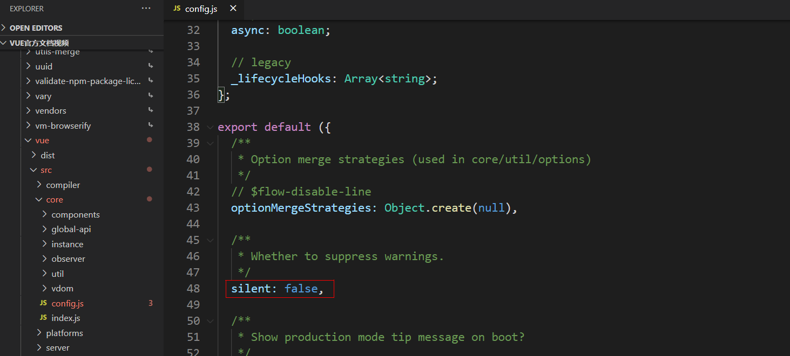
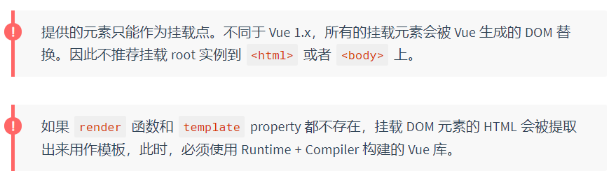
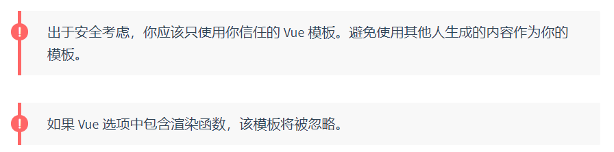
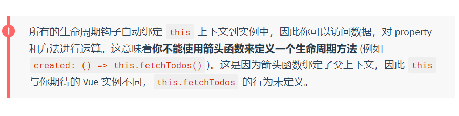
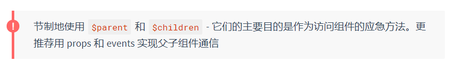
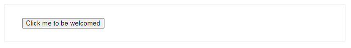
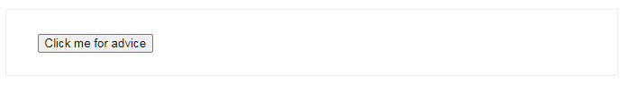
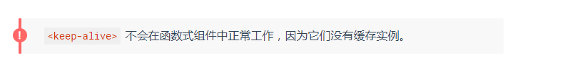

(注1：说来惭愧，接触Vue差不多一年的时间了(虽然中间很长一段时间并没有学习Vue)，但是它的[官网(中文版)](https://cn.vuejs.org/)我一直没有仔细的从头到尾的去看过，更别说英文版的官网了。我到今天才终于发现官方文档不光有教程，还有API、风格指南、示例、Cookbook以及一些视频教程。我这看官方文档也看得太不仔细了吧。)

(注2：所以这篇博文专门用来单独记载Vue2.x官网列出的所有API的，其他的风格指南等就不写博文了，到时候看一下就好了。)

(注3：学习这些API我自己也会补充一部分放到文章中去的。)

(注4：[Vue中的API](https://cn.vuejs.org/v2/api/))


# 全局配置

`Vue.config` 是一个对象，包含 Vue 的全局配置。可以在启动应用之前修改下列 property：

## silent

* **类型**：`boolean`

* **默认值**：`false`

* **用法**：

  ```javascript
  Vue.config.silent = true
  ```

  取消 Vue 所有的日志与警告。

* 文件位置

  Vue项目的`node_modules`——>`vue`——>`src`——>`core`——>`config.js`里面可以找到

  

# 全局API

## Vue.extend

**Vue.extend( options )**

* **参数**：

  * `{Object} options`

* **用法**：

  使用基础 Vue 构造器，创建一个“子类”。参数是一个包含组件选项的对象。

  `data` 选项是特例，需要注意 - 在 `Vue.extend()` 中它必须是函数

  ```javascript
  <div id="mount-point"></div>
  ```

  ~~~javascript
  // 创建构造器
  var Profile = Vue.extend({
    template: '<p>{{firstName}} {{lastName}} aka {{alias}}</p>',
    data: function () {
      return {
        firstName: 'Walter',
        lastName: 'White',
        alias: 'Heisenberg'
      }
    }
  })
  // 创建 Profile 实例，并挂载到一个元素上。
  new Profile().$mount('#mount-point')
  ~~~

  * 结果如下：

    ```css
    <p>Walter White aka Heisenberg</p>
    ```

  * **参考**：[组件](https://cn.vuejs.org/v2/guide/components.html)

> `$mount`这个API自己以前都没用过。

[vue $mount 和 el的区别](https://blog.csdn.net/c2311156c/article/details/80415633)

[VUE生命周期中的$mount挂载过程](https://www.jianshu.com/p/c9d9897eada5)

## Vue.nextTick

**Vue.nextTick( [callback, context] )**

* **参数**：

  * `{Function} [callback]`
  * `{Object} [context]`

* **用法**：

  在下次 DOM 更新循环结束之后执行延迟回调。在修改数据之后立即使用这个方法，获取更新后的 DOM。

~~~javascript
// 修改数据
vm.msg = 'Hello'
// DOM 还没有更新
Vue.nextTick(function () {
  // DOM 更新了
})

// 作为一个 Promise 使用 (2.1.0 起新增，详见接下来的提示)
Vue.nextTick()
  .then(function () {
    // DOM 更新了
  })
~~~

> 2.1.0 起新增：如果没有提供回调且在支持 Promise 的环境中，则返回一个 Promise。请注意 Vue 不自带 Promise 的 polyfill，所以如果你的目标浏览器不原生支持 Promise (IE：你们都看我干嘛)，你得自己提供 polyfill。

**参考**：[异步更新队列](https://cn.vuejs.org/v2/guide/reactivity.html#%E5%BC%82%E6%AD%A5%E6%9B%B4%E6%96%B0%E9%98%9F%E5%88%97)

## Vue.component

**Vue.component( id, [definition] )**

- **参数**：

  - `{string} id`
  - `{Function | Object} [definition]`

- **用法**：

  注册或获取全局组件。注册还会自动使用给定的 `id` 设置组件的名称

  ```javascript
  // 注册组件，传入一个扩展过的构造器
  Vue.component('my-component', Vue.extend({ /* ... */ }))
  
  // 注册组件，传入一个选项对象 (自动调用 Vue.extend)
  Vue.component('my-component', { /* ... */ })
  
  // 获取注册的组件 (始终返回构造器)
  var MyComponent = Vue.component('my-component')
  ```

- **参考**：[组件](https://cn.vuejs.org/v2/guide/components.html)

# 选项/数据

## data

- **类型**：`Object | Function`

- **限制**：组件的定义只接受 `function`。

- **详细**：

  Vue 实例的数据对象。Vue 将会递归将 data 的 property 转换为 getter/setter，从而让 data 的 property 能够响应数据变化。**对象必须是纯粹的对象 (含有零个或多个的 key/value 对)**：浏览器 API 创建的原生对象，原型上的 property 会被忽略。大概来说，data 应该只能是数据 - 不推荐观察拥有状态行为的对象。

  一旦观察过，你就无法在根数据对象上添加响应式 property。因此推荐在创建实例之前，就声明所有的根级响应式 property。

  实例创建之后，可以通过 `vm.$data` 访问原始数据对象。Vue 实例也代理了 data 对象上所有的 property，因此访问 `vm.a` 等价于访问 `vm.$data.a`。

  以 `_` 或 `$` 开头的 property **不会**被 Vue 实例代理，因为它们可能和 Vue 内置的 property、API 方法冲突。你可以使用例如 `vm.$data._property` 的方式访问这些 property。

  当一个**组件**被定义，`data` 必须声明为返回一个初始数据对象的函数，因为组件可能被用来创建多个实例。如果 `data` 仍然是一个纯粹的对象，则所有的实例将**共享引用**同一个数据对象！通过提供 `data` 函数，每次创建一个新实例后，我们能够调用 `data` 函数，从而返回初始数据的一个全新副本数据对象。

  如果需要，可以通过将 `vm.$data` 传入 `JSON.parse(JSON.stringify(...))` 得到深拷贝的原始数据对象。

* **示例**：

  ~~~javascript
  var data = { a: 1 }
  
  // 直接创建一个实例
  var vm = new Vue({
    data: data
  })
  vm.a // => 1
  vm.$data === data // => true
  
  // Vue.extend() 中 data 必须是函数
  var Component = Vue.extend({
    data: function () {
      return { a: 1 }
    }
  })
  ~~~

  注意，如果你为 `data` property 使用了箭头函数，则 `this` 不会指向这个组件的实例，不过你仍然可以将其实例作为函数的第一个参数来访问。

  ```javascript
  data: vm => ({ a: vm.myProp })
  ```

* **参考**：[深入响应式原理](https://cn.vuejs.org/v2/guide/reactivity.html)

## props

> 我知道`props`很重要，也很基础，但是我一直都对这个十分不熟悉啊！！

- **类型**：`Array | Object`

- **详细**：

  props 可以是数组或对象，用于接收来自父组件的数据。props 可以是简单的数组，或者使用对象作为替代，对象允许配置高级选项，如类型检测、自定义验证和设置默认值。

  你可以基于对象的语法使用以下选项：

  - `type`：可以是下列原生构造函数中的一种：`String`、`Number`、`Boolean`、`Array`、`Object`、`Date`、`Function`、`Symbol`、任何自定义构造函数、或上述内容组成的数组。会检查一个 prop 是否是给定的类型，否则抛出警告。Prop 类型的[更多信息在此](https://cn.vuejs.org/v2/guide/components-props.html#Prop-类型)。
  - `default`：`any`
    为该 prop 指定一个默认值。如果该 prop 没有被传入，则换做用这个值。对象或数组的默认值必须从一个工厂函数返回。
  - `required`：`Boolean`
    定义该 prop 是否是必填项。在非生产环境中，如果这个值为 truthy 且该 prop 没有被传入的，则一个控制台警告将会被抛出。
  - `validator`：`Function`
    自定义验证函数会将该 prop 的值作为唯一的参数代入。在非生产环境下，如果该函数返回一个 falsy 的值 (也就是验证失败)，一个控制台警告将会被抛出。你可以在[这里](https://cn.vuejs.org/v2/guide/components-props.html#Prop-验证)查阅更多 prop 验证的相关信息。

* **示例**

  ~~~javascript
  // 简单语法
  Vue.component('props-demo-simple', {
    props: ['size', 'myMessage']
  })
  
  // 对象语法，提供验证
  Vue.component('props-demo-advanced', {
    props: {
      // 检测类型
      height: Number,
      // 检测类型 + 其他验证
      age: {
        type: Number,
        default: 0,
        required: true,
        validator: function (value) {
          return value >= 0
        }
      }
    }
  })
  ~~~

* **参考**：[Props](https://cn.vuejs.org/v2/guide/components-props.html)

# 选项/DOM

## el

* **类型**：`string | Element`

* **限制**：只在用 `new` 创建实例时生效。

* **详细**：

  提供一个在页面上已存在的 DOM 元素作为 Vue 实例的挂载目标。可以是 CSS 选择器，也可以是一个 HTMLElement 实例。

  在实例挂载之后，元素可以用 `vm.$el` 访问。

  如果在实例化时存在这个选项，实例将立即进入编译过程，否则，需要显式调用 `vm.$mount()` 手动开启编译。



**参考**：

* [生命周期图示](https://cn.vuejs.org/v2/guide/instance.html#%E7%94%9F%E5%91%BD%E5%91%A8%E6%9C%9F%E5%9B%BE%E7%A4%BA)
* [运行时 + 编译器 vs. 只包含运行时](https://cn.vuejs.org/v2/guide/installation.html#%E8%BF%90%E8%A1%8C%E6%97%B6-%E7%BC%96%E8%AF%91%E5%99%A8-vs-%E5%8F%AA%E5%8C%85%E5%90%AB%E8%BF%90%E8%A1%8C%E6%97%B6)

## template

* **类型**：`string`

* **详细**：

  一个字符串模板作为 Vue 实例的标识使用。模板将会**替换**挂载的元素。挂载元素的内容都将被忽略，除非模板的内容有分发插槽。

  如果值以 `#` 开始，则它将被用作选择符，并使用匹配元素的 innerHTML 作为模板。常用的技巧是用 `<script type="x-template">` 包含模板。



**参考**：

* [生命周期图示](https://cn.vuejs.org/v2/guide/instance.html#%E7%94%9F%E5%91%BD%E5%91%A8%E6%9C%9F%E5%9B%BE%E7%A4%BA)
* [通过插槽分发内容](https://cn.vuejs.org/v2/guide/components.html#%E9%80%9A%E8%BF%87%E6%8F%92%E6%A7%BD%E5%88%86%E5%8F%91%E5%86%85%E5%AE%B9)

# 选项/生命周期钩子



## beforeCreate

* **类型**：`Function`

* **详细**：

  在实例初始化之后，数据观测 (data observer) 和 event/watcher 事件配置之前被调用。

* **参考**：[生命周期图示](https://cn.vuejs.org/v2/guide/instance.html#%E7%94%9F%E5%91%BD%E5%91%A8%E6%9C%9F%E5%9B%BE%E7%A4%BA)

## created

* **类型**：`Function`

* **详细**：

  在实例创建完成后被立即调用。在这一步，实例已完成以下的配置：数据观测 (data observer)，property 和方法的运算，watch/event 事件回调。然而，挂载阶段还没开始，`$el` property 目前尚不可用。

* **参考**：[生命周期图示](https://cn.vuejs.org/v2/guide/instance.html#%E7%94%9F%E5%91%BD%E5%91%A8%E6%9C%9F%E5%9B%BE%E7%A4%BA)

## activated

* **类型**：`Function`

* **详细**：

  被 keep-alive 缓存的组件激活时调用。

  **该钩子在服务器端渲染期间不被调用。**

* **参考**：

  * [构建组件 - keep-alive](https://cn.vuejs.org/v2/api/#keep-alive)
  * [动态组件 - keep-alive](https://cn.vuejs.org/v2/guide/components-dynamic-async.html#%E5%9C%A8%E5%8A%A8%E6%80%81%E7%BB%84%E4%BB%B6%E4%B8%8A%E4%BD%BF%E7%94%A8-keep-alive)

## deactivated

* **类型**：`Function`

* **详细**：

  被 keep-alive 缓存的组件停用时调用。

  **该钩子在服务器端渲染期间不被调用。**

* **参考**：

  * [构建组件 - keep-alive](https://cn.vuejs.org/v2/api/#keep-alive)
  * [动态组件 - keep-alive](https://cn.vuejs.org/v2/guide/components-dynamic-async.html#%E5%9C%A8%E5%8A%A8%E6%80%81%E7%BB%84%E4%BB%B6%E4%B8%8A%E4%BD%BF%E7%94%A8-keep-alive)

# 选项/资源

# 选项/组合

## parent

* **类型**：`Vue instance`

* **详细**：

  指定已创建的实例之父实例，在两者之间建立父子关系。子实例可以用 `this.$parent` 访问父实例，子实例被推入父实例的 `$children` 数组中。



## mixins

* **类型**：`Array<Object>`

* **详细**：

  `mixins` 选项接收一个混入对象的数组。这些混入对象可以像正常的实例对象一样包含实例选项，这些选项将会被合并到最终的选项中，使用的是和 `Vue.extend()` 一样的选项合并逻辑。也就是说，如果你的混入包含一个 created 钩子，而创建组件本身也有一个，那么两个函数都会被调用。

  Mixin 钩子按照传入顺序依次调用，并在调用组件自身的钩子之前被调用。

* 示例

  ~~~javascript
  var mixin = {
    created: function () { console.log(1) }
  }
  var vm = new Vue({
    created: function () { console.log(2) },
    mixins: [mixin]
  })
  // => 1
  // => 2
  ~~~

* **参考**：[混入](https://cn.vuejs.org/v2/guide/mixins.html)

# 选项/其它

# 实例property

## vm.$data

- **类型**：`Object`

- **详细**：

  Vue 实例观察的数据对象。Vue 实例代理了对其 data 对象 property 的访问。

- **参考**：[选项 / 数据 - data](https://cn.vuejs.org/v2/api/#data)

# 实例property

# 实例方法/数据

# 实例方法 / 事件

## vm.$emit

**vm.$emit( eventName, […args] )**

**参数**：

- `{string} eventName`
- `[...args]`

触发当前实例上的事件。附加参数都会传给监听器回调。

**示例：**

只配合一个事件名使用 `$emit`：

~~~javascript
Vue.component('welcome-button', {
  template: `
    <button v-on:click="$emit('welcome')">
      Click me to be welcomed
    </button>
  `
})
~~~

~~~javascript
<div id="emit-example-simple">
  <welcome-button v-on:welcome="sayHi"></welcome-button>
</div>
~~~

~~~javascript
new Vue({
  el: '#emit-example-simple',
  methods: {
    sayHi: function () {
      alert('Hi!')
    }
  }
})
~~~



配合额外的参数使用 `$emit`：

~~~javascript
Vue.component('magic-eight-ball', {
  data: function () {
    return {
      possibleAdvice: ['Yes', 'No', 'Maybe']
    }
  },
  methods: {
    giveAdvice: function () {
      var randomAdviceIndex = Math.floor(Math.random() * this.possibleAdvice.length)
      this.$emit('give-advice', this.possibleAdvice[randomAdviceIndex])
    }
  },
  template: `
    <button v-on:click="giveAdvice">
      Click me for advice
    </button>
  `
})
~~~

~~~javascript
<div id="emit-example-argument">
  <magic-eight-ball v-on:give-advice="showAdvice"></magic-eight-ball>
</div>
~~~

~~~javascript
new Vue({
  el: '#emit-example-argument',
  methods: {
    showAdvice: function (advice) {
      alert(advice)
    }
  }
})
~~~



> 点击按钮随机显示'Yes', 'No', 'Maybe'。

# 实例方法 /生命周期

## vm.$mount

**vm.$mount( [elementOrSelector] )**

- **参数**：

  - `{Element | string} [elementOrSelector]`
  - `{boolean} [hydrating]`

- **返回值**：`vm` - 实例自身

- **用法**：

  如果 Vue 实例在实例化时没有收到 el 选项，则它处于“未挂载”状态，没有关联的 DOM 元素。可以使用 `vm.$mount()` 手动地挂载一个未挂载的实例。

  如果没有提供 `elementOrSelector` 参数，模板将被渲染为文档之外的的元素，并且你必须使用原生 DOM API 把它插入文档中。

  这个方法返回实例自身，因而可以链式调用其它实例方法。

* **示例**：

```javascript
var MyComponent = Vue.extend({
  template: '<div>Hello!</div>'
})

// 创建并挂载到 #app (会替换 #app)
new MyComponent().$mount('#app')

// 同上
new MyComponent({ el: '#app' })

// 或者，在文档之外渲染并且随后挂载
var component = new MyComponent().$mount()
document.getElementById('app').appendChild(component.$el)
```

**参考**：

- [生命周期图示](https://cn.vuejs.org/v2/guide/instance.html#生命周期图示)
- [服务端渲染](https://cn.vuejs.org/v2/guide/ssr.html)

# 指令

## v-model

- **预期**：随表单控件类型不同而不同。

- **限制**：

  - `<input>`
  - `<select>`
  - `<textarea>`
  - components

- **修饰符**：

  - [`.lazy`](https://cn.vuejs.org/v2/guide/forms.html#lazy) - 取代 `input` 监听 `change` 事件
  - [`.number`](https://cn.vuejs.org/v2/guide/forms.html#number) - 输入字符串转为有效的数字
  - [`.trim`](https://cn.vuejs.org/v2/guide/forms.html#trim) - 输入首尾空格过滤

- **用法**：

  在表单控件或者组件上创建双向绑定。细节请看下面的教程链接。

- **参考**：

  - [表单控件绑定](https://cn.vuejs.org/v2/guide/forms.html)
  - [组件 - 在输入组件上使用自定义事件](https://cn.vuejs.org/v2/guide/components-custom-events.html#将原生事件绑定到组件)

# 特殊 attribute

## key

**预期**：`number | string | boolean (2.4.2 新增) | symbol (2.5.12 新增)`

`key` 的特殊 attribute 主要用在 Vue 的虚拟 DOM 算法，在新旧 nodes 对比时辨识 VNodes。如果不使用 key，Vue 会使用一种最大限度减少动态元素并且尽可能的尝试就地修改/复用相同类型元素的算法。而使用 key 时，它会基于 key 的变化重新排列元素顺序，并且会移除 key 不存在的元素。

有相同父元素的子元素必须有**独特的 key**。重复的 key 会造成渲染错误。

最常见的用例是结合 `v-for`：

```javascript
<ul>
  <li v-for="item in items" :key="item.id">...</li>
</ul>
```

它也可以用于强制替换元素/组件而不是重复使用它。当你遇到如下场景时它可能会很有用：

- 完整地触发组件的生命周期钩子
- 触发过渡

例如：

```javascript
<transition>
  <span :key="text">{{ text }}</span>
</transition>
```

当 `text` 发生改变时，`` 总是会被替换而不是被修改，因此会触发过渡。

## ref

> 可以把ref看成是id，它总是和`$refs`成对使用。

- **预期**：`string`

  `ref` 被用来给元素或子组件注册引用信息。引用信息将会注册在父组件的 `$refs` 对象上。如果在普通的 DOM 元素上使用，引用指向的就是 DOM 元素；如果用在子组件上，引用就指向组件实例：

  ```javascript
  <!-- `vm.$refs.p` will be the DOM node -->
  <p ref="p">hello</p>
  
  <!-- `vm.$refs.child` will be the child component instance -->
  <child-component ref="child"></child-component>
  ```

  当 `v-for` 用于元素或组件的时候，引用信息将是包含 DOM 节点或组件实例的数组。

  关于 ref 注册时间的重要说明：因为 ref 本身是作为渲染结果被创建的，在初始渲染的时候你不能访问它们 - 它们还不存在！`$refs` 也不是响应式的，因此你不应该试图用它在模板中做数据绑定。

- **参考**：[子组件 ref](https://cn.vuejs.org/v2/guide/components-edge-cases.html#访问子组件实例或子元素)

# 内置的组件

## keep-alive

- **Props**：

  - `include` - 字符串或正则表达式。只有名称匹配的组件会被缓存。
  - `exclude` - 字符串或正则表达式。任何名称匹配的组件都不会被缓存。
  - `max` - 数字。最多可以缓存多少组件实例。

- **用法**：

  `` 包裹动态组件时，会缓存不活动的组件实例，而不是销毁它们。和 `` 相似，`` 是一个抽象组件：它自身不会渲染一个 DOM 元素，也不会出现在组件的父组件链中。

  当组件在 `` 内被切换，它的 `activated` 和 `deactivated` 这两个生命周期钩子函数将会被对应执行。

  > 在 2.2.0 及其更高版本中，`activated` 和 `deactivated` 将会在 `<keep-alive>` 树内的所有嵌套组件中触发。

  主要用于保留组件状态或避免重新渲染。

  ~~~javascript
  <!-- 基本 -->
  <keep-alive>
    <component :is="view"></component>
  </keep-alive>
  
  <!-- 多个条件判断的子组件 -->
  <keep-alive>
    <comp-a v-if="a > 1"></comp-a>
    <comp-b v-else></comp-b>
  </keep-alive>
  
  <!-- 和 `<transition>` 一起使用 -->
  <transition>
    <keep-alive>
      <component :is="view"></component>
    </keep-alive>
  </transition>
  ~~~

  注意，`` 是用在其一个直属的子组件被开关的情形。如果你在其中有 `v-for` 则不会工作。如果有上述的多个条件性的子元素，`` 要求同时只有一个子元素被渲染。

- **`include` and `exclude`**

  > 2.1.0 新增

  `include` 和 `exclude` prop 允许组件有条件地缓存。二者都可以用逗号分隔字符串、正则表达式或一个数组来表示：

  ```javascript
  <!-- 逗号分隔字符串 -->
  <keep-alive include="a,b">
    <component :is="view"></component>
  </keep-alive>
  
  <!-- 正则表达式 (使用 `v-bind`) -->
  <keep-alive :include="/a|b/">
    <component :is="view"></component>
  </keep-alive>
  
  <!-- 数组 (使用 `v-bind`) -->
  <keep-alive :include="['a', 'b']">
    <component :is="view"></component>
  </keep-alive>
  ```

  匹配首先检查组件自身的 `name` 选项，如果 `name` 选项不可用，则匹配它的局部注册名称 (父组件 `components` 选项的键值)。匿名组件不能被匹配。

* max

  > 2.5.0 新增

  最多可以缓存多少组件实例。一旦这个数字达到了，在新实例被创建之前，已缓存组件中最久没有被访问的实例会被销毁掉。

  ```javascript
  <keep-alive :max="10">
    <component :is="view"></component>
  </keep-alive>
  ```

  .

* **参考**：[动态组件 - keep-alive](https://cn.vuejs.org/v2/guide/components-dynamic-async.html#在动态组件上使用-keep-alive)