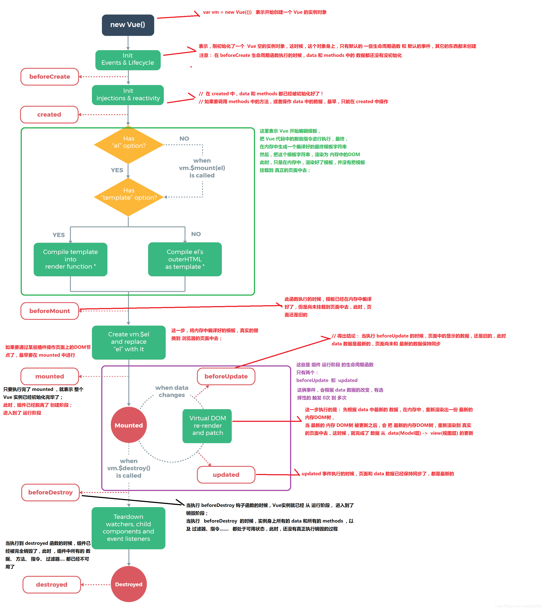
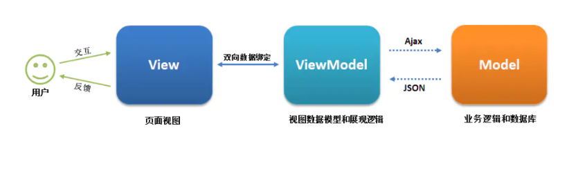
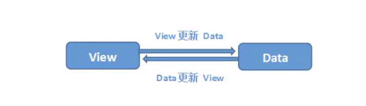
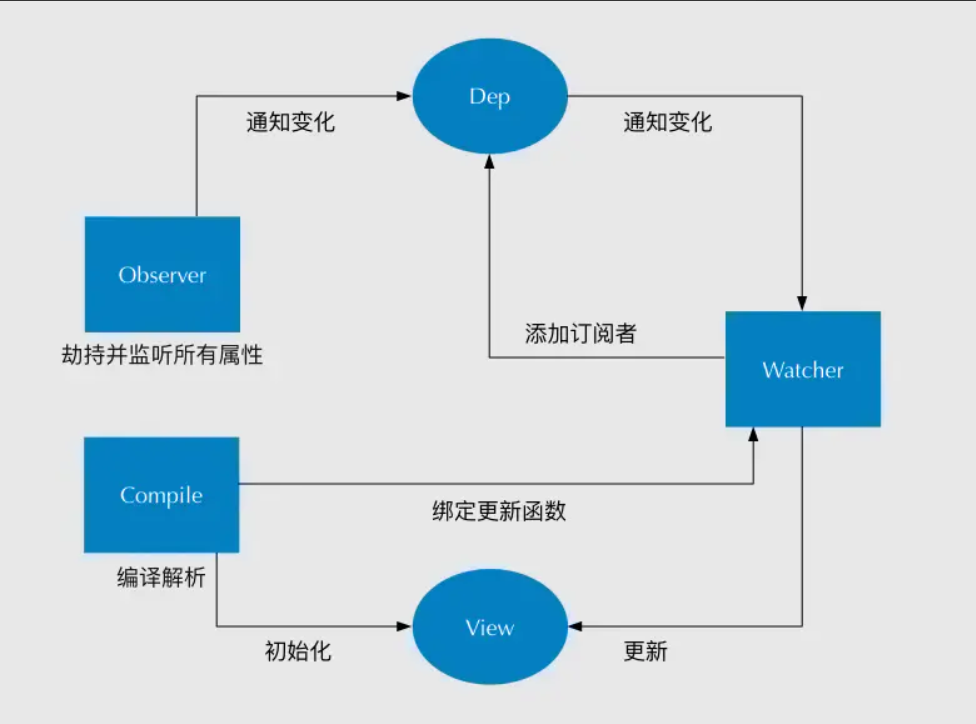

(注1：现在是2020年9月4日，今天我开始重新学习Vue,同时新建这篇博文，汇总罗列面试中有关Vue大概会问哪些知识，现在每天至少收集一道面试题吧，自己的目标大概是300道。)

(注2：[面试题地址1](https://github.com/haizlin/fe-interview/blob/master/lib/Vue.md))

(注3：[面试题地址2](https://juejin.im/post/6844903918753808398))（其中11-40这30题是从这里面抄的）

# Vue面试题

## 1.从0到1自己构架一个Vue项目，说说有哪些步骤、哪些重要插件、目录结构你会怎么组织

### 项目类型

前端的项目目前来看主要分为**小程序**开发，**H5页面**开发、**PC官网**、**后台管理系统**开发、**Native**开发。不同的项目所涉及的知识点和环境不太一样，但是很多方面是相通的。

- **小程序**

由于框架限定在Vue，所以这里指的是使用**mpVue**、**WePY**来开发小程序项目。

- **H5页面**

这里主要是指微信页面、Webview中的H5页面开发

- **PC官网**

为什么单独划出来是因为官方的开发主要是用来展示企业信息、产品，对交互、体验有一定的要求，会有一些炫酷的动画效果。还有就是官网有可能需要采用SSR（比如Vue的**Nuxt.js**）来做，来确定良好的SEO。

- **后台管理系统**

后台管理系统主要功能在于数据的配置、权限的控制、数据报表的展示、日志功能等。通常又叫**CMS**，**OA**。

- **Native开发**

这个通常就是指用前端技术去开PC应用、APP应用，比如**Weex**, **Electron**。

- **通吃型**

比如**uni-app**， 可以一套代码编译成不同的平台源码。

不同的项目类型决定了其能够使用的生态、目录结构、特定的上下文。这里就以**后台管理系统**为例来说一下如何基于Vue来搭建一个项目。

### 基于@Vue/cli的选型

后台管理系统中`Vue-router`，`Vuex`都是必选的，其它可以自行考虑。

- **ES6/7 or Typescript ?**
  鉴于目前Typescript如此流行，很多流行的框架和库都采用其来写，IDE友好的智能提示、强类型结束等，在立项时是否考虑采用Typescript来写Vue项目。如果采用Typescript，是不是很羡慕Angular中的DI注入，那可以考虑在大型项目中引入**inversify**这个库；在开发过程中遇到一些库没有声明文件要学会定义声明文件，这个是Typescript初学者最头疼的问题。

  还有一个问题是团队中有多少人会Typescript，项目周期紧不紧，有没有时间来试错，踩坑。

- **Sass/Less/Stylus/PostCss ?**
  由于Vue项目开发本身样式自带`scope`，所以不需要像React那样去选**css-in-js**框架（目前在React最流行的是`styled-components`），但是如果我们在Vue中采用**JSX**的方式来定义组件，是否考虑引入`Vue-styled-components`这个库（年久失修，完全脱节React版了，但依然是Vue中最好的选择）。在Vue中sass, less, stylus可以在``标签中通过`lang=""`来指定，如果你想使用`PostCss`也可以的，就是要自己花点时间去折腾一下。

- **关于代码规范和风格**

  这个主要的选择就是**Prettier** 和 **Airbnb**风格，如果配置不好，在IDE中满屏的红色波浪线和黄色的小灯光提示。

  在配置**eslint**或者**tslint**时主要考虑的点是是否要写分号，未定义变量等问题。

- **关于测试**

  很多时间前端项目测试反而拖慢了项目的开发进度，但是在开源项目中良好的测试是保证项目质量的一个很重要方式。这里通常分为**单元测试(Unit Testing)\**和\**端到端测试(E2E Testing)**，更多信息我也没有什么经验，自行百度、Google。

通过 @Vue/cli 生成项目后，接下来就是添加一些配置文件。

### 通用配置

一个前端项目在开发过程中少不了各种框架、IDE的配置文件。前端项目的配置文件通常格式有`xx.json`、`.xxrc`、`xx.config.js`、`xxconfig`等方式。

- **编辑器配置**：`.editorconfig`

这里最重要的是缩进方式，及Tab大小，建议2个空格作用缩进。

~~~css
# https://editorconfig.org
root = true

[*]
charset = utf-8
indent_style = space
indent_size = 2
end_of_line = lf
insert_final_newline = true
trim_trailing_whitespace = true

[*.md]
insert_final_newline = false
trim_trailing_whitespace = false
~~~

- **Git忽略文件配置**: `.gitignore`

这里的配置决定了哪些文件会被版本控制所忽略

~~~css
# See https://help.github.com/articles/ignoring-files/ for more about ignoring files.

# dependencies
/node_modules
/.pnp
.pnp.js

# testing
/coverage

# production
/build

# misc
.DS_Store
.env.local
.env.development.local
.env.test.local
.env.production.local

npm-debug.log*
yarn-debug.log*
yarn-error.log*

# editor
/.idea
~~~

- **Eslint配置**: `.eslintrc.js`，`.eslintignore`等

说实话eslint要是配置不好，代码在IDE中提示真的很恶心，但是配置项又太多，还有很多专有的扩展，这里给出我的一个配置（也是到处copy过来的）

~~~javascript
module.exports = {
  root: true,
  env: {
    node: true
  },
  extends: ["plugin:Vue/strongly-recommended"],
  rules: {
    "no-console": process.env.NODE_ENV === "production" ? "error" : "off",
    "no-debugger": process.env.NODE_ENV === "production" ? "error" : "off",
    // 不加分号
    "semi": [0],
    // 不能有未定义的变量
    "no-undef": 1,
    // 不能有声明后未被使用的变量或参数
    "no-unused-vars":[2, {
      "vars": "local",
      "args": "none"
    }],
    // 禁止修改const声明的变量
    "no-const-assign": 2,
    // 函数参数不能重复
    "no-dupe-args": 2,
    // 如果if语句里面有return,后面不能跟else语句
    "no-else-return": 2,
    // 块语句中的内容不能为空
    "no-empty": 2,
    // 禁止对null使用==或!=运算符
    "no-eq-null": 2,
    // 禁止扩展native对象
    "no-extend-native": 2,
    // 禁止不必要的函数绑定
    "no-extra-bind": 2,
    // 禁止非必要的括号
    "no-extra-parens": 2,
    // 禁止多余的冒号
    "no-extra-semi":2,
    // 禁止省略浮点数中的0 .5 3.
    "no-floating-decimal": 2,
    // 禁止行内备注
    "no-inline-comments": 0,
    // 不能有不规则的空格
    "no-irregular-whitespace": 2,
    // 不能用多余的空格
    "no-multi-spaces": 1,
    // 禁止重复声明变量
    "no-redeclare": 2,
    // 禁止使用javascript:void(0)
    "no-script-url": 0,
    // 禁止稀疏数组， [0,,2]
    "no-sparse-arrays": 2,
    // 禁止使用三目运算符
    "no-ternary": 0,
    // 一行结束后面不要有空格
    "no-trailing-spaces": 1,
    // 标识符不能以_开头或结尾
    "no-underscore-dangle": 1,
    // 是否允许非空数组里面有多余的空格
    "array-bracket-spacing": [2, "never"],
    // 箭头函数用小括号括起来
    "arrow-parens": 0,
    // =>的前/后括号
    "arrow-spacing": 0,
    // 块语句中使用var
    "block-scoped-var": 0,
    // 逗号风格，换行时在行首还是行尾
    "comma-style": [2, "last"],
    // 避免不必要的方括号
    "dot-notation": [0, { "allowKeywords": true }],
    // 必须使用全等
    "eqeqeq": 2,
    // 对象字面量中冒号的前后空格
    "key-spacing": [0, {
      "beforeColon": false,
      "afterColon": true
    }],
    // 变量声明后是否需要空一行
    "newline-after-var": 0,
    // 引号类型 `` "" ''
    "quotes": [1, "single"],
    // 变量声明时排序
    "sort-vars": 0,
    // 禁止比较时使用NaN，只能用isNaN()
    "use-isnan": 2,
    //jsx中使用单引号
    "jsx-quotes": ["error", "prefer-single"],
    // 单个组件无内容自结尾
    "Vue/html-self-closing": ["error", {
      "html": {
        "void": "always",
        "normal": "always",
        "component": "always"
      },
      "svg": "always",
      "math": "always"
    }],
    // 设置html缩进
    "Vue/html-indent": ["error", 2, {
      "attribute": 2,
      "baseIndent": 1,
      "closeBracket": 0,
      "alignAttributesVertically": false,
      "ignores": []
    }],
    // 属性顺序
    "Vue/attributes-order": 1,
    // 注释前面需要添加空格
    "spaced-comment": ["error", "always", { "exceptions": ["-", "+"] }],
    // html属性赋值等号左右不能有空格
    "Vue/no-spaces-around-equal-signs-in-attribute": ["error"],
    // 强制prop以驼峰命名
    "Vue/prop-name-casing": ["error", "camelCase"],
    // 移除多余不使用的空格
    "Vue/no-multi-spaces": ["error", {
      "ignoreProperties": false
    }],
    // html结尾 >
    "Vue/html-closing-bracket-newline": ["error", {
      "singleline": "never",
      "multiline": "never"
    }],
    // 属性每行数量
    "Vue/max-attributes-per-line": ["error", {
      // 一行最多3个属性
     "singleline": 3,
      "multiline": {
        "max": 1,
        "allowFirstLine": true
      }
    }],
    // 单行html元素内容是否换行
    "Vue/singleline-html-element-content-newline": ["error", {
      "ignoreWhenNoAttributes": true,
      "ignoreWhenEmpty": true,
      "ignores": [
        "pre",
        "textarea",
        "span",
        "i",
        "label",
        "el-button",
        "el-radio",
        "el-checkbox",
        "el-link",
        "el-tab-pane",
        "el-dropdown-item",
        "el-step",
        "el-table-column",
        "el-option"
      ]
    }]
  },
  parserOptions: {
    parser: "babel-eslint"
  }
};
~~~

- **PostCss配置**: `postcss.config.js`

这个文件自动生成，里面的内容就是指定`autoprefixer`兼容配置

- **Babel配置**: `babel.config.js`

主要是配置Babel的`plugins`、`presets`和`parse`等

- **StyleLint**：`.stylelintrc`

如果代码对样式有一定的规范的话，可以加一个，没有就不需要配置这个。

~~~javascript
{
  "extends": "stylelint-config-standard",
  "plugins": ["stylelint-scss"]
}
~~~

- **@Vue/cli配置**：`Vue.config.js`

在这个里面我们可以对@Vue/cli的Webpack进行配置和覆盖。

~~~css
module.exports = {
  devServer: {
    proxy: {
      '/kpi': {
        target: process.env.Vue_APP_KPI_API,
        changeOrigin: true
      }
    }
  }
}
~~~

- **Webpack配置**：`webpack.config.js`

因为在webpack中不能识别@Vue/cli中的`@`路径，所以需要一个配置文件让webapck提示正常。具体怎么配置可以自行搜索。

~~~css
'use strict'
const path = require('path')

function resolve (dir) {
  return path.join(__dirname, '.', dir)
}

module.exports = {
  context: path.resolve(__dirname, './'),
  resolve: {
    extensions: ['.js', '.Vue', '.json'],
    alias: {
      '@': resolve('src'),
      '_c': resolve('src/components')
    }
  }
}
~~~

- **Visual Studio Code配置**：`.vscode`目录

这里主要是配置基于vscode的代码调试以及eslint配置。

### 版本控制

不管是多人协作开发还个一个人开发在使用git时都需要一套流程规范来执行。

- **Git Flow**

这个每个团队的做法不太一样，有的采用**多分支开发**，有的采用**单一master分支开发**，有的还采用**submodule**的方式，有的在项目中使用了**lerna**来做多packages，甚至有的公司一个分支一个项目。

在开发环境的区分上通常分为**生产（线上）环境**、**预发布环境**、**开发环境**，有的还有什么**沙盒环境**，很多做得好的公司基于Docker前后端都可以根据每一个commit来发布。

有时候不想把有些代码提交上去，除了选择性提交单个文件外，还有使用git的`stash`功能，此外如果使用Webstorm可还可以使用其提供的**Changelist**来缓存修改，切换分支。

- **Git Commit**

项目提交的描述如果没有一定的规范，随性而为的话，就会让其它人误解。通常提交采用英文作为描述，可以多行文字。在社区中有很多流行的方案(比如[Conventional Commit](https://www.conventionalcommits.org/en/v1.0.0/))，更多的是采用Angular的方式。

- **Change Log**

如果采用了社区统一的commit方式，那么我们就可以基于提交来生成变更记录，在每一次版本发布时自动关联Jira中的Issue。

- **版本号生成**

这个通常是按照[Semantic Versioning](https://semver.org/)的规范来打tag，具休怎么做可以自行尝试

在项目中通常使用`gitHooks`和`husky`这二个node包来配置上面提到的这些。在git钩子中我们在每次提交、push前跑一次单元测试、代码覆盖率。前端代码覆盖率一般来说没有必要加，不然很痛苦。

下面是`package.json`文件中相关的配置示例（试验性代码）

~~~css
{
  "name": "your-project-name",
  "version": "0.1.0",
  "scripts": {
    "clean": "rm -rf node_modules",
    "serve": "Vue-cli-service serve",
    "build": "Vue-cli-service build",
    "lint": "Vue-cli-service lint --no-fix",
    "stylelint": "stylelint src/**/*.{scss,css,less,css,Vue,jsx} --fix",
    "eslint": "eslint --ext .js,.jsx,.Vue src --fix",
    "changelog": "conventional-changelog -p angular -i CHANGELOG.md -s -r 0"
  },
  "repository": {
    "type": "git",
    "url": "http://gitlab.transsion.com/mi/mi-bigdata-admin.git"
  },
  "dependencies": {},
  "devDependencies": {
    "@commitlint/cli": "^8.1.0",
    "@commitlint/config-conventional": "^8.1.0",
    "babel-eslint": "^10.0.1",
    "conventional-changelog-cli": "^2.0.23",
    "eslint": "^6.2.1",
    "eslint-plugin-Vue": "^5.2.3",
    "husky": "^3.0.4",
    "lint-staged": "^9.2.3",
    "stylelint": "^10.1.0",
    "stylelint-config-standard": "^18.3.0",
    "stylelint-scss": "^3.9.4",
  },
  "gitHooks": {
    "pre-commit": "lint-staged"
  },
  "lint-staged": {
    "*.{js,Vue}": [
      "Vue-cli-service lint",
      "eslint --fix --ext .js,.Vue src",
      "git add"
    ],
    "*.{css,scss,less,Vue}": [
      "stylelint --fix",
      "git add"
    ]
  },
  "husky": {
    "hooks": {
      "commit-msg": "commitlint -E HUSKY_GIT_PARAMS"
    }
  }
}
~~~

### 项目文档和组件测试文档

除了在项目根目录放一个`README.MD`文件外，通常还需要一些比如`CHANGELOG.md`, `PLAD.md`等文档，还有一些组件的使用文档，可以考虑使用`styleguide`和`storybook`。

### 持续集成和部署

目前开源项目通常采用[Travis](https://travis-ci.com/)，而一般公司内部项目通常采用[Jenkins](http://jenkins-ci.org/)来做持续集成，在部署上通常采用Docker，集群上使用[KubeOperator](https://www.fit2cloud.com/kubeoperator/)来管理。

### API请求方式

通常采用Restfull的方式来请求数据，也可以采用[GraphQL](https://graphql.cn/)的方式来请求。如果采用Restfull的方式通常可以使用`axios`, `fetch api`。GraphQL可以使用Apollo Client。

### 代理和数据Mock

SPA页面开发通常都是配置代码来调用后端的接口数据，怎么配置可以参考@Vue/cli文档。数据Mock主要用到一个`mockjs`，至于怎么起服务自行搜索。

### 项目用到的库

下面这些库可以在所有项目中使用

- **UI框架**: [Element](https://element.eleme.cn/#/zh-CN), [iView](https://www.iviewui.com/), [Vue-strap](http://yuche.github.io/Vue-strap/)等

> 注：UI风格目前有Bookstrap、Antd和Google Materials三种风格，在项目搭建时这也是一个很重要的技术选型。

- **日期**: [moment](https://github.com/moment/moment), [dayjs](https://github.com/iamkun/dayjs)
- **URL解析**: [query-string](https://github.com/sindresorhus/query-string), [path-to-reqexp](https://github.com/pillarjs/path-to-regexp)
- **实用方法**: [lodash](https://github.com/lodash/lodash)
- **Cookie**: [js-cookie](https://github.com/js-cookie/js-cookie)
- **混淆ID**: [hashids](https://github.com/vinkla/hashids)
- **图表**: [echarts](https://echarts.apache.org/zh/index.html)
- **Ajax**: [axios](https://github.com/axios/axios), [isomorphic-fetch](https://github.com/matthew-andrews/isomorphic-fetch), [Vue-apollo](https://github.com/Vuejs/Vue-apollo)
- **拖拽**: [Vue.Draggable](https://github.com/SortableJS/Vue.Draggable)
- **Meta修改**: [Vue-meta](https://github.com/nuxt/Vue-meta)

> 注：这些只是我能想到的

### 项目目录划分

- 视图页面放在 `pags`或者`views`中
- 静态文件放在`static`中
- 资源文件放在`assets`中
- 样式文件放在`styles`中
- 辅助库放在`utils`中
- 配置文件可以放在`config`或者`constants`中
- Vuex的文件放在`stores`中，至于getters, actions, mutation, modules可以参考Vuex的文档
- 路由文件放在`routes`中
- 所有组件放在`components`中
- 共享代码也可以使用`shared`作为目录
- 布局组件可以放在`layouts`目录中

### 权限配置

主要分为页面权限（路由）、功能权限，采用多级角色划分方式。菜单配置数据直接通过接口返回。

## 2.你知道Vue的模板语法用的是哪个web模板引擎的吗？说说你对这模板引擎的理解

[小胡子（模板系统）](https://en.wikipedia.org/wiki/Mustache_(template_system))

[janl](https://github.com/janl)/[mustache.js](https://github.com/janl/mustache.js)

[Javascript模板引擎mustache.js详解](https://www.cnblogs.com/lyzg/p/5133250.html)

[WOW！这就是mustache.js！一个有灵魂的模板引擎](https://www.yinzhuoei.com/index.php/archives/110/)

[模板引擎](https://baike.baidu.com/item/%E6%A8%A1%E6%9D%BF%E5%BC%95%E6%93%8E/907667?fr=aladdin)

[浅谈web中前端模板引擎的使用](https://segmentfault.com/a/1190000016845819)

[有哪些好用的前端模板引擎？](https://www.zhihu.com/question/32524504?sort=created)

印象中是`mustache`，模板引擎的初衷是解决早期的字符模板拼接的问题，也是因这些方面的慢慢的发展壮大。

严格的模板引擎的定义，输入模板字符串 + 数据，得到渲染过的字符串。

模板引擎：负责组装数据，以另外一种形式或外观展现数据。
优点：

* 可维护性（后期改起来方便）；

* 可扩展性（想要增加功能，增加需求方便）；

* 开发效率提高（程序逻辑组织更好，调试方便）；

* 看起来舒服（不容易写错）

## 3.你知道v-model的原理吗？说说看

v-model只不过是一个语法糖而已,真正的实现靠的还是

- v-bind:绑定响应式数据
- 触发 input 事件 并传递数据 (核心和重点)

> v-model本质上是语法糖，其实就是既用v-bind:value绑定了数据，又用v-on:input添加了一个事件监听

## 4.你有使用过Vue开发多语言项目吗？说说你的做法

[使用 vue-i18n 切换中英文](https://www.cnblogs.com/rogerwu/p/7744476.html)

**vue-i18n** 使用简单，案例也多，很方便。

## 5.在使用计算属性的时，函数名和data数据源中的数据可以同名吗

不能同名 因为不管是计算属性还是data还是props 都会被挂载在vm实例上，因此 这三个都不能同名。

> 其实是可以同名的, 不是先把data绑定到vm,初始化顺序是这样的,先computed,methods,data,props

莫名其妙的问题。**可以同名**，但data会覆盖methods。并且本就不该同名，同名说明你命名不规范。
然后解释为什么会覆盖，因为Props、methods、data、computed、watch都是在initState函数中被初始化的。初始化顺序就是我上面给出的顺序，本质上这些都是要挂载到this上面的，你如果重名的话，后面出现的属性自然而然会覆盖之前挂载的属性了。如果你的eslint配置比较严格的话，同名是编译不通过的。

## 6.vue中data的属性可以和methods中的方法同名吗？为什么

data中的属性和methods方法重名会优先执行data中的属性并且报错。

## 7.怎么给Vue定义全局的方法

回答1：

- 第一种：挂载到Vue的prototype上。把全局方法写到一个文件里面，然后for循环挂载到Vue的prototype上，缺点是调用这个方法的时候没有提示

```javascript
 Object.keys(tools).forEach(key => {
      Vue.prototype[key] = tools[key]
 })
```

- 第二种：利用全局混入mixin，因为mixin里面的methods会和创建的每个单文件组件合并。这样做的优点是调用这个方法的时候有提示

```javascript
Vue.mixin(mixin)
new Vue({
    store,
    router,
    render: h => h(App),
}).$mount('#app')
import tools from "./tools"
import filters from "./filters"
import Config from '../config'
import CONSTANT from './const_var'

export default {
    data() {
        return {
            CONFIG: Config,
            CONSTANT: CONSTANT
        }
    },
    methods: {
        // //将tools里面的方法挂载到vue上,以方便调用，直接this.$xxx方法名就可以了
        // Object.keys(tools).forEach(key => {
        //     Vue.prototype[key] = tools[key]
        // })
        //将tools里面的方法用对象展开符混入到mixin上,以方便调用，直接this.$xxx方法名就可以了
        ...tools
    },
    filters: {
        // //将filter里面的方法添加了vue的筛选器上
        // Object.keys(filters).forEach(key => {
        //     Vue.filter(key, filters[key])
        // })
        ...filters
    }
}
```

回答2：我知道一种方法，就是在任意vue文件中写全局函数

~~~javascript
// 创建全局方法
this.$root.$on('test', function(){
    console.log('test');
})

// 销毁全局方法
this.$root.$off('test');

// 调用全局方法
this.$root.$emit('test');
~~~

## 8. Vue2.0不再支持v-html中使用过滤器了怎么办

* 全局方法
* computed
* $options.filters

## 9.怎么解决vue打包后静态资源图片失效的问题

设置`assetsPublicPath`将` assetsPublicPath: '/' `改为 `assetsPublicPath: './'`

------

## 10.怎么解决vue动态设置img的src不生效的问题

`< img :src="require('../../../assets/images/xxx.png')" />`(浪费资源)

> 因为动态添加src被当做静态资源处理了，没有进行编译，所以要加上require。

不是应该` require('@/assets/images/xxx.png')` 这样吗？？你这样多浪费资源啊

## 11.说说你对 SPA 单页面的理解，它的优缺点分别是什么？

SPA（ single-page application ）仅在 Web 页面初始化时加载相应的 HTML、JavaScript 和 CSS。一旦页面加载完成，SPA 不会因为用户的操作而进行页面的重新加载或跳转；取而代之的是利用路由机制实现 HTML 内容的变换，UI 与用户的交互，避免页面的重新加载。

**优点：**

* 用户体验好、快，内容的改变不需要重新加载整个页面，避免了不必要的跳转和重复渲染；
* 基于上面一点，SPA 相对对服务器压力小；
* 前后端职责分离，架构清晰，前端进行交互逻辑，后端负责数据处理；

**缺点：**

* 初次加载耗时多：为实现单页 Web 应用功能及显示效果，需要在加载页面的时候将 JavaScript、CSS 统一加载，部分页面按需加载；
* 前进后退路由管理：由于单页应用在一个页面中显示所有的内容，所以不能使用浏览器的前进后退功能，所有的页面切换需要自己建立堆栈管理；
* SEO 难度较大：由于所有的内容都在一个页面中动态替换显示，所以在 SEO 上其有着天然的弱势。

## 12.v-show与 v-if 有什么区别？

**v-if** 是**真正**的条件渲染，因为它会确保在切换过程中条件块内的事件监听器和子组件适当地被销毁和重建；也是**惰性的**：如果在初始渲染时条件为假，则什么也不做——直到条件第一次变为真时，才会开始渲染条件块。

**v-show** 就简单得多——不管初始条件是什么，**元素总是会被渲染**，并且只是简单地基于 CSS 的 “display” 属性进行切换。

所以，v-if 适用于在运行时很少改变条件，**不需要频繁切换条件的场景**；v-show 则适用于需要非常频繁切换条件的场景。

## 13.Class 与 Style 如何动态绑定？

Class 可以通过对象语法和数组语法进行动态绑定：

- 对象语法：

```javascript
<div v-bind:class="{ active: isActive, 'text-danger': hasError }"></div>

data: {
  isActive: true,
  hasError: false
}
```

- 数组语法：

```javascript
<div v-bind:class="[isActive ? activeClass : '', errorClass]"></div>

data: {
  activeClass: 'active',
  errorClass: 'text-danger'
}
```

Style 也可以通过对象语法和数组语法进行动态绑定：

- 对象语法：

```javascript
<div v-bind:style="{ color: activeColor, fontSize: fontSize + 'px' }"></div>

data: {
  activeColor: 'red',
  fontSize: 30
}
```

- 数组语法：

```javascript
<div v-bind:style="[styleColor, styleSize]"></div>

data: {
  styleColor: {
     color: 'red'
   },
  styleSize:{
     fontSize:'23px'
  }
}
```

## 14.怎样理解 Vue 的单向数据流？

所有的 prop 都使得其父子 prop 之间形成了一个**单向下行绑定**：父级 prop 的更新会向下流动到子组件中，但是反过来则不行。这样会防止从子组件意外改变父级组件的状态，从而导致你的应用的数据流向难以理解。

额外的，每次父级组件发生更新时，子组件中所有的 prop 都将会刷新为最新的值。这意味着你不应该在一个子组件内部改变 prop。如果你这样做了，Vue 会在浏览器的控制台中发出警告。子组件想修改时，只能通过 $emit 派发一个自定义事件，父组件接收到后，由父组件修改。

有两种常见的试图改变一个 prop 的情形 :

- **这个 prop 用来传递一个初始值；这个子组件接下来希望将其作为一个本地的 prop 数据来使用。** 在这种情况下，最好定义一个本地的 data 属性并将这个 prop 用作其初始值：

```javascript
props: ['initialCounter'],
data: function () {
  return {
    counter: this.initialCounter
  }
}
```

- **这个 prop 以一种原始的值传入且需要进行转换。** 在这种情况下，最好使用这个 prop 的值来定义一个计算属性

```javascript
props: ['size'],
computed: {
  normalizedSize: function () {
    return this.size.trim().toLowerCase()
  }
}
```

## 15.computed 和 watch 的区别和运用的场景？

**computed：** 是计算属性，依赖其它属性值，并且 computed 的值有**缓存**，只有它依赖的属性值发生改变，下一次获取 computed 的值时才会重新计算 computed  的值；

**watch：** 更多的是「观察」的作用，类似于某些数据的监听回调 ，每当监听的数据变化时都会执行回调进行后续操作；

**运用场景：**

- 当我们需要进行数值计算，并且依赖于其它数据时，应该使用 computed，因为可以利用 computed 的缓存特性，避免每次获取值时，都要重新计算；
- 当我们需要在数据变化时执行异步或开销较大的操作时，应该使用 watch，使用 watch 选项允许我们执行异步操作 ( 访问一个 API )，限制我们执行该操作的频率，并在我们得到最终结果前，设置中间状态。这些都是计算属性无法做到的。

## 16.直接给一个数组项赋值，Vue 能检测到变化吗？

由于 JavaScript 的限制，Vue 不能检测到以下数组的变动：

- 当你利用索引直接设置一个数组项时，例如：`vm.items[indexOfItem] = newValue`
- 当你修改数组的长度时，例如：`vm.items.length = newLength`

为了解决第一个问题，Vue 提供了以下操作方法：

```javascript
// Vue.set
Vue.set(vm.items, indexOfItem, newValue)
// vm.$set，Vue.set的一个别名
vm.$set(vm.items, indexOfItem, newValue)
// Array.prototype.splice
vm.items.splice(indexOfItem, 1, newValue)
```

为了解决第二个问题，Vue 提供了以下操作方法：

```javascript
// Array.prototype.splice
vm.items.splice(newLength)
```

## 17.谈谈你对 Vue 生命周期的理解？

**（1）生命周期是什么？**

Vue 实例有一个完整的生命周期，也就是从开始创建、初始化数据、编译模版、挂载 DOM -> 渲染、更新 -> 渲染、卸载等一系列过程，我们称这是 Vue 的生命周期。

**（2）各个生命周期的作用**

| 生命周期      | 描述                                                         |
| ------------- | ------------------------------------------------------------ |
| beforeCreate  | 组件实例被创建之初，组件的属性生效之前                       |
| created       | 组件实例已经完全创建，属性也绑定，但真实DOM还没有生成，$el 还不可用 |
| beforeMount   | 在挂载开始之前被调用：相关的 render 函数首次被调用           |
| mounted       | el 被新创建的 vm.$el 替换，并挂载到实例上去之后调用该钩子    |
| beforeUpdate  | 组件数据更新之前调用，发生在虚拟 DOM 打补丁之前              |
| update        | 组件数据更新之后                                             |
| activited     | keep-alive 专属，组件被激活时调用                            |
| deactivated   | keep-alive 专属，组件被销毁时调用                            |
| beforeDestory | 组件销毁前调用                                               |
| destoryed     | 组件销毁后调用                                               |

**（3）生命周期示意图**



## 18.Vue 的父组件和子组件生命周期钩子函数执行顺序？

Vue 的父组件和子组件生命周期钩子函数执行顺序可以归类为以下 4 部分：

- 加载渲染过程

  父 beforeCreate -> 父 created -> 父 beforeMount -> 子 beforeCreate -> 子 created -> 子 beforeMount -> 子 mounted -> 父 mounted

- 子组件更新过程

  父 beforeUpdate -> 子 beforeUpdate -> 子 updated -> 父 updated

- 父组件更新过程

  父 beforeUpdate -> 父 updated

- 销毁过程

  父 beforeDestroy -> 子 beforeDestroy -> 子 destroyed -> 父 destroyed

## 19.在哪个生命周期内调用异步请求？

可以在钩子函数 created、beforeMount、mounted 中进行调用，因为在这三个钩子函数中，data 已经创建，可以将服务端端返回的数据进行赋值。但是本人推荐在 created 钩子函数中调用异步请求，因为在 created 钩子函数中调用异步请求有以下优点：

- 能更快获取到服务端数据，减少页面 loading 时间；
- ssr 不支持 beforeMount 、mounted 钩子函数，所以放在 created 中有助于一致性；

## 20.在什么阶段才能访问操作DOM？

在钩子函数 mounted 被调用前，Vue 已经将编译好的模板挂载到页面上，所以在 mounted 中可以访问操作 DOM。vue 具体的生命周期示意图可以参见如下，理解了整个生命周期各个阶段的操作，关于生命周期相关的面试题就难不倒你了。


## 21.父组件可以监听到子组件的生命周期吗？

比如有父组件 Parent 和子组件 Child，如果父组件监听到子组件挂载 mounted 就做一些逻辑处理，可以通过以下写法实现：

```javascript
// Parent.vue
<Child @mounted="doSomething"/>
    
// Child.vue
mounted() {
  this.$emit("mounted");
}
```

以上需要手动通过 $emit 触发父组件的事件，更简单的方式可以在父组件引用子组件时通过 @hook 来监听即可，如下所示：

```javascript
//  Parent.vue
<Child @hook:mounted="doSomething" ></Child>

doSomething() {
   console.log('父组件监听到 mounted 钩子函数 ...');
},
    
//  Child.vue
mounted(){
   console.log('子组件触发 mounted 钩子函数 ...');
},    
    
// 以上输出顺序为：
// 子组件触发 mounted 钩子函数 ...
// 父组件监听到 mounted 钩子函数 ...     
```

当然 @hook 方法不仅仅是可以监听 mounted，其它的生命周期事件，例如：created，updated 等都可以监听。

## 22.谈谈你对 keep-alive 的了解？

keep-alive 是 Vue 内置的一个组件，可以使被包含的组件保留状态，避免重新渲染 ，其有以下特性：

- 一般结合路由和动态组件一起使用，用于缓存组件；
- 提供 include 和 exclude 属性，两者都支持字符串或正则表达式， include 表示只有名称匹配的组件会被缓存，exclude 表示任何名称匹配的组件都不会被缓存 ，其中 exclude 的优先级比 include 高；
- 对应两个钩子函数 activated 和 deactivated ，当组件被激活时，触发钩子函数 activated，当组件被移除时，触发钩子函数 deactivated。

## 23.组件中 data 为什么是一个函数？

> 为什么组件中的 data 必须是一个函数，然后 return 一个对象，而 new Vue 实例里，data 可以直接是一个对象？

```javascript
// data
data() {
  return {
	message: "子组件",
	childName:this.name
  }
}

// new Vue
new Vue({
  el: '#app',
  router,
  template: '<App/>',
  components: {App}
})
```

因为组件是用来复用的，且 JS 里对象是引用关系，如果组件中 data 是一个对象，那么这样作用域没有隔离，子组件中的 data 属性值会相互影响，如果组件中 data 选项是一个函数，那么每个实例可以维护一份被返回对象的独立的拷贝，组件实例之间的 data 属性值不会互相影响；而 new Vue 的实例，是不会被复用的，因此不存在引用对象的问题。

> 这个我的另一篇博文《Vue框架入门》里面有更加详细的解释。
>
> 主要就是让生成的各个组件实例之间保持独立性，不然你这边改了一个组件，其他的组件也会随之变化，那整个页面就乱套了。

## 24.v-model 的原理？

我们在 vue 项目中主要使用 v-model 指令在表单 input、textarea、select 等元素上创建双向数据绑定，我们知道 v-model 本质上不过是语法糖，v-model 在内部为不同的输入元素使用不同的属性并抛出不同的事件：

- text 和 textarea 元素使用 value 属性和 input 事件；
- checkbox 和 radio 使用 checked 属性和 change 事件；
- select 字段将 value 作为 prop 并将 change 作为事件。

以 input  表单元素为例：

```javascript
<input v-model='something'>
    
相当于

<input v-bind:value="something" v-on:input="something = $event.target.value">
```

如果在自定义组件中，v-model 默认会利用名为 value 的 prop 和名为 input 的事件，如下所示：

```javascript
父组件：
<ModelChild v-model="message"></ModelChild>

子组件：
<div>{{value}}</div>

props:{
    value: String
},
methods: {
  test1(){
     this.$emit('input', '小红')
  },
},
```

## 25.Vue 组件间通信有哪几种方式？

Vue 组件间通信是面试常考的知识点之一，这题有点类似于开放题，你回答出越多方法当然越加分，表明你对 Vue 掌握的越熟练。Vue 组件间通信只要指以下 3 类通信：父子组件通信、隔代组件通信、兄弟组件通信，下面我们分别介绍每种通信方式且会说明此种方法可适用于哪类组件间通信。

**（1）`props / $emit`  适用 父子组件通信**

这种方法是 Vue 组件的基础，相信大部分同学耳闻能详，所以此处就不举例展开介绍。

**（2）`ref` 与 `$parent / $children` 适用 父子组件通信**

- `ref`：如果在普通的 DOM 元素上使用，引用指向的就是 DOM 元素；如果用在子组件上，引用就指向组件实例
- `$parent` / `$children`：访问父 / 子实例

**（3）`EventBus （$emit / $on）`  适用于 父子、隔代、兄弟组件通信**

这种方法通过一个空的 Vue 实例作为中央事件总线（事件中心），用它来触发事件和监听事件，从而实现任何组件间的通信，包括父子、隔代、兄弟组件。

**（4）`$attrs`/`$listeners` 适用于 隔代组件通信**

- `$attrs`：包含了父作用域中不被 prop 所识别 (且获取) 的特性绑定 ( class 和 style 除外 )。当一个组件没有声明任何 prop 时，这里会包含所有父作用域的绑定 ( class 和 style 除外 )，并且可以通过 `v-bind="$attrs"` 传入内部组件。通常配合 inheritAttrs 选项一起使用。
- `$listeners`：包含了父作用域中的 (不含 .native 修饰器的)  v-on 事件监听器。它可以通过 `v-on="$listeners"` 传入内部组件

**（5）`provide / inject` 适用于 隔代组件通信**

祖先组件中通过 provider 来提供变量，然后在子孙组件中通过 inject 来注入变量。 provide / inject API 主要解决了跨级组件间的通信问题，不过它的使用场景，主要是子组件获取上级组件的状态，跨级组件间建立了一种主动提供与依赖注入的关系。

**（6）Vuex  适用于 父子、隔代、兄弟组件通信**

Vuex 是一个专为 Vue.js 应用程序开发的状态管理模式。每一个 Vuex 应用的核心就是 store（仓库）。“store” 基本上就是一个容器，它包含着你的应用中大部分的状态 ( state )。

- Vuex 的状态存储是响应式的。当 Vue 组件从 store 中读取状态的时候，若 store 中的状态发生变化，那么相应的组件也会相应地得到高效更新。
- 改变 store 中的状态的唯一途径就是显式地提交  (commit) mutation。这样使得我们可以方便地跟踪每一个状态的变化。

## 26.你使用过 Vuex 吗？

Vuex 是一个专为 Vue.js 应用程序开发的状态管理模式。每一个 Vuex 应用的核心就是 store（仓库）。“store” 基本上就是一个容器，它包含着你的应用中大部分的状态 ( state )。

（1）Vuex 的状态存储是响应式的。当 Vue 组件从 store 中读取状态的时候，若 store 中的状态发生变化，那么相应的组件也会相应地得到高效更新。

（2）改变 store 中的状态的唯一途径就是显式地提交 (commit) mutation。这样使得我们可以方便地跟踪每一个状态的变化。

主要包括以下几个模块：

- State：定义了应用状态的数据结构，可以在这里设置默认的初始状态。
- Getter：允许组件从 Store 中获取数据，mapGetters 辅助函数仅仅是将 store 中的 getter 映射到局部计算属性。
- Mutation：是唯一更改 store 中状态的方法，且必须是同步函数。
- Action：用于提交 mutation，而不是直接变更状态，可以包含任意异步操作。
- Module：允许将单一的 Store 拆分为多个 store 且同时保存在单一的状态树中。

## 27.使用过 Vue SSR 吗？说说 SSR？

> Vue.js 是构建客户端应用程序的框架。默认情况下，可以在浏览器中输出 Vue 组件，进行生成 DOM 和操作 DOM。然而，也可以将同一个组件渲染为服务端的 HTML 字符串，将它们直接发送到浏览器，最后将这些静态标记"激活"为客户端上完全可交互的应用程序。
>
> 即：SSR大致的意思就是vue在客户端将标签渲染成的整个 html 片段的工作在服务端完成，服务端形成的html 片段直接返回给客户端这个过程就叫做服务端渲染。

**服务端渲染 SSR 的优缺点如下：**

**（1）服务端渲染的优点：**

- 更好的 SEO： 因为 SPA 页面的内容是通过 Ajax 获取，而搜索引擎爬取工具并不会等待 Ajax 异步完成后再抓取页面内容，所以在 SPA 中是抓取不到页面通过 Ajax 获取到的内容；而 SSR 是直接由服务端返回已经渲染好的页面（数据已经包含在页面中），所以搜索引擎爬取工具可以抓取渲染好的页面；
- 更快的内容到达时间（首屏加载更快）： SPA 会等待所有 Vue 编译后的 js 文件都下载完成后，才开始进行页面的渲染，文件下载等需要一定的时间等，所以首屏渲染需要一定的时间；SSR 直接由服务端渲染好页面直接返回显示，无需等待下载 js 文件及再去渲染等，所以 SSR 有更快的内容到达时间；

**（2) 服务端渲染的缺点：**

- 更多的开发条件限制： 例如服务端渲染只支持 beforCreate 和 created 两个钩子函数，这会导致一些外部扩展库需要特殊处理，才能在服务端渲染应用程序中运行；并且与可以部署在任何静态文件服务器上的完全静态单页面应用程序 SPA 不同，服务端渲染应用程序，需要处于 Node.js server 运行环境；
- 更多的服务器负载：在 Node.js  中渲染完整的应用程序，显然会比仅仅提供静态文件的  server 更加大量占用CPU 资源 (CPU-intensive - CPU 密集)，因此如果你预料在高流量环境 ( high traffic ) 下使用，请准备相应的服务器负载，并明智地采用缓存策略。

如果没有 SSR 开发经验的同学，可以参考本文作者的另一篇 SSR 的实践文章[《Vue SSR 踩坑之旅》](https://juejin.im/post/6844903824956588040)，里面 SSR 项目搭建以及附有项目源码。

## 28.vue-router 路由模式有几种？

vue-router 有 3 种路由模式：hash、history、abstract，对应的源码如下所示：

```javascript
switch (mode) {
  case 'history':
	this.history = new HTML5History(this, options.base)
	break
  case 'hash':
	this.history = new HashHistory(this, options.base, this.fallback)
	break
  case 'abstract':
	this.history = new AbstractHistory(this, options.base)
	break
  default:
	if (process.env.NODE_ENV !== 'production') {
	  assert(false, `invalid mode: ${mode}`)
	}
}
```

其中，3 种路由模式的说明如下：

- hash:  使用 URL hash 值来作路由。支持所有浏览器，包括不支持 HTML5 History Api 的浏览器；
- history :  依赖 HTML5 History API 和服务器配置。具体可以查看 HTML5 History 模式；
- abstract :  支持所有 JavaScript 运行环境，如 Node.js 服务器端。如果发现没有浏览器的 API，路由会自动强制进入这个模式.

## 29.能说下 vue-router 中常用的 hash 和 history 路由模式实现原理吗？

**（1）hash 模式的实现原理**

早期的前端路由的实现就是基于 location.hash 来实现的。其实现原理很简单，location.hash 的值就是 URL 中 # 后面的内容。比如下面这个网站，它的 location.hash 的值为 '#search'：

```javascript
https://www.word.com#search
```

hash  路由模式的实现主要是基于下面几个特性：

* URL 中 hash 值只是客户端的一种状态，也就是说当向服务器端发出请求时，hash 部分不会被发送；
* hash 值的改变，都会在浏览器的访问历史中增加一个记录。因此我们能通过浏览器的回退、前进按钮控制hash 的切换；
* 可以通过 a 标签，并设置 href 属性，当用户点击这个标签后，URL 的 hash 值会发生改变；或者使用  JavaScript 来对 loaction.hash 进行赋值，改变 URL 的 hash 值；
* 我们可以使用 hashchange 事件来监听 hash 值的变化，从而对页面进行跳转（渲染）。

**（2）history 模式的实现原理**

HTML5 提供了 History API 来实现 URL 的变化。其中做最主要的 API 有以下两个：history.pushState() 和 history.repalceState()。这两个 API 可以在不进行刷新的情况下，操作浏览器的历史纪录。唯一不同的是，前者是新增一个历史记录，后者是直接替换当前的历史记录，如下所示：

```javascript
window.history.pushState(null, null, path);
window.history.replaceState(null, null, path);
```

history 路由模式的实现主要基于存在下面几个特性：

* pushState 和 repalceState 两个 API 来操作实现 URL 的变化 ；
* 我们可以使用 popstate  事件来监听 url 的变化，从而对页面进行跳转（渲染）；
* history.pushState() 或 history.replaceState() 不会触发 popstate 事件，这时我们需要手动触发页面跳转（渲染）。

## 30.什么是 MVVM？

Model–View–ViewModel （MVVM） 是一个软件架构设计模式，由微软 WPF 和 Silverlight 的架构师 Ken Cooper 和 Ted Peters 开发，是一种简化用户界面的事件驱动编程方式。由 John Gossman（同样也是 WPF 和 Silverlight 的架构师）于2005年在他的博客上发表

MVVM 源自于经典的 Model–View–Controller（MVC）模式  ，MVVM 的出现促进了前端开发与后端业务逻辑的分离，极大地提高了前端开发效率，MVVM 的核心是 ViewModel 层，它就像是一个中转站（value converter），负责转换 Model 中的数据对象来让数据变得更容易管理和使用，该层向上与视图层进行双向数据绑定，向下与 Model 层通过接口请求进行数据交互，起呈上启下作用。如下图所示：



（1）View 层

View 是视图层，也就是用户界面。前端主要由 HTML 和 CSS 来构建 。

（2）Model 层

Model 是指数据模型，泛指后端进行的各种业务逻辑处理和数据操控，对于前端来说就是后端提供的 api 接口。

（3）ViewModel 层

ViewModel 是由前端开发人员组织生成和维护的视图数据层。在这一层，前端开发者对从后端获取的 Model 数据进行转换处理，做二次封装，以生成符合 View 层使用预期的视图数据模型。需要注意的是 ViewModel 所封装出来的数据模型包括视图的状态和行为两部分，而 Model 层的数据模型是只包含状态的，比如页面的这一块展示什么，而页面加载进来时发生什么，点击这一块发生什么，这一块滚动时发生什么这些都属于视图行为（交互），视图状态和行为都封装在了 ViewModel 里。这样的封装使得 ViewModel 可以完整地去描述 View 层。

MVVM 框架实现了双向绑定，这样 ViewModel 的内容会实时展现在 View 层，前端开发者再也不必低效又麻烦地通过操纵 DOM 去更新视图，MVVM 框架已经把最脏最累的一块做好了，我们开发者只需要处理和维护 ViewModel，更新数据视图就会自动得到相应更新。这样 View 层展现的不是 Model 层的数据，而是 ViewModel 的数据，由 ViewModel 负责与 Model 层交互，这就完全解耦了 View 层和 Model 层，这个解耦是至关重要的，它是前后端分离方案实施的重要一环。

我们以下通过一个 Vue 实例来说明 MVVM 的具体实现，有 Vue 开发经验的同学应该一目了然：

（1）View 层

```vue
<div id="app">
    <p>{{message}}</p>
    <button v-on:click="showMessage()">Click me</button>
</div>
```

（2）ViewModel 层

```javascript
var app = new Vue({
    el: '#app',
    data: {  // 用于描述视图状态   
        message: 'Hello Vue!', 
    },
    methods: {  // 用于描述视图行为  
        showMessage(){
            let vm = this;
            alert(vm.message);
        }
    },
    created(){
        let vm = this;
        // Ajax 获取 Model 层的数据
        ajax({
            url: '/your/server/data/api',
            success(res){
                vm.message = res;
            }
        });
    }
})
```

（3） Model 层

```javascript
{
    "url": "/your/server/data/api",
    "res": {
        "success": true,
        "name": "IoveC",
        "domain": "www.cnblogs.com"
    }
}
```

## 31.Vue 是如何实现数据双向绑定的？

Vue 数据双向绑定主要是指：数据变化更新视图，视图变化更新数据，如下图所示：



即：

* 输入框内容变化时，Data 中的数据同步变化。即 View => Data 的变化。
* Data 中的数据变化时，文本节点的内容同步变化。即 Data => View 的变化。

其中，View 变化更新 Data ，可以通过事件监听的方式来实现，所以 Vue 的数据双向绑定的工作主要是如何根据 Data 变化更新 View。

Vue 主要通过以下 4 个步骤来实现数据双向绑定的：

实现一个监听器 Observer：对数据对象进行遍历，包括子属性对象的属性，利用 Object.defineProperty() 对属性都加上 setter 和 getter。这样的话，给这个对象的某个值赋值，就会触发 setter，那么就能监听到了数据变化。

实现一个解析器 Compile：解析 Vue 模板指令，将模板中的变量都替换成数据，然后初始化渲染页面视图，并将每个指令对应的节点绑定更新函数，添加监听数据的订阅者，一旦数据有变动，收到通知，调用更新函数进行数据更新。

实现一个订阅者 Watcher：Watcher 订阅者是 Observer 和 Compile 之间通信的桥梁 ，主要的任务是订阅 Observer 中的属性值变化的消息，当收到属性值变化的消息时，触发解析器 Compile 中对应的更新函数。

实现一个订阅器 Dep：订阅器采用 发布-订阅 设计模式，用来收集订阅者 Watcher，对监听器 Observer 和 订阅者 Watcher 进行统一管理。

以上四个步骤的流程图表示如下，如果有同学理解不大清晰的，可以查看作者专门介绍数据双向绑定的文章[《0 到 1 掌握：Vue 核心之数据双向绑定》](https://juejin.im/post/6844903903822086151)，有进行详细的讲解、以及代码 demo 示例。



## 32.Vue 框架怎么实现对象和数组的监听？

如果被问到 Vue 怎么实现数据双向绑定，大家肯定都会回答 通过 Object.defineProperty() 对数据进行劫持，但是  Object.defineProperty() 只能对属性进行数据劫持，不能对整个对象进行劫持，同理无法对数组进行劫持，但是我们在使用 Vue 框架中都知道，Vue 能检测到对象和数组（部分方法的操作）的变化，那它是怎么实现的呢？我们查看相关代码如下：

~~~javascript
  /**
   * Observe a list of Array items.
   */
  observeArray (items: Array<any>) {
    for (let i = 0, l = items.length; i < l; i++) {
      observe(items[i])  // observe 功能为监测数据的变化
    }
  }

  /**
   * 对属性进行递归遍历
   */
  let childOb = !shallow && observe(val) // observe 功能为监测数据的变化
~~~

通过以上 Vue 源码部分查看，我们就能知道 Vue 框架是通过遍历数组 和递归遍历对象，从而达到利用 Object.defineProperty() 也能对对象和数组（部分方法的操作）进行监听。

## 33.Proxy 与 Object.defineProperty 优劣对比

**Proxy 的优势如下:**

* Proxy 可以直接监听对象而非属性；
* Proxy 可以直接监听数组的变化；
* Proxy 有多达 13 种拦截方法,不限于 apply、ownKeys、deleteProperty、has 等等是 Object.defineProperty 不具备的；
* Proxy 返回的是一个新对象,我们可以只操作新的对象达到目的,而 Object.defineProperty 只能遍历对象属性直接修改；
* Proxy 作为新标准将受到浏览器厂商重点持续的性能优化，也就是传说中的新标准的性能红利；

**Object.defineProperty 的优势如下:**

* 兼容性好，支持 IE9，而 Proxy 的存在浏览器兼容性问题,而且无法用 polyfill 磨平，因此 Vue 的作者才声明需要等到下个大版本( 3.0 )才能用 Proxy 重写。

## 34.Vue 怎么用 vm.$set() 解决对象新增属性不能响应的问题 ？

受现代 JavaScript 的限制 ，Vue **无法检测到对象属性的添加或删除**。由于 Vue 会在初始化实例时对属性执行 getter/setter 转化，所以属性必须在 data 对象上存在才能让 Vue 将它转换为响应式的。但是 Vue 提供了 `Vue.set (object, propertyName, value) / vm.$set (object, propertyName, value)`  来实现为对象添加响应式属性，那框架本身是如何实现的呢？

我们查看对应的 Vue 源码：`vue/src/core/instance/index.js`

~~~javascript
export function set (target: Array<any> | Object, key: any, val: any): any {
  // target 为数组  
  if (Array.isArray(target) && isValidArrayIndex(key)) {
    // 修改数组的长度, 避免索引>数组长度导致splcie()执行有误
    target.length = Math.max(target.length, key)
    // 利用数组的splice变异方法触发响应式  
    target.splice(key, 1, val)
    return val
  }
  // key 已经存在，直接修改属性值  
  if (key in target && !(key in Object.prototype)) {
    target[key] = val
    return val
  }
  const ob = (target: any).__ob__
  // target 本身就不是响应式数据, 直接赋值
  if (!ob) {
    target[key] = val
    return val
  }
  // 对属性进行响应式处理
  defineReactive(ob.value, key, val)
  ob.dep.notify()
  return val
}
~~~

我们阅读以上源码可知，vm.$set 的实现原理是：

- 如果目标是数组，直接使用数组的 splice 方法触发相应式；
- 如果目标是对象，会先判读属性是否存在、对象是否是响应式，最终如果要对属性进行响应式处理，则是通过调用   defineReactive 方法进行响应式处理（ defineReactive 方法就是  Vue 在初始化对象时，给对象属性采用 Object.defineProperty 动态添加 getter 和 setter 的功能所调用的方法）

## 35.虚拟 DOM 的优缺点？

**优点：**

- **保证性能下限：** 框架的虚拟 DOM 需要适配任何上层 API 可能产生的操作，它的一些 DOM 操作的实现必须是普适的，所以它的性能并不是最优的；但是比起粗暴的 DOM 操作性能要好很多，因此框架的虚拟 DOM 至少可以保证在你不需要手动优化的情况下，依然可以提供还不错的性能，即保证性能的下限；
- **无需手动操作 DOM：** 我们不再需要手动去操作 DOM，只需要写好 View-Model 的代码逻辑，框架会根据虚拟 DOM 和 数据双向绑定，帮我们以可预期的方式更新视图，极大提高我们的开发效率；
- **跨平台：** 虚拟 DOM 本质上是 JavaScript 对象,而 DOM 与平台强相关，相比之下虚拟 DOM 可以进行更方便地跨平台操作，例如服务器渲染、weex 开发等等。

**缺点:**

- **无法进行极致优化：** 虽然虚拟 DOM + 合理的优化，足以应对绝大部分应用的性能需求，但在一些性能要求极高的应用中虚拟 DOM 无法进行针对性的极致优化。

## 36.虚拟 DOM 实现原理？

虚拟 DOM 的实现原理主要包括以下 3 部分：

- 用 JavaScript 对象模拟真实 DOM 树，对真实 DOM 进行抽象；
- diff 算法 — 比较两棵虚拟 DOM 树的差异；
- pach 算法 — 将两个虚拟 DOM 对象的差异应用到真正的 DOM 树。

如果对以上 3 个部分还不是很了解的同学，可以查看本文作者写的另一篇详解虚拟 DOM 的文章《[深入剖析：Vue核心之虚拟DOM](https://juejin.im/post/6844903895467032589#heading-14)》

## 37.Vue 中的 key 有什么作用？

key 是为 Vue 中 vnode 的唯一标记，通过这个 key，我们的 diff 操作可以更准确、更快速。Vue 的 diff 过程可以概括为：oldCh 和 newCh 各有两个头尾的变量 oldStartIndex、oldEndIndex 和 newStartIndex、newEndIndex，它们会新节点和旧节点会进行两两对比，即一共有4种比较方式：newStartIndex 和oldStartIndex 、newEndIndex 和  oldEndIndex 、newStartIndex 和 oldEndIndex 、newEndIndex 和 oldStartIndex，如果以上 4 种比较都没匹配，如果设置了key，就会用 key 再进行比较，在比较的过程中，遍历会往中间靠，一旦 StartIdx > EndIdx 表明 oldCh 和 newCh 至少有一个已经遍历完了，就会结束比较。具体有无 key 的 diff 过程，可以查看作者写的另一篇详解虚拟 DOM 的文章《[深入剖析：Vue核心之虚拟DOM](https://juejin.im/post/6844903895467032589#heading-14)》

所以 Vue 中 key 的作用是：key 是为 Vue 中 vnode 的唯一标记，通过这个 key，我们的 diff 操作可以更准确、更快速

**更准确**：因为带 key 就不是就地复用了，在 sameNode 函数 `a.key === b.key` 对比中可以避免就地复用的情况。所以会更加准确。

**更快速**：利用 key 的唯一性生成 map 对象来获取对应节点，比遍历方式更快，源码如下：

~~~javascript
function createKeyToOldIdx (children, beginIdx, endIdx) {
  let i, key
  const map = {}
  for (i = beginIdx; i <= endIdx; ++i) {
    key = children[i].key
    if (isDef(key)) map[key] = i
  }
  return map
}
~~~

## 38.你有对 Vue 项目进行哪些优化？

如果没有对 Vue 项目没有进行过优化总结的同学，可以参考本文作者的另一篇文章[《 Vue 项目性能优化 — 实践指南 》](https://juejin.im/post/6844903913410314247)，文章主要介绍从 3 个大方面，22 个小方面详细讲解如何进行 Vue 项目的优化。

**（1）代码层面的优化**

- v-if 和 v-show 区分使用场景
- computed 和 watch  区分使用场景
- v-for 遍历必须为 item 添加 key，且避免同时使用 v-if
- 长列表性能优化
- 事件的销毁
- 图片资源懒加载
- 路由懒加载
- 第三方插件的按需引入
- 优化无限列表性能
- 服务端渲染 SSR or 预渲染

**（2）Webpack 层面的优化**

- Webpack 对图片进行压缩
- 减少 ES6 转为 ES5 的冗余代码
- 提取公共代码
- 模板预编译
- 提取组件的 CSS
- 优化 SourceMap
- 构建结果输出分析
- Vue 项目的编译优化

**（3）基础的 Web 技术的优化**

- 开启 gzip 压缩
- 浏览器缓存
- CDN 的使用
- 使用 Chrome Performance 查找性能瓶颈

## 39.对于即将到来的 vue3.0 特性你有什么了解的吗？

Vue 3.0 正走在发布的路上，Vue 3.0 的目标是让 Vue 核心变得更小、更快、更强大，因此 Vue 3.0 增加以下这些新特性：

**（1）监测机制的改变**

3.0 将带来基于代理 Proxy 的 observer 实现，提供全语言覆盖的反应性跟踪。这消除了 Vue 2 当中基于 Object.defineProperty 的实现所存在的很多限制：

- 只能监测属性，不能监测对象
- 检测属性的添加和删除；
- 检测数组索引和长度的变更；
- 支持 Map、Set、WeakMap 和 WeakSet。

新的 observer 还提供了以下特性：

- 用于创建 observable 的公开 API。这为中小规模场景提供了简单轻量级的跨组件状态管理解决方案。
- 默认采用惰性观察。在 2.x 中，不管反应式数据有多大，都会在启动时被观察到。如果你的数据集很大，这可能会在应用启动时带来明显的开销。在 3.x 中，只观察用于渲染应用程序最初可见部分的数据。
- 更精确的变更通知。在 2.x 中，通过 Vue.set 强制添加新属性将导致依赖于该对象的 watcher 收到变更通知。在 3.x 中，只有依赖于特定属性的 watcher 才会收到通知。
- 不可变的 observable：我们可以创建值的“不可变”版本（即使是嵌套属性），除非系统在内部暂时将其“解禁”。这个机制可用于冻结 prop 传递或 Vuex 状态树以外的变化。
- 更好的调试功能：我们可以使用新的 renderTracked 和 renderTriggered 钩子精确地跟踪组件在什么时候以及为什么重新渲染。

**（2）模板**

模板方面没有大的变更，只改了作用域插槽，2.x 的机制导致作用域插槽变了，父组件会重新渲染，而 3.0 把作用域插槽改成了函数的方式，这样只会影响子组件的重新渲染，提升了渲染的性能。

同时，对于 render 函数的方面，vue3.0 也会进行一系列更改来方便习惯直接使用 api 来生成 vdom 。

**（3）对象式的组件声明方式**

vue2.x 中的组件是通过声明的方式传入一系列 option，和 TypeScript 的结合需要通过一些装饰器的方式来做，虽然能实现功能，但是比较麻烦。3.0 修改了组件的声明方式，改成了类式的写法，这样使得和 TypeScript 的结合变得很容易。

此外，vue 的源码也改用了 TypeScript 来写。其实当代码的功能复杂之后，必须有一个静态类型系统来做一些辅助管理。现在 vue3.0 也全面改用 TypeScript 来重写了，更是使得对外暴露的 api 更容易结合 TypeScript。静态类型系统对于复杂代码的维护确实很有必要。

**（4）其它方面的更改**

vue3.0 的改变是全面的，上面只涉及到主要的 3 个方面，还有一些其他的更改：

- 支持自定义渲染器，从而使得 weex 可以通过自定义渲染器的方式来扩展，而不是直接 fork 源码来改的方式。
- 支持 Fragment（多个根节点）和 Protal（在 dom 其他部分渲染组建内容）组件，针对一些特殊的场景做了处理。
- 基于 treeshaking 优化，提供了更多的内置功能。

## 40.说说你使用 Vue 框架踩过最大的坑是什么？怎么解决的？

本题为开放题目，欢迎大家在评论区畅所欲言，分享自己的踩坑、填坑经历，提供前车之鉴，避免大伙再次踩坑

## 41.使用vue后怎么针对搜索引擎做SEO优化

* SSR服务器渲染
* 静态化
* 预渲染prerender-spa-plugin
* 使用Phantomjs针对爬虫做处理

## 42.跟keep-alive有关的生命周期是哪些？描述下这些生命周期

`activated`和`deactivated`

- keep-alive的生命周期
  * activated： 页面第一次进入的时候，钩子触发的顺序是created->mounted->activated
  * deactivated: 页面退出的时候会触发deactivated，当再次前进或者后退的时候只触发activated

## 43.如果现在让你从vue/react/angularjs三个中选择一个，你会选哪个？说说你的理由

* 考虑当前团队成员技术栈, 基本遵循少数服从多数的情况

* 考虑人员招聘成本, 我上家公司当初希望切换到 react 框架, 结果招聘非常难, 新人迟迟进不来影响开发进度

* 业务场景考虑, 在平台类应用,并且未来将长期持续维护, 团队开发人员经验不足的情况下, 选择 angular 是不错的方案

* 架构上倾向设计的视图层更轻, 尽量弱化框架的绑定

## 44.你知道vue2.0兼容IE哪个版本以上吗

不支持IE8及以下，部分兼容IE9 ，完全兼容10以上

> 不兼容ie8及以下是因为vue的响应式原理是基于ES5的Object.defineProperty的,而这个方法不支持ie8及以下

## 45.使用vue开发一个todo小应用，谈下你的思路

之前的demo，可以点击体验：https://xiangshuo1992.github.io/vue-note/#/
项目地址：https://github.com/xiangshuo1992/vue-note

思路：
用 `localstory` 存储用户登录信息
创建todo-list
展示todo-list

## 46.你有看过vue推荐的风格指南吗？列举出你知道的几条

* 组件名称见名知意，最好加特殊前缀，如：el-Button、el-row等
* 组件的prop尽可能描述的越详细越好
* 为组件样式设置scoped作用域
* 使用v-for时记得加key，可以快速定位到需要更新的DOM节点，提高效率。
* 永远不要把 v-if 和 v-for 同时用在同一个元素上。提高渲染效率
* 优先通过 Vuex 管理全局状态，而不是通过 this.$root 或一个全局事件总线

## 47.你是从vue哪个版本开始用的？你知道1.x和2.x有什么区别吗

[从 Vue 1.x 迁移](https://cn.vuejs.org/v2/guide/migration.html)

*  2.0生命生命周期变化感觉变得更加语义化一点（有规律可寻，更好记了），而且增加了beforeUpdate、updated、activated、deactivated，删除了attached、detached。
* 2.0将1.0所有自带的过滤器都删除了，也就是说，在2.0中，要使用过滤器，则需要我们自己编写，以下是一个自定义过滤器示例,

~~~vue
Vue.filter('toDou',function(n,a,b){
	return n<10?n+a+b:''+n;
});
~~~

## 48.你知道vue中key的原理吗？说说你对它的理解

[Vue2.0 v-for 中 :key 到底有什么用？](https://www.zhihu.com/question/61064119/answer/183717717)

[Virtual Dom && Diff原理，极简版](https://zhuanlan.zhihu.com/p/57974487)

[聊一聊Diff算法（React、Vue2.x、Vue3.x）](https://zhuanlan.zhihu.com/p/149972619)

作用的话，便**于Diff算法**的更新，key的唯一性，能让算法更快的找到需要更新的dom，需要注意的是，key要唯一，不然会出现很隐蔽性的更新问题。

**便于Diff时更高效的进行节点查询对比。**
有key时，通过`createKeyToOldIdx(oldCh, oldStartIdx, oldEndIdx)`生成的key与索引映射关系，直接通过新子节点的key查询是否存在于旧子节点序列中。
无key时，必须遍历旧子节点序列，依次与新子节点对比判断是否为新增节点。
参考`vue/src/core/vdom/patch.js`**updateChildren**方法

## 49.vue中怎么重置data

```javascript
Object.assign(this.$data, this.$options.data())
```

## 50.vue渲染模板时怎么保留模板中的HTML注释呢

~~~vue
<template comments>
  ...
</template>
~~~

## 51.Vue.observable你有了解过吗？说说看

vue2.6发布一个新的API，可以处理一些简单的跨组件共享数据状态的问题。

类轻量级vuex，用作状态管理。

让一个对象可响应。Vue 内部会用它来处理 data 函数返回的对象。

返回的对象可以直接用于渲染函数和计算属性内，并且会在发生改变时触发相应的更新；也可以作为最小化的跨组件状态存储器。

## 52.你知道style加scoped属性的用途和原理吗

用途：防止全局同名CSS污染。

原理：在标签加上v-data-something属性，再在选择器时加上对应[v-data-something]，即CSS带属性选择器，以此完成类似作用域的选择方式

* scoped会在元素上添加唯一的属性（data-v-x形式），css编译后也会加上属性选择器，从而达到限制作用域的目的。

  缺点：

  * 由于只是通过属性限制，类还是原来的类，所以在其他地方对类设置样式还是可以造成污染。

  * 添加了属性选择器，对于CSS选择器的权重加重了。

  * 外层组件包裹子组件，会给子组件的根节点添加data属性。在外层组件中无法修改子组件中除了根节点以外的节点的样式。比如子组件中有box类，在父节点中设置样式，会被编译为`.box[data-v-x]`的形式，但是box类所在的节点上没有添加data属性，因此无法修改样式。

    可以使用/deep/或者>>>穿透CSS，这样外层组件设置的box类编译后的就为[data-v-x] .box了，就可以进行修改。

* 可以使用CSS Module

  CSS Module没有添加唯一属性，而是通过修改类名限制作用域。这样类发生了变化，在其他地方设置样式无法造成污染，也没有使CSS选择器的权重增加。

> 这里给大家排个坑，这里虽然设置了scoped 如果我们使用bootstrap的话，因为bootstrap是设置的全局属性，可能会有冲突，

## 53.你期待Vue3.0有什么功能或者改进的地方

用尤大的话说就是各种速度提升n倍。我希望在依赖node_modules能够做出调整，文件数目太多，开启项目每次都要下载。

## 54.Vue边界情况有哪些

访问根实例、访问父组件、子组件

[处理边界情况](https://cn.vuejs.org/v2/guide/components-edge-cases.html)

> 这里记录的都是和处理边界情况有关的功能，即一些需要对 Vue 的规则做一些小调整的特殊情况。不过注意这些功能都是有劣势或危险的场景的。我们会在每个案例中注明，所以当你使用每个功能的时候请稍加留意。

### 访问元素 & 组件

在绝大多数情况下，我们最好不要触达另一个组件实例内部或手动操作 DOM 元素。不过也确实在一些情况下做这些事情是合适的。

#### 访问根实例

在每个 `new Vue` 实例的子组件中，其根实例可以通过 `$root` property 进行访问。例如，在这个根实例中：

~~~javascript
// Vue 根实例
new Vue({
  data: {
    foo: 1
  },
  computed: {
    bar: function () { /* ... */ }
  },
  methods: {
    baz: function () { /* ... */ }
  }
})
~~~

所有的子组件都可以将这个实例作为一个全局 store 来访问或使用。

~~~javascript
// 获取根组件的数据
this.$root.foo

// 写入根组件的数据
this.$root.foo = 2

// 访问根组件的计算属性
this.$root.bar

// 调用根组件的方法
this.$root.baz()
~~~

对于 demo 或非常小型的有少量组件的应用来说这是很方便的。不过这个模式扩展到中大型应用来说就不然了。因此在绝大多数情况下，我们强烈推荐使用 [Vuex](https://github.com/vuejs/vuex) 来管理应用的状态。

(以下略了，不写了)

## 55.如何在子组件中访问父组件的实例

vue中如果父组件想调用子组件的方法，可以在子组件中加上ref，然后通过this.\$refs.ref.method调用(https://www.cnblogs.com/jin-zhe/p/9523029.html)
Vue中子组件调用父组件的方法，这里有三种方法提供参考：

* 直接在子组件中通过this.\$parent.event来调用父组件的方法
* 在子组件里用​\$emit向父组件触发一个事件，父组件监听这个事件
* 父组件把方法传入子组件中，在子组件里直接调用这个方法
  （https://www.cnblogs.com/jin-zhe/p/9523782.html）

## 56.watch的属性用箭头函数定义结果会怎么样

因为箭头函数默绑定父级作用域的上下文，所以不会绑定vue实例，所以 this 是undefind。

## 57.在vue项目中如何配置favicon

Vue-cli3中，可以在vue.config.js中的pwa字段配置favicon路径等相关设置。

- ico 图标在线制作：[http://www.faviconico.org](http://www.faviconico.org/)

**步骤：**

1. 将 favicon 图片放到 `static` 文件夹下

   > 用 vue-cli 搭建的Vue项目。

2. 然后在 `index.html` 中添加：

   ```
   <link rel="shortcut icon" type="image/x-icon" href="static/favicon.ico">
   ```

3. 刷新浏览器页面。

 参考链接：

- [Vue项目 -- favicon设置以及动态修改favicon](https://www.cnblogs.com/chinabin1993/p/8509743.html)

## 58.你有使用过`babel-polyfill`模块吗？主要是用来做什么的

babel默认只转换语法,而不转换新的API,如需使用新的API,还需要使用对应的转换插件或者polyfill去模拟这些新特性。

Babel默认只转换新的JavaScript句法（syntax），而不转换新的API，比如Iterator、Generator、Set、Maps、Proxy、Reflect、Symbol、Promise等全局对象，以及一些定义在全局对象上的方法（比如Object.assign）都不会转码。

举例来说，ES6在Array对象上新增了Array.from方法。Babel就不会转码这个方法。如果想让这个方法运行，必须使用babel-polyfill，为当前环境提供一个垫片。

Babel默认不转码的API非常多，详细清单可以查看`babel-plugin-transform-runtime`模块的definitions.js文件。

## 59.说说你对vue的错误处理的了解

分为`errorCaptured`与`errorHandler`。

* `errorCaptured`是组件内部钩子，可捕捉本组件与子孙组件抛出的错误，接收`error、vm、info`三个参数，`return false`后可以阻止错误继续向上抛出。
* `errorHandler`为全局钩子，使用`Vue.config.errorHandler`配置，接收参数与`errorCaptured`一致，2.6后可捕捉`v-on`与`promise`链的错误，可用于统一错误处理与错误兜底。

## 60.在vue事件中传入$event，使用`e.target`和`e.currentTarget`有什么区别

* `event.currentTarget`指向事件所绑定的元素
* `event.target`始终指向事件发生时的元素。
* `currentTarget `始终是监听事件者，而` target `是事件的真正发出者

## 61.在`.vue`文件中style是必须的吗？那script是必须的吗？为什么

都不是必须的，但最好写上，至少script要写上。一切都是模块，因此最后都是转成JavaScript形式。

在option上挂个render函数也可以，所以template也不是必须的。

## 62.vue怎么实现强制刷新组件

~~~vue
//强制重新渲染
this.$forceUpdate()

//强制重新刷新某组件
//模版上绑定key
<SomeComponent :key="theKey"/>
//选项里绑定data
data(){
  return{
      theKey:0
  }
}
//刷新key达到刷新组件的目的
theKey++;
~~~

## 63.vue自定义事件中父组件怎么接收子组件的多个参数

~~~vue
this.$emit("eventName",data)
~~~

data为一个对象。

传递一个对象出去

父组件那边用解构赋值取。。。

## 64.实际工作中，你总结的vue最佳实践有哪些

全部存在vue风格指南里面了

`.babelrc`是目前 babel-polyfill 的最佳实践

## 65.vue给组件绑定自定义事件无效怎么解决

[将原生事件绑定到组件](https://cn.vuejs.org/v2/guide/components-custom-events.html#将原生事件绑定到组件)

* 组件外部加修饰符`.navtive`
* 组件内部声明$emit('自定义事件')

## 66.vue的属性名称与method的方法名称一样时会发生什么问题

报错 `"Method 'xxx' has already been defined as a data property"`

键名优先级：props > data > methods

## 67.vue变量名如果以_、$开头的属性会发生什么问题？怎么访问到它们的值

报错 变量未定义(undefined)

以 _ 或 \$ 开头的属性 不会 被 Vue 实例代理，因为它们可能和 Vue 内置的属性、API 方法冲突。

你可以使用例如 `$data.xxx`或者`_data.xxx` 的方式访问这些属性。

## 68.vue使用v-for遍历对象时，是按什么顺序遍历的？如何保证顺序

在遍历对象时，会按 Object.keys() 的结果遍历，但是不能保证它的结果在不同的 JavaScript 引擎下都一致。

---值value---{{v}}---键key---{{k}}----索引index----{{i}}

## 69.vue如果想扩展某个现有的组件时，怎么做呢

* 使用Vue.extend直接扩展
* 使用Vue.mixin全局混入
* HOC封装
* 加slot扩展

## 70.说下\$attrs和$listeners的使用场景

组件传值的时候会用到 爷爷在父亲组件传递值，父亲组件会通过\$attrs获取到不在父亲props里面的所有属性，父亲组件通过在孙子组件上绑定\$attrs 和 \$listeners 使孙组件获取爷爷传递的值并且可以调用在爷爷那里定义的方法

一般我对一些UI库进行二次封装用，比如element-ui，里面的组件不能满足自己的使用场景的时候，会二次封装，但是又想保留他自己的属性和方法，那么这个时候时候$attrs和$listners是个完美的解决方案。
简单的例子，对el-button二次封装

~~~vue
<el-button v-on="$listeners" v-bind="$attrs" :loading="loading" @click="myClick">
~~~

~~~vue
<script> export default { name: 'mButton', inheritAttrs: false, props: { debounce: { type: [Boolean, Number] } }, data() { return { timer: 0, loading: false } }, methods: { myClick() { if (!this.debounce) return this.loading = true clearTimeout(this.timer) this.timer = setTimeout( () => { this.loading = false }, typeof this.debounce === 'boolean' ? 500 : this.debounce ) } } } </script>
~~~

## 71.分析下vue项目本地开发完成后部署到服务器后报404是什么原因呢

* 使用了history模式，而后端又没有进行相关资源配置。

* 检查nginx配置，是否正确设置了资源映射条件；
* 检查vue.config.js中是否配置了publicPath，若有则检查是否和项目资源文件在服务器摆放位置一致。

## 72.v-once的使用场景有哪些

[v-once](https://cn.vuejs.org/v2/api/#v-once) 只渲染元素和组件**一次**。随后的重新渲染，元素/组件及其所有的子节点将被视为静态内容并跳过。这可以用于优化更新性能。

单次触发的场景

## 73. 说说你对vue的表单修饰符`.lazy`的理解

`v-model`默认的触发条件是input事件,加了`.lazy`修饰符之后,`v-model`会在change事件触发的时候去监听。

input标签`v-model`用lazy修饰之后，vue并不会立即监听`input Value`的改变，会在input失去焦点之后，才会触发`input Value`的改变

## 74.vue为什么要求组件模板只能有一个根元素

因为"树"状数据结构，肯定要有个"根"，一个遍历起始点吧，我是这么理解的。

我觉得这个问题可以抽象为：逻辑抽象树为什么只能有一个根

从效率上，如果多个根，那么就会产生多个入口（遍历、查找）从效率上来说都不方便

其次，如果一颗树有多个根，其实是可以优化的。肯定存在一个子节点。通过这个该子节点访问到所有的节点。那么，优化后，这个子节点就成为了新的树的根节点

此外从vue 的角度来说，如果一个组件有多个根，说明你可以把这个组件拆开成两个组件，这样既进行了解耦，也会为后续的维护和迭代提供方便

我觉得这个问题需要从两个方面来说起：

1.new Vue({el:'#app'})

2.单文件组件中，template下的元素div

一、

当我们实例化Vue的时候，填写一个el选项，来指定我们的SPA入口：

```javascript
let vm = new Vue({
    el:'#app'
})
```

同时我们也会在body里面新增一个id为app的div

```javascript
<body>
    <div id='app'></div>
</body>
```

这很好理解，就是为vue开启一个入口，那我们不妨来想想，如果我在body下这样

```javascript
<body>
    <div id='app1'></div>
    <div id='app2'></div>
</body>
```

Vue其实并不知道哪一个才是我们的入口，因为对于一个入口来讲，这个入口就是一个‘Vue类’，Vue需要把这个入口里面的所有东西拿来渲染，处理，最后再重新插入到dom中。
如果同时设置了多个入口，那么vue就不知道哪一个才是这个‘类’。

二、

当我们在webpack搭建的vue开发环境下，使用单文件组件时，你可能会这样：

```javascript
<template>
    <div class='component'></div>
</template>
```

那这里为什么template下也必须有且只能有一个div呢？

这里我们要先看一看template这个标签，这个标签是HTML5出来的新标签，它有三个特性：

1.隐藏性：该标签不会显示在页面的任何地方，即便里面有多少内容，它永远都是隐藏的状态；

2.任意性：该标签可以写在页面的任何地方，甚至是head、body、sciprt标签内；

3.无效性：该标签里的任何HTML内容都是无效的，不会起任何作用；

但是呢，你可以通过innerHTML来获取到里面的内容。

知道了这个，我们再来看.vue的单文件组件。其实本质上，一个单文件组件，本质上（我认为）会被各种各样的loader处理成为.js文件（因为当你import一个单文件组件并打印出来的时候，是一个vue实例），通过template的任意性我们知道，template包裹的HTML可以写在任何地方，那么对于一个.vue来讲，这个template里面的内容就是会被vue处理为虚拟dom并渲染的内容，导致结果又回到了开始 ：既然一个.vue单文件组件是一个vue实例，那么这个实例的入口在哪里？

如果在template下有多个div，那么该如何指定这个vue实例的根入口？
为了让组件能够正常的生成一个vue实例，那么这个div会被自然的处理成程序的入口。

**通过这个‘根节点’，来递归遍历整个vue‘树’下的所有节点，并处理为vdom，最后再渲染成真正的HTML，插入在正确的位置**

那么这个入口，就是这个树的‘根’，各个子元素，子组件，就是这个树的‘枝叶’，而自然而然地，这棵‘树’，就是指一个vue实例了。

## 75.EventBus注册在全局上时，路由切换时会重复触发事件，如何解决呢

* 在组件内的beforeRouteLeave中移除事件监听

* 建议在created里注册，在beforeDestory移出
* 在组件销毁前 $off

## 76.怎么修改vue打包后生成文件路径

* vue.config.js中设置outputDir
* webpack：output.path
* vue-cli3: outputDir

## 77. 你有使用做过vue与原生app交互吗？说说vue与ap交互的方法 

jsBridge,建立连接，然后相互调用

用WebViewJavascriptBridge

~~~javascript
export const connectWebViewJavascriptBridge = callback => { if (window.WebViewJavascriptBridge) { callback(WebViewJavascriptBridge) } else { document.addEventListener( 'WebViewJavascriptBridgeReady', function() { callback(WebViewJavascriptBridge) }, false ) } }
~~~

## 78.使用vue写一个tab切换

v-for循环，利用下标和v-show显示

```vue
<div id="app">
    <ul class="tabs">
        <li class="li-tab" v-for="(item,index) in tabsParam" 
        @click="toggleTabs(index)" 
        :class="index===nowIndex?'active':''">{{item}}</li>
    </ul>
    <div class="divTab" v-show="nowIndex===0">我是tab1</div>
    <div class="divTab" v-show="nowIndex===1">我是tab2</div>
    <div class="divTab" v-show="nowIndex===2">我是tab3</div>
    <div class="divTab" v-show="nowIndex===3">我是tab4</div>
</div>
```

> 作用域 插槽+子组件

## 79. vue中什么是递归组件？举个例子说明下

当前注册一个vue组件定义 name 为 'node-tree' ，在组件 template 内部调用 实现递归。

用过组件的name属性，调用自身。例如生成树型菜单。

## 80.怎么访问到子组件的实例或者子元素

在子组件标签上加 ref属性如ref="baseAlert"，在父组件通过this.$refs.baseAlert.子组件方法名。

~~~javascript
<div id="app">
    <base-input ref="usernameInput"></base-input>
</div>

<script>
    Vue.component("base-input", {
        template: "<input type='input' ref='input'>",
        methods: {
            popUp() {
                alert(11)
            },
            focus: function () {
                this.$refs.input.focus()
            }
        }
    });

    new Vue({
        el: "#app",
        data: {},
        mounted: function () {
            this.$refs.usernameInput.popUp();
            this.$refs.usernameInput.focus();
        }
    });
</script>
~~~

## 81.在子组件中怎么访问到父组件的实例

通过`this.$parent`

## 82.在组件中怎么访问到根实例

无限循环调用$parent直到没有这个属性为止。

## 83.说说你对`Object.defineProperty`的理解

Object.defineProperty定义新属性或修改原有的属性；
vue的数据双向绑定的原理就是用的Object.defineProperty这个方法，里面定义了setter和getter方法，通过观察者模式（发布订阅模式）来监听数据的变化，从而做相应的逻辑处理。

## 84.vue组件里写的原生`addEventListeners`监听事件，要手动去销毁吗？为什么

肯定要，一方面是绑定多次，另一方面是函数没释放会内存溢出

## 85. vue组件里的定时器要怎么销毁

当生命周期销毁后，并没有将组件中的计时器销毁，虽然页面上看不出来，但是如果在控制台打印的话，会发现计时器还在运行，所以要销毁计时器，避免代码一直执行。

~~~javascript
const timer = setInterval(() =>{
// 某些定时器操作
}, 500);

// 通过$once来监听定时器，在beforeDestroy钩子可以被清除。
this.$once('hook:beforeDestroy', () => {
	clearInterval(timer);
})
~~~

## 86.vue组件会在什么时候下被销毁

页面关闭、路由跳转、v-if和改变key值。

## 87.使用vue渲染大量数据时应该怎么优化？说下你的思路

[Object.freeze](https://juejin.im/post/5c92ff94f265da6128275a85#heading-21)

感觉 freeze 是有点多余了，其实本质就是不想要 vue 去观测吧。

虚拟列表：[vue-virtual-scroll-list](https://github.com/tangbc/vue-virtual-scroll-list)，[vue-virtual-scroller](https://github.com/Akryum/vue-virtual-scroller)……
冻结属性，让不必要的属性不响应：[`Object.freeze`](https://developer.mozilla.org/zh-CN/docs/Web/JavaScript/Reference/Global_Objects/Object/freeze), 或者使用 `Object.defineProperty` 将对象属性的`configurable`设置为`false`

源码：[vue/src/core/observer/index.js](https://github.com/vuejs/vue/blob/2f7209c39a303a1112a5da94cd2280e866f19610/src/core/observer/index.js#L144-L147)

## 88.在vue中使用this应该注意哪些问题

vue中使用匿名函数，会出现this指针改变。

解决方法

* 使用箭头函数
* 定义变量绑定this至vue对象

## 89.你有使用过JSX吗？说说你对JSX的理解

[Babel到底对jsx做了什么？](https://www.borgor.cn/2019-11-25/655734a7.html)

jsx不是一门新的语言，是一种新的语法糖。让我们在js中可以编写像html一样的代码。
允许XML语法直接加入到JavaScript代码中，让你能够高效的通过代码而不是模板来定义界面。

## 90.说说组件的命名规范

**“组件命名应当是多个单词的，但根目录下的`App`组件或Vue提供的如``, ``内置组件除外”。**

这样做可以避免跟现有的以及未来的 HTML 元素相冲突，因为所有的 HTML 元素名称都是单个单词的。

## 91.怎么配置使vue2.0+支持TypeScript写法

- 配置ts-loader，tsconfig
- 增加类型扩展，让ts识别vue文件
- vue文件中script里面换成ts写法， 需要增加几个ts扩展的package， 比如vue-property-decorator

## 92. `<template></template>`有什么用

当做一个不可见的包裹元素，减少不必要的DOM元素，整个结构会更加清晰。

包裹嵌套其它元素，使元素具有区域性，自身具有三个特点：

* 隐藏性：不会显示在页面中
* 任意性：可以写在页面的任意地方
* 无效性： 没有一个根元素包裹，任何HTML内容都是无效的

## 93.vue的is这个特性你有用过吗？主要用在哪些方面

vue中is的属性引入是为了解决DOM结构中对放入html的元素有限制的问题

~~~javascript
<ul>
  <li is='my-component'></li>
</ul>
~~~

## 94.vue的`:class`和`:style`有几种表示方式

* `:class` 绑定变量 绑定对象 绑定一个数组 绑定三元表达式
* `:style`绑定变量 绑定对象 绑定函数返回值 绑定三元表达式

## 95.你了解什么是函数式组件吗

函数式组件：

> 需要提供一个render方法， 接受一个参数（createElement函数）， 方法内根据业务逻辑，通过createElement创建vnodes，最后return vnodes

createElement函数， 三个参数， 第一个参数是html标签或自定义组件，第二个参数一个obj（包含props， on...等等）， 第三个参数children(通过createElement构建， 或者字符串)。

## 96.vue怎么改变插入模板的分隔符

[delimiters](https://cn.vuejs.org/v2/api/#delimiters)

## 97.组件中写name选项有什么作用

[vue组件name的作用小结](https://www.jb51.net/article/140702.htm)

蜜汁微笑,
如果用过devTool会有详细感受
如果你使用keep-alive, component等内置组件时
如果你使用循环组件时

遇到了bug, 你就会知道为什么了

项目使用keep-alive时，可搭配组件name进行缓存过滤。
DOM做递归组件时需要调用自身name。
vue-devtools调试工具里显示的组见名称是由vue中组件name决定的。

## 98.说说你对provide和inject的理解

通过在父组件中provide一些数据然后再所有子组件中都可以通过inject获取使用该参数,

主要是为了解决一些循环组件比如tree, menu, list等, 传参困难, 并且难以管理的问题, 主要用于组件封装, 常见于一些ui组件库。

## 99.开发过程中有使用过devtools吗

有，devtools确实是个好东西，大力协助vue项目开发，传参，数据展示，用于调试vue应用，这可以极大地提高我们的调试效率。

## 100.说说你对slot的理解有多少？slot使用场景有哪些

slot, 插槽, 在使用组件的时候, 在组建内部插入东西。

组件封装的时候最常使用到。

## 101.你有使用过动态组件吗？说说你对它的理解

通过 Vue 的 元素加一个特殊的 is 特性来实现。

## 102.prop验证的type类型有哪几种

七种：

```javascript
props:{
	title:String,
	likes: Number,
	isPublished: Boolean,
	commentIds: Array,
	author: Object,
	callback: Function,
	contactsPromise: Promise
}
```

## 103.prop是怎么做验证的？可以设置默认值吗

单个类型就用Number等基础类型，多个类型用数组，必填的话设置require为true，默认值的话设置default，对象和数组设置默认用工厂函数，自定义验证函数validator。

## 104.怎么缓存当前打开的路由组件，缓存后想更新当前组件怎么办呢

可以在路由meta中加入参数, 对打开的路由进行keep-alive的判断, 通过钩子active等。

## 105.说说你对vue组件的设计原则的理解

第一: 容错处理, 这个要做好, 极端场景要考虑到, 不能我传错了一个参数你就原地爆炸
第二: 缺省值(默认值)要有, 一般把应用较多的设为缺省值
第三: 颗粒化, 把组件拆分出来.
第四: 一切皆可配置, 如有必要, 组件里面使用中文标点符号, 还是英文的标点符号, 都要考虑到
第五: 场景化, 如一个dialog弹出, 还需要根据不同的状态封装成success, waring, 等
第六: 有详细的文档/注释和变更历史, 能查到来龙去脉, 新版本加了什么功能是因为什么
第七: 组件名称, 参数prop, emit, 名称设计要通俗易懂, 最好能做到代码即注释这种程度
第八: 可拓展性, 前期可能不需要这个功能, 但是后期可能会用上, 要预留什么, 要注意什么, 心里要有逼数
第九: 规范化,我这个input组件, 叫`on-change`, 我另外一个select组件叫`change`, 信不信老子捶死你
第十: 分阶段: 不是什么都要一期开发完成看具体业务, 如果一个select, 我只是个简单的select功能, 什么`multi`老子这个版本压根不需要, 别TM瞎折腾! 给自己加戏

## 106.你了解vue的diff算法吗

[详解vue的diff算法-现在还看不懂啊](https://www.cnblogs.com/wind-lanyan/p/9061684.html)

## 107.vue如何优化首页的加载速度

异步路由和异步加载
还有分屏加载, 按需加载, 延时加载图片等, cdn, 域名才分

不要什么东西动不动就打包到vendor中, 恶心

ssr直出，
webpack压缩HTML/CSS/JS，
首屏css单独提取内联，
关键资源Proload，
图片：不缩放，使用webp、小图片base64，iconfont，
gzip,
dns-prefetch，
静态资源单独域名，去掉cookie

## 108. vue打包成最终的文件有哪些

[vue项目打包后有哪些文件~详析](https://blog.csdn.net/weixin_40079913/article/details/111225503)

vendor.js, app.js, app.css,
1.xxx.js
2.xxx.js

如果有设置到单独提取css的话
还有
1.xxx.css
......

## 109.ajax、fetch、axios这三都有什么区别

[ajax、axios、fetch之间优缺点重点对比](https://zhuanlan.zhihu.com/p/58062212)

* ajax是最早出现发送后端请求的技术，属于原生js范畴,核心是使用XMLHttpRequest对象,使用较多并有先后顺序的话，容易产生回调地狱。
* fetch号称可以代替ajax的技术，是基于es6中的Promise对象设计的，参数和jQuery中的ajax类似，它并不是对ajax进一步封装，它属于原生js范畴。没有使用XMLHttpRequest对象。
* axios不是原生js,使用时需要对其进行安装，客户端和服务器端都可以使用，可以在请求和相应阶段进行拦截，基于promise对象。

## 110.vue能监听到数组变化的方法有哪些？为什么这些方法能监听到呢

这是vue的核心之一， 订阅者模式里面的广播， 还一块就是订阅者的收集， vue利用defineProperty, 把这两件事做了
del里面我还真忘了， 这几天没事再看看源码，每看一遍都哟不同的收获～～

push()
pop()
shift()
unshift()
splice()
sort()
reverse()
[数组更新检测](https://cn.vuejs.org/v2/guide/list.html#数组更新检测)

楼上的这些方法，都是在框架内重写过的，并不是原生的方法了，新的方法 里面增加了监听

你说的是vue内部的源码对Array数据的中转代理嘛
好像对push, shift等通用方法都做了代理吧!
因为它对中转的数据都做了监听

## 111.vue中是如何使用event对象的

~~~javascript
<!DOCTYPE html>
<html lang="en">

<head>
    <meta charset="UTF-8">
    <title>Document</title>
</head>

<body>
    <div id="app">
        <!-- 事件调用的方法没有参数,此时加不加小括号都行-->
        <button @click="btnClick">按钮1不加小括号</button>
        <button @click="btnClick()">按钮1加小括号</button>

        <!-- 在事件定义时，写方法时省略了小括号(小括号都没有，更别说参数了)，但是方法本身是需要一个参数的，
             这个时候Vue会默认将浏览器生成的event事件对象作为参数传入到方法中-->
        <button @click="btn2Click(123)">按钮2正常情况</button>

        <!-- btn2Click这个函数定义时是要传参数的，但是引用时没有写参数 -->
        <!-- 后面写了小括号，但是里面没有写参数，会显示undefined -->
        <button @click="btn2Click()">按钮2有小括号但里面没参数</button>

        <!-- 函数后面连小括号都没写会显示MouseEvent -->
        <button @click="btn2Click">按钮2连小括号都没有</button>

        <!--方法定义时，我们需要event对象，同时又需要其他参数-->

        <!-- 2个参数都不写会显示MouseEvent对象和undefined-->
        <!-- Vue会把MouseEvent对象赋值给第一个参数——abc,undefined赋值给第二个参数event-->
        <button @click="btn3Click">按钮3中2个参数都不写</button>

        <!-- 只写第1个参数，第二个参数写的还是形参 -->
        <!-- 此时小括号里的第二个参数event会被当成变量解析 -->
        <button @click="btn3Click(123,event)">按钮3第2个参数是形参event</button>

        <!-- 在调用方法时，如何手动的获取到浏览器参数的event对象呢？ 答：通过$event即可 -->
        <!-- 如果第1个参数写的是'abc',那它会将其当成字符串；如果是abc,它会将其当成变量，就会
             在下面找有没有这个变量，如果没有这个变量它就会报错-->
        <button @click="btn3Click(123,$event)">按钮3第2个参数是$event</button>

        <button>按钮4</button>
    </div>
    <script src="js/vue.js"></script>
    <script>
        const app = new Vue({
            el: '#app',
            data: {
                // event: 'codewhy'
                //如果没有找到变量event的值，就会报错说找不到这个属性。
            },
            methods: {
                btnClick() {
                    console.log("点击第一个按钮了");
                },
                btn2Click(event) {
                    console.log('------------------', event);
                },
                btn3Click(abc, event) {
                    console.log('++++++++++++++++++', abc, event);
                }
            }
        })

        // 如果函数需要参数，但是没有传入，那么函数的形参为undefined
        // function fun(name) {
        //     console.log(name);
        // }
        // fun();
        // fun()因为小括号里没有传入参数,所以会显示undefined
    </script>
</body>
</html>
~~~

## 112.vue首页白屏是什么问题引起的？如何解决呢？

* 打包后文件引用路径不对，导致找不到文件报错白屏
* 路由模式mode设置影响

* 我觉得也是 首页加载速度慢 出现短暂白屏 应该是问性能优化

## 113.说说你对单向数据流和双向数据流的理解

* 单向数据流：所有状态的改变可记录、可跟踪，源头易追溯；所有数据只有一份，组件数据只有唯一的入口和出口，使得程序更直观更容易理解，有利于应用的可维护性；一旦数据变化，就去更新页面(data-页面)，但是没有(页面-data)；如果用户在页面上做了变动，那么就手动收集起来(双向是自动)，合并到原有的数据中。
* 双向数据流：无论数据改变，或是用户操作，都能带来互相的变动，自动更新。

## 114.移动端ui你用的是哪个ui库？有遇到过什么问题吗

vant，mint等等吧，各有各的坑，不过大部分都是可以查到解决方案的

cubi是个巨坑

## 115.你知道nextTick的原理吗(Vue源码理解)

用法：在下次 DOM 更新循环结束之后执行延迟回调。在修改数据之后立即使用这个方法，获取更新后的 DOM。

[Vue官网](https://cn.vuejs.org/v2/guide/reactivity.html#异步更新队列)
提到DOM的更新是**异步**执行的，只要数据发生变化，将会开启一个队列，并缓冲在同一事件循环中发生的所有数据变更。如果同一个 watcher 被多次触发，只会被推入到队列中一次。

简单来说，就是当数据发生变化时，视图不会立即更新，而是等到同一事件循环中所有数据变化完成之后，再统一更新视图。

关于异步的解析，可以查看阮一峰老师的[这篇文章](http://www.ruanyifeng.com/blog/2014/10/event-loop.html)，具体来说，异步执行的运行机制如下。

> （1）所有同步任务都在主线程上执行，形成一个[执行栈](http://www.ruanyifeng.com/blog/2013/11/stack.html)（execution context stack）。
>
> （2）主线程之外，还存在一个"任务队列"（task queue）。只要异步任务有了运行结果，就在"任务队列"之中放置一个事件。
>
> （3）一旦"执行栈"中的所有同步任务执行完毕，系统就会读取"任务队列"，看看里面有哪些事件。那些对应的异步任务，于是结束等待状态，进入执行栈，开始执行。
>
> （4）主线程不断重复上面的第三步。

例子：

```javascript
//改变数据
vm.message = 'changed'

//想要立即使用更新后的DOM。这样不行，因为设置message后DOM还没有更新
console.log(vm.$el.textContent) // 并不会得到'changed'

//这样可以，nextTick里面的代码会在DOM更新后执行
Vue.nextTick(function(){
    console.log(vm.$el.textContent) //可以得到'changed'
})
```

那么，Vue内部是如何实现的呢？

可以了解一下哇 [NextTick - 源码版 之 独立自身](https://mp.weixin.qq.com/s?__biz=MzUxNjQ1NjMwNw==&mid=2247484373&idx=1&sn=4649539af29f75a060e5ab5bff2e8a97&chksm=f9a669c9ced1e0df91d06e9d06144c9576a300ec4e63f6052b60b67123d16a756f9123377ac3&scene=21#wechat_redirect)

## 116.说说你对v-clock和v-pre指令的理解

* v-cloak指令只是在标签中加入一个v-cloak自定义属性，在HTML还编译完成之后该属性会被删除。
* v-pre可以用来阻止预编译，有v-pre指令的标签内部的内容不会被编译，会原样输出。

## 117.写出你知道的表单修饰符和事件修饰符

* 事件修饰符`.stop`、` .prevent` 、`.capture`、` .self`、` .once`、` .passive`
* 表单修饰符`.number`、` .lazy`、` .trim`

## 118.说说你对proxy的理解

目前只知道用来修改 属性的get set方法 vue3 来替换`Object.defineProperty`。一方面提高性能 另一方面可以免去给数组重写方法。

vue的数据劫持有两个缺点:

* 无法监听通过索引修改数组的值的变化

* 无法监听object也就是对象的值的变化

所以vue2.x中才会有`$set`属性的存在

proxy是es6中推出的新api，可以弥补以上两个缺点，所以vue3.x版本用proxy替换`object.defineproperty`

## 119. 你有自己用vue写过UI组件库吗

没有。

## 120.用vue怎么实现一个换肤的功能

在vue.config.js同级目录下创建` .env.development` / `.env.production` 文件可以进行开发/生产环境的全局变量配置（需`VUE_APP`前缀），在项目中根据全局变量加载对应的`sass`文件实现换肤。

## 121.有在vue中使用过echarts吗？踩过哪些坑？如何解决的

在切换tab时 第二个tab的图表无法正常显示 切换tab时使用方法@tab-click="handleClick"加载图表的render函数。

## 122.如果让你教一个2-3年经验前端经验的同事使用vue，你该怎么教

直接甩已经有的项目给他 简单说下 vuex router ，和项目中常用操作 和注意事项 比如什么时候可以用箭头函数 什么时候不能用 等等 快速上手。。剩下的只能靠自己，刷官网。

## 123.vue性能的优化的方法有哪些

[Vue 项目性能优化 — 实践指南](https://juejin.im/post/5d548b83f265da03ab42471d)

## 124.SSR解决了什么问题？有做过SSR吗？你是怎么做的

[有必要使用服务器端渲染(SSR)吗？](https://www.zhihu.com/question/308792091/answer/1581205688)

[SPA，SSR等新技术是不是反而让前端开发更复杂了？](https://www.zhihu.com/question/350058930/answer/852687654)

SSR服务端渲染，解决SEO问题，用`next`吧，最佳实践

现在应该用`nuxt.js`吧

## 125.说说你觉得认为的vue开发规范有哪些(好题)

[Vue 开发规范目录及说明](https://juejin.cn/post/6844903652096770055)

[Vue风格指南](https://cn.vuejs.org/v2/style-guide/)

## 126.vue部署上线前需要做哪些准备工作

主要assetsPublicPath、publicPath 两个

router 是不是hash 是否需要配置nginx , publicPath , 是不是要配置CDN

## 127.vue过渡动画实现的方式有哪些

* 使用vue的transition标签结合css样式完成动画
* 利用animate.css结合transition实现动画
* 利用 vue中的钩子函数实现动画

## 128.vue在created和mounted这两个生命周期中请求数据有什么区别呢

看实际情况，一般在 created（或beforeRouter） 里面就可以，如果涉及到需要页面加载完成之后的话就用 mounted。

* 在created的时候，视图中的html并没有渲染出来，所以此时如果直接去操作html的dom节点，一定找不到相关的元素。
* 而在mounted中，由于此时html已经渲染出来了，所以可以直接操作dom节点，（此时`document.getelementById`即可生效了）。

## 129.vue父子组件双向绑定的方法有哪些

* 利用对象的引用关系来实现
* 父子组件之间的数据传递
* 使用.sync修饰符

## 130.vue怎么获取DOM节点

~~~javascript
<template>
  <div>
    <input ref="myInput" type="text" value="hello world">
    <button @click="getText">getText</button>
  </div>
</template>

<script>
  export default {
    methods: {
      getText() {
        const input = this.$refs.myInput
        console.log(input)
        alert(input.value)
      }
    }
  }
</script>
~~~

## 131. vue项目有做过单元测试吗

[测试](https://vue-test-utils.vuejs.org/zh/)

## 132.vue项目有使用过`npm run build --report`吗

给 process.env 对象添加了一个属性 npm_config_report: "true"，表示开启编译完成后的报告。

## 133.如何解决vue打包vendor过大的问题

1、在webpack.base.conf.js新增externals配置，表示不需要打包的文件，然后在index.html中通过CDN引入

```javascript
externals: {
    "vue": "Vue",
    "vue-router": "VueRouter",
    "vuex": "Vuex",
    "element-ui": "ELEMENT",
    "BMap": "BMap"
  }
```

2、使用路由懒加载 [官网](https://router.vuejs.org/zh/guide/advanced/lazy-loading.html)

## 134.webpack打包vue速度太慢怎么办

[趁webpack5还没出，先升级成webpack4吧](https://www.cnblogs.com/imwtr/p/9189670.html)

升级webpack4,支持多进程。

## 135.vue在开发过程中要同时跟N个不同的后端人员联调接口（请求的url不一样）时你该怎么办

devServer中把所有的服务人员的地址代理都写进去，然后动态更改接口的baseUrl，这样切换不同后端人员的时候不用重启。

## 136.vue要做权限管理该怎么做？如果控制到按钮级别的权限怎么做

[权限认证](https://panjiachen.github.io/vue-element-admin-site/zh/guide/essentials/permission.html#%E6%8C%87%E4%BB%A4%E6%9D%83%E9%99%90)

## 137.说下你的vue项目的目录结构，如果是大型项目你该怎么划分结构和划分组件呢

* views目录存放一级路由的组件，即视图组件
* Components目录存放组件
* Store存放vuex相关文件
* Router目录存放路由相关文件
* Untils目录存放工具js文件
* API目录存放封装好的与后端交互的逻辑
* Assets存放静态文件

## 138.在移动端使用vue，你觉得最佳实践有哪些

vant，mint，uniapp

## 139.你们项目为什么会选vue而不选择其它的框架呢

我能说实话吗 我只会vue。

Vue.js是一个轻巧、高性能、可组件化的MVVM库，同时拥有非常容易上手的API；vue是单页面应用，使页面局部刷新，不用每次跳转页面都要请求所有数据和dom，这样大大加快了访问速度和提升用户体验。而且他的第三方ui库很多节省开发时间。

## 140.对于即将到来的vue3.0特性你有什么了解的吗

[抄笔记：尤雨溪在Vue3.0 Beta直播里聊到了这些…](https://juejin.cn/post/6844904134303301645)

## 141.vue开发过程中你有使用什么辅助工具吗

`vue-devtools`

## 142.vue和微信小程序写法上有什么区别

[Vue 和微信小程序的区别、比较](https://www.jianshu.com/p/d4a053599572)

## 143.怎么缓存当前的组件？缓存后怎么更新

* `keep-alive`
* 通过actived钩子

## 144.你了解什么是高阶组件吗？可否举个例子说明下

[Vue高阶组件](https://blog.csdn.net/z609373067/article/details/81258966)

vue 高阶组件的认识，在React中组件是以复用代码实现的，而Vue中是以mixins 实现，并且官方文档中也缺少一些高阶组件的概念,因为在vue中实现高阶组很困难，并不像React简单,其实vue中mixins也同样和以代替,在读了一部分源码之后,对vue有了更深的认识

所谓高阶组件其实就是一个高阶函数, 即返回一个组件函数的函数，Vue中怎么实现呢？ 注意 高阶组件有如下特点

1. 高阶组件(HOC)应该是无副作用的纯函数，且不应该修改原组件,即原组件不能有变动
2. 高阶组件(HOC)不关心你传递的数据(props)是什么，并且新生成组件不关心数据来源
3. 高阶组件(HOC)接收到的 props 应该透传给被包装组件即直接将原组件prop传给包装组件
4. 高阶组件完全可以添加、删除、修改 props

## 145.为什么我们写组件的时候可以写在.vue里呢？可以是别的文件名后缀吗

* 配合相应的loader 想咋写就咋写（手动滑稽）

* 也可以写为js,jsx,ts,tsx这种

## 146. vue-loader是什么？它有什么作用

解析和转换 .vue 文件，提取出其中的逻辑代码 script、样式代码 style、以及 HTML 模版 template，再分别把它们交给对应的 Loader 去处理。

## 147.说说你对vue的extend（构造器）的理解，它主要是用来做什么的

* extend：创建、复用组件，使用extend时，data选项必须是函数。

* extend的作用是继承当前的Vue类，传入一个extendOption生成一个新的构造函数。在extend的时候会进行mergeOption，融合Vue原型上的baseOption，所以extend出来的子类也能使用v-model、keep-alive等全局性的组件。
* 作用是生成组件类。在挂载全局组件和设置了components属性的时候会使用到。在生成DOM的时候会new 实例化挂载。

## 148.如何将axios异步请求同步化处理

* async ,await
* Generator函数
* 回调里面写回调

~~~javascript
// 统一处理axios请求
    async getHistoryData (data) {
      try {
        let res = await axios.get('/api/survey/list/', {
          params: data
        })
        this.tableData = res.data.result
        this.totalData = res.data.count
      } catch (err) {
        console.log(err)
        alert('请求出错！')
      }
    }
  }
~~~

## 149.怎么捕获组件vue的错误信息

`errorCaptured`

## 150.为什么vue使用异步更新组件

批量更新 收集当前的改动一次性更新 节省diff开销吧。

## 151.如何实现一个虚拟DOM？说说你的思路

* 虚拟DOM本身是一个JavaScript对象模拟真实DOM ，用对象的属性去描述一个DOM节点，最终也只是一个真实DOM的映射。

* 可以使用 document.createDocumentFragment 创建虚拟节点

* 虚拟DOM在vue底层实现中是一个类，每次_render的时候都会实例化Vnode为一个虚拟DOM对象。也就是说本质上是用一个js对象来描述DOM节点。

## 152.写出多种定义组件模板的方法 

* 字符串
* 模板字面量
* `<script type="x-template"></script>`
* 文件组件模板
* `inline-template`

## 153.SPA单页面的实现方式有哪些

1.监听地址栏中hash变化驱动界面变化(hash/history)

2.用pushsate记录浏览器的历史，驱动界面发送变化

3.直接在界面用普通事件驱动界面变化

它们都是遵循同一种原则：div 的显示与隐藏

## 154.说说你对SPA单页面的理解，它的优缺点分别是什么

介绍：SPA应用就是一个web应用，可理解为：是一种只需要将单个页面加载到服务器之中的web应用程序。当浏览器向服务器发出第一个请求时，服务器会返回一个index.html文件，它所需的js，css等会在显示时统一加载，部分页面需要时加载。
优点：

* 良好的交互式体验。意思是：用户无需刷新页面，获取数据通过异步ajax获取，页面显示流畅
* 良好的前后端分离模式（MVVM），减轻服务端压力。服务器只需要输出数据就可以，不用管逻辑和页面展示，吞吐能力会提高几倍

* 共用同一套后端程序代码，不用修改就可用于web界面，手机和平板等客户端设备

缺点：

* 不利于SEO优化
* 由于单页应用在一个页面中显示，所以不可以使用浏览器自带的前进后退功能，想要实现页面切换需要自己进行管理
* 首屏加载过慢（初次加载耗时多），原因是：为了实现单页web应用功能及展示效果，在页面初始化的时候就会将js，css等统一加载，部分页面在需要时加载。当然也有解决方法。

解决方法：

* 使用路由懒加载

* 开启Gzip压缩 
* 使用webpack的externals属性把不需要的库文件分离出去，减少打包后文件的大小
* 使用vue的服务端渲染（SSR）

举例SPA应用：网易云音乐、QQ音乐等

## 155.说说你都用Vue做过哪些类型的项目

* 网上商城项目

## 156.在vue项目中如何引入第三方库？有哪些方法可以做到

* 绝对路径直接引入
  在index.html中用script引入`<script src="./static/jquery-1.12.4.js"></script>`，然后在webpack中配置external`externals: { 'jquery': 'jQuery' }`在组件中使用时import`import $ from 'jquery'`

* 在webpack中配置alias
  `resolve: { extensions: ['.js', '.vue', '.json'], alias: { '@': resolve('src'), 'jquery': resolve('static/jquery-1.12.4.js') } }`
  然后在组件中import

* 在webpack中配置plugins
  `plugins: [ new webpack.ProvidePlugin({ $: 'jquery' }) ]`
  全局使用，但在使用eslint情况下会报错，需要在使用了 $ 的代码前添加 /* eslint-disable*/ 来去掉 ESLint 的检查。

## 157.使用Vue手写一个过滤器

全局过滤器：

~~~javascript
Vue.filter('addHobby',(val,hobby)=>{
	return val + hobby
})
~~~

局部过滤器：

~~~javascript
filters:{
	addHobby(val,hobby){
	return val + hobby
	}
}
~~~

## 158.你有使用过render函数吗？有什么好处

[终于搞懂了vue 的 render 函数一](https://blog.csdn.net/sansan_7957/article/details/83014838)

`render 函数` 跟 `template` 一样都是创建HTML模板的，但是有些场景中用 `template` 实现起来代码冗长繁琐而且有大量重复，这时候就可以用 `render 函数`。

## 159.写出你常用的指令有哪些

* v-if
* v-for
* v-bind 
* v-model

## 160. 手写一个自定义指令及写出如何调用

~~~javascript
//全局自定义指令
Vue,directive('test',(el,binding,vnode)=>{
//业务逻辑
})

//局部指令
directives:{
	test(el,binding,vnode){
	//业务逻辑
	}
}

//调用，都是v-test
~~~

## 161.组件进来请求接口时你是放在哪个生命周期？为什么

* 一般在created 因为在这个生命周期我们常用到的都已经初始化好了
* 如果涉及DOM那就mounted

## 162.你有用过事件总线(EventBus)吗？说说你的理解

[Vue组件通信（非父子通信之Bus）](https://blog.csdn.net/xr510002594/article/details/96431090)

也是组件传值的一种方式（例如兄弟组件）

当然复杂项目建议还是使用vuex

## 163.说说vue的优缺点分别是什么

* 优点：上手容易，社区活跃，文档齐全、国内中小公司最爱
* 缺点：API多，大而全、封装过度、学习成本较高，导致程序员javascript能力钝化

## 164.DOM渲染在哪个周期中就已经完成了

mounted生命周期

## 165.第一次加载页面时会触发哪几个钩子

beforeCreate, created, beforeMount, mounted

## 166.vue生命周期总共有几个阶段

- beforeCreate：在 `new `一个 vue 实例后，只有一些默认的生命周期钩子和默认事件，其他的东西都还没创建。
- created：`data` 和 `methods` 都已经被初始化好了。（如果要调用 methods 中的方法，或者操作 data 中的数据，最早可以在这个阶段中操作）
- beforeMount：在内存中已经`编译好了模板`了，但是还`没有挂载`到页面中，此时，页面还是旧的。
- mounted：`Vue 实例已经初始化`完成了。此时组件脱离了创建阶段，进入到了运行阶段。 （如果我们想要通过插件操作页面上的 `DOM` 节点，最早可以在和这个阶段中进行）
- beforeUpdate：页面中的显示的数据还是旧的，`data` 中的数据是更新后的， 页面还没有和最新的数据保持同步。
- updated：页面显示的数据和 `data` 中的数据已经保持`同步`了，都是最新的。
- beforeDestroy：Vue 实例从运行阶段`进入到了销毁阶段`，这个时候上所有的 data 和 methods ， 指令， 过滤器 ……都是处于可用状态。还没有真正被销毁。
- destroyed：这个时候上所有的 data 和 methods ， 指令， 过滤器 ……都是处于不可用状态。组件`已经被销毁`了。