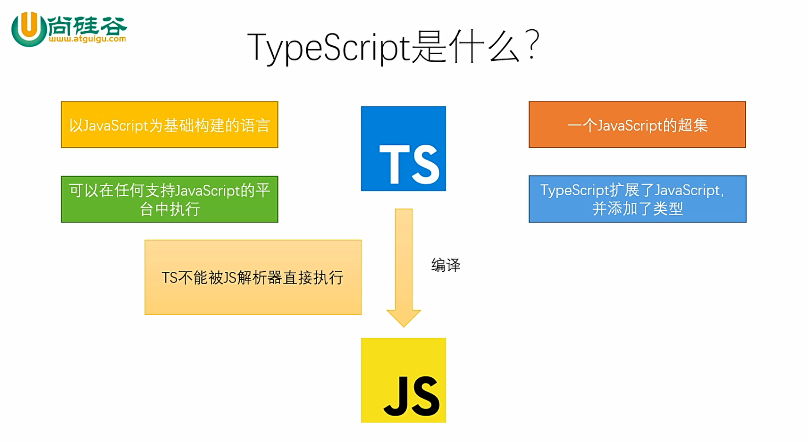

(注1：反正这个迟早要学，我就先新建一篇博文，等以后有时间了再来补充。)

(注2：这个是尚硅谷李立超老师的视频，总共只有30节课，10个小时左右，并不算长。不知道为什么我开始对学新的东西感到恐惧了，其实想想大可不必啊，既然选择了前端，就势必要不停的去学习一些新的东西，学习能力这个是基本的素养，所以先去学习就完事了。)

(注3：摘录一下视频简介给自己共勉吧：本套视频教程对TypeScript进行了深入讲解，其中涵盖了环境搭建、TypeScript中的各种类型（基本类型、数组、对象、元组、枚举、unknown、any、void、never等）。TypeScript的编译选项，以及TypeScript中面向对象的相关知识（类、抽象类和接口），教程最后通过一个实战项目“贪食蛇”对知识进行了系统的串联。
**TS本身并非什么高深的技术，凡是有JavaScript基础的同学都可以轻松掌握**。)

(注4：[视频链接如下](https://www.bilibili.com/video/BV1Xy4y1v7S2))

(注5：现在是2020年12月19日，开始看视频了，开个头吧。)

(注6：学了一点点，初步感觉就是这不就是Java吗，好像没有什么区别，也是要编译的，变量名前也要写类型。)

(注7：老师也说了，学习一门语言就是学习它的语法，刚开始你觉得不习惯主要是因为它的语法和你以前学的不太一样，通过不断的写，不断的写，你也就慢慢熟悉它的语法和写法了，真的没什么难的。)

(注8：[TypeScript入门教程](https://ts.xcatliu.com/introduction/what-is-typescript.html))

# TypeScript是什么

* TypeScript是JavaScript的超集。
* 它对JS进行了扩展，向JS中引入了类型的概念，并添加了许多新的特性。
* TS代码需要通过编译器编译为JS，然后再交由JS解析器执行。

* TS完全兼容JS，换言之，任何的JS代码都可以直接当成JS使用。

* 相较于JS而言，TS拥有了静态类型，更加严格的语法，更强大的功能；TS可以在代码执行前就完成代码的检查，减小了运行时异常的出现的几率；TS代码可以编译为任意版本的JS代码，可有效解决不同JS运行环境的兼容问题；同样的功能，TS的代码量要大于JS，但由于TS的代码结构更加清晰，变量类型更加明确，在后期代码的维护中TS却远远胜于JS。



# TypeScript增加了什么


# TypeScript 开发环境搭建

1. 下载Node.js
   * 64位：https://nodejs.org/dist/v14.15.1/node-v14.15.1-x64.msi
   * 32位：https://nodejs.org/dist/v14.15.1/node-v14.15.1-x86.msi
2. 安装Node.js
3. 使用npm全局安装typescript
   * 进入命令行
   * 输入：`npm i -g typescript`
4. 创建一个ts文件
5. 使用tsc对ts文件进行编译
   * 进入命令行
   * 进入.`ts`文件所在目录
   * 执行命令：`tsc xxx.ts`

# 基本类型

> 可以将TS编译为任意版本的JS，可以编译为ES5的，也可以编译为ES6的，等等，任何版本。
>
> 好处是可以确保代码最好的兼容性，在不同的浏览器都可以正常的去执行。你想兼容哪个版本我就可以编译成哪个版本。
>
> 默认情况下它是编译为ES3的，后面会讲到如何更改默认情况下的编译版本。

* 类型声明

  * 类型声明是TS非常重要的一个特点

  * 通过类型声明可以指定TS中变量（参数、形参）的类型

  * 指定类型后，当为变量赋值时，TS编译器会自动检查值是否符合类型声明，符合则赋值，否则报错

  * 简而言之，类型声明给变量设置了类型，使得变量只能存储某种类型的值

  * 语法：

    * ```typescript
      let 变量: 类型;
      
      let 变量: 类型 = 值;
      
      function fn(参数: 类型, 参数: 类型): 类型{
          ...
      }
      ```

* 自动类型判断

  * TS拥有自动的类型判断机制
  * 当对变量的声明和赋值是同时进行的，TS编译器会自动判断变量的类型
  * 所以如果你的变量的声明和赋值时同时进行的，可以省略掉类型声明


* 类型：

  |  类型   |       例子        |              描述              |
  | :-----: | :---------------: | :----------------------------: |
  | number  |    1, -33, 2.5    |            任意数字            |
  | string  | 'hi', "hi", `hi`  |           任意字符串           |
  | boolean |    true、false    |       布尔值true或false        |
  | 字面量  |      其本身       |  限制变量的值就是该字面量的值  |
  |   any   |         *         |            任意类型            |
  | unknown |         *         |         类型安全的any          |
  |  void   | 空值（undefined） |     没有值（或undefined）      |
  |  never  |      没有值       |          不能是任何值          |
  | object  |  {name:'孙悟空'}  |          任意的JS对象          |
  |  array  |      [1,2,3]      |           任意JS数组           |
  |  tuple  |       [4,5]       | 元素，TS新增类型，固定长度数组 |
  |  enum   |    enum{A, B}     |       枚举，TS中新增类型       |

* number

  * ```typescript
    let decimal: number = 6;
    let hex: number = 0xf00d;
    let binary: number = 0b1010;
    let octal: number = 0o744;
    let big: bigint = 100n;
    
    // let a;
    // a = 10;
    // a = 'hello'
    // 以前JS是这样写的
    // 因为JS是动态类型的语言，变量是没有类型的概念的
    // 你可以给变量赋任何类型的值
    
    let a: number;
    // TS写法：声明一个变量a,同时指定它的类型为number
    
    // a的类型设置为了number，在以后的使用过程中，a的值只能是数字
    a = 10;
    a = 33;
    // 这些都没有问题
    
    // a = 'hello'
    // 这样写会报错，出现红色的波浪线
    // 但是即使TS里面有这样的错误，而且编译会报错，但是还是会编译生成JS文件！！
    // 不会因为有一个错误而不让你生成JS了
    // 因为首先a = 'hello';虽然不符合TS语法规范，但是它符合JS语法规范
    // 其次也是为了让刚开始接触TS的人更好的接受和使用TS
    // 如果我写了有错误你就不让我编译通过，那么那些习惯写JS的人就不会用TS了。
    
    // 后面会通过编译工具的配置，让它在有错的情况下编译不通过
    ```

* boolean

  * ```typescript
    let isDone: boolean = false;
    
    let b: string;
    b = 'hello'
    
    let c: boolean = true;
    c = false
    
    // let d = true
    // 编译器很操作，你没有写boolean,它看到赋值为true,就知道d为布尔值了
    // d = 123
    // 你就算没有写变量类型(声明变量时没有写boolean)
    // 更改变量为123时还是会报错
    
    // 如果变量的声明和赋值是同时进行的，那么TS就可以自动对变量进行类型检测
    
    // 疑问：既然TS编译器可以自动判断变量类型，那我们手动写类型是否多此一举呢？
    // 回答：类型给我们带来的困扰最大的往往不是变量，而是函数
    
    // JS中的函数是不考虑参数的类型和个数的
    // 而TS如何给定了参数的类型，类型不会的话会报错
    // 参数的个数不对的话也是会报错的
    
    // 这个函数很明显是求和的，那么两个参数a和b都是数字才有意义
    function sum(a,b) { 
        return a + b;
    }
    
    console.log(sum(123, 456));
    // 579
    
    console.log(sum(123, "456"));
    //123456
    //没有给参数设定类型，这个不会报错
    
    function total(a:number,b:number) { 
        return a + b;
    }
    
    // total(11,'123');
    // 给了变量类型，此时这个会报错
    
    // 函数返回值的类型也是可以指定的
    function total2(a: number, b: number): number{ 
        // 括号外面的:number就表示函数返回值的类型
        // 虽然写上去有点麻烦，但是当你项目越来越大的时候
        // 你会喜欢上这种写法的,它会让代码越来越可控制
        return a + b;
    }
    
    let result = total2(10, 20)
    // 鼠标悬停到result上可以看到resulta的类型为number
    ```

* string

  * ```typescript
    let color: string = "blue";
    color = 'red';
    
    let fullName: string = `Bob Bobbington`;
    let age: number = 37;
    let sentence: string = `Hello, my name is ${fullName}.
    
    I'll be ${age + 1} years old next month.`;
    ```

* 字面量

  * 也可以使用字面量去指定变量的类型，通过字面量可以确定变量的取值范围

  * ```typescript
    let color: 'red' | 'blue' | 'black';
    let num: 1 | 2 | 3 | 4 | 5;
    ```

  * 代码示例

    ~~~javascript
    // 也可以直接使用字面量进行类型声明
    let a: 10;
    a = 10;
    // a = 11;
    // a已经赋值10了，你就不能再修改它了
    // 赋值一次就不能再修改了，感觉就像常量一样
    
    
    let b: "male" | "female";
    // 竖线|表示或者
    // b只能是male或female这2个选项
    b = 'male'
    b = 'female'
    
    // 可以使用|来连接多个类型(联合类型)
    let c: boolean | string
    c = true;
    c= "hello"
    
    
    ~~~

* any

  * ```typescript
    let d: any = 4;
    d = 'hello';
    d = true;
    
    // any表示的是任意类型
    // 你写了any以后就跟JS也没什么区别了
    // 一个变量设置类型为any后相当于对该变量关闭了TS的类型检测
    // 使用TS时，不建议使用any类型(你用了any还不如直接去用JS)
    // 听说有些公司不给写any，写一个扣10块钱
    
    // let d: any;
    // 这种写法是显式的any
    let d;
    // 这种写法是隐式的any
    // 声明变量如果不指定类型，则TS解析器会自动判断变量的类型为any(隐式的any)
    
    // 显式的any我们要避免，隐式的any我们更要避免
    // any不到万不得已的时候尽量别用
    d = 10;
    d = 'hello';
    d = true;
    ```

* unknown

  * ```typescript
    let notSure: unknown = 4;
    notSure = 'hello';
    
    // 如果有一些变量你实在是不知道它的类型的话，你可以使用any
    // 不过你也可以使用unknown
    // unknown表示未知类型的值，那么它和any有什么区别呢？
    let e: unknown;
    e = 10;
    e = '你好';
    e = true;
    // 这里可以看到设置any和设置unknown效果是一样的
    
    let s: string;
    s = d;
    // s是string，d是any
    // 把变量d的值赋值给了变量s
    // d的类型是any，它可以赋值给任意变量，不会报错
    // 说明any类型的变量不仅霍霍自己，还霍霍别人
    // s本来是字符串挺好的，你这一整，被any弄成了true布尔值了
    // any不仅把自己的类型检查给关了，也把别人的类型检查也给关了
    
    // 而unknown就不一样了
    let f: string;
    e = 'hello';
    // f = e;
    // 报错：Type 'unknown' is not assignable to type 'string'
    // 你把未知类型的变量(e)赋值给了f(类型为string)会报错
    // 这个就是any和unknown的区别
    // any的话你给别人赋值他也不查了，但是unknown只管自己，自己爱赋啥值赋啥值
    // 但是如果你想把自己(unknown类型)的变量值赋值给别的变量的时候，就会报错
    // 用TS的时候只要看到红色波浪线，一定要记得处理
    // 不然你用TS就没有意义了
    
    
    // unknown实际上就是一个类型安全的any
    // unknown类型的变量不能直接赋值给其他变量
    // 如果你真的一定要赋值的话(f = e)
    // 你可以对它先进行类型检查
    
    // 方法1：
    // if (typeof e === "string") { 
    //   f = e
    //   // 这样就不报错了
    //   // 这个还要多个类型检查，看上去有点麻烦
    //   // 但是它可以避免后面出问题
    // }
    
    // 方法2：使用类型断言
    // 有些时候一些变量的类型TS编译器它不知道，但是我们自己知道
    // 类型断言，可以用来告诉解析器变量的实际类型(不过你要确保你写的是对的)
    
    /*
    * 语法
    *   1.变量 as 类型
    *   2.<类型>变量
    */
    // 2.1写法
    // f = e as string;
    
    // 2.2写法
    f = <string>e;
    
    // 2.1和2.2写法的效果是一样的，都是告诉变量e是字符串
    
    // 以后你遇到类型不确定的变量时，能用unknown尽量用unknown
    // 能不用any尽量不要用any
    // 不要嫌unknown麻烦
    // 如果嫌麻烦的话就不要用TS了
    // TS刚开始接触的时候感觉没那么好，但是随着时间久了，越用越好用
    ```

* void

  * ```typescript
    let unusable: void = undefined;
    
    function fn(): number { 
      // 设置返回值的类型为number
      return 123;
    }
    
    function fn1() { 
      // 有些情况下函数没有返回值
      // 如果你在小括号后不写类型的话，默认的类型就是void
    }
    
    function fn2() { 
      return true
      // 你写了返回值，而且返回的是true
      // 虽然你没有写返回值，它还是能自动判断出来类型为true的
    }
    
    function fn3(num) { 
      if (num > 0) {
        return true;
      } else { 
        return 123;
      }
      // 这个时候返回类型就是true或者123了
    }
    
    // void用来表示空，以函数为例子，就表示没有返回值的函数
    function fn4(): void { 
      // return true;
      // 这时只要你有返回值，它就会报错
      // Type 'boolean' is not assignable to type 'void'
      // return null;
      // return undefined;
      // 你return null或undefined，void都认为是空，都不会报错
    }
    ```

* never

  * ```typescript
    function error(message: string): never {
      throw new Error(message);
    }
    
    function fn5() :never{ 
      // never表示永远不会返回结果
      // 和void的区别：
      // 从哲学的角度上来讲，你没有返回值(返回值为空)，一定意义上也是一种返回值
      // 而never是真的没有，连空都没有，什么都没有
    
      // 在JS里面有一些函数，它不返回结果，连undefined都不返回
      // 它是用来报错的
      // 当程序运行出错误了，需要报一个错，就可以用这种函数来完成报错
      throw new Error('报错了！')
      // 这个函数一旦调用，它就会报错
      // 不过这种一般用的比较少
    }
    ```

* object（没啥用）

  * ```typescript
    let obj: object = {};
    
    // object表示一个JS对象
    // 但是它并不实用
    // 因为在JS里面对象实在是太多了
    // "一切都是对象"
    // 所以你只写了一个object等于没有给它添加任何限制
    // 其实我们在限制对象的时候，其实是在限制对象中包含哪些属性，而非限制它是否是一个对象
    let a: object;
    a = {};
    a = function () { };
    
    
    let b: {name:string};
    // 这样写也表示变量b存储的是一个对象,同时这个对象有一个name属性，类型为string
    // 但是这个和上面是有很大区别的，这个可以指定属性
    // {}可以用来指定对象中可以包含哪些属性
    // b = {}
    b = { name: '孙悟空' };
    // 这样写就会报错，它里面需要一个name属性
    // b = { name: '孙悟空', age: 18 };
    // 这样写也不行，会报错，只能有定义好的name属性，不能有其他的属性
    // 要求结构必须一模一样，不能多，也不能少
    
    let c:{ name: string, age: number };
    // c = {name:'猪八戒'}
    // 这样也不行，必须要有age
    
    let d: { name: string, age?: number };
    // 如果在属性名后面加一个问号，则表示这个属性是可选的，你可以写，也可以不写
    d = { name: '沙悟净' }
    // 这样写才不会报错
    
    // let e: { name: string }
    // 要求必须要有name属性，其他属性不做要求，有没有都行
    // let e: { name: string, a?: number, b?: number }
    // 这样写也行，但是很麻烦，如果我还想加一个属性叫c呢？你能穷举出全部的属性吗？
    // e = {name:'唐僧',a:1,b:2}
    let e: { name: string, [propName: string]: any }
    e = {name:'唐僧',a:1,b:2,age:18,sex:'男'}
    // 这个表明首先必须有name属性，其他属性随便你，加不加都行
    // 中括号里面的propName是你随便写的，写什么都行，它就是一个变量名
    // :string表示我这个属性名的类型是字符串
    // JS里面的属性名实际上就是一个字符串
    // [propName: string]就表示只要是字符串的属性名，都可以
    // : any 表示任意类型
    
    
    /*
     * 设置函数结构的类型声明
     *    语法(形参：类型,形参：类型,...)=>{返回值}
     * 
     * */
    let f: (a: number, b: number) => number;
    // 希望限制这个函数有几个参数，返回值是什么类型的
    // 表示希望f是一个函数，并且有2个参数，都是number类型的
    // 而且返回值也是number类型的
    // 注意，名字无所谓，叫a,b也行，叫c,d也行
    
    // d = function (n1: number, n2: number):number { 
    // 你这里小括号后写不写:number都行了
    d = function (n1: number, n2: number) { 
      return n1 + n2
    }
    ```

* array

  * ```typescript
    let list: number[] = [1, 2, 3];
    let list: Array<number> = [1, 2, 3];
    
    /*
     *数组的类型声明：
     *    方法1：类型[]
     *    方法2：Array<类型>
     */
    let g: string[];
    // 在原生JS里面数组中什么类型的值都可以存
    // 但是数组里面存了乱七八糟的类型的话，处理起来就比较麻烦了
    // 所以一般在开发中，数组都是存相同类型的值
    // g表示字符串数组，数组里面存的都是字符串
    g = ['a', 'b', 'c'];
    
    // 写法1：表示数值类型的数组
    let h: number[];
    h = [1, 2, 5, 6, 8];
    
    // 写法2：也表示数值类型的数组
    let i: Array<number>;
    ```

* tuple(元祖)

  * ```typescript
    let x: [string, number];
    x = ["hello", 10]; 
    
    /**
     * 元祖：元祖就是固定长度的数组
     * (一般的数组长度是可变的，动态的)
     * 元祖的存储效率会比较好一点，因为它的长度固定，变化的机会会比较少一点
     * 语法：[类型,类型,类型,...]
     * 元祖长度一般不会特别长，特别长的话就用数组了
     */
    
    let j: [string, string]
    //  这个表示我定义了一个元祖，这个元祖里面有2个值，都是string类型
    j = ['hello','world']
    ```

* enum

  * ```typescript
    enum Color {
      Red,
      Green,
      Blue,
    }
    let c: Color = Color.Green;
    
    enum Color {
      Red = 1,
      Green,
      Blue,
    }
    let c: Color = Color.Green;
    
    enum Color {
      Red = 1,
      Green = 2,
      Blue = 4,
    }
    let c: Color = Color.Green;
    
    /**
     * enum 枚举
     */
    // let k: { name: string, gender: string };
    // let k: { name: string, gender: number };
    enum Gender { 
      // 枚举的类型叫Gender，里面有2个值，Male，Female
      // Male = 0,
      // Female = 1
      Male,
      Female
    }
    let k: { name: string, gender:Gender };
    // let k: { name: string, gender: 0|1 };
    // 你可以写成number,0是男，1是女，等等。
    // 但是我这个程序可能要交给别人用，他不会知道0是男还是1是男
    // 于是我们就用到枚举了
    // 枚举就是把我们所有的可能的情况都详细列出来
    k = {
      name: '孙悟空',
      // gender: 1
      gender: Gender.Male
      // 这样写也行，挺好的，我一看就知道它是男的
      //'male'
      //gender的值在一定范围之内：男，女，不详，保密 
    }
    
    // console.log(k.gender === 1);
    console.log(k.gender === Gender.Male);
    ```

* 补充知识

  * ~~~javascript
    // &表示同时
    let l: { name: string } & { age: number };
    // l既要有name属性，也要有age属性
    l = { name: '孙悟空', age: 18 }
    
    // 类型的别名
    type myType = string;
    let o: myType
    // 给string起了一个类型别名叫myType
    // 现在myType和string就是等价的了
    type youType = 1 | 2 | 3 | 4 | 5;
    let m: youType;
    let n: youType;
    ~~~

* 类型断言

  * 有些情况下，变量的类型对于我们来说是很明确，但是TS编译器却并不清楚，此时，可以通过类型断言来告诉编译器变量的类型，断言有两种形式：

    * 第一种

      * ```typescript
        let someValue: unknown = "this is a string";
        let strLength: number = (someValue as string).length;
        ```

    * 第二种

      * ```typescript
        let someValue: unknown = "this is a string";
        let strLength: number = (<string>someValue).length;
        ```

# 编译选项

- 自动编译文件

  - 编译文件时，使用-w指令后，TS编译器会**自动监视**文件的变化，并在文件发生变化时对文件进行重新编译。

  - 示例：

    ~~~typescript
    tsc xxx.ts -w
    ~~~

- 自动编译整个项目

  - 如果直接使用tsc指令，则可以自动将当前项目下的所有ts文件编译为js文件。

  - 但是能直接使用tsc命令的前提时，要先在**项目根目录下**创建一个ts的配置文件`tsconfig.json`

  - `tsconfig.json`是一个JSON文件，添加配置文件后，只需只需 tsc 命令即可完成对整个项目的编译

  - 配置选项：

    - include

      - 定义希望被编译文件所在的目录

      - 默认值：`["\*\*/\*"]`

      - 注意：`**`表示任意目录，`*`表示任意文件。

      - 示例：

        ~~~typescript
        "include":["src/**/*", "tests/**/*"]
        ~~~

        > 上述示例中，所有src目录和tests目录下的文件都会被编译

    - exclude

      - 定义需要排除在外的目录

      - 默认值：`["node_modules", "bower_components", "jspm_packages"]`

      - 示例：

        ~~~typescript
        "exclude": ["./src/hello/**/*"]
        ~~~

        > 上述示例中，src下hello目录下的文件都不会被编译

    - extends

      - 定义被继承的配置文件

      - 示例：

        ~~~typescript
        "extends": "./configs/base"
        ~~~

        > 上述示例中，当前配置文件中会自动包含config目录下base.json中的所有配置信息

    - files

      - 指定被编译文件的列表，只有**需要编译的文件很少时**才会用到

      - 示例：

        ~~~javascript
        "files": [
            "core.ts",
            "sys.ts",
            "types.ts",
            "scanner.ts",
            "parser.ts",
            "utilities.ts",
            "binder.ts",
            "checker.ts",
            "tsc.ts"
        ]
        ~~~

        > 列表中的文件都会被TS编译器所编译。

    - compilerOptions

      - 编译选项是配置文件中非常重要也比较复杂的配置选项

      - 在compilerOptions中包含多个子选项，用来完成对编译的配置

        - 项目选项

          - target

            - 设置TS代码编译的**目标版本**

            - 可选值：

              - ES3（默认）、ES5、ES6/ES2015、ES7/ES2016、ES2017、ES2018、ES2019、ES2020、ESNext

            - 示例：

              ~~~json
              "compilerOptions": {
                  "target": "ES6"
              }
              ~~~

              > 如上设置，我们所编写的ts代码将会被编译为ES6版本的js代码

          - lib

            - 指定代码运行时所包含的库（宿主环境）

            - 可选值：

              - ES5、ES6/ES2015、ES7/ES2016、ES2017、ES2018、ES2019、ES2020、ESNext、DOM、WebWorker、ScriptHost ......

            - 示例：

              ~~~typescript
              "compilerOptions": {
                  "target": "ES6",
                  "lib": ["ES6", "DOM"],
                  "outDir": "dist",
                  "outFile": "dist/aa.js"
              }
              ~~~

          - module

            - 设置编译后代码使用的**模块化系统**

            - 可选值：

              - CommonJS、UMD、AMD、System、ES2020、ESNext、None

            - 示例：

              ~~~typescript
              "compilerOptions": {
                  "module": "CommonJS"
              }
              ~~~

          - outDir

            - **编译后文件的所在目录**

            - 默认情况下，编译后的js文件会和ts文件位于相同的目录，设置outDir后可以改变编译后文件的位置

            - 示例：

              ~~~typescript
              "compilerOptions": {
                  "outDir": "dist"
              }
              ~~~

              > 设置后编译后的js文件将会生成到dist目录

          - outFile

            - **将所有的文件编译为一个js文件**

            - 默认会将所有的编写在全局作用域中的代码合并为一个js文件，如果module制定了None、System或AMD则会将模块一起合并到文件之中

            - 示例：

              ~~~typescript
              "compilerOptions": {
                  "outFile": "dist/app.js"
              }
              ~~~

          - rootDir

            - 指定代码的根目录，默认情况下**编译后文件的目录结构**会以最长的公共目录为根目录，通过rootDir可以手动指定根目录

            - 示例：

              ~~~typescript
              "compilerOptions": {
                  "rootDir": "./src"
              }
              ~~~

          - allowJs

            - 是否对js文件编译

          - checkJs

            - 是否对js文件进行检查

            - 示例：

              ~~~typescript
              "compilerOptions": {
                  "allowJs": true,
                  "checkJs": true
              }
              ~~~

          - removeComments

            - 是否删除注释
            - 默认值：false

          - noEmit

            - 不对代码进行编译
            - 默认值：false

          - sourceMap

            - 是否生成sourceMap
            - 默认值：false

        * 严格检查

          - strict
            - 启用所有的严格检查，默认值为true，设置后相当于开启了所有的严格检查
          - alwaysStrict
            - 总是以严格模式对代码进行编译
          - noImplicitAny
            - 禁止隐式的any类型
          - noImplicitThis
            - 禁止类型不明确的this
          - strictBindCallApply
            - 严格检查bind、call和apply的参数列表
          - strictFunctionTypes
            - 严格检查函数的类型
          - strictNullChecks
            - 严格的空值检查
          - strictPropertyInitialization
            - 严格检查属性是否初始化

        * 额外检查

          - noFallthroughCasesInSwitch
            - 检查switch语句包含正确的break
          - noImplicitReturns
            - 检查函数没有隐式的返回值
          - noUnusedLocals
            - 检查未使用的局部变量
          - noUnusedParameters
            - 检查未使用的参数

        * 高级

          - allowUnreachableCode

            - 检查不可达代码
            - 可选值：
              - true，忽略不可达代码
              - false，不可达代码将引起错误

          - noEmitOnError

            - 有错误的情况下不进行编译
            - 默认值：false
